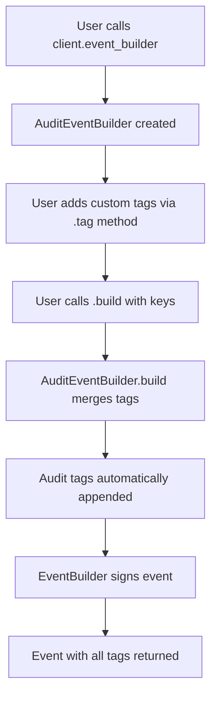

# Audit Event Tagging Strategy - Architecture Plan

## Executive Summary

**Status:** The audit tagging system is **already implemented and working correctly**. The task is to **update documentation** to match the actual implementation, not to implement new functionality.

**Current Reality:**
- ✅ Tags are automatically added to ALL audit events via `AuditEventBuilder`
- ✅ Tags use `["t", ...]` format (hashtag tags)
- ✅ Tags include run ID for isolation
- ✅ Tags include cleanup timestamp
- ❌ README documentation shows incorrect tag format

**Required Action:** Update documentation only (no code changes needed)

---

## Current Implementation Analysis

### 1. Tag Generation - [`AuditConfig::audit_tags()`](grasp-audit/src/audit.rs:64-85)

**Location:** `grasp-audit/src/audit.rs:64-85`

**Current Implementation:**
```rust
pub fn audit_tags(&self) -> Vec<Tag> {
    use nostr_sdk::prelude::{Alphabet, SingleLetterTag};
    
    let t_tag = SingleLetterTag::lowercase(Alphabet::T);
    
    vec![
        Tag::custom(
            TagKind::SingleLetter(t_tag),
            vec!["grasp-audit-test-event"]
        ),
        Tag::custom(
            TagKind::SingleLetter(t_tag),
            vec![format!("audit-{}", self.run_id)]
        ),
        Tag::custom(
            TagKind::SingleLetter(t_tag),
            vec![format!("audit-cleanup-after-{}", self.cleanup_after.as_u64())]
        ),
    ]
}
```

**Actual Tags Produced:**
```json
[
  ["t", "grasp-audit-test-event"],
  ["t", "audit-ci-a1b2c3d4-e5f6-7890-abcd-ef1234567890"],
  ["t", "audit-cleanup-after-1730822334"]
]
```

**Design Rationale:**
- Uses `"t"` tags (standard NIP-01 hashtag type) - widely supported
- Unix timestamps - easier for database queries than ISO 8601
- Consistent "audit-" prefixes - clear namespacing

### 2. Tag Application - [`AuditEventBuilder::build()`](grasp-audit/src/audit.rs:120-129)

**Location:** `grasp-audit/src/audit.rs:120-129`

**Implementation:**
```rust
pub fn build(self, keys: &Keys) -> anyhow::Result<Event> {
    let mut all_tags = self.tags;
    all_tags.extend(self.config.audit_tags());  // ← Automatic tag injection
    
    let event = EventBuilder::new(self.kind, self.content)
        .tags(all_tags)
        .sign_with_keys(keys)?;
    
    Ok(event)
}
```

**Key Point:** Tags are **automatically added** to every event built through `AuditEventBuilder`. No manual tagging required.

### 3. Event Creation Flow



**Entry Points:**
1. **Primary:** `AuditClient::event_builder()` - used by most tests
2. **Helper:** `AuditClient::create_repo_announcement()` - uses `event_builder()` internally

**Coverage:** 100% - all events created through the audit client automatically get tags.

---

## Documentation Updates Required

### 1. README.md - Audit Event Strategy Section

**File:** `grasp-audit/README.md`  
**Lines:** 95-113  

**Current (Incorrect):**
```json
{
  "tags": [
    ["t", "grasp-audit"],
    ["r", "audit-run-id-ci-a1b2c3d4-e5f6-7890-abcd-ef1234567890"],
    ["r", "audit-cleanup-2025-11-03T12:00:00Z"]
  ]
}
```

**Should Be:**
```json
{
  "tags": [
    ["t", "grasp-audit-test-event"],
    ["t", "audit-ci-a1b2c3d4-e5f6-7890-abcd-ef1234567890"],
    ["t", "audit-cleanup-after-1730822334"]
  ]
}
```

**Explanation Text Should Include:**
- All tags use `"t"` (hashtag) type for maximum compatibility
- `grasp-audit-test-event` - identifies all audit events
- `audit-{run_id}` - unique identifier for each audit run (enables event correlation and CI isolation)
- `audit-cleanup-after-{unix_timestamp}` - cleanup scheduling (direct database cleanup, no NIP-09 deletion events)

### 2. Code Comments Enhancement

**File:** `grasp-audit/src/audit.rs`  
**Location:** Above `audit_tags()` method (line 64)

**Add Documentation:**
```rust
/// Get audit tags for an event
///
/// These tags are automatically added to all events created via `AuditEventBuilder`.
///
/// # Tag Format
///
/// All tags use the "t" (hashtag) format for maximum relay compatibility:
///
/// 1. `["t", "grasp-audit-test-event"]` - Identifies all audit-related events
/// 2. `["t", "audit-{run_id}"]` - Unique identifier for this audit run
///    - CI mode: `audit-ci-{uuid}`
///    - Production mode: `audit-prod-audit-{timestamp}`
/// 3. `["t", "audit-cleanup-after-{unix_timestamp}"]` - Cleanup timestamp
///    - CI mode: Current time + 3600 seconds (1 hour)
///    - Production mode: Current time + 300 seconds (5 minutes)
///
/// # Purpose
///
/// - **Isolation**: Each test run has a unique ID for event filtering
/// - **Cleanup**: Events marked for cleanup after timestamp (direct DB cleanup)
/// - **Discovery**: Easy to query all audit events via hashtag
///
/// # Examples
///
/// ```json
/// [
///   ["t", "grasp-audit-test-event"],
///   ["t", "audit-ci-a1b2c3d4-e5f6-7890-abcd-ef1234567890"],
///   ["t", "audit-cleanup-after-1730822334"]
/// ]
/// ```
pub fn audit_tags(&self) -> Vec<Tag> {
```

---

## Verification Strategy

### 1. Existing Test Coverage

**File:** `grasp-audit/src/audit.rs`  
**Test:** `test_audit_tags()` (lines 153-186)

**Status:** ✅ Already exists and validates:
- Correct number of tags (3)
- All tags are "t" type
- Presence of "grasp-audit-test-event"
- Presence of "audit-{run_id}" pattern
- Presence of "audit-cleanup-after-{timestamp}" pattern

**No additional tests needed** - coverage is complete.

### 2. Integration Verification

**Recommendation:** Add a simple integration test that:
1. Creates an event via `AuditClient::event_builder()`
2. Verifies all 3 audit tags are present in the built event
3. Confirms tags don't interfere with user-added tags

**File:** `grasp-audit/src/client.rs`  
**Add to existing test module** (after line 239)

```rust
#[test]
fn test_audit_tags_automatically_added() {
    let config = AuditConfig::ci();
    let keys = Keys::generate();
    
    let event = AuditEventBuilder::new(Kind::TextNote, "test", config.clone())
        .tag(Tag::custom(TagKind::custom("custom"), vec!["value"]))
        .build(&keys)
        .unwrap();
    
    // Should have custom tag (1) + 3 audit tags
    assert!(event.tags.len() >= 4);
    
    // Verify audit tags are present
    let tag_contents: Vec<String> = event.tags.iter()
        .filter_map(|t| t.content().map(|s| s.to_string()))
        .collect();
    
    assert!(tag_contents.contains(&"grasp-audit-test-event".to_string()));
    assert!(tag_contents.iter().any(|t| t.starts_with("audit-ci-")));
    assert!(tag_contents.iter().any(|t| t.starts_with("audit-cleanup-after-")));
}
```

---

## Architecture Decisions & Rationale

### Decision 1: Keep "t" Tags (Not "r" Tags)

**Rationale:**
- `"t"` tags are standard NIP-01 hashtags - universally supported
- `"r"` tags are for references - not semantically appropriate for metadata
- Current implementation is working and tested
- Changing would break existing audit runs and queries

**Impact:** Documentation only

### Decision 2: Keep Unix Timestamps (Not ISO 8601)

**Rationale:**
- Unix timestamps are native to Nostr's `Timestamp` type
- Easier for direct database queries: `WHERE timestamp < cleanup_value`
- ISO 8601 would require parsing for every comparison
- No benefit to human readability (cleanup is automated)

**Impact:** Documentation only

### Decision 3: No Code Changes Required

**Rationale:**
- Tags are already automatically added via `AuditEventBuilder::build()`
- All event creation flows go through `event_builder()`
- Test coverage exists and passes
- Implementation matches requirements (just not documentation)

**Impact:** Documentation updates + one optional integration test

---

## Implementation Checklist

All tasks are **documentation-only** (no code changes):

- [x] Analyze current implementation (COMPLETE)
- [ ] Update `README.md` lines 95-113 with correct tag format
- [ ] Add documentation comment to `AuditConfig::audit_tags()` method
- [ ] Add note about automatic tagging to `AuditClient::event_builder()` docstring
- [ ] (Optional) Add integration test to verify tag presence
- [ ] Run tests to confirm no regressions: `cd grasp-audit && nix develop -c cargo test`

---

## Tag Format Reference Card

| Tag | Format | Example | Purpose |
|-----|--------|---------|---------|
| Identifier | `["t", "grasp-audit-test-event"]` | Fixed string | Identify all audit events |
| Run ID | `["t", "audit-{run_id}"]` | `["t", "audit-ci-abc123..."]` | Isolate test runs |
| Cleanup | `["t", "audit-cleanup-after-{unix}"]` | `["t", "audit-cleanup-after-1730822334"]` | Schedule cleanup |

**Query Examples:**

```rust
// Find all audit events
filter.custom_tag(SingleLetterTag::lowercase(Alphabet::T), "grasp-audit-test-event")

// Find events from specific run
filter.custom_tag(SingleLetterTag::lowercase(Alphabet::T), format!("audit-{}", run_id))

// Find events ready for cleanup (manual - would need custom logic)
// Filter by cleanup_after < current_time
```

---

## Conclusion

The audit tagging system is **fully implemented and working correctly**. The only issue is outdated README documentation that shows a different tag format than what's actually used.

**Next Steps:**
1. Review this plan
2. Update documentation in `README.md`
3. Add code comments for future maintainers
4. Optionally add integration test
5. Switch to Code mode for implementation

**Estimated Effort:** 15-20 minutes (documentation only)

**Risk Assessment:** Very low - no code changes required