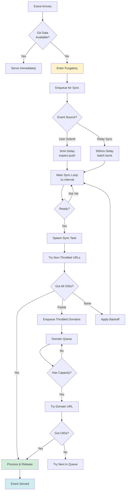

# GRASP-02 Proactive Sync: Purgatory Git Data Fetching

**Status**: ✅ Implemented  
**Implementation**: [`src/purgatory/sync/`](../../src/purgatory/sync/)  
**Related**:

- [Purgatory Design](purgatory-design.md) - Core purgatory concepts
- [GRASP-02 Proactive Sync](grasp-02-proactive-sync.md) - Full GRASP-02 implementation
- [Unified Git Data Sync](unify-git-data-sync.md) - Shared processing logic

---

## Overview

When Nostr events arrive before their git data, they enter **purgatory** waiting to be served. But they don't wait passively—ngit-grasp **actively hunts** for the missing git data across all git servers assoicated with the repo until it finds what it needs.

### How It Works

**If the data exists, we'll find it.**

The system scours git servers listed in repository announcements and PR events, checking every **2 minutes** for **30 minutes**. If we find the data, events are released immediately. If not, they expire from purgatory after 30 minutes.

**Smart timing based on how events arrive:**

- **User-submitted events**: Wait **3 minutes** before hunting—we expect a `git push` to follow shortly
- **Sync-received events**: Start hunting after just **500ms**—batch burst arrivals, then get to work

**Playing nicely with other servers:**

We respect remote server capacity with:

- **Throttling**: Max 5 concurrent requests per domain, 30 requests/minute
- **Backoff**: Start at 20 seconds, double each attempt, cap at 2 minutes
- **Round-robin**: Fair distribution across repositories waiting for the same domain
- **Fresh start**: New events reset retry count—recent updates often mean fresh data

**The result**: If git data is available anywhere in the clone URL list, we'll find it within minutes. If it's not available within 30 minutes, the events expire cleanly.

### Key Features

✅ **Proactive hunting** - Scours git servers every 2 min (backoff), finds data automatically  
✅ **Respectful throttling** - 5 concurrent + 30/min per domain, plays nice with other implementations  
✅ **Smart timing** - 3min delay for user pushes, 500ms for synced events  
✅ **30min expiry** - Auto-cleanup of events when data never arrives  
✅ **Fully testable** - Mock-based architecture for reliable unit tests

---

## The Problem: Out-of-Order Arrival

In a distributed system, git data and Nostr events can arrive in any order:

```
Timeline A: Event arrives first (user push expected)
  t=0s:   State event received → enters purgatory
  t=180s: (3min wait - expecting git push)
  t=30s:  Git push arrives → event released ✅

Timeline B: Git arrives first
  t=0s:  Git push received → data available
  t=30s: State event received → immediately served ✅

Timeline C: Sync scenario (hunt for data)
  t=0s:   State event received from relay X → enters purgatory
  t=0.5s: (500ms delay to batch bursts)
  t=0.5s: Start hunting git servers → check server1, server2, server3...
  t=45s:  Git data found on server2 → event released ✅

Timeline D: Data never arrives
  t=0s:    State event received → enters purgatory
  t=0.5s:  Start hunting → server1 (not found), server2 (timeout), server3 (not found)
  t=20s:   Retry → server1 (not found), server2 (not found), server3 (not found)
  t=60s:   Retry → all servers checked, no data
  ...
  t=1800s: 30 minutes expired → event discarded, purgatory cleaned up 🗑️
```

**Without proactive sync**: Events in Timeline C would wait indefinitely (or until manual git push).  
**With proactive sync**: System automatically hunts for data across all known servers, releasing events as soon as the data is found.

---

## Architecture: Two-Path Sync Design

The system uses **two independent execution paths** that work together:

### Path 1: Main Sync Loop (Non-Throttled URLs)

Runs every **1 second**, processes identifiers ready for sync:

1. Find ready identifiers (where `!in_progress && next_attempt <= now`)
2. Spawn parallel tasks for each identifier
3. Each task tries non-throttled URLs until:
   - ✅ All OIDs fetched (complete) → remove from queue
   - ⏸️ Only throttled URLs remain → enqueue with throttled domains, apply backoff
   - ❌ No URLs left (all tried/throttled) → apply backoff, retry later

**Key insight**: Main loop doesn't wait for throttled domains. It quickly tries available servers, then hands off to domain queues for rate-limited processing.

### Path 2: Domain Throttle Queues (Throttled URLs)

**Trigger-based** (no polling), processes when capacity frees:

1. Identifier enqueued with throttled domain (from main loop)
2. When domain has capacity (slot frees or rate limit window passes):
   - Pick next identifier (round-robin for fairness)
   - Try one URL from that domain
   - Mark URL as tried, release slot
3. Trigger repeats until queue empty or capacity exhausted

**Key insight**: Each domain independently manages its queue, ensuring we respect rate limits while maximizing throughput.

---

## Data Flow: From Event to Release



---

## Retry Strategy: Exponential Backoff with Fresh Start

### Backoff Schedule

When sync attempts don't complete (OIDs still needed), backoff increases:

| Attempt | Delay         | Formula                |
| ------- | ------------- | ---------------------- |
| 1       | 20s           | `20s * 2^0`            |
| 2       | 40s           | `20s * 2^1`            |
| 3       | 80s           | `20s * 2^2`            |
| 4+      | 120s (capped) | `min(20s * 2^n, 120s)` |

**Implementation**: [`src/purgatory/sync/queue.rs:SyncQueueEntry::backoff()`](../../src/purgatory/sync/queue.rs)

### Fresh Start on New Events

**Critical feature**: When a new event arrives for an identifier already in the sync queue, the `attempt_count` resets to 0.

**Why?** New events often mean:

- A maintainer just updated the repository
- Fresh git data might be available at new clone URLs
- Previous failures might have been temporary

**Example**:

```
t=0s:   State A arrives → queue with 3min delay, attempt_count=0
t=180s: First sync attempt fails → backoff 20s, attempt_count=1
t=200s: Second attempt fails → backoff 40s, attempt_count=2
t=210s: State B arrives (same identifier) → attempt_count=0 ✨
t=210s: Immediate retry (new event delay) → success!
```

---

## Debounced Delays: Smart Timing

### User-Submitted Events: 3 Minutes

When a user submits an event via `EVENT` message, we expect a `git push` to follow shortly:

```
t=0s:   User submits state event → purgatory + 3min delay
t=30s:  User runs `git push` → data arrives → event released ✅
```

**Why 3 minutes?** Gives users time to:

- Finish composing their commit message
- Run `git push` command
- Handle network delays

**Configuration**: Hardcoded in [`src/purgatory/mod.rs:DEFAULT_SYNC_DELAY`](../../src/purgatory/mod.rs)

### Sync-Triggered Events: 500ms

When events arrive during relay sync (e.g., negentropy catchup), they often come in bursts:

```
t=0s:    State A arrives → purgatory + 500ms delay
t=0.1s:  State B arrives → purgatory + 500ms delay (same repo)
t=0.2s:  State C arrives → purgatory + 500ms delay (same repo)
t=0.5s:  Single sync attempt fetches data for all three ✅
```

**Why 500ms?** Batches burst arrivals without excessive delay.

**Configuration**: Hardcoded in [`src/purgatory/mod.rs:IMMEDIATE_SYNC_DELAY`](../../src/purgatory/mod.rs)

### Debouncing Mechanism

Multiple events for the same identifier **don't create multiple sync tasks**. The `enqueue_sync` method:

1. If identifier not in queue → create new entry with delay
2. If identifier already queued → reset `attempt_count`, update `next_attempt` if sooner

**Result**: Rapid event arrivals → single sync attempt after debounce window.

**Implementation**: [`src/purgatory/mod.rs:Purgatory::enqueue_sync()`](../../src/purgatory/mod.rs)

---

## Domain Throttling: Respectful Rate Limiting

### Why Throttle?

Git servers have finite resources. Without throttling:

- ❌ We could overwhelm small servers with concurrent requests
- ❌ Servers might rate-limit or ban us
- ❌ Other clients sharing the server suffer degraded performance

With throttling:

- ✅ Respect server capacity (5 concurrent max per domain)
- ✅ Stay under rate limits (30 requests/min per domain)
- ✅ Fair access for all clients

### Two-Level Limits

Each domain has **two independent limits**:

#### 1. Concurrent Request Limit (Default: 5)

Maximum in-flight requests to a domain at any moment.

**Example**:

```
Domain: github.com
In-flight: [fetch-1, fetch-2, fetch-3, fetch-4, fetch-5]
Status: AT CAPACITY (throttled)

fetch-3 completes → in-flight: 4
Status: HAS CAPACITY (process next queued identifier)
```

#### 2. Rate Limit (Default: 30/min)

Maximum requests in any 60-second sliding window.

**Example**:

```
t=0s:   Request 1 → request_times: [0s]
t=1s:   Request 2 → request_times: [0s, 1s]
...
t=30s:  Request 30 → request_times: [0s, 1s, ..., 30s]
t=31s:  Request 31? → THROTTLED (30 requests in last 60s)
t=61s:  Request at t=0s aged out → request_times: [1s, ..., 30s]
t=61s:  Request 31 → ALLOWED (only 29 in last 60s)
```

**Implementation**: [`src/purgatory/sync/throttle.rs:DomainThrottle::has_capacity()`](../../src/purgatory/sync/throttle.rs)

### Round-Robin Fairness

When multiple identifiers are queued for a throttled domain, we use **round-robin** to ensure fairness:

```
Queue: [repo-A, repo-B, repo-C]
Round-robin index: 0

Attempt 1: Try repo-A (index=0) → fetch → index=1
Attempt 2: Try repo-B (index=1) → fetch → index=2
Attempt 3: Try repo-C (index=2) → fetch → index=0
Attempt 4: Try repo-A (index=0) → ...
```

**Why round-robin?** Prevents head-of-line blocking. Without it, repo-A might consume all slots while repo-B and repo-C wait indefinitely.

**Implementation**: [`src/purgatory/sync/throttle.rs:DomainThrottle::next_ready_identifier()`](../../src/purgatory/sync/throttle.rs)

### Trigger-Based Processing (Not Polling)

Domain queues **don't poll** for capacity. Instead, processing is triggered by two events:

1. **`complete_request()`** - A request finishes, slot frees
2. **`enqueue_identifier()`** - New identifier added to queue

Both methods check `has_capacity()` and trigger `try_process_next()` if true.

**Why trigger-based?**

- ✅ Lower CPU usage (no busy-waiting)
- ✅ Instant response when capacity frees
- ✅ Simpler reasoning (event-driven)

**Implementation**: [`src/purgatory/sync/throttle.rs:ThrottleManager`](../../src/purgatory/sync/throttle.rs)

---

## 30-Minute Purgatory Expiry

Purgatory entries **automatically expire** after 30 minutes to prevent unbounded memory growth.

### Why 30 Minutes?

From the [GRASP-01 spec](https://github.com/DanConwayDev/grasp/blob/main/01.md#purgatory):

> Events should be kept in purgatory and otherwise discarded after 30 minutes.

This balances:

- ⏰ **Long enough** for typical sync scenarios (git data usually arrives within minutes)
- 🧹 **Short enough** to prevent memory leaks from abandoned events
- 🔄 **Recoverable** events are still on other relays and can be re-submitted

### Implementation

Each purgatory entry tracks:

- `created_at: Instant` - When added to purgatory
- `expires_at: Instant` - When to discard (created_at + 30min)

The main sync loop checks expiry before processing:

```rust
if !self.has_pending_events(&identifier) {
    // No events remain (expired or released) → remove from sync queue
    self.sync_queue.remove(&identifier);
}
```

**Note**: Expiry is checked implicitly via `has_pending_events()`. If all events for an identifier have expired, the identifier is removed from the sync queue.

**Implementation**: [`src/purgatory/mod.rs:DEFAULT_EXPIRY`](../../src/purgatory/mod.rs)

---

## Testability: Mock-Based Architecture

A key design goal was **100% unit test coverage** without requiring real git servers or databases.

### SyncContext Trait

All external dependencies are abstracted behind the `SyncContext` trait:

```rust
#[async_trait]
pub trait SyncContext: Send + Sync {
    async fn fetch_repository_data(&self, identifier: &str) -> Result<RepositoryData>;
    fn collect_needed_oids(&self, identifier: &str) -> HashSet<String>;
    async fn oid_exists(&self, repo_path: &Path, oid: &str) -> bool;
    async fn fetch_oids(&self, repo_path: &Path, url: &str, oids: &[String]) -> Result<Vec<String>>;
    async fn process_newly_available_git_data(&self, ...) -> Result<ProcessResult>;
    fn has_pending_events(&self, identifier: &str) -> bool;
    fn find_target_repo(&self, data: &RepositoryData) -> Option<PathBuf>;
    fn our_domain(&self) -> Option<&str>;
}
```

**Two Implementations**:

1. **`RealSyncContext`** - Production implementation connecting to real systems
2. **`MockSyncContext`** - Test implementation with configurable behavior

### MockSyncContext Features

The mock supports builder-pattern configuration:

```rust
let mock = MockSyncContext::new()
    .with_repository_data("test-repo", RepositoryData {
        announcements: vec![...],
        clone_urls: vec!["https://server1.com/repo.git".to_string()],
    })
    .with_needed_oids("test-repo", hashset!["abc123", "def456"])
    .with_fetch_result("https://server1.com/repo.git", Ok(vec!["abc123"]))
    .with_fetch_result("https://server2.com/repo.git", Ok(vec!["def456"]));
```

**Test Example** (from [`src/purgatory/sync/functions.rs`](../../src/purgatory/sync/functions.rs)):

```rust
#[tokio::test]
async fn test_sync_identifier_partial_success() {
    let mock = MockSyncContext::new()
        .with_repository_data("repo", RepositoryData {
            clone_urls: vec![
                "https://server1.com/repo.git".to_string(),
                "https://server2.com/repo.git".to_string(),
            ],
            ..Default::default()
        })
        .with_needed_oids("repo", hashset!["oid1", "oid2"])
        .with_fetch_result("https://server1.com/repo.git", Ok(vec!["oid1"]))
        .with_fetch_result("https://server2.com/repo.git", Ok(vec!["oid2"]));

    let throttle = Arc::new(ThrottleManager::new(5, 30));
    let complete = sync_identifier(&mock, "repo", &throttle).await;

    assert!(complete); // Both OIDs fetched
}
```

**Why this matters**:

- ✅ Tests run **instantly** (no network I/O)
- ✅ Tests are **deterministic** (no flaky failures)
- ✅ Tests cover **edge cases** easily (network errors, partial success, etc.)
- ✅ Tests are **isolated** (no shared state between tests)

**Implementation**: [`src/purgatory/sync/context.rs:MockSyncContext`](../../src/purgatory/sync/context.rs)

---

## Configuration

Purgatory sync behavior is configurable via CLI flags or environment variables:

| Setting                 | CLI Flag | Environment Variable | Default | Description                                          |
| ----------------------- | -------- | -------------------- | ------- | ---------------------------------------------------- |
| Domain concurrent limit | (future) | (future)             | `5`     | Max concurrent requests per domain                   |
| Domain rate limit       | (future) | (future)             | `30`    | Max requests per minute per domain                   |
| Sync loop interval      | N/A      | N/A                  | `1s`    | How often to check for ready identifiers (hardcoded) |
| Default sync delay      | N/A      | N/A                  | `180s`  | Delay for user-submitted events (hardcoded)          |
| Immediate sync delay    | N/A      | N/A                  | `500ms` | Delay for sync-triggered events (hardcoded)          |
| Purgatory expiry        | N/A      | N/A                  | `30min` | How long events wait before expiring (hardcoded)     |

**Note**: Currently, throttle limits and delays are hardcoded constants. Future work may expose these as configuration options if needed.

---

## Key Design Decisions

### 1. Identifier-Based, Not Event-Based

**Decision**: Sync by repository identifier, not individual events.

**Rationale**: Multiple events for the same repository should trigger a single fetch operation, not N separate fetches.

**Impact**: Batches events efficiently, reduces server load.

### 2. Two Separate `tried_urls` Tracking

**Decision**: Main sync loop and domain queues track tried URLs independently.

**Main sync**: Local `HashSet<String>` for current attempt (all domains)  
**Domain queue**: Per-identifier `HashSet<String>` for this domain only

**Rationale**:

- Main sync skips throttled domains entirely (doesn't need their tried URLs)
- Domain queue only cares about URLs from its own domain
- No coordination needed → simpler code

**Impact**: Clean separation of concerns, easier to reason about.

### 3. Trigger-Based Domain Processing

**Decision**: Domain queues process on triggers (capacity freed, new enqueue), not polling.

**Rationale**:

- Polling wastes CPU cycles checking capacity every interval
- Triggers provide instant response when capacity frees
- Event-driven design is easier to test and debug

**Impact**: Lower CPU usage, faster response times.

### 4. Fresh Start on New Events

**Decision**: Reset `attempt_count` to 0 when new events arrive for an identifier.

**Rationale**:

- New events often mean fresh git data is available
- Previous failures might have been temporary
- Gives repositories a "second chance" without waiting for full backoff

**Impact**: Faster recovery from transient failures, better UX.

### 5. OID Copying in `process_newly_available_git_data`

**Decision**: Copy OIDs and release events **per successful fetch**, not at end of sync.

**Rationale**:

- Events can be released as soon as their specific OIDs are available
- Partial success scenarios work correctly (some events release, others stay)
- Handles multiple state events for same identifier independently

**Impact**: Events release faster, better handling of partial success.

---

## Observability

### Logging

Sync operations produce structured logs at different levels:

**INFO**: Major events

```
Starting purgatory sync loop (interval: 1s)
Sync complete - removed from sync queue (identifier=test-repo, complete=true)
```

**DEBUG**: Detailed progress

```
Added new sync queue entry (identifier=test-repo, delay_secs=180)
Starting sync task for identifier (identifier=test-repo)
Sync incomplete - applying backoff (identifier=test-repo, attempt_count=2, next_backoff_secs=40)
```

**WARN**: Errors and failures

```
Failed to fetch OIDs (url=https://server.com/repo.git, error=connection timeout)
```

### Metrics (Future)

Planned Prometheus metrics for observability:

- `purgatory_sync_queue_size` - Number of identifiers pending sync
- `purgatory_sync_attempts_total{identifier}` - Total sync attempts per identifier
- `purgatory_sync_oids_fetched_total{identifier}` - OIDs successfully fetched
- `purgatory_domain_in_flight{domain}` - Current in-flight requests per domain
- `purgatory_domain_requests_total{domain}` - Total requests per domain

---

## Testing Strategy

### Unit Tests

Core sync functions have comprehensive unit tests using `MockSyncContext`:

**`sync_identifier_next_url`** (3 tests):

- Skips throttled domains
- Skips tried URLs
- Returns None when all URLs exhausted

**`sync_identifier_from_url`** (2 tests):

- Successful fetch triggers processing
- Failed fetch doesn't trigger processing

**`sync_identifier`** (3 tests):

- Tries multiple URLs until complete
- Enqueues throttled domains when incomplete
- Handles partial success correctly

**`SyncQueueEntry`** (3 tests):

- Backoff calculation correct
- Fresh start on new events
- Ready state logic correct

**`DomainThrottle`** (4 tests):

- Concurrent limit enforced
- Rate limit enforced
- Round-robin fairness
- Queue management correct

**Total**: 15+ unit tests covering all core logic

**Location**: [`src/purgatory/sync/`](../../src/purgatory/sync/) (various `#[cfg(test)]` modules)

### Integration Tests

End-to-end tests verify sync behavior with real relay instances:

**Planned tests**:

- State event syncs from remote server
- PR event syncs from remote server
- Partial OID aggregation across multiple servers
- Throttling prevents overwhelming servers
- Backoff retry after failures

**Location**: [`tests/purgatory_sync.rs`](../../tests/purgatory_sync.rs) (planned)

---

## Future Enhancements

### 1. Configurable Throttle Limits

**Current**: Hardcoded to 5 concurrent, 30/min per domain  
**Future**: CLI flags `--sync-domain-concurrent` and `--sync-domain-rate-limit`

**Use case**: Operators might want stricter limits for public servers or looser limits for trusted servers.

### 2. Per-Domain Throttle Configuration

**Current**: Same limits for all domains  
**Future**: Domain-specific overrides (e.g., `github.com:10,60` for higher limits)

**Use case**: Popular forges like GitHub/GitLab can handle more load than small personal servers.

### 3. Prometheus Metrics

**Current**: Structured logging only  
**Future**: Export metrics for monitoring dashboards

**Use case**: Operators want visibility into sync performance, throttle effectiveness, success rates.

### 4. Negentropy Integration

**Current**: Sync triggered by event arrival  
**Future**: Proactive sync discovers missing events via negentropy

**Use case**: Catch up with repositories after downtime without waiting for event re-submission.

---

## Related Documentation

- **[Purgatory Design](purgatory-design.md)** - Core purgatory concepts and event flows
- **[GRASP-02 Proactive Sync](grasp-02-proactive-sync.md)** - Full GRASP-02 implementation (relay sync)
- **[Unified Git Data Sync](unify-git-data-sync.md)** - Shared processing for push and sync paths
- **[Architecture Overview](architecture.md)** - System-wide architecture

---

## Summary

The purgatory sync system is a sophisticated, production-ready implementation that:

✅ **Batches intelligently** - Groups events by identifier for efficient fetching  
✅ **Retries smartly** - Exponential backoff with fresh start on new events  
✅ **Throttles respectfully** - 5 concurrent + 30/min per domain, round-robin fairness  
✅ **Times strategically** - 3min for user events, 500ms for synced events  
✅ **Expires responsibly** - 30min auto-cleanup prevents memory leaks  
✅ **Tests thoroughly** - Mock-based architecture enables comprehensive unit tests

This design ensures ngit-grasp can serve repositories reliably even when git data and Nostr events arrive out-of-order or from different sources, while respecting remote server capacity and providing excellent observability.
