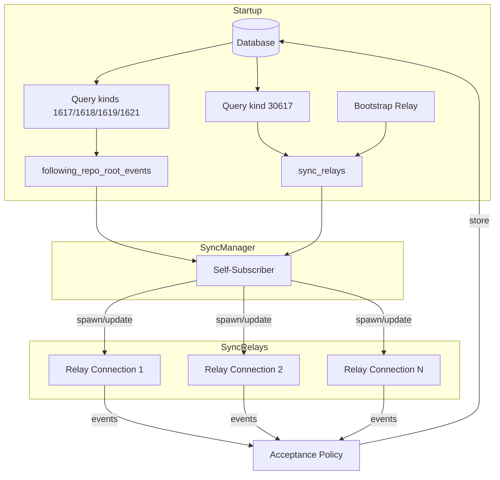
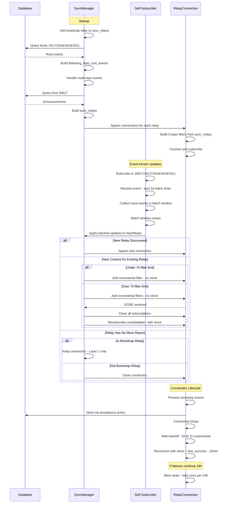

# GRASP-02: Proactive Sync v2 - Simplified Design

## Overview

This document presents a simplified redesign of the proactive sync module. The key insight is that **all sync filters can be derived from two database queries**, with incremental updates via self-subscription.

## Goals (Same as v1)

1. **Data Availability**: Ensure we have all relevant events for repositories we host
2. **Resilience**: Handle relay failures gracefully with backoff and health tracking
3. **Efficiency**: Minimize connections and bandwidth through filter consolidation
4. **Consistency**: Use unified filters for both live sync and catchup

## Core Data Structures

The entire sync filter state is captured in two HashMaps, initialized from database queries at startup:

```rust
/// Repository root events we're following
/// Key: repo addressable reference (e.g., "30617:pubkey:identifier")
/// Value: Set of event IDs (kinds 1617, 1618, 1619, 1621) that tag this repo
///
/// Note: May include a few extra repo refs that aren't in sync_relays.
/// This is acceptable - we won't query other relays for them.
type FollowingRepoRootEvents = Arc<RwLock<HashMap<String, HashSet<EventId>>>>;

/// Relays we sync from, including their repos and events
/// Key: relay URL
/// Value: Map of repo_ref -> event IDs for repos that list both this relay AND our service
///
/// Note: Bootstrap relay (if configured) is always present and excluded from removal logic.
type SyncRelays = Arc<RwLock<HashMap<String, HashMap<String, HashSet<EventId>>>>>;
```

## Architecture Overview



## Design Decision: No Jitter

We considered adding jitter to prevent thundering herd scenarios when:

- Multiple relay connections initialize simultaneously
- Batched updates affect multiple relays
- Filter consolidation triggers across connections

**Decision: No jitter implemented.**

**Rationale:**

- Our GRASP server should handle the load of simultaneous operations
- Jitter would lead to more orphan filters (filters added one at a time rather than atomically)
- Jitter creates inefficiency - partial subscriptions miss events during the stagger window
- The batching window (5s) already provides natural smoothing without the downsides

## Health Tracking & Backoff

```rust
/// Health state machine for relay connections
enum HealthState {
    Healthy,           // Connected and working
    Backoff(u32),      // Failed, attempt count for exponential backoff
    Dead,              // 24h+ continuous failures
}

impl RelayHealthTracker {
    /// Backoff durations:
    /// - Attempt 1: 5s
    /// - Attempt 2: 10s
    /// - Attempt 3: 20s
    /// - Attempt 4: 40s
    /// - ... exponential up to 1h max
    /// - After reaching 1h, continue hourly until 24h total failure time
    /// - After 24h: marked Dead, retry once per 24h
    fn get_backoff(&self, relay_url: &str) -> Duration;
}
```

| State       | Retry Behavior                               |
| ----------- | -------------------------------------------- |
| **Healthy** | Immediate reconnect on disconnect            |
| **Backoff** | 5s → 10s → 20s → ... → 1h max (exponential)  |
| **Hourly**  | Once per hour after hitting 1h cap           |
| **Dead**    | After 24h total failures, retry once per 24h |

## Startup Initialization

At startup, two database queries initialize the sync state:

```rust
impl SyncManager {
    async fn initialize_from_database(&mut self) -> Result<()> {
        // Initialize bootstrap relay if configured (never removed)
        if let Some(bootstrap_url) = &self.config.bootstrap_relay_url {
            self.sync_relays.write().await.insert(
                bootstrap_url.clone(),
                HashMap::new()  // Repos potentially populated below but may stay empty (Layer 1 only)
            );
        }

        // Query 1: Build following_repo_root_events
        // Find all 1617/1618/1619/1621 events and extract their repo references
        let root_events = self.database
            .query(Filter::new().kinds([
                Kind::GitPatch,      // 1617
                Kind::Custom(1618),  // PRs
                Kind::Custom(1619),  // PR updates
                Kind::Custom(1621),  // Issues
            ]))
            .await?;

        for event in root_events {
            // An event may have multiple 'a' tags pointing to different repos
            let repo_refs = self.extract_all_repo_refs(&event);
            for repo_ref in repo_refs {
                self.following_repo_root_events
                    .write().await
                    .entry(repo_ref)
                    .or_default()
                    .insert(event.id);
            }
        }

        // Query 2: Build sync_relays from kind 30617 announcements
        let announcements = self.database
            .query(Filter::new().kind(Kind::Custom(30617)))
            .await?;

        for event in announcements {
            let repo_ref = self.build_repo_ref(&event);
            let relay_urls = self.extract_relay_urls(&event);

            // Only track repos that list BOTH a remote relay AND our service
            if self.lists_our_service(&event) {
                for relay_url in relay_urls {
                    if !self.is_own_relay(&relay_url) {
                        // Get events for this repo from following_repo_root_events
                        let events = self.following_repo_root_events
                            .read().await
                            .get(&repo_ref)
                            .cloned()
                            .unwrap_or_default();

                        self.sync_relays
                            .write().await
                            .entry(relay_url)
                            .or_default()
                            .insert(repo_ref.clone(), events);
                    }
                }
            }
        }

        Ok(())
    }

    /// Extract ALL repo refs from an event (it may tag multiple repos)
    fn extract_all_repo_refs(&self, event: &Event) -> Vec<String> {
        event.tags.iter()
            .filter_map(|tag| {
                let tag_vec = tag.clone().to_vec();
                if tag_vec.len() >= 2 && tag_vec[0] == "a" {
                    // Validate it's a 30617 reference
                    if tag_vec[1].starts_with("30617:") {
                        Some(tag_vec[1].clone())
                    } else {
                        None
                    }
                } else {
                    None
                }
            })
            .collect()
    }
}
```

## Self-Subscriber: Event-Driven Updates

A single self-subscriber watches for new events from **our own relay** and updates the HashMaps.

**Important:** The self-subscriber does NOT subscribe to kind 30618 as this would never lead to refreshing the sync filters. Those events are synced from remote relays only (via Layer 1 filter on sync relay connections).

### Batching Strategy

The batch timer **starts only when the first event arrives**, not on a fixed interval. This prevents the scenario where an event arriving at second 4 of a 5-second interval only gets 1 second before the batch fires.

```rust
impl SelfSubscriber {
    async fn run(&self) {
        // Subscribe to our own relay for relevant kinds
        // Note: 30618 NOT included - synced from remote relays only
        let filter = Filter::new()
            .kinds([
                Kind::Custom(30617),  // Repository announcements
                Kind::GitPatch,       // 1617 Patches
                Kind::Custom(1618),   // PRs
                Kind::Custom(1619),   // PR updates
                Kind::Custom(1621),   // Issues
            ]);

        let mut pending_updates: Vec<PendingUpdate> = Vec::new();
        let mut batch_deadline: Option<Instant> = None;

        loop {
            let timeout = batch_deadline
                .map(|d| d.saturating_duration_since(Instant::now()))
                .unwrap_or(Duration::MAX);

            tokio::select! {
                Some(event) = self.event_receiver.recv() => {
                    pending_updates.push(self.classify_update(&event));

                    // Start batch timer on first event
                    if batch_deadline.is_none() {
                        batch_deadline = Some(Instant::now() + Duration::from_secs(5));
                    }
                }
                _ = tokio::time::sleep(timeout), if batch_deadline.is_some() => {
                    // Batch window elapsed - apply all pending updates
                    self.apply_batched_updates(pending_updates.drain(..).collect()).await;
                    batch_deadline = None;
                }
            }
        }
    }

    fn classify_update(&self, event: &Event) -> PendingUpdate {
        match event.kind.as_u16() {
            30617 => PendingUpdate::NewAnnouncement(event.clone()),
            1617 | 1618 | 1619 | 1621 => PendingUpdate::NewRootEvent(event.clone()),
            _ => PendingUpdate::None,
        }
    }
}
```

### Applying Batched Updates

When the batch window closes, we process all pending updates together:

```rust
/// Batched updates grouped by relay
struct RelayUpdateBatch {
    /// New repo refs to subscribe to (Layer 2)
    new_repo_refs: HashSet<String>,
    /// New event IDs to subscribe to (Layer 3)
    new_event_ids: HashSet<EventId>,
    /// Whether this is a newly discovered relay
    is_new_relay: bool,
}

impl SelfSubscriber {
    async fn apply_batched_updates(&mut self, updates: Vec<PendingUpdate>) {
        // Step 1: Process all updates and update HashMaps
        // Build batched actions per relay
        let mut relay_batches: HashMap<String, RelayUpdateBatch> = HashMap::new();

        for update in updates {
            match update {
                PendingUpdate::NewAnnouncement(event) => {
                    self.process_announcement(&event, &mut relay_batches).await;
                }
                PendingUpdate::NewRootEvent(event) => {
                    self.process_root_event(&event, &mut relay_batches).await;
                }
                PendingUpdate::None => {}
            }
        }

        // Step 2: Apply batched updates to each relay
        for (relay_url, batch) in relay_batches {
            self.apply_batch_to_relay(&relay_url, batch).await;
        }

        // Step 3: Check for relay removal (repos removed from announcements)
        self.check_relay_removal().await;
    }

    async fn apply_batch_to_relay(&mut self, relay_url: &str, batch: RelayUpdateBatch) {
        if batch.is_new_relay {
            // Spawn new relay connection with full filters
            self.spawn_sync_relay(relay_url.to_string()).await;
            return;
        }

        // Build incremental filters for new content (NO since - get historical)
        let incremental_filters = self.build_incremental_filters(&batch);

        if incremental_filters.is_empty() {
            return;
        }

        // Check if we need to consolidate
        let current_filter_count = self.get_filter_count_for_relay(relay_url).await;
        let new_filter_count = current_filter_count + incremental_filters.len();

        if new_filter_count > 70 {
            // Consolidate: add incremental filters first (no since), wait for EOSE,
            // then close all and resubscribe with consolidated filters (with since)
            self.consolidate_relay_subscription(relay_url, incremental_filters).await;
        } else {
            // Just add incremental filters (no since - to get historical events)
            self.send_filters_to_relay(relay_url, incremental_filters).await;
        }
    }

    fn build_incremental_filters(&self, batch: &RelayUpdateBatch) -> Vec<Filter> {
        let mut filters = Vec::new();

        // Layer 2: New repo refs (for ALL kinds that tag repos with 'a' tags)
        if !batch.new_repo_refs.is_empty() {
            let refs: Vec<String> = batch.new_repo_refs.iter().cloned().collect();
            for chunk in refs.chunks(100) {
                // All kinds with lowercase 'a' tag
                filters.push(
                    Filter::new()
                        .custom_tag(SingleLetterTag::lowercase(Alphabet::A), chunk.to_vec())
                );
                // All kinds with uppercase 'A' tag
                filters.push(
                    Filter::new()
                        .custom_tag(SingleLetterTag::uppercase(Alphabet::A), chunk.to_vec())
                );
                // All kinds with 'q' tag (quote)
                filters.push(
                    Filter::new()
                        .custom_tag(SingleLetterTag::lowercase(Alphabet::Q), chunk.to_vec())
                );
            }
        }

        // Layer 3: New event IDs
        if !batch.new_event_ids.is_empty() {
            let ids: Vec<String> = batch.new_event_ids.iter()
                .map(|id| id.to_hex())
                .collect();
            for chunk in ids.chunks(100) {
                filters.push(
                    Filter::new()
                        .custom_tag(SingleLetterTag::lowercase(Alphabet::E), chunk.to_vec())
                );
                filters.push(
                    Filter::new()
                        .custom_tag(SingleLetterTag::uppercase(Alphabet::E), chunk.to_vec())
                );
                filters.push(
                    Filter::new()
                        .custom_tag(SingleLetterTag::lowercase(Alphabet::Q), chunk.to_vec())
                );
            }
        }

        filters
    }
}
```

### Consolidation Strategy

When consolidating, we need a two-phase approach:

1. First, subscribe with incremental filters (no `since`) to get any historical events we missed
2. After receiving EOSE, close all subscriptions and resubscribe with consolidated filters (with `since`)

```rust
async fn consolidate_relay_subscription(
    &mut self,
    relay_url: &str,
    incremental_filters: Vec<Filter>,
) {
    // Phase 1: Add incremental filters WITHOUT since to catch up on new content
    // These filters are for new repo_refs / event_ids we just discovered
    let phase1_sub_id = self.send_filters_to_relay_and_wait_eose(
        relay_url,
        incremental_filters
    ).await;

    // Phase 2: After EOSE, consolidate everything
    // Close ALL existing subscriptions for this relay
    self.close_all_subscriptions(relay_url).await;

    // Build fresh consolidated filters using current HashMap state
    let consolidated_filters = self.build_three_layer_filters_for_relay(relay_url).await;

    // Resubscribe with since = now - 15 minutes
    let since = Timestamp::now() - 900;
    let filters_with_since: Vec<Filter> = consolidated_filters
        .into_iter()
        .map(|f| f.since(since))
        .collect();

    self.send_filters_to_relay(relay_url, filters_with_since).await;
}
```

## Sync Relay Connections

Each sync relay connection uses the three-layer filter strategy:

```rust
impl SyncRelayConnection {
    async fn start(&mut self) {
        loop {
            match self.connect_and_subscribe().await {
                Ok(()) => {
                    // Record successful connection
                    self.last_successful_connection = Instant::now();
                    self.health_tracker.record_success(&self.url);

                    // Run event loop until disconnect
                    self.run_event_loop().await;
                }
                Err(e) => {
                    self.health_tracker.record_failure(&self.url);
                }
            }

            // Reconnect with backoff and since filter
            let backoff = self.health_tracker.get_backoff(&self.url);
            tokio::time::sleep(backoff).await;

            // On reconnect, use since = last_successful - 15 minutes
            self.reconnect_since = Some(
                Timestamp::from(self.last_successful_connection - Duration::from_secs(900))
            );
        }
    }

    async fn connect_and_subscribe(&mut self) -> Result<()> {
        self.client.connect().await?;

        let filters = self.build_three_layer_filters().await;

        // Apply since filter if reconnecting
        let filters = if let Some(since) = self.reconnect_since {
            filters.into_iter().map(|f| f.since(since)).collect()
        } else {
            filters
        };

        for filter in filters {
            self.client.subscribe(filter, None).await?;
        }

        Ok(())
    }
}
```

## Three-Layer Filter Strategy

```rust
impl SyncRelayConnection {
    async fn build_three_layer_filters(&self) -> Vec<Filter> {
        let mut filters = Vec::new();

        // Get repos for this relay
        let repos = self.sync_relays.read().await
            .get(&self.url)
            .cloned()
            .unwrap_or_default();

        // Layer 1: Announcements (kinds 30617 + 30618)
        // Note: 30618 is ONLY synced from remote relays, not self-subscribed
        // Always included even if relay has no repos (bootstrap relay case)
        filters.push(
            Filter::new().kinds([Kind::Custom(30617), Kind::Custom(30618)])
        );

        // Layer 2: Events tagging repos with 'a' tags (ALL kinds)
        // Batched per 100 repo refs
        let repo_refs: Vec<String> = repos.keys().cloned().collect();
        for chunk in repo_refs.chunks(100) {
            filters.push(
                Filter::new()
                    .custom_tag(SingleLetterTag::lowercase(Alphabet::A), chunk.to_vec())
            );
            filters.push(
                Filter::new()
                    .custom_tag(SingleLetterTag::uppercase(Alphabet::A), chunk.to_vec())
            );
            filters.push(
                Filter::new()
                    .custom_tag(SingleLetterTag::lowercase(Alphabet::Q), chunk.to_vec())
            );
        }

        // Layer 3: Events tagging root events (batch per 100 event IDs)
        let all_event_ids: HashSet<EventId> = repos.values()
            .flat_map(|ids| ids.iter().cloned())
            .collect();

        let event_id_strs: Vec<String> = all_event_ids
            .iter()
            .map(|id| id.to_hex())
            .collect();

        for chunk in event_id_strs.chunks(100) {
            filters.push(
                Filter::new()
                    .custom_tag(SingleLetterTag::lowercase(Alphabet::E), chunk.to_vec())
            );
            filters.push(
                Filter::new()
                    .custom_tag(SingleLetterTag::uppercase(Alphabet::E), chunk.to_vec())
            );
            filters.push(
                Filter::new()
                    .custom_tag(SingleLetterTag::lowercase(Alphabet::Q), chunk.to_vec())
            );
        }

        filters
    }
}
```

## Relay Removal

```rust
async fn check_relay_removal(&mut self) {
    let relays_to_check: Vec<String> = self.sync_relays.read().await
        .keys()
        .cloned()
        .collect();

    for relay_url in relays_to_check {
        // Never remove bootstrap relay
        if Some(relay_url.as_str()) == self.config.bootstrap_relay_url.as_deref() {
            continue;
        }

        // Check if relay has any repos left
        let should_remove = {
            let sync_relays = self.sync_relays.read().await;
            sync_relays.get(&relay_url)
                .map(|repos| repos.is_empty())
                .unwrap_or(true)
        };

        if should_remove {
            // Remove from HashMap
            self.sync_relays.write().await.remove(&relay_url);

            // Close connection
            self.close_relay_connection(&relay_url).await;
        }
    }
}
```

## Prometheus Metrics (Same as v1)

| Metric                                | Type    | Labels        | Description             |
| ------------------------------------- | ------- | ------------- | ----------------------- |
| `ngit_sync_relay_connected`           | Gauge   | relay         | Connection status 1/0   |
| `ngit_sync_connection_attempts_total` | Counter | relay, result | Attempts by outcome     |
| `ngit_sync_relay_status`              | Gauge   | relay         | Health state 1/2/3      |
| `ngit_sync_relay_failures`            | Gauge   | relay         | Consecutive failures    |
| `ngit_sync_events_total`              | Counter | source        | Events by source type   |
| `ngit_sync_gap_events_total`          | Counter | relay         | Gap events filled       |
| `ngit_sync_relays_tracked_total`      | Gauge   | -             | Total relays discovered |
| `ngit_sync_relays_connected_total`    | Gauge   | -             | Currently connected     |
| `ngit_sync_relays_dead_total`         | Gauge   | -             | Dead relay count        |

## Module Structure (Simplified)

```
src/sync/
├── mod.rs              # Module exports, constants
├── manager.rs          # SyncManager - orchestrates sync
├── state.rs            # FollowingRepoRootEvents + SyncRelays HashMaps
├── self_subscriber.rs  # Self-subscriber + batching logic
├── relay_connection.rs # Per-relay WebSocket + filters
├── health.rs           # RelayHealthTracker (reuse from v1)
└── metrics.rs          # SyncMetrics (reuse from v1)
```

## Comparison: v1 vs v2

| Aspect              | v1 (Current)                                                       | v2 (Simplified)                               |
| ------------------- | ------------------------------------------------------------------ | --------------------------------------------- |
| **State Model**     | Spread across FilterService, SubscriptionManager, ConnectionState  | Two HashMaps derived from DB                  |
| **Relay Discovery** | Multiple paths: bootstrap, DB query, self-subscribe, remote events | Single path: DB init + self-subscribe         |
| **Filter Updates**  | Dynamic per-event subscription adds                                | Batched updates (5s window, starts on event)  |
| **Consolidation**   | Per-connection at 150 filters                                      | Per-connection at 70 filters                  |
| **Batching**        | Per 100 tags                                                       | Per 100 tags                                  |
| **Reconnection**    | Various backoff strategies                                         | Unified: since = last_success - 15min         |
| **Jitter**          | Startup jitter                                                     | None (see design decision)                    |
| **30618 Handling**  | Synced everywhere                                                  | Remote relays only, not self-subscribed       |
| **1621 (Issues)**   | Not included                                                       | Included with 1617/1618/1619                  |
| **Layer 2 Scope**   | Specific NIP-34 kinds                                              | ALL kinds with 'a' tags                       |
| **Health Backoff**  | Variable                                                           | 5s → exp → 1h max → hourly → dead@24h → daily |

## Key Design Decisions

1. **Single Source of Truth**: Two HashMaps represent all sync state, initialized from database
2. **Event-Driven Updates**: Self-subscriber updates HashMaps; relay connections read from them
3. **Batched Filter Updates**: 5-second window that starts on first event (not fixed interval)
4. **Uniform Reconnection**: Always use `since = last_successful - 15min`
5. **No Jitter**: Trade-offs not worth it - orphan filters and inefficiency outweigh thundering herd concerns
6. **Bootstrap Relay Protected**: Never removed from sync_relays; subscribes with Layer 1 even if empty
7. **30618 Remote-Only**: Maintainer state synced from remote relays, not self-subscribed
8. **70 Filter Consolidation Threshold**: Lower than v1's 150 for earlier consolidation
9. **100-Tag Batching**: Consistent batch size for Layer 2 and Layer 3 filters
10. **Layer 2 All Kinds**: Subscribe to ALL events with 'a' tags, not just NIP-34 kinds
11. **Two-Phase Consolidation**: Incremental filters WITHOUT since first, then consolidated WITH since
12. **Multiple Repo Refs**: Handle events that tag multiple repos correctly

---

## Detailed Flow Diagram


