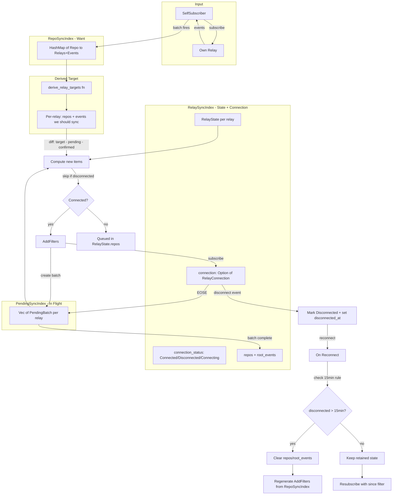
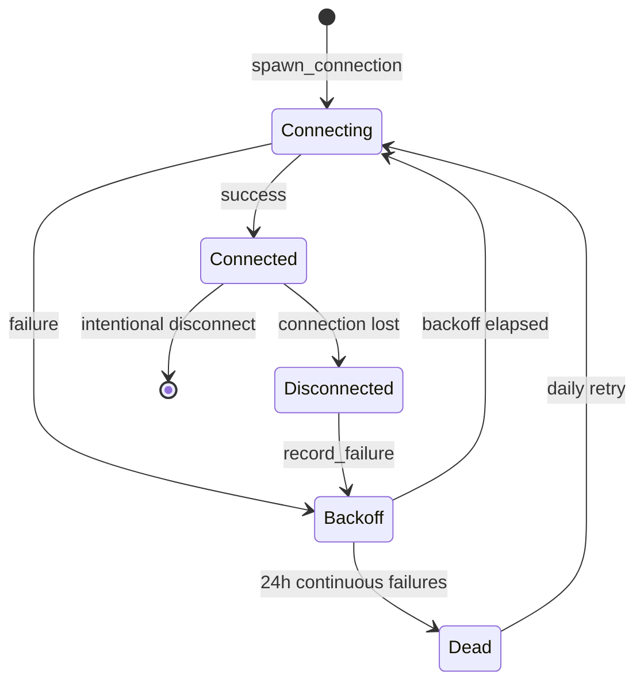

# GRASP-02: Proactive Sync v3 - Event-Driven Design

## Overview

This document presents v3 of the proactive sync design. Key principles:

1. **Self-subscription as the only mechanism** - No database initialization at startup
2. **Batch-based pending tracking** - Each batch confirms independently
3. **Single action type** - AddFilters only, auto-spawn connections
4. **Three-way state model** - RepoSyncIndex (want) → PendingSyncIndex (in-flight) → RelaySyncIndex (confirmed)

---

## Data Model

### RepoSyncIndex (Source of Truth)

```rust
/// What we WANT to sync - derived from events received via self-subscription.
/// Updated immediately when self-subscriber batch fires.
/// Key: repo addressable ref ("30617:pubkey:identifier")
pub type RepoSyncIndex = Arc<RwLock<HashMap<String, RepoSyncNeeds>>>;

#[derive(Debug, Clone, Default)]
pub struct RepoSyncNeeds {
    /// Relay URLs listed in this repo's 30617 announcement
    pub relays: HashSet<String>,
    /// Root event IDs (1617/1618/1619/1621) that reference this repo
    pub root_events: HashSet<EventId>,
}
```

### RelaySyncIndex (Confirmed State + Connection)

```rust
/// What we've CONFIRMED syncing - includes connection state for integrated lifecycle.
/// Key: relay URL
pub type RelaySyncIndex = Arc<RwLock<HashMap<String, RelayState>>>;

/// Connection status for a relay
#[derive(Debug, Clone, Copy, PartialEq, Eq)]
pub enum ConnectionStatus {
    /// Not currently connected
    Disconnected,
    /// Connection attempt in progress
    Connecting,
    /// Successfully connected and subscribed
    Connected,
}

/// Complete state for a single relay - combines sync needs with connection lifecycle
#[derive(Debug)]
pub struct RelayState {
    /// Repos we've confirmed syncing from this relay
    pub repos: HashSet<String>,
    /// Root events we've confirmed tracking
    pub root_events: HashSet<EventId>,
    /// If true, never disconnect this relay
    pub is_bootstrap: bool,
    /// Current connection status
    pub connection_status: ConnectionStatus,
    /// When we last successfully connected (for since filter on reconnect)
    pub last_connected: Option<Timestamp>,
    /// When we disconnected (for 15-minute state retention rule)
    pub disconnected_at: Option<Timestamp>,
    /// The active connection (None if disconnected)
    pub connection: Option<RelayConnection>,
}

impl RelayState {
    /// Check if state should be cleared based on 15-minute rule
    pub fn should_clear_state(&self) -> bool {
        match self.disconnected_at {
            Some(disconnected) => {
                let now = Timestamp::now();
                now.as_u64().saturating_sub(disconnected.as_u64()) > 900 // 15 minutes
            }
            None => false, // Still connected or never connected
        }
    }
    
    /// Clear repos and root_events (called when reconnect takes > 15 minutes)
    pub fn clear_sync_state(&mut self) {
        self.repos.clear();
        self.root_events.clear();
    }
}
```

### PendingSyncIndex (In-Flight Batches)

```rust
/// Tracks batches of subscriptions that are in-flight, awaiting EOSE.
/// Each batch has its own ID and can confirm independently.
/// Key: relay URL
pub type PendingSyncIndex = Arc<RwLock<HashMap<String, Vec<PendingBatch>>>>;

#[derive(Debug, Clone)]
pub struct PendingBatch {
    /// Unique ID for this batch (for debugging/logging)
    pub batch_id: u64,
    /// The items this batch is syncing
    pub items: PendingItems,
    /// Subscription IDs that must ALL receive EOSE before confirming
    pub outstanding_subs: HashSet<SubscriptionId>,
}

#[derive(Debug, Clone, Default)]
pub struct PendingItems {
    pub repos: HashSet<String>,
    pub root_events: HashSet<EventId>,
}
```

---

## State Flow



### Connection Lifecycle Integration

The `RelayState` struct now owns both the connection and sync state:

```rust
// On disconnect (detected via RelayPoolNotification::Shutdown or handle_notifications returning)
fn handle_disconnect(&mut self, relay_url: &str) {
    if let Some(state) = self.relay_sync_index.write().await.get_mut(relay_url) {
        state.connection_status = ConnectionStatus::Disconnected;
        state.disconnected_at = Some(Timestamp::now());
        state.connection = None;
        
        // Clear any pending batches for this relay
        self.pending_sync_index.write().await.remove(relay_url);
    }
}

// On reconnect
async fn handle_reconnect(&mut self, relay_url: &str) -> Result<(), Error> {
    let mut index = self.relay_sync_index.write().await;
    let state = index.get_mut(relay_url).ok_or("Relay not in index")?;
    
    // Apply 15-minute state retention rule
    if state.should_clear_state() {
        tracing::info!("Reconnect after >15min for {}, clearing state", relay_url);
        state.clear_sync_state();
    }
    
    // Create new connection
    state.connection_status = ConnectionStatus::Connecting;
    let connection = RelayConnection::new(relay_url.to_string());
    
    // Connect with since filter if we have last_connected
    let since = state.last_connected.map(|ts| {
        Timestamp::from(ts.as_u64().saturating_sub(900)) // -15 min buffer
    });
    
    connection.connect_and_subscribe_with_since(since).await?;
    
    state.connection = Some(connection);
    state.connection_status = ConnectionStatus::Connected;
    state.last_connected = Some(Timestamp::now());
    state.disconnected_at = None;
    
    drop(index); // Release lock
    
    // Regenerate AddFilters from current state (either retained or fresh from RepoSyncIndex)
    self.regenerate_filters_for_relay(relay_url).await;
    
    Ok(())
}

/// Regenerate AddFilters for a relay after reconnection
async fn regenerate_filters_for_relay(&mut self, relay_url: &str) {
    let repo_index = self.repo_sync_index.read().await;
    let targets = derive_relay_targets(&repo_index);
    
    if let Some(target) = targets.get(relay_url) {
        // Build filters for everything this relay should sync
        let filters = build_filters(&target.repos, &target.root_events);
        
        // Create and process AddFilters action
        let action = AddFilters {
            relay_url: relay_url.to_string(),
            repos: target.repos.clone(),
            root_events: target.root_events.clone(),
            filters,
        };
        
        self.handle_add_filters(action).await;
    }
}
```

---

## Action Type

```rust
/// Action sent from SelfSubscriber to SyncManager.
/// SyncManager auto-spawns relay connections if they don't exist.
pub struct AddFilters {
    pub relay_url: String,
    /// Items this action covers (for pending tracking)
    pub repos: HashSet<String>,
    pub root_events: HashSet<EventId>,
    /// Pre-batched filters (each with <= 100 tags)
    pub filters: Vec<Filter>,
}
```

---

## Core Algorithms

### 1. derive_relay_targets

Transform RepoSyncIndex into per-relay sync targets:

```rust
fn derive_relay_targets(
    repo_index: &HashMap<String, RepoSyncNeeds>
) -> HashMap<String, RelaySyncNeeds> {
    let mut targets: HashMap<String, RelaySyncNeeds> = HashMap::new();
    
    for (repo_ref, needs) in repo_index {
        for relay_url in &needs.relays {
            let target = targets.entry(relay_url.clone()).or_default();
            target.repos.insert(repo_ref.clone());
            target.root_events.extend(needs.root_events.iter().cloned());
        }
    }
    
    targets
}
```

### 2. compute_actions (Three-Way Diff)

```rust
fn compute_actions(
    targets: &HashMap<String, RelaySyncNeeds>,
    pending: &HashMap<String, Vec<PendingBatch>>,
    confirmed: &HashMap<String, RelayState>,
) -> Vec<AddFilters> {
    let mut actions = Vec::new();
    
    for (relay_url, target) in targets {
        // Skip disconnected relays - they'll get AddFilters on reconnect
        if let Some(state) = confirmed.get(relay_url) {
            if state.connection_status != ConnectionStatus::Connected {
                continue;
            }
        }
        
        // Collect all pending items for this relay
        let pending_repos: HashSet<_> = pending.get(relay_url)
            .map(|batches| batches.iter()
                .flat_map(|b| b.items.repos.iter().cloned())
                .collect())
            .unwrap_or_default();
        let pending_events: HashSet<_> = pending.get(relay_url)
            .map(|batches| batches.iter()
                .flat_map(|b| b.items.root_events.iter().cloned())
                .collect())
            .unwrap_or_default();
        
        // Collect confirmed items for this relay
        let confirmed_repos = confirmed.get(relay_url)
            .map(|c| &c.repos)
            .unwrap_or(&HashSet::new());
        let confirmed_events = confirmed.get(relay_url)
            .map(|c| &c.root_events)
            .unwrap_or(&HashSet::new());
        
        // New = target - pending - confirmed
        let new_repos: HashSet<_> = target.repos.iter()
            .filter(|r| !pending_repos.contains(*r) && !confirmed_repos.contains(*r))
            .cloned()
            .collect();
        let new_events: HashSet<_> = target.root_events.iter()
            .filter(|e| !pending_events.contains(*e) && !confirmed_events.contains(*e))
            .cloned()
            .collect();
        
        if !new_repos.is_empty() || !new_events.is_empty() {
            let filters = build_filters(&new_repos, &new_events);
            actions.push(AddFilters {
                relay_url: relay_url.clone(),
                repos: new_repos,
                root_events: new_events,
                filters,
            });
        }
    }
    
    actions
}
```

### 3. handle_add_filters (SyncManager)

```rust
impl SyncManager {
    async fn handle_add_filters(&mut self, action: AddFilters) {
        let AddFilters { relay_url, repos, root_events, filters } = action;
        
        // Auto-spawn connection if needed
        if !self.connections.contains_key(&relay_url) {
            self.spawn_connection(&relay_url).await;
        }
        
        let conn = self.connections.get(&relay_url).unwrap();
        
        // Subscribe and collect subscription IDs
        // nostr-sdk 0.44: subscribe returns Output<Vec<SubscriptionId>>
        // since we're only subscribed to one relay per connection
        let mut sub_ids = HashSet::new();
        for filter in filters {
            // cloned filter for each subscription call
            match conn.client.subscribe(filter, None).await {
                Ok(output) => {
                    // Output contains subscription IDs for each relay
                    for sub_id in output.val {
                        sub_ids.insert(sub_id);
                    }
                }
                Err(e) => {
                    tracing::warn!("Failed to subscribe: {}", e);
                }
            }
        }
        
        // Create pending batch
        let batch = PendingBatch {
            batch_id: self.next_batch_id(),
            items: PendingItems { repos, root_events },
            outstanding_subs: sub_ids,
        };
        
        // Add to pending index
        self.pending_sync_index.write().await
            .entry(relay_url)
            .or_default()
            .push(batch);
    }
}
```

### 4. handle_eose (Batch Completion)

```rust
impl SyncManager {
    async fn handle_eose(&mut self, relay_url: &str, sub_id: SubscriptionId) {
        let mut pending = self.pending_sync_index.write().await;
        
        if let Some(batches) = pending.get_mut(relay_url) {
            // Find which batch this subscription belongs to
            for batch in batches.iter_mut() {
                if batch.outstanding_subs.remove(&sub_id) {
                    // Check if batch is now complete
                    if batch.outstanding_subs.is_empty() {
                        // Move items to confirmed
                        let items = batch.items.clone();
                        drop(pending); // Release lock before acquiring another
                        
                        let mut confirmed = self.relay_sync_index.write().await;
                        let relay_confirmed = confirmed
                            .entry(relay_url.to_string())
                            .or_default();
                        relay_confirmed.repos.extend(items.repos);
                        relay_confirmed.root_events.extend(items.root_events);
                        
                        tracing::info!(
                            "Batch {} complete for {} - confirmed {} repos, {} events",
                            batch.batch_id, relay_url,
                            items.repos.len(), items.root_events.len()
                        );
                    }
                    break;
                }
            }
            
            // Clean up completed batches
            if let Some(batches) = pending.get_mut(relay_url) {
                batches.retain(|b| !b.outstanding_subs.is_empty());
            }
        }
    }
}
```

---

## Self-Subscriber Flow

### State Tracking

```rust
pub struct SelfSubscriber {
    own_relay_url: String,
    relay_domain: String,
    repo_sync_index: RepoSyncIndex,
    pending_sync_index: PendingSyncIndex,
    relay_sync_index: RelaySyncIndex,
    action_tx: mpsc::Sender<AddFilters>,
    /// Timestamp of last successful connection - used for since filter on reconnection
    last_connected: Option<Timestamp>,
    /// Is this the first connection attempt since startup?
    is_initial_connect: bool,
}
```

### On Startup

```rust
impl SelfSubscriber {
    async fn run(mut self) {
        // Connect to own relay
        let client = Client::new(Keys::generate());
        client.add_relay(&self.own_relay_url).await?;
        client.connect().await;
        
        // Track connection time
        self.last_connected = Some(Timestamp::now());
        
        // Subscribe WITHOUT since filter (get all historical) on first connect
        let filter = Filter::new().kinds([
            Kind::Custom(30617),  // Repository announcements
            Kind::GitPatch,       // 1617
            Kind::Custom(1618),   // PRs
            Kind::Custom(1619),   // PR updates
            Kind::GitIssue,       // 1621
        ]);
        
        client.subscribe(filter, None).await?;
        self.is_initial_connect = false;
        
        // Run event loop with batching
        self.event_loop(&client).await;
    }
}
```

### On Reconnection

```rust
impl SelfSubscriber {
    async fn reconnect(&mut self, client: &Client) -> Result<(), Error> {
        // Reconnect to own relay
        client.connect().await;
        
        // On reconnection ONLY, use since filter based on last_connected
        let since = match self.last_connected {
            Some(ts) => Timestamp::from(ts.as_u64().saturating_sub(900)), // -15 minutes buffer
            None => Timestamp::from(0), // Shouldn't happen, but fall back to full sync
        };
        
        // Update last_connected AFTER computing since
        self.last_connected = Some(Timestamp::now());
        
        let filter = Filter::new()
            .kinds([
                Kind::Custom(30617),
                Kind::GitPatch,
                Kind::Custom(1618),
                Kind::Custom(1619),
                Kind::GitIssue,
            ])
            .since(since);
        
        client.subscribe(filter, None).await?;
        Ok(())
    }
}
```

### Batching Logic

```rust
impl SelfSubscriber {
    async fn event_loop(&self, client: &Client) {
        let mut pending_events: Vec<Event> = Vec::new();
        let mut batch_timer: Option<Instant> = None;
        let batch_window = Duration::from_secs(5);
        
        loop {
            let timeout = batch_timer
                .map(|t| batch_window.saturating_sub(t.elapsed()))
                .unwrap_or(Duration::from_secs(60));
            
            tokio::select! {
                notification = client.notifications().recv() => {
                    if let Ok(RelayPoolNotification::Event { event, .. }) = notification {
                        pending_events.push(*event);
                        
                        // Start timer on first event (does NOT reset)
                        if batch_timer.is_none() {
                            batch_timer = Some(Instant::now());
                        }
                    }
                }
                _ = tokio::time::sleep(timeout), if batch_timer.is_some() => {
                    // Batch window elapsed
                    self.process_batch(pending_events.drain(..).collect()).await;
                    batch_timer = None;
                }
            }
        }
    }
    
    async fn process_batch(&self, events: Vec<Event>) {
        // 1. Update RepoSyncIndex
        for event in events {
            match event.kind.as_u16() {
                30617 => self.handle_announcement(&event).await,
                1617 | 1618 | 1619 | 1621 => self.handle_root_event(&event).await,
                _ => {}
            }
        }
        
        // 2. Derive targets and compute actions
        let repo_index = self.repo_sync_index.read().await;
        let targets = derive_relay_targets(&repo_index);
        
        let pending = self.pending_sync_index.read().await;
        let confirmed = self.relay_sync_index.read().await;
        
        let actions = compute_actions(&targets, &pending, &confirmed);
        
        drop(repo_index);
        drop(pending);
        drop(confirmed);
        
        // 3. Send actions to SyncManager
        for action in actions {
            let _ = self.action_tx.send(action).await;
        }
    }
}
```

---

## Bootstrap Relay

```rust
impl SyncManager {
    async fn initialize_bootstrap(&mut self) {
        if let Some(url) = &self.config.bootstrap_relay_url {
            // Pre-mark as bootstrap (never removed)
            self.relay_sync_index.write().await.insert(
                url.clone(),
                RelaySyncNeeds {
                    repos: HashSet::new(),
                    root_events: HashSet::new(),
                    is_bootstrap: true,
                }
            );
            
            // Send Layer 1 filter
            let filters = vec![
                Filter::new().kinds([Kind::Custom(30617), Kind::Custom(30618)])
            ];
            
            self.handle_add_filters(AddFilters {
                relay_url: url.clone(),
                repos: HashSet::new(),  // Layer 1 doesn't track specific repos
                root_events: HashSet::new(),
                filters,
            }).await;
        }
    }
}
```

---

## Disconnect Handling

Direct in SyncManager (not via action):

```rust
impl SyncManager {
    async fn check_disconnects(&mut self) {
        let confirmed = self.relay_sync_index.read().await;
        
        for (relay_url, state) in confirmed.iter() {
            if state.is_bootstrap {
                continue; // Never disconnect bootstrap
            }
            
            if state.repos.is_empty() && state.root_events.is_empty() {
                // No repos - disconnect
                self.disconnect_relay(relay_url).await;
            }
        }
    }
    
    async fn disconnect_relay(&mut self, relay_url: &str) {
        self.relay_sync_index.write().await.remove(relay_url);
        self.pending_sync_index.write().await.remove(relay_url);
        
        if let Some(conn) = self.connections.remove(relay_url) {
            conn.disconnect().await;
        }
    }
}
```

---

## Relay Connection Lifecycle

### State Machine for External Relays



### Health Integration

Uses `RelayHealthTracker` from [`src/sync/health.rs`](../../src/sync/health.rs):

```rust
impl SyncManager {
    /// Spawn a connection with health tracking
    async fn spawn_connection(&mut self, relay_url: &str) {
        // Check if we should attempt connection
        if !self.health_tracker.should_attempt_connection(relay_url) {
            let remaining = self.health_tracker.get_remaining_backoff(relay_url);
            tracing::debug!(
                "Skipping connection to {} - backoff {:?}",
                relay_url,
                remaining
            );
            return;
        }
        
        match self.try_connect(relay_url).await {
            Ok(conn) => {
                self.health_tracker.record_success(relay_url);
                self.connections.insert(relay_url.to_string(), conn);
            }
            Err(e) => {
                self.health_tracker.record_failure(relay_url);
                tracing::warn!("Connection to {} failed: {}", relay_url, e);
            }
        }
    }
}
```

### Reconnection Loop

Each relay connection runs its own reconnection loop:

```rust
impl RelayConnection {
    async fn run_with_reconnection(
        mut self,
        health_tracker: Arc<RelayHealthTracker>,
        event_tx: mpsc::Sender<RelayEvent>,
    ) {
        loop {
            // Check backoff before attempting
            if !health_tracker.should_attempt_connection(&self.url) {
                if let Some(remaining) = health_tracker.get_remaining_backoff(&self.url) {
                    tokio::time::sleep(remaining).await;
                    continue;
                }
            }
            
            // Attempt connection
            match self.connect_and_subscribe().await {
                Ok(()) => {
                    health_tracker.record_success(&self.url);
                    
                    // Track when we connected for since filter on reconnect
                    let connected_at = Timestamp::now();
                    
                    // Run event loop until disconnection
                    self.run_event_loop(&event_tx).await;
                    
                    // Connection lost - will reconnect with since filter
                    health_tracker.record_failure(&self.url);
                    
                    // On reconnect, use since = connected_at - 15 minutes
                    self.set_reconnect_since(connected_at);
                }
                Err(e) => {
                    health_tracker.record_failure(&self.url);
                    tracing::warn!("Connection to {} failed: {}", self.url, e);
                }
            }
            
            // Get backoff duration and wait
            let state = health_tracker.get_state(&self.url);
            if state == HealthState::Dead {
                // Dead relays retry once per 24 hours
                tokio::time::sleep(Duration::from_secs(24 * 3600)).await;
            }
            // Otherwise, loop will check should_attempt_connection
        }
    }
}
```

### Backoff Configuration

From existing [`RelayHealthTracker`](../../src/sync/health.rs:91):

| Parameter | Value | Notes |
|-----------|-------|-------|
| Base backoff | 5 seconds | First failure |
| Backoff multiplier | 2x | Exponential increase |
| Max backoff | 1 hour (configurable) | `sync_max_backoff_secs` |
| Dead threshold | 24 hours | Continuous failures |
| Dead retry interval | 24 hours | Once per day |

---

## Consolidation

### Threshold-Based (70 filters)

```rust
impl SyncManager {
    async fn maybe_consolidate(&mut self, relay_url: &str) {
        let filter_count = self.get_filter_count(relay_url).await;
        
        if filter_count > 70 {
            self.consolidate(relay_url).await;
        }
    }
    
    async fn consolidate(&mut self, relay_url: &str) {
        // 1. Wait for all pending batches to complete
        self.wait_pending_complete(relay_url).await;
        
        // 2. Close all subscriptions
        self.close_all_subs(relay_url).await;
        
        // 3. Rebuild filters from confirmed state
        let confirmed = self.relay_sync_index.read().await;
        let state = confirmed.get(relay_url)?;
        let filters = build_filters(&state.repos, &state.root_events);
        
        // 4. Resubscribe with since = now - 15 minutes
        let since = Timestamp::now() - 900;
        for filter in filters {
            self.subscribe(relay_url, filter.since(since)).await;
        }
    }
}
```

### Daily Timer (23-25h Random)

```rust
impl SyncManager {
    async fn run_daily_consolidation(&self) {
        loop {
            let hours = 23 + rand::random::<f64>() * 2.0;
            tokio::time::sleep(Duration::from_secs_f64(hours * 3600.0)).await;
            
            for relay_url in self.connections.keys() {
                self.consolidate(relay_url).await;
            }
        }
    }
}
```

---

## Key Design Decisions

| Decision | Choice | Rationale |
|----------|--------|-----------|
| Startup mechanism | Self-subscription only | Single code path, fresh DB behaves same as reconnect |
| Since filter | Only on reconnection | Initial subscribe gets full history |
| Pending tracking | Per-batch with batch ID | Independent confirmation, no blocking |
| EOSE requirement | All subs in batch must complete | Single repo may need multiple filter subs |
| Action type | Struct not enum | Only one action type needed |
| Relay spawning | Auto-spawn on AddFilters | Simplifies action logic |
| Disconnect | Direct in SyncManager | Not worth an action type |
| Consolidation | 70 filters + daily timer | Threshold for growth, timer for staleness |
| Timestamps | In-memory only | Not critical for correctness |
| Health tracking | Reuse existing RelayHealthTracker | Already implements exponential backoff, dead relay detection |
| Reconnection backoff | Exponential to 1h max | Prevents hammering failed relays |
| Dead relay policy | 24h threshold, daily retry | Balance between giving up and resource waste |
| last_connected tracking | Per-connection in-memory | Enables 15-minute buffer on reconnect |
| Connection ownership | Inside RelayState | Ties connection lifecycle to sync state, simpler than separate maps |
| State retention rule | Clear if disconnected >15min | Matches since filter buffer, prevents stale subscriptions |
| Skip disconnected | compute_actions skips disconnected | Prevents queuing AddFilters for offline relays |
| Reconnect triggers | handle_notifications returns or Shutdown | nostr-sdk signals disconnect via event loop exit |
| On-reconnect flow | Regenerate AddFilters from RepoSyncIndex | Fresh subscriptions for what we actually need |

---

## Module Structure

```
src/sync/
├── mod.rs              # SyncManager, main loop
├── state.rs            # RepoSyncIndex, RelaySyncIndex, PendingSyncIndex types
├── actions.rs          # AddFilters struct, compute_actions
├── self_subscriber.rs  # SelfSubscriber, batching logic
├── relay_connection.rs # Per-relay WebSocket connection
├── consolidation.rs    # Consolidation logic, daily timer
├── health.rs           # Health tracking (reuse from v2)
└── metrics.rs          # Prometheus metrics (reuse from v2)