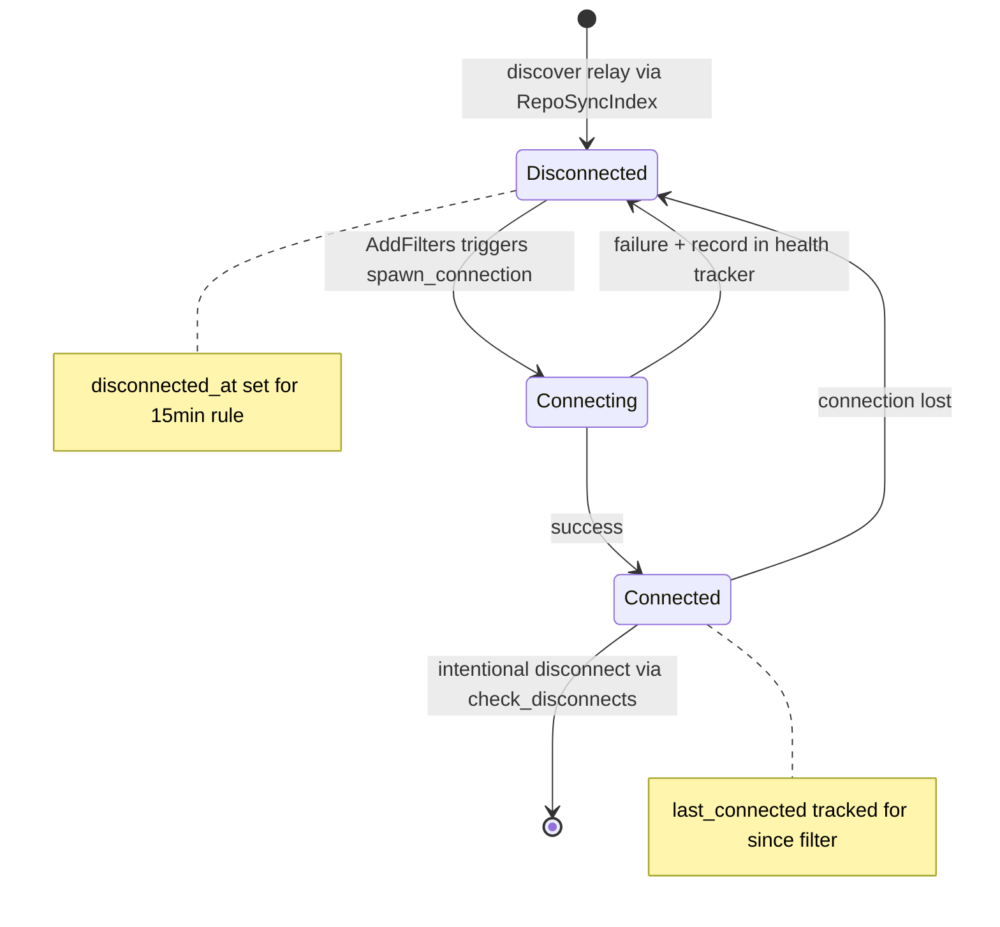
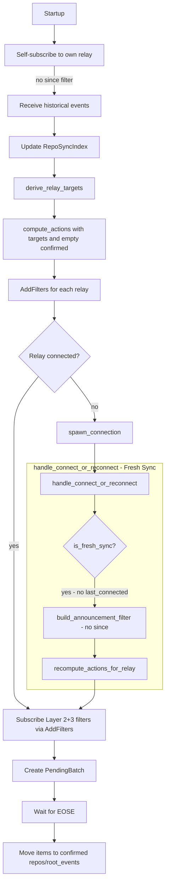
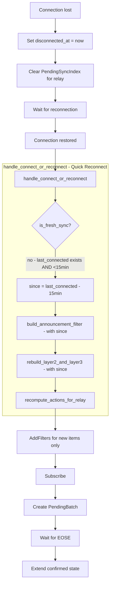
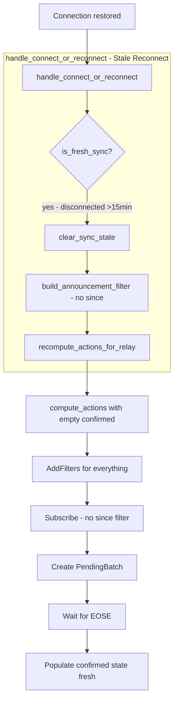
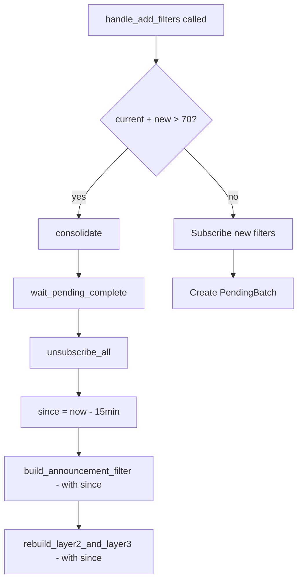
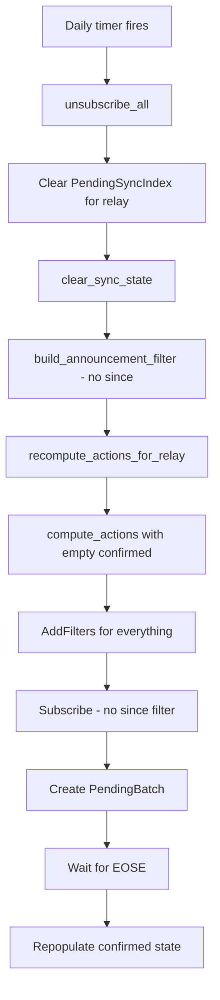
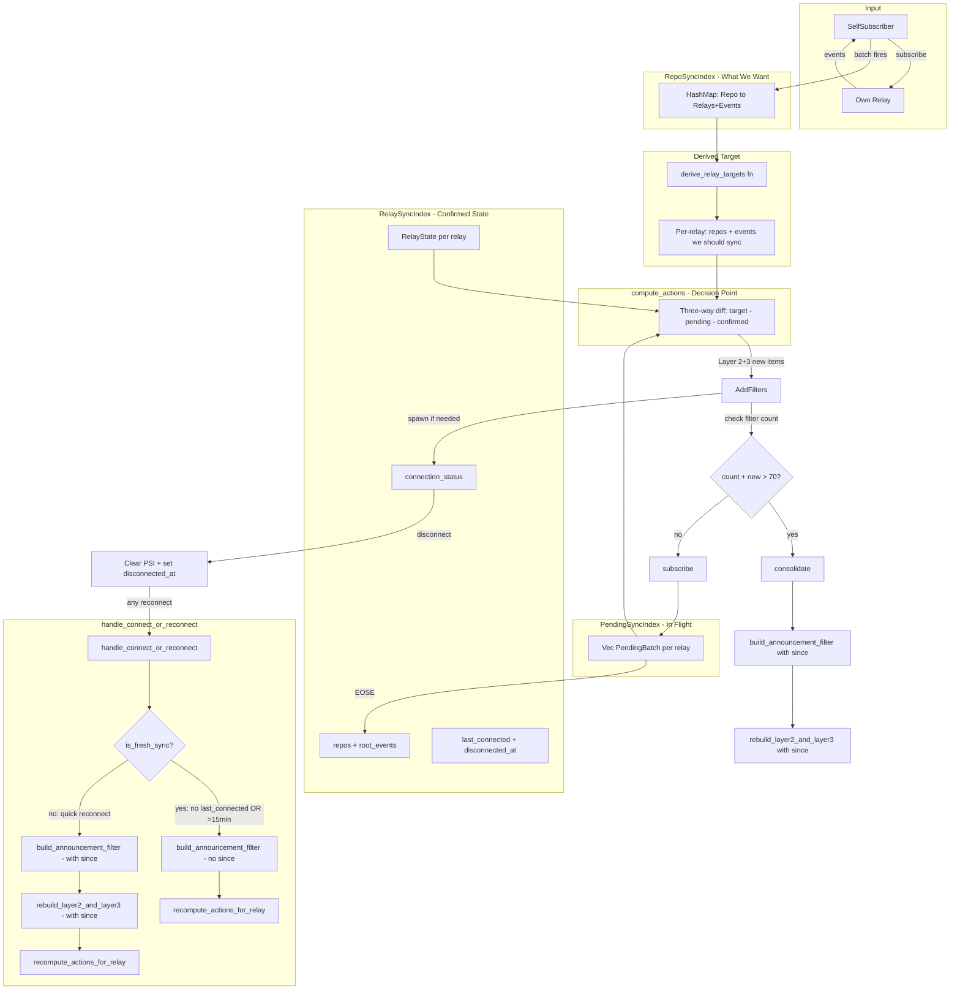

# GRASP-02: Proactive Sync v4 - Health & Reconnection Design

## Overview

This document presents v4 of the proactive sync design, refining the connection lifecycle and reconnection patterns. Key principles:

1. **Self-subscription as the only mechanism** - No database initialization at startup
2. **compute_actions as single decision point** - Determines what NEW subscriptions to create
3. **Two subscription paths on reconnect** - Catch-up (retained, with since) vs new items (via compute_actions)
4. **Blank state = fresh sync** - Empty confirmed state triggers full historical fetch
5. **Clear on disconnect, not reconnect** - PendingSyncIndex cleared at event boundary

---

## Data Model

### RepoSyncIndex (Source of Truth)

```rust
/// What we WANT to sync - derived from events received via self-subscription.
/// Updated immediately when self-subscriber batch fires.
/// Key: repo addressable ref - 30617:pubkey:identifier
pub type RepoSyncIndex = Arc<RwLock<HashMap<String, RepoSyncNeeds>>>;

#[derive(Debug, Clone, Default)]
pub struct RepoSyncNeeds {
    /// Relay URLs listed in this repo's 30617 announcement
    pub relays: HashSet<String>,
    /// Root event IDs - 1617/1618/1619/1621 - that reference this repo
    pub root_events: HashSet<EventId>,
}
```

### RelaySyncIndex (Confirmed State + Connection)

```rust
/// What we have CONFIRMED syncing - includes connection state for integrated lifecycle.
/// Key: relay URL
pub type RelaySyncIndex = Arc<RwLock<HashMap<String, RelayState>>>;

/// Connection status for a relay
#[derive(Debug, Clone, Copy, PartialEq, Eq)]
pub enum ConnectionStatus {
    /// Not currently connected
    Disconnected,
    /// Connection attempt in progress
    Connecting,
    /// Successfully connected and subscribed
    Connected,
}

/// Complete state for a single relay - combines sync needs with connection lifecycle
#[derive(Debug)]
pub struct RelayState {
    /// Repos we have confirmed syncing from this relay
    pub repos: HashSet<String>,
    /// Root events we have confirmed tracking
    pub root_events: HashSet<EventId>,
    /// If true, never disconnect this relay
    pub is_bootstrap: bool,
    /// Current connection status
    pub connection_status: ConnectionStatus,
    /// When we last successfully connected - used for since filter on reconnect
    pub last_connected: Option<Timestamp>,
    /// When we disconnected - for 15-minute state retention rule
    pub disconnected_at: Option<Timestamp>,
    /// The active connection - None if disconnected
    pub connection: Option<RelayConnection>,
}

impl RelayState {
    /// Check if state should be cleared based on 15-minute rule
    pub fn should_clear_state(&self) -> bool {
        match self.disconnected_at {
            Some(disconnected) => {
                let now = Timestamp::now();
                now.as_u64().saturating_sub(disconnected.as_u64()) > 900 // 15 minutes
            }
            None => false, // Still connected or never connected
        }
    }
    
    /// Clear repos and root_events - called when reconnect takes > 15 minutes
    pub fn clear_sync_state(&mut self) {
        self.repos.clear();
        self.root_events.clear();
    }
}
```

### PendingSyncIndex (In-Flight Batches)

```rust
/// Tracks batches of subscriptions that are in-flight, awaiting EOSE.
/// Each batch has its own ID and can confirm independently.
/// Key: relay URL
pub type PendingSyncIndex = Arc<RwLock<HashMap<String, Vec<PendingBatch>>>>;

#[derive(Debug, Clone)]
pub struct PendingBatch {
    /// Unique ID for this batch - for debugging/logging
    pub batch_id: u64,
    /// The items this batch is syncing
    pub items: PendingItems,
    /// Subscription IDs that must ALL receive EOSE before confirming
    pub outstanding_subs: HashSet<SubscriptionId>,
}

#[derive(Debug, Clone, Default)]
pub struct PendingItems {
    pub repos: HashSet<String>,
    pub root_events: HashSet<EventId>,
}
```

---

## Connection Lifecycle State Machine



---

## Flow Scenarios

### Scenario 1: Initial Connect via handle_connect_or_reconnect



**Key points:**
- No `since` filter on initial connect - get full history
- `handle_connect_or_reconnect` detects `is_fresh_sync` via `last_connected.is_none()`
- Layer 1: `build_announcement_filter(None)` - subscribed immediately without since
- Layer 2+3: handled via `recompute_actions_for_relay` → `compute_actions` with PendingBatch tracking

### Scenario 2: Quick Reconnect via handle_connect_or_reconnect - less than 15 minutes



**Key points:**
- PendingSyncIndex cleared on disconnect (not reconnect)
- `handle_connect_or_reconnect`:
  1. `build_announcement_filter(Some(since))` - Layer 1 with since
  2. `rebuild_layer2_and_layer3(since)` - Layer 2+3 with since
  3. `recompute_actions_for_relay` - check for new items
- since = last_connected - 15min ensures we catch events during disconnection

### Scenario 3: Stale Reconnect via handle_connect_or_reconnect - greater than 15 minutes



**Key points:**
- `should_clear_state()` returns true → triggers fresh sync
- Same path as initial connect after clearing state
- Layer 1: `build_announcement_filter(None)` - full history
- Layer 2+3: handled via empty confirmed state → compute_actions generates AddFilters for everything

### Scenario 4: Consolidation - Triggered on Filter Add



**Key points:**
- Consolidation checked in `handle_add_filters` BEFORE adding new filters
- After closing all subscriptions, re-subscribe:
  1. `build_announcement_filter(Some(since))` - Layer 1 stays active with since
  2. `rebuild_layer2_and_layer3(since)` - Layer 2+3 with since
- `since = now - 15min` prevents re-fetching old events
- Keeps confirmed state, just reduces filter count

### Scenario 5: Daily Timer - 23 to 25h Random



**Key points:**
- Daily timer is a full fresh sync, NOT consolidation
- Clears both PendingSyncIndex and confirmed state
- Layer 1: `build_announcement_filter(None)` - full history
- Layer 2+3: via compute_actions with empty confirmed - full history
- Detects any state drift accumulated over 24 hours

---

## Core Algorithms

### 1. derive_relay_targets

Transform RepoSyncIndex into per-relay sync targets:

```rust
/// Inverts RepoSyncIndex to get per-relay view
fn derive_relay_targets(
    repo_index: &HashMap<String, RepoSyncNeeds>
) -> HashMap<String, RelaySyncNeeds> {
    let mut targets: HashMap<String, RelaySyncNeeds> = HashMap::new();
    
    for (repo_ref, needs) in repo_index {
        for relay_url in &needs.relays {
            let target = targets.entry(relay_url.clone()).or_default();
            target.repos.insert(repo_ref.clone());
            target.root_events.extend(needs.root_events.iter().cloned());
        }
    }
    
    targets
}
```

### 2. compute_actions (Three-Way Diff)

**This is the ONLY decision point for what NEW subscriptions to create.**

```rust
/// Computes AddFilters for items that are:
/// - In targets (what we want)
/// - NOT in pending (already in-flight)
/// - NOT in confirmed (already confirmed)
fn compute_actions(
    targets: &HashMap<String, RelaySyncNeeds>,
    pending: &HashMap<String, Vec<PendingBatch>>,
    confirmed: &HashMap<String, RelayState>,
) -> Vec<AddFilters> {
    let mut actions = Vec::new();
    
    for (relay_url, target) in targets {
        // Skip disconnected relays - they will get AddFilters on reconnect
        if let Some(state) = confirmed.get(relay_url) {
            if state.connection_status != ConnectionStatus::Connected {
                continue;
            }
        }
        
        // Collect all pending items for this relay
        let pending_repos: HashSet<_> = pending.get(relay_url)
            .map(|batches| batches.iter()
                .flat_map(|b| b.items.repos.iter().cloned())
                .collect())
            .unwrap_or_default();
        let pending_events: HashSet<_> = pending.get(relay_url)
            .map(|batches| batches.iter()
                .flat_map(|b| b.items.root_events.iter().cloned())
                .collect())
            .unwrap_or_default();
        
        // Collect confirmed items for this relay
        let confirmed_repos = confirmed.get(relay_url)
            .map(|c| &c.repos)
            .unwrap_or(&HashSet::new());
        let confirmed_events = confirmed.get(relay_url)
            .map(|c| &c.root_events)
            .unwrap_or(&HashSet::new());
        
        // New = target - pending - confirmed
        let new_repos: HashSet<_> = target.repos.iter()
            .filter(|r| !pending_repos.contains(*r) && !confirmed_repos.contains(*r))
            .cloned()
            .collect();
        let new_events: HashSet<_> = target.root_events.iter()
            .filter(|e| !pending_events.contains(*e) && !confirmed_events.contains(*e))
            .cloned()
            .collect();
        
        if !new_repos.is_empty() || !new_events.is_empty() {
            let filters = build_filters(&new_repos, &new_events);
            actions.push(AddFilters {
                relay_url: relay_url.clone(),
                repos: new_repos,
                root_events: new_events,
                filters,
            });
        }
    }
    
    actions
}
```

### 3. Filter Building Functions (Three-Layer Strategy)

The filter strategy uses three layers:
- **Layer 1**: Announcements (30617/30618) - subscribed ONCE on connect, NOT rebuilt during consolidation
- **Layer 2**: Events tagging our repos
- **Layer 3**: Events tagging our root events

**Key insight**: Layer 1 is connection-level (subscribe once), Layer 2+3 are item-level (managed by compute_actions and PendingBatch).

```rust
/// Layer 1: Announcements filter (kinds 30617 + 30618)
/// Subscribed ONCE on connect - NOT included in consolidation rebuilds.
/// Note: 30618 is ONLY synced from remote relays, not self-subscribed.
fn build_announcement_filter(since: Option<Timestamp>) -> Filter {
    let filter = Filter::new().kinds([
        Kind::Custom(30617),  // Repository announcements
        Kind::Custom(30618),  // Maintainer lists
    ]);
    
    match since {
        Some(ts) => filter.since(ts),
        None => filter,
    }
}

/// Layer 2: Events tagging one of our repos
/// Uses lowercase a, uppercase A, and q tags for comprehensive coverage.
/// Batched per 100 repo refs.
fn tagged_one_of_our_repo_event_filters(
    repos: &HashSet<String>,
    since: Option<Timestamp>,
) -> Vec<Filter> {
    let mut filters = Vec::new();
    let repo_refs: Vec<_> = repos.iter().collect();
    
    for chunk in repo_refs.chunks(100) {
        let chunk_vec: Vec<&str> = chunk.iter().map(|s| s.as_str()).collect();
        
        // Lowercase 'a' tag - standard addressable reference
        let mut f1 = Filter::new()
            .custom_tag(SingleLetterTag::lowercase(Alphabet::A), chunk_vec.clone());
        // Uppercase 'A' tag - some clients use this
        let mut f2 = Filter::new()
            .custom_tag(SingleLetterTag::uppercase(Alphabet::A), chunk_vec.clone());
        // Quote 'q' tag - NIP-10 quote references to addressable events
        let mut f3 = Filter::new()
            .custom_tag(SingleLetterTag::lowercase(Alphabet::Q), chunk_vec);
        
        if let Some(ts) = since {
            f1 = f1.since(ts);
            f2 = f2.since(ts);
            f3 = f3.since(ts);
        }
        
        filters.push(f1);
        filters.push(f2);
        filters.push(f3);
    }
    
    filters
}

/// Layer 3: Events tagging one of our root events
/// Uses lowercase e, uppercase E, and q tags for comprehensive coverage.
/// Batched per 100 event IDs.
fn tagged_one_of_our_root_event_filters(
    root_events: &HashSet<EventId>,
    since: Option<Timestamp>,
) -> Vec<Filter> {
    let mut filters = Vec::new();
    let event_ids: Vec<String> = root_events.iter().map(|id| id.to_hex()).collect();
    
    for chunk in event_ids.chunks(100) {
        let chunk_vec: Vec<&str> = chunk.iter().map(|s| s.as_str()).collect();
        
        // Lowercase 'e' tag - standard event reference
        let mut f1 = Filter::new()
            .custom_tag(SingleLetterTag::lowercase(Alphabet::E), chunk_vec.clone());
        // Uppercase 'E' tag - some clients use this
        let mut f2 = Filter::new()
            .custom_tag(SingleLetterTag::uppercase(Alphabet::E), chunk_vec.clone());
        // Quote 'q' tag - NIP-10 quote references to events
        let mut f3 = Filter::new()
            .custom_tag(SingleLetterTag::lowercase(Alphabet::Q), chunk_vec);
        
        if let Some(ts) = since {
            f1 = f1.since(ts);
            f2 = f2.since(ts);
            f3 = f3.since(ts);
        }
        
        filters.push(f1);
        filters.push(f2);
        filters.push(f3);
    }
    
    filters
}

/// Builds Layer 2 + Layer 3 filters only (NOT Layer 1)
/// Used by:
/// - compute_actions for incremental subscriptions
/// - consolidation rebuilds (Layer 1 remains active)
fn build_layer2_and_layer3_filters(
    repos: &HashSet<String>,
    root_events: &HashSet<EventId>,
    since: Option<Timestamp>,
) -> Vec<Filter> {
    let mut filters = Vec::new();
    filters.extend(tagged_one_of_our_repo_event_filters(repos, since));
    filters.extend(tagged_one_of_our_root_event_filters(root_events, since));
    filters
}
```

**Note**: There is no `build_all_filters` function. Layer 1 is subscribed separately on connect, and Layer 2+3 are managed independently.

### 4. handle_add_filters (SyncManager)

```rust
impl SyncManager {
    async fn handle_add_filters(&mut self, action: AddFilters) {
        let AddFilters { relay_url, repos, root_events, filters } = action;
        
        // Auto-spawn connection if needed
        let state = self.relay_sync_index.read().await.get(&relay_url).cloned();
        match state {
            None => {
                // New relay discovered - create entry and spawn connection
                self.relay_sync_index.write().await.insert(
                    relay_url.clone(),
                    RelayState {
                        repos: HashSet::new(),
                        root_events: HashSet::new(),
                        is_bootstrap: false,
                        connection_status: ConnectionStatus::Connecting,
                        last_connected: None,
                        disconnected_at: None,
                        connection: None,
                    }
                );
                self.spawn_connection(&relay_url).await;
                return; // Subscriptions will happen on connection success
            }
            Some(state) if state.connection_status != ConnectionStatus::Connected => {
                // Not connected - subscriptions will happen on connection success
                return;
            }
            Some(_) => {
                // Already connected - proceed with subscription
            }
        }
        
        // Subscribe and collect subscription IDs
        let conn = self.connections.get(&relay_url).unwrap();
        let mut sub_ids = HashSet::new();
        
        for filter in filters {
            match conn.client.subscribe(filter, None).await {
                Ok(output) => {
                    for sub_id in output.val {
                        sub_ids.insert(sub_id);
                    }
                }
                Err(e) => {
                    tracing::warn!("Failed to subscribe: {}", e);
                }
            }
        }
        
        // Create pending batch
        let batch = PendingBatch {
            batch_id: self.next_batch_id(),
            items: PendingItems { repos, root_events },
            outstanding_subs: sub_ids,
        };
        
        // Add to pending index
        self.pending_sync_index.write().await
            .entry(relay_url)
            .or_default()
            .push(batch);
    }
}
```

### 5. handle_disconnect

```rust
impl SyncManager {
    /// Called when connection to a relay is lost
    async fn handle_disconnect(&mut self, relay_url: &str) {
        let mut index = self.relay_sync_index.write().await;
        
        if let Some(state) = index.get_mut(relay_url) {
            state.connection_status = ConnectionStatus::Disconnected;
            state.disconnected_at = Some(Timestamp::now());
            state.connection = None;
        }
        
        // Clear pending batches - these items were not confirmed
        self.pending_sync_index.write().await.remove(relay_url);
        
        // Remove from active connections map
        self.connections.remove(relay_url);
        
        // Health tracker records failure for backoff
        self.health_tracker.record_failure(relay_url);
    }
}
```

### 6. handle_connect_or_reconnect (Unified)

This method handles BOTH initial connection AND reconnection with unified logic:

```rust
impl SyncManager {
    /// Called when connection to a relay succeeds - handles both initial connect and reconnect.
    ///
    /// Decision tree:
    /// - Fresh sync (no last_connected OR disconnected >15min): No since filter, full history
    /// - Quick reconnect (<15min): since = last_connected - 15min
    async fn handle_connect_or_reconnect(&mut self, relay_url: &str) {
        let mut index = self.relay_sync_index.write().await;
        let state = match index.get_mut(relay_url) {
            Some(s) => s,
            None => return, // Relay was removed while disconnected
        };
        
        // Determine if this is a fresh sync or quick reconnect
        let is_fresh_sync = state.last_connected.is_none() || state.should_clear_state();
        let last_connected = state.last_connected;
        
        if is_fresh_sync && state.last_connected.is_some() {
            // Stale reconnect (>15min) - clear state
            tracing::info!("Reconnect after >15min for {}, clearing state for fresh sync", relay_url);
            state.clear_sync_state();
        }
        
        // Update connection state
        state.connection_status = ConnectionStatus::Connected;
        state.last_connected = Some(Timestamp::now());
        state.disconnected_at = None;
        
        // Record success in health tracker
        self.health_tracker.record_success(relay_url);
        
        drop(index); // Release lock
        
        let conn = match self.connections.get(relay_url) {
            Some(c) => c,
            None => return,
        };
        
        if is_fresh_sync {
            // Fresh sync: Layer 1 without since, Layer 2+3 handled by compute_actions
            
            // Step 1: Subscribe Layer 1 (announcements) without since
            let layer1 = build_announcement_filter(None);
            let _ = conn.client.subscribe(layer1, None).await;
            
            // Step 2: compute_actions will handle Layer 2+3 (with since=None in build)
            self.recompute_actions_for_relay(relay_url).await;
        } else {
            // Quick reconnect: Layer 1 with since, Layer 2+3 with since
            let since = last_connected
                .map(|ts| Timestamp::from(ts.as_u64().saturating_sub(900)))
                .unwrap_or(Timestamp::from(0));
            
            // Step 1: Subscribe Layer 1 (announcements) with since
            let layer1 = build_announcement_filter(Some(since));
            let _ = conn.client.subscribe(layer1, None).await;
            
            // Step 2: Rebuild Layer 2+3 for confirmed items with since
            self.rebuild_layer2_and_layer3(relay_url, Some(since)).await;
            
            // Step 3: Check for NEW items via compute_actions
            self.recompute_actions_for_relay(relay_url).await;
        }
    }
    
    /// Rebuild Layer 2+3 subscriptions only (NOT Layer 1).
    /// Used by:
    /// - Quick reconnect: rebuild confirmed items with since filter
    /// - Consolidation: close and rebuild with since filter
    async fn rebuild_layer2_and_layer3(&mut self, relay_url: &str, since: Option<Timestamp>) {
        let confirmed = self.relay_sync_index.read().await;
        let state = match confirmed.get(relay_url) {
            Some(s) => s,
            None => return,
        };
        
        // Build Layer 2+3 filters WITH since
        let filters = build_layer2_and_layer3_filters(&state.repos, &state.root_events, since);
        drop(confirmed);
        
        // Subscribe directly - no PendingBatch for catch-up (items already confirmed)
        let conn = match self.connections.get(relay_url) {
            Some(c) => c,
            None => return,
        };
        
        for filter in filters {
            let _ = conn.client.subscribe(filter, None).await;
        }
    }
    
    /// Rerun compute_actions for a specific relay and process resulting AddFilters.
    /// compute_actions builds Layer 2+3 filters for NEW items not yet in confirmed state.
    async fn recompute_actions_for_relay(&mut self, relay_url: &str) {
        let repo_index = self.repo_sync_index.read().await;
        let targets = derive_relay_targets(&repo_index);
        drop(repo_index);
        
        // Filter to just this relay
        let target = match targets.get(relay_url) {
            Some(t) => t.clone(),
            None => return, // No repos reference this relay anymore
        };
        
        let pending = self.pending_sync_index.read().await;
        let confirmed = self.relay_sync_index.read().await;
        
        let mut single_relay_targets = HashMap::new();
        single_relay_targets.insert(relay_url.to_string(), target);
        
        let actions = compute_actions(&single_relay_targets, &pending, &confirmed);
        
        drop(pending);
        drop(confirmed);
        
        // Process AddFilters
        for action in actions {
            self.handle_add_filters(action).await;
        }
    }
}
```

### 7. Daily Timer

```rust
impl SyncManager {
    async fn run_daily_timer(&self) {
        loop {
            // Random 23-25 hours
            let hours = 23.0 + rand::random::<f64>() * 2.0;
            tokio::time::sleep(Duration::from_secs_f64(hours * 3600.0)).await;
            
            let relay_urls: Vec<_> = self.relay_sync_index.read().await
                .keys()
                .cloned()
                .collect();
            
            for relay_url in relay_urls {
                self.daily_sync(&relay_url).await;
            }
        }
    }
    
    /// Perform daily fresh sync for a relay
    async fn daily_sync(&mut self, relay_url: &str) {
        tracing::info!("Daily sync triggered for {}", relay_url);
        
        // Close all subscriptions
        if let Some(conn) = self.connections.get(relay_url) {
            conn.client.unsubscribe_all().await;
        }
        
        // Clear PendingSyncIndex
        self.pending_sync_index.write().await.remove(relay_url);
        
        // Clear confirmed state - triggers fresh sync
        {
            let mut index = self.relay_sync_index.write().await;
            if let Some(state) = index.get_mut(relay_url) {
                state.clear_sync_state();
            }
        }
        
        // Recompute actions - will generate AddFilters for everything
        self.recompute_actions_for_relay(relay_url).await;
    }
}
```

### 8. Consolidation (Threshold-Based, Triggered on Add)

Consolidation is checked when adding new subscriptions, not periodically. **Key insight**: Consolidation only closes and rebuilds Layer 2+3 - Layer 1 remains active.

```rust
impl SyncManager {
    /// Check filter count and consolidate if needed.
    /// Called from handle_add_filters BEFORE adding new filters.
    async fn maybe_consolidate(&mut self, relay_url: &str, new_filter_count: usize) {
        let current_count = self.get_filter_count(relay_url).await;
        
        if current_count + new_filter_count > 70 {
            self.consolidate(relay_url).await;
        }
    }
    
    /// Consolidate filters - only rebuilds Layer 2+3, Layer 1 stays active.
    /// Does NOT clear state - just reduces filter count.
    async fn consolidate(&mut self, relay_url: &str) {
        tracing::info!("Consolidating filters for {} (count > 70)", relay_url);
        
        // Wait for all pending batches to complete first
        self.wait_pending_complete(relay_url).await;
        
        // Close Layer 2+3 subscriptions only - Layer 1 remains active
        // NOTE: In practice, we close all then re-add Layer 1, or track sub IDs separately
        // For simplicity, we close all and re-add Layer 1
        if let Some(conn) = self.connections.get(relay_url) {
            conn.client.unsubscribe_all().await;
        }
        
        // Re-subscribe Layer 1 with since (maintains announcements stream)
        let since = Timestamp::from(Timestamp::now().as_u64().saturating_sub(900));
        let conn = self.connections.get(relay_url).unwrap();
        let layer1 = build_announcement_filter(Some(since));
        let _ = conn.client.subscribe(layer1, None).await;
        
        // Rebuild Layer 2+3 only
        self.rebuild_layer2_and_layer3(relay_url, Some(since)).await;
    }
}
```

**Updated handle_add_filters to check consolidation:**

```rust
impl SyncManager {
    async fn handle_add_filters(&mut self, action: AddFilters) {
        let AddFilters { relay_url, repos, root_events, filters } = action;
        
        // Auto-spawn connection if needed (unchanged)
        let state = self.relay_sync_index.read().await.get(&relay_url).cloned();
        match state {
            None => {
                // New relay discovered - create entry and spawn connection
                self.relay_sync_index.write().await.insert(
                    relay_url.clone(),
                    RelayState {
                        repos: HashSet::new(),
                        root_events: HashSet::new(),
                        is_bootstrap: false,
                        connection_status: ConnectionStatus::Connecting,
                        last_connected: None,
                        disconnected_at: None,
                        connection: None,
                    }
                );
                self.spawn_connection(&relay_url).await;
                return; // Subscriptions will happen on connection success
            }
            Some(state) if state.connection_status != ConnectionStatus::Connected => {
                return; // Not connected - subscriptions will happen on connection success
            }
            Some(_) => {
                // Already connected - proceed
            }
        }
        
        // CHECK CONSOLIDATION BEFORE ADDING
        self.maybe_consolidate(&relay_url, filters.len()).await;
        
        // Subscribe and collect subscription IDs
        let conn = self.connections.get(&relay_url).unwrap();
        let mut sub_ids = HashSet::new();
        
        for filter in filters {
            match conn.client.subscribe(filter, None).await {
                Ok(output) => {
                    for sub_id in output.val {
                        sub_ids.insert(sub_id);
                    }
                }
                Err(e) => {
                    tracing::warn!("Failed to subscribe: {}", e);
                }
            }
        }
        
        // Create pending batch (unchanged)
        let batch = PendingBatch {
            batch_id: self.next_batch_id(),
            items: PendingItems { repos, root_events },
            outstanding_subs: sub_ids,
        };
        
        self.pending_sync_index.write().await
            .entry(relay_url)
            .or_default()
            .push(batch);
    }
}
```

---

## Disconnect (Relay Removal) Handling

```rust
impl SyncManager {
    /// Periodically check for relays that should be disconnected
    async fn check_disconnects(&mut self) {
        let confirmed = self.relay_sync_index.read().await;
        let relays_to_disconnect: Vec<_> = confirmed.iter()
            .filter(|(_, state)| {
                !state.is_bootstrap && 
                state.repos.is_empty() && 
                state.root_events.is_empty()
            })
            .map(|(url, _)| url.clone())
            .collect();
        drop(confirmed);
        
        for relay_url in relays_to_disconnect {
            self.disconnect_relay(&relay_url).await;
        }
    }
    
    async fn disconnect_relay(&mut self, relay_url: &str) {
        tracing::info!("Disconnecting relay {} (no repos)", relay_url);
        
        self.relay_sync_index.write().await.remove(relay_url);
        self.pending_sync_index.write().await.remove(relay_url);
        
        if let Some(conn) = self.connections.remove(relay_url) {
            let _ = conn.client.disconnect().await;
        }
    }
}
```

---

## State Flow Summary



---

## Key Design Decisions

| Decision | Choice | Rationale |
|----------|--------|-----------|
| Startup mechanism | Self-subscription only | Single code path, fresh DB behaves same as reconnect |
| Connect/reconnect handling | Unified handle_connect_or_reconnect | Single entry point for both initial and reconnect |
| Layer 1 handling | Separate build_announcement_filter | Connection-level: subscribe ONCE on connect, NOT rebuilt in consolidation |
| Layer 2+3 handling | Separate rebuild_layer2_and_layer3 | Item-level: managed by compute_actions, consolidated when filter count > 70 |
| Filter functions | since as Option parameter | Allows same functions for fresh sync and catch-up |
| Layer 2+3 tags | tagged_one_of_our_repo_event_filters, tagged_one_of_our_root_event_filters | Descriptive names, uses a/A/q for repos, e/E/q for events |
| Since filter | Only on catch-up paths | Initial/stale gets full history, quick reconnect catches up |
| compute_actions role | ONLY for new Layer 2+3 items | Does NOT handle Layer 1 or catch-up |
| Catch-up pending tracking | No PendingBatch | Items already confirmed, don't need re-confirmation |
| Consolidation trigger | On filter add, not periodic | Check in handle_add_filters before adding new filters |
| Consolidation Layer 1 | Re-subscribe with since after unsubscribe_all | Maintains announcement stream |
| Consolidation Layer 2+3 | rebuild_layer2_and_layer3 with since | Shared logic with quick_reconnect |
| Clear on disconnect | Clear PSI on disconnect | Cleanup at event boundary, simpler than on reconnect |
| 15-minute rule | Clear confirmed if disconnected >15min | Matches since filter buffer, prevents stale subscriptions |
| Daily timer | Fresh sync (clears state) | Ensures consistency, detects drift |
| Connection spawning | Via AddFilters handler | Single path for new relay discovery |
| Self-subscriber reconnect | Use since-15min filter | Simpler than immediate RepoSyncIndex updates |

---

## Module Structure

```
src/sync/
├── mod.rs              # SyncManager, main loop
├── state.rs            # RepoSyncIndex, RelaySyncIndex, PendingSyncIndex types
├── actions.rs          # AddFilters struct, compute_actions, build_filters
├── self_subscriber.rs  # SelfSubscriber, batching logic
├── relay_connection.rs # Per-relay WebSocket connection
├── consolidation.rs    # Consolidation logic, daily timer
├── health.rs           # Health tracking (reuse from v2)
└── metrics.rs          # Prometheus metrics (reuse from v2)
```

---

## Comparison: v3 vs v4

| Aspect | v3 | v4 |
|--------|----|----|
| Connect handling | Separate initial vs reconnect | Unified handle_connect_or_reconnect |
| Layer 1 handling | Mixed with other layers | Separate build_layer1_filter, always included |
| Layer 2+3 tags | Basic a/e tags | Comprehensive a/A/q and e/E/q per v2 |
| Rebuild logic | Duplicated in reconnect and consolidation | Shared rebuild_all_subscriptions method |
| Consolidation trigger | Maybe periodic | On filter add in handle_add_filters |
| Since filter application | Applied in handle_reconnect | build_all_filters with optional since |
| PSI clearing | On disconnect | On disconnect (confirmed) |
| Daily timer | Consolidation-style | Fresh sync (different from consolidation) |

---

## Self-Subscriber Flow

The SelfSubscriber connects to the own relay and maintains a subscription to discover repos and events. It batches incoming events and triggers compute_actions.

### State Tracking

```rust
pub struct SelfSubscriber {
    own_relay_url: String,
    relay_domain: String,
    repo_sync_index: RepoSyncIndex,
    pending_sync_index: PendingSyncIndex,
    relay_sync_index: RelaySyncIndex,
    action_tx: mpsc::Sender<AddFilters>,
    /// Timestamp of last successful connection - used for since filter on reconnection
    last_connected: Option<Timestamp>,
    /// The active client connection
    client: Option<Client>,
}
```

### On Startup / Reconnect (Unified)

Both initial startup and reconnection use the same `connect_and_subscribe` method:

```rust
impl SelfSubscriber {
    async fn run(mut self) {
        loop {
            // Connect or reconnect
            if let Err(e) = self.connect_and_subscribe().await {
                tracing::warn!("Connection failed: {}, will retry", e);
                tokio::time::sleep(Duration::from_secs(5)).await;
                continue;
            }
            
            // Run event loop until disconnection
            self.event_loop().await;
            
            // Loop will retry connection
        }
    }
    
    async fn connect_and_subscribe(&mut self) -> Result<(), Error> {
        let client = Client::new(Keys::generate());
        client.add_relay(&self.own_relay_url).await?;
        client.connect().await;
        
        // Build filter - add since only on reconnect
        let filter = Filter::new().kinds([
            Kind::Custom(30617),  // Repository announcements
            Kind::GitPatch,       // 1617
            Kind::Custom(1618),   // PRs  
            Kind::Custom(1619),   // PR updates
            Kind::GitIssue,       // 1621
        ]);
        
        let filter = if let Some(ts) = self.last_connected {
            // Reconnection: use since filter
            let since = Timestamp::from(ts.as_u64().saturating_sub(900)); // -15 min buffer
            filter.since(since)
        } else {
            // Initial connect: no since filter - get full history
            filter
        };
        
        // Update last_connected AFTER computing since
        self.last_connected = Some(Timestamp::now());
        
        client.subscribe(filter, None).await?;
        self.client = Some(client);
        Ok(())
    }
}
```

### Event Loop with Batching

```rust
impl SelfSubscriber {
    async fn event_loop(&mut self) {
        let client = self.client.as_ref().unwrap();
        let mut pending_events: Vec<Event> = Vec::new();
        let mut batch_timer: Option<Instant> = None;
        let batch_window = Duration::from_secs(5);
        
        loop {
            let timeout = batch_timer
                .map(|t| batch_window.saturating_sub(t.elapsed()))
                .unwrap_or(Duration::from_secs(60));
            
            tokio::select! {
                notification = client.notifications().recv() => {
                    match notification {
                        Ok(RelayPoolNotification::Event { event, .. }) => {
                            pending_events.push(*event);
                            
                            // Start timer on first event - does NOT reset
                            if batch_timer.is_none() {
                                batch_timer = Some(Instant::now());
                            }
                        }
                        Ok(RelayPoolNotification::Shutdown) => {
                            // Connection lost
                            break;
                        }
                        _ => {}
                    }
                }
                _ = tokio::time::sleep(timeout), if batch_timer.is_some() => {
                    // Batch window elapsed
                    self.process_batch(pending_events.drain(..).collect()).await;
                    batch_timer = None;
                }
            }
        }
    }
    
    async fn process_batch(&self, events: Vec<Event>) {
        // 1. Update RepoSyncIndex
        for event in events {
            match event.kind.as_u16() {
                30617 => self.handle_announcement(&event).await,
                1617 | 1618 | 1619 | 1621 => self.handle_root_event(&event).await,
                _ => {}
            }
        }
        
        // 2. Derive targets and compute actions
        let repo_index = self.repo_sync_index.read().await;
        let targets = derive_relay_targets(&repo_index);
        
        let pending = self.pending_sync_index.read().await;
        let confirmed = self.relay_sync_index.read().await;
        
        let actions = compute_actions(&targets, &pending, &confirmed);
        
        drop(repo_index);
        drop(pending);
        drop(confirmed);
        
        // 3. Send actions to SyncManager
        for action in actions {
            let _ = self.action_tx.send(action).await;
        }
    }
    
    async fn handle_announcement(&self, event: &Event) {
        // Extract repo_ref from event - 30617:pubkey:identifier
        let d_tag = event.tags.iter()
            .find_map(|tag| {
                if tag.kind() == TagKind::D {
                    tag.content().map(|s| s.to_string())
                } else {
                    None
                }
            })
            .unwrap_or_default();
        
        let repo_ref = format!("30617:{}:{}", event.pubkey, d_tag);
        
        // Extract relay URLs from 'r' tags
        let relays: HashSet<String> = event.tags.iter()
            .filter_map(|tag| {
                if tag.kind() == TagKind::Relay {
                    tag.content().map(|s| s.to_string())
                } else {
                    None
                }
            })
            .collect();
        
        // Update RepoSyncIndex
        let mut index = self.repo_sync_index.write().await;
        let needs = index.entry(repo_ref).or_default();
        needs.relays = relays;
    }
    
    async fn handle_root_event(&self, event: &Event) {
        // Extract repo_ref from 'a' tag
        let repo_ref = event.tags.iter()
            .find_map(|tag| {
                if tag.kind() == TagKind::A {
                    tag.content().map(|s| s.to_string())
                } else {
                    None
                }
            });
        
        if let Some(repo_ref) = repo_ref {
            let mut index = self.repo_sync_index.write().await;
            let needs = index.entry(repo_ref).or_default();
            needs.root_events.insert(event.id);
        }
    }
}
```