# GRASP-02: Proactive Sync - Design & Implementation

## Overview

This document explains the proactive sync system that synchronizes repository data from external relays based on relay URLs listed in 30617 repository announcements. Key principles:

1. **Triggers call compute_actions → sync_computed_filters** - Self-subscriber batches and connect/reconnect events trigger this flow
2. **Clear separation of live vs historic sync** - Two distinct primitives with different purposes
3. **Layer 1 on connect, Layer 2+3 via AddFilters** - L1 handled at connection time, L2+L3 flow through compute_actions
4. **Always clear PendingSyncIndex first** - Before any reconnect/consolidate operation
5. **NIP-77 negentropy for historical sync** - Efficient set reconciliation, fallback to REQ if unsupported

---

## Data Model

### RepoSyncIndex (Source of Truth)

```rust
/// What we WANT to sync - derived from events received via self-subscription.
/// Updated immediately when self-subscriber batch fires.
/// Key: repo addressable ref - 30617:pubkey:identifier
pub type RepoSyncIndex = Arc<RwLock<HashMap<String, RepoSyncNeeds>>>;

#[derive(Debug, Clone, Default)]
pub struct RepoSyncNeeds {
    /// Relay URLs listed in this repo's 30617 announcement
    pub relays: HashSet<String>,
    /// Root event IDs - 1617/1618/1619/1621 - that reference this repo
    pub root_events: HashSet<EventId>,
}
```

### RelaySyncIndex (Confirmed State + Connection)

```rust
/// What we have CONFIRMED syncing - includes connection state for integrated lifecycle.
/// Key: relay URL
pub type RelaySyncIndex = Arc<RwLock<HashMap<String, RelayState>>>;

/// Connection status for a relay
#[derive(Debug, Clone, Copy, PartialEq, Eq)]
pub enum ConnectionStatus {
    /// Not currently connected
    Disconnected,
    /// Connection attempt in progress
    Connecting,
    /// Successfully connected and subscribed
    Connected,
}

/// Complete state for a single relay - combines sync needs with connection lifecycle
#[derive(Debug)]
pub struct RelayState {
    /// Repos we have confirmed syncing from this relay
    pub repos: HashSet<String>,
    /// Root events we have confirmed tracking
    pub root_events: HashSet<EventId>,
    /// If true, never disconnect this relay
    pub is_bootstrap: bool,
    /// Current connection status
    pub connection_status: ConnectionStatus,
    /// When we last successfully connected - used for since filter on reconnect
    pub last_connected: Option<Timestamp>,
    /// When we disconnected - for 15-minute state retention rule
    pub disconnected_at: Option<Timestamp>,
    /// Whether announcement filter historic sync has completed for this relay
    /// Used to determine if we can use `since` filter on reconnect for Layer 1
    pub announcements_synced: bool,
}

impl RelayState {
    /// Check if state should be cleared based on 15-minute rule
    pub fn should_clear_state(&self) -> bool {
        match self.disconnected_at {
            Some(disconnected) => {
                let now = Timestamp::now();
                now.as_secs().saturating_sub(disconnected.as_secs()) > 900 // 15 minutes
            }
            None => false, // Still connected or never connected
        }
    }

    /// Clear repos and root_events - called when reconnect takes > 15 minutes
    pub fn clear_sync_state(&mut self) {
        self.repos.clear();
        self.root_events.clear();
    }
}
```

### PendingSyncIndex (In-Flight Batches)

```rust
/// Method used for synchronization
#[derive(Debug, Clone, Copy, PartialEq, Eq)]
pub enum SyncMethod {
    /// Traditional REQ+EOSE flow - waits for EOSE on subscriptions
    ReqEose,
    /// NIP-77 negentropy sync - confirms immediately after sync completes
    Negentropy,
}

/// Tracks batches of subscriptions that are in-flight, awaiting EOSE.
/// Each batch has its own ID and can confirm independently.
/// Key: relay URL
pub type PendingSyncIndex = Arc<RwLock<HashMap<String, Vec<PendingBatch>>>>;

/// Pagination state for a subscription in non-Negentropy historic sync
#[derive(Debug, Clone)]
pub struct PaginationState {
    /// Number of events received for this subscription
    pub event_count: usize,
    /// Smallest created_at timestamp seen (for pagination with `until`)
    pub min_created_at: Option<Timestamp>,
    /// Original filter to reconstruct for next page
    pub original_filter: Filter,
}

pub struct PendingBatch {
    /// Unique ID for this batch - for debugging/logging
    pub batch_id: u64,
    /// The items this batch is syncing
    pub items: PendingItems,
    /// Subscription IDs that must ALL receive EOSE before confirming (for ReqEose)
    /// Empty for Negentropy sync method
    pub outstanding_subs: HashSet<SubscriptionId>,
    /// The sync method used for this batch
    pub sync_method: SyncMethod,
    /// Pagination tracking for REQ+EOSE subscriptions (empty for Negentropy)
    /// Maps subscription ID to its pagination state
    pub pagination_state: HashMap<SubscriptionId, PaginationState>,
}

#[derive(Debug, Clone, Default)]
pub struct PendingItems {
    pub repos: HashSet<String>,
    pub root_events: HashSet<EventId>,
}
```

**Pagination for REQ+EOSE Historic Sync:**

When a relay doesn't support NIP-77 Negentropy, historic sync falls back to traditional REQ+EOSE. To handle large result sets efficiently:

- **`PaginationState`** tracks per-subscription pagination progress
  - `event_count`: Number of events received so far
  - `min_created_at`: Smallest timestamp seen, used to set `until` for next page
  - `original_filter`: Base filter to reconstruct with updated `until` parameter
- **Automatic pagination**: When EOSE is received, if enough events were received to suggest more may exist, the system automatically issues a follow-up request with `until` set to `min_created_at`
- **Completion**: Pagination continues until an EOSE is received with fewer events than expected, indicating the end of results

---

## Connection Lifecycle

### Object vs Connection Lifecycle

**Key Principle**: RelayConnection objects persist forever, WebSocket connections are transient.

- **RelayConnection object**: Created once via `register_relay()`, stored in HashMap permanently
- **WebSocket connection**: Transient, established via `try_connect_relay()`, dies on disconnect
- **Event loop**: Spawned by `handle_connect_or_reconnect()`, must be respawned after every reconnection

### Connection State Machine

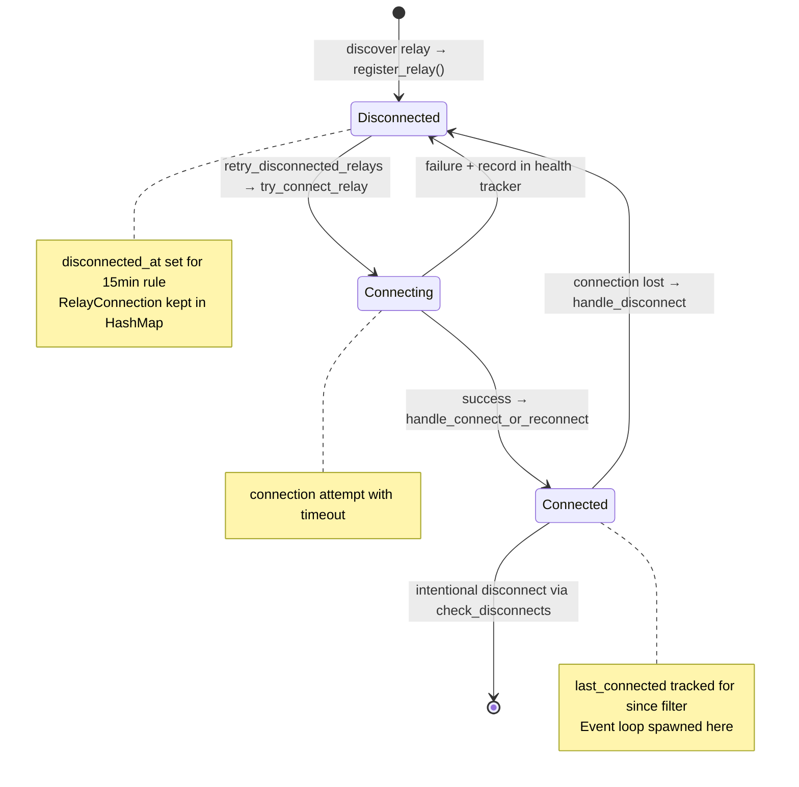

### Connection Flow Methods

| Method                          | Purpose                   | When Called                     | Actions                                                         |
| ------------------------------- | ------------------------- | ------------------------------- | --------------------------------------------------------------- |
| `register_relay()`              | Initialize relay tracking | Discovery via RepoSyncIndex     | Creates RelayConnection, stores in HashMap, returns immediately |
| `try_connect_relay()`           | Attempt connection        | Periodic retry (500ms)          | Calls connect_and_subscribe, sends notification on success      |
| `handle_connect_or_reconnect()` | Setup after connection    | ConnectNotification received    | Spawns event loop, updates state, decides sync strategy         |
| `handle_disconnect()`           | Cleanup after disconnect  | DisconnectNotification received | Updates state, clears pending, KEEPS RelayConnection            |
| `retry_disconnected_relays()`   | Periodic reconnection     | Every 500ms                     | For each ready relay: try_connect_relay()                       |

### Event Loop Lifecycle

**Critical**: Event loops die on disconnect and cannot be reused.

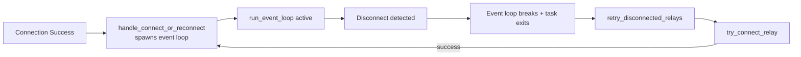

**Why respawn is required**:

- `run_event_loop()` breaks on RelayStatus::Disconnected
- The spawned task completely exits
- Cannot resume terminated task - must spawn fresh
- Happens for both initial connection AND every reconnect

---

## Core Architecture: Live vs Historic Sync

The sync system is built on two fundamental primitives that are clearly separated:

### Sync Primitives

| Primitive         | Purpose                 | Filter Modifier  | Tracking         |
| ----------------- | ----------------------- | ---------------- | ---------------- |
| `sync_live()`     | Ongoing event stream    | `limit: 0`       | Not tracked      |
| `historic_sync()` | Catch up on past events | Optional `since` | PendingSyncIndex |

### Why `limit: 0` for Live Sync?

| Approach     | Pros                                    | Cons                              |
| ------------ | --------------------------------------- | --------------------------------- |
| `since: now` | Intuitive                               | Time-sensitive, clock skew issues |
| `limit: 0`   | Deterministic, mirrors filter structure | Less intuitive name               |

`limit: 0` is better because:

1. **No time dependency**: Doesn't depend on synchronized clocks
2. **Mirrors historic filters**: Same tag structure, just different limit
3. **State reconstruction**: Can rebuild from repo/event lists without timestamps

### Layer Strategy

| Layer   | Content                                 | When Subscribed       | Managed By           |
| ------- | --------------------------------------- | --------------------- | -------------------- |
| Layer 1 | 30617 Announcements, 30618 Maintainers  | On connect (any type) | Connection lifecycle |
| Layer 2 | Events tagging our repos (a/A/q tags)   | Via AddFilters        | compute_actions      |
| Layer 3 | Events tagging root events (e/E/q tags) | Via AddFilters        | compute_actions      |

**Key insight**: Layer 1 is connection-level (handled at connect time), Layer 2+3 are item-level (flow through compute_actions → sync_computed_filters).

---

## Triggers and Flow

### What Triggers compute_actions → sync_computed_filters?

| Trigger                     | When                                   | What Happens                             |
| --------------------------- | -------------------------------------- | ---------------------------------------- |
| Self-subscriber batch fires | New events discovered on own relay     | Update RepoSyncIndex → compute_actions   |
| fresh_start()               | Initial connect, long_reconnect, daily | After L1 setup → compute_actions         |
| quick_reconnect()           | Reconnect < 15 minutes                 | After L1+L2+L3 catchup → compute_actions |
| consolidate()               | Filter count > threshold               | After live rebuild → compute_actions     |

### The Core Flow

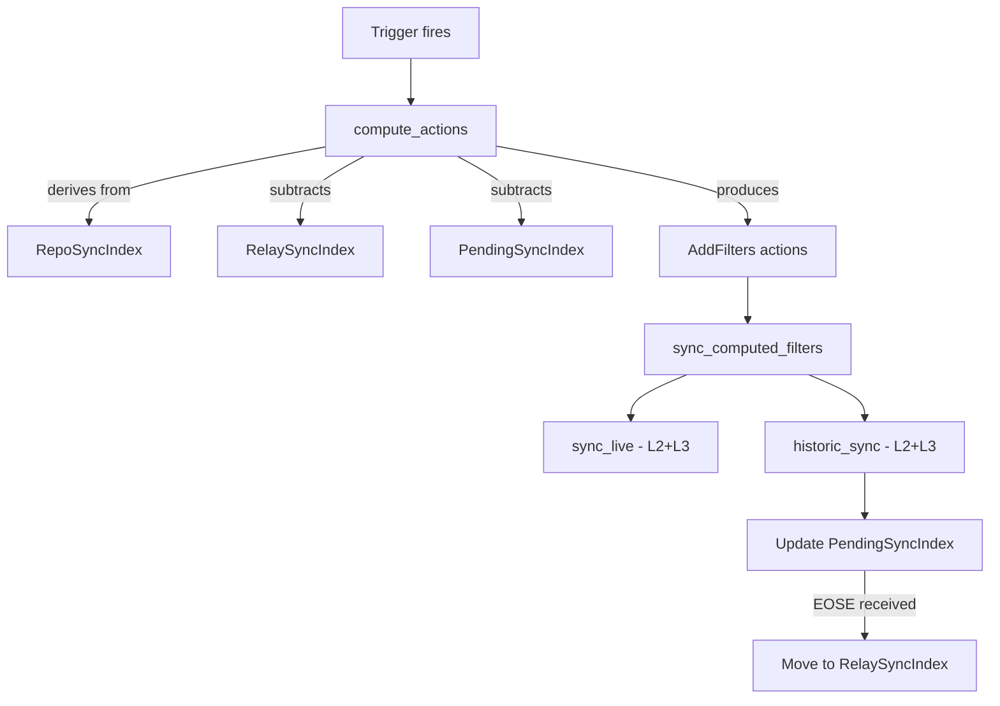

---

## Flow Scenarios

### Scenario 1: Fresh Start (Initial Connect / Long Reconnect / Daily Sync)

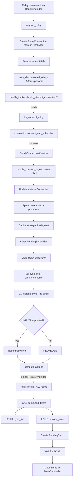

**Key points:**

- Always clear PendingSyncIndex first, then RelaySyncIndex
- L1 live + L1 historic (uses negentropy if available)
- Empty RelaySyncIndex means diff produces AddFilters for everything
- L2+L3 flow through sync_computed_filters with proper pending tracking

### Scenario 2: Quick Reconnect (< 15 minutes)

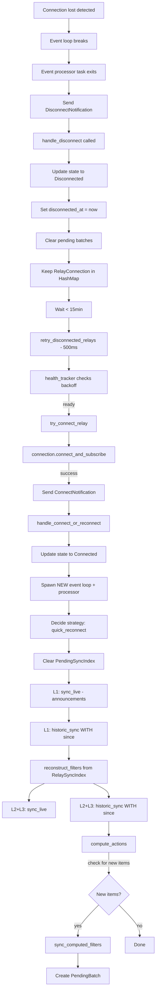

**Key points:**

- Clear PendingSyncIndex first (old subscriptions are dead)
- L1 live (always on any connection)
- L1 historic WITH since (catches up missed announcements)
- L2+L3 rebuilt from RelaySyncIndex (confirmed state preserved)
- compute_actions checks for any NEW items discovered during catchup

### Scenario 3: Long Reconnect (> 15 minutes)

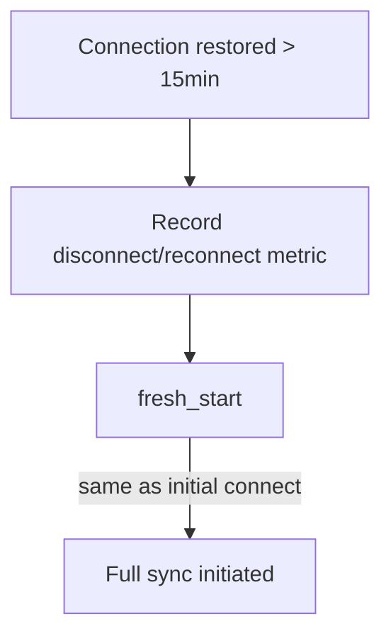

**Key points:**

- Records disconnect/reconnect as a metric
- Delegates to fresh_start() - same as initial connect
- State too stale to trust, start fresh

### Scenario 4: Consolidation (Filter Count > Threshold)

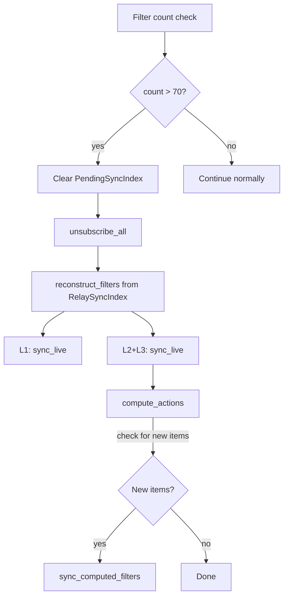

**Key points:**

- Clear PendingSyncIndex first
- NO historic sync needed - items already synced/syncing
- Only rebuilds live subscriptions from confirmed state
- compute_actions catches any new items that need syncing

### Scenario 5: Daily Sync (23-25h Random Timer)

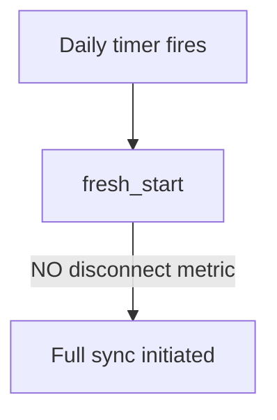

**Key points:**

- Same as fresh_start() but WITHOUT recording disconnect/reconnect metric
- Ensures consistency, detects any drift accumulated over 24 hours

### Scenario 6: Self-Subscriber Batch

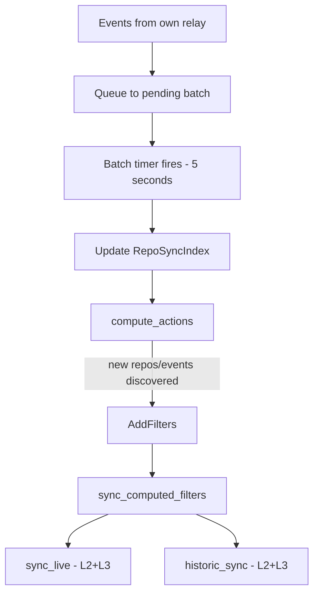

**Key points:**

- Self-subscriber monitors own relay for 30617, 1617, 1618, 1619, 1621
- Batches events (5 second window)
- Updates RepoSyncIndex, then compute_actions finds new work
- New items flow through sync_computed_filters

---

## Core Algorithms

### derive_relay_targets

Transforms the repo-centric `RepoSyncIndex` into a relay-centric view. For each relay URL mentioned in any repo's announcements, collects all the repos and root events that should be synced from that relay.

```rust
// Conceptual: inverts repo → relays to relay → repos
fn derive_relay_targets(repo_index: &HashMap<String, RepoSyncNeeds>)
    -> HashMap<String, RelaySyncNeeds>
```

### compute_actions (Three-Way Diff)

**This is the ONLY decision point for what NEW subscriptions to create.**

Performs a three-way diff: `target - pending - confirmed = new`

- **targets**: What we want (from derive_relay_targets)
- **pending**: What's already in-flight awaiting EOSE
- **confirmed**: What's already confirmed syncing

Only creates `AddFilters` actions for items not already pending or confirmed. Skips disconnected relays (they will get AddFilters on reconnect).

```rust
fn compute_actions(
    targets: &HashMap<String, RelaySyncNeeds>,
    pending: &PendingSyncIndex,
    confirmed: &RelaySyncIndex,
) -> Vec<AddFilters>
```

---

## Method Specifications

### Primitives

#### `sync_live()` - Live Subscriptions

```rust
/// Set up live subscription (filters with limit: 0)
///
/// - Uses `limit: 0` to receive only new events
/// - NOT tracked in PendingSyncIndex (state reconstructable)
async fn sync_live(&self, relay_url: &str, filters: &[Filter])
```

#### `historic_sync()` - Historical Sync Dispatcher

```rust
/// Dispatch to appropriate historic sync method based on relay capabilities
///
/// Both paths update PendingSyncIndex to ensure consistent lifecycle tracking.
async fn historic_sync(
    &mut self,
    relay_url: &str,
    filters: Vec<Filter>,
    items: PendingItems,
    since: Option<Timestamp>,
) -> Option<u64>  // Returns batch_id
```

Dispatches to:

- `historic_sync_negentropy()` - NIP-77 parallel sync (if supported) - no pagination needed
- `historic_sync_legacy()` - REQ+EOSE fallback with automatic pagination for large result sets

### Building Blocks

#### `sync_computed_filters()` - Handle New AddFilters

```rust
/// Process AddFilters action (from compute_actions)
///
/// Orchestrates both live and historic sync for NEW items:
/// 1. sync_live() - set up permanent L2+L3 subscriptions
/// 2. historic_sync() - catch up on past events
///
/// This is specifically for NEW filter discovery.
async fn sync_computed_filters(
    &mut self,
    action: AddFilters,
    since: Option<Timestamp>,
) -> Option<u64>
```

### Top-Level Entry Points

#### `fresh_start()` - Clean Slate Sync

```rust
/// Fresh start - clears state and does full sync
///
/// Called by: initial connect, long_reconnect, daily_sync
///
/// Flow:
/// 1. Clear PendingSyncIndex
/// 2. Clear RelaySyncIndex
/// 3. L1 live + L1 historic (negentropy if available)
/// 4. compute_actions → AddFilters → sync_computed_filters for L2+L3
async fn fresh_start(&mut self, relay_url: &str)
```

#### `quick_reconnect()` - Short Disconnection Recovery

```rust
/// Quick reconnect - for disconnections < 15 minutes
///
/// Flow:
/// 1. Clear PendingSyncIndex
/// 2. L1 live + L1 historic(since)
/// 3. reconstruct_filters → L2+L3 live + L2+L3 historic(since)
/// 4. compute_actions for any new items
async fn quick_reconnect(&mut self, relay_url: &str, since: Timestamp)
```

#### `long_reconnect()` - Extended Disconnection Recovery

```rust
/// Long reconnect - for disconnections > 15 minutes
///
/// Flow:
/// 1. Record disconnect/reconnect metric
/// 2. fresh_start()
async fn long_reconnect(&mut self, relay_url: &str)
```

#### `daily_sync()` - Scheduled Full Refresh

```rust
/// Daily sync - full refresh without disconnect metrics
///
/// Flow: fresh_start() (no disconnect metric recorded)
async fn daily_sync(&mut self, relay_url: &str)
```

#### `consolidate()` - Filter Count Reduction

```rust
/// Consolidate subscriptions when filter count exceeds threshold
///
/// Flow:
/// 1. Clear PendingSyncIndex
/// 2. unsubscribe_all
/// 3. reconstruct_filters → sync_live only (L1+L2+L3)
/// 4. compute_actions for any new items
///
/// NO historic sync - items already synced, just reducing subscriptions
async fn consolidate(&mut self, relay_url: &str)
```

#### `handle_new_sync_filters()` - New Filter Discovery

```rust
/// Handle AddFilters action from compute_actions
///
/// Flow:
/// 1. Check/spawn connection if needed
/// 2. maybe_consolidate (check filter threshold)
/// 3. sync_computed_filters
async fn handle_new_sync_filters(&mut self, action: AddFilters)
```

---

## Method Relationships Summary

```
fresh_start(relay_url)                          // Initial/long_reconnect/daily
    ├──> Clear PendingSyncIndex
    ├──> Clear RelaySyncIndex
    ├──> L1: sync_live(announcement_filter)
    ├──> L1: historic_sync(announcement_filter, None)
    └──> compute_actions → AddFilters → sync_computed_filters (L2+L3)

quick_reconnect(relay_url, since)               // Disconnected < 15 min
    ├──> Clear PendingSyncIndex
    ├──> L1: sync_live(announcement_filter)
    ├──> L1: historic_sync(announcement_filter, since)
    ├──> reconstruct_filters() → L2+L3 filters
    ├──> L2+L3: sync_live(filters)
    ├──> L2+L3: historic_sync(filters, since)
    └──> compute_actions → AddFilters → sync_computed_filters (new items only)

long_reconnect(relay_url)                       // Disconnected > 15 min
    ├──> Record disconnect/reconnect metric
    └──> fresh_start()

daily_sync(relay_url)                           // Timer fires
    └──> fresh_start()  // No disconnect metric

consolidate(relay_url)                          // Filter count > threshold
    ├──> Clear PendingSyncIndex
    ├──> unsubscribe_all()
    ├──> reconstruct_filters() → L1+L2+L3 filters
    ├──> sync_live(filters)  // Live only, NO historic
    └──> compute_actions → AddFilters → sync_computed_filters (new items only)

handle_new_sync_filters(action)                      // New filter discovery
    ├──> Check/spawn connection
    ├──> maybe_consolidate()
    └──> sync_computed_filters(action, None)

sync_computed_filters(action, since)            // Process AddFilters
    ├──> sync_live(action.filters)              // L2+L3 live
    └──> historic_sync(action.filters, since)   // L2+L3 historic
              ├── historic_sync_negentropy()    // Parallel, updates Pending
              └── historic_sync_legacy()        // REQ+EOSE, updates Pending
```

---

## Filter Building (Three-Layer Strategy)

### Layer 1: Announcements

- **Kinds**: 30617 (Repository Announcements), 30618 (Maintainer Lists)
- **When subscribed**: On connect (any type) - handled by connection lifecycle
- **Function**: `build_announcement_filter(since: Option<Timestamp>)`
- 30618 is ONLY synced from remote relays, not self-subscribed

### Layer 2: Events Tagging Our Repos

- **Tags**: lowercase `a`, uppercase `A`, and `q` tags for comprehensive coverage
- **Batching**: Per 100 repo refs
- **Function**: `build_repo_tag_filters(repos, since)`

### Layer 3: Events Tagging Our Root Events

- **Tags**: lowercase `e`, uppercase `E`, and `q` tags for comprehensive coverage
- **Batching**: Per 100 event IDs
- **Function**: `build_root_event_tag_filters(root_events, since)`

### Combined Layer 2+3

The `build_layer2_and_layer3_filters()` function combines both layers. Used by:

- `sync_computed_filters` for new item subscriptions
- `reconstruct_filters` for rebuilding from confirmed state

---

## NIP-77 Negentropy Sync

### What is Negentropy?

NIP-77 defines the negentropy protocol for efficient event set comparison. Instead of requesting all events matching a filter (REQ+EOSE), negentropy allows relays to compare fingerprints of their event sets and only transfer the differences.

### When Negentropy is Used

Negentropy sync is attempted for:

- **fresh_start()** - Full sync without `since`
- **daily_sync()** - Periodic full refresh (via fresh_start)
- **long_reconnect()** - Via fresh_start

Negentropy is NOT used for:

- **quick_reconnect()** - Uses REQ with `since` (more efficient for small gaps)
- **Live subscriptions** - Always use REQ with `limit: 0`

### Fallback Behavior

If negentropy fails (relay doesn't support NIP-77, network error, etc.):

1. A warning is logged (once per relay to avoid spam)
2. The sync falls back to traditional REQ+EOSE
3. No error is raised - fallback is automatic

---

## REQ+EOSE Pagination

When a relay doesn't support NIP-77 Negentropy, historic sync uses traditional REQ+EOSE with automatic pagination to handle large result sets efficiently.

### How Pagination Works

1. **Initial Request**: Send REQ with filters (may include `since` parameter)
2. **Track Events**: As events arrive, [`PaginationState`](src/sync/mod.rs:165) tracks:
   - `event_count`: Number of events received
   - `min_created_at`: Smallest timestamp seen (oldest event)
   - `original_filter`: Base filter for reconstruction
3. **EOSE Detection**: When EOSE arrives, check if pagination is needed
4. **Next Page**: If enough events were received (suggesting more exist):
   - Create new filter with `until: min_created_at`
   - Issue another REQ for events older than the oldest seen
   - Reuse same subscription ID
5. **Completion**: Repeat until EOSE arrives with fewer events, indicating end of results

### Pagination State Lifecycle

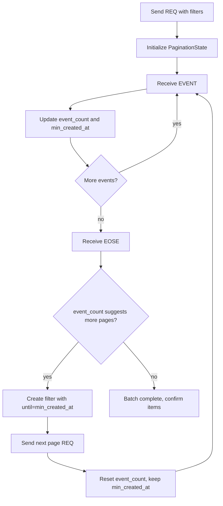

### Pagination vs Negentropy

| Aspect              | Negentropy Sync              | REQ+EOSE Pagination                                       |
| ------------------- | ---------------------------- | --------------------------------------------------------- |
| **Efficiency**      | High (set reconciliation)    | Lower (sequential pages)                                  |
| **Bandwidth**       | Minimal (only missing items) | Higher (all matching events transferred)                  |
| **Relay support**   | Requires NIP-77              | Universal (standard Nostr)                                |
| **State tracking**  | None needed                  | [`PaginationState`](src/sync/mod.rs:165) per subscription |
| **Completion time** | Typically faster             | Slower for large sets                                     |
| **Use cases**       | Full sync, large event sets  | Fallback, small gaps with `since`                         |

---

## State Flow Summary

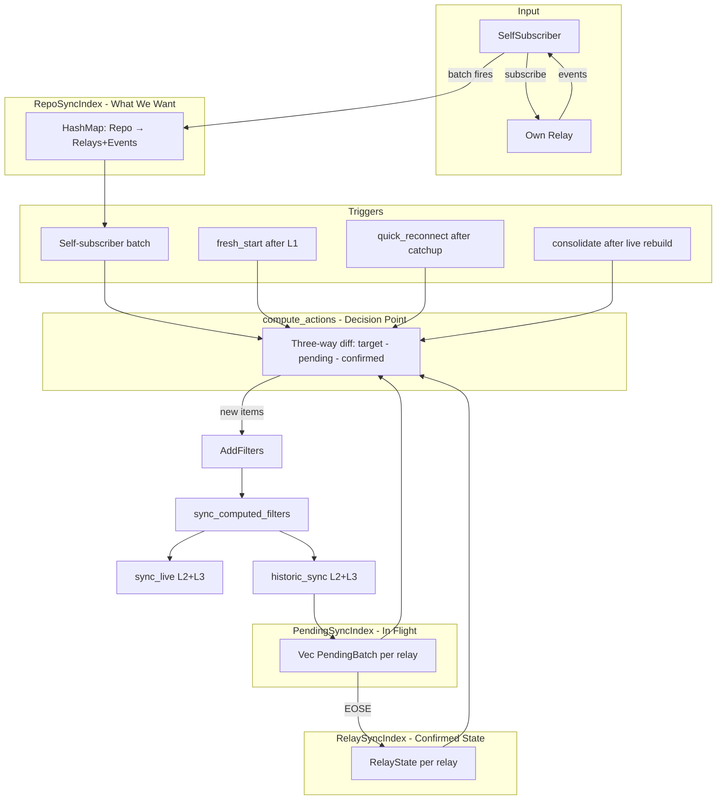

---

## Key Design Decisions

| Decision                      | Choice                                      | Rationale                                                          |
| ----------------------------- | ------------------------------------------- | ------------------------------------------------------------------ |
| Live vs Historic separation   | Two distinct primitives                     | Clear responsibilities, easier reasoning about state               |
| Live sync method              | `limit: 0` not `since: now`                 | No clock dependency, deterministic, mirrors filter structure       |
| Layer 1 handling              | On connect, separate from AddFilters        | Connection-level concern, not item-level                           |
| Layer 2+3 handling            | Via compute_actions → sync_computed_filters | Item-level, proper pending tracking                                |
| Clear PendingSyncIndex        | Always first                                | Old subscriptions are dead, must clear before any operation        |
| fresh_start vs long_reconnect | Same flow, different metrics                | Reuse logic, distinguish intentional refresh from failure recovery |
| Consolidation                 | Live only, no historic                      | Items already synced, just reducing subscription count             |
| compute_actions role          | ONLY decision point for new work            | Single place to reason about what needs syncing                    |
| NIP-77 negentropy             | Try first on full sync, fallback            | Efficient for large sets, graceful degradation                     |

---

## Module Structure

```
src/sync/
├── mod.rs              # SyncManager, main loop, data structures
├── algorithms.rs       # derive_relay_targets(), compute_actions()
├── filters.rs          # build_announcement_filter(), build_layer2_and_layer3_filters()
├── health.rs           # RelayHealthTracker with exponential backoff
├── relay_connection.rs # RelayConnection, RelayEvent handling
├── self_subscriber.rs  # SelfSubscriber with batching
└── metrics.rs          # SyncMetrics for Prometheus
```

---

## Health Tracking

The `RelayHealthTracker` manages connection health with exponential backoff:

- **States**: Healthy, Degraded, Dead
- **Backoff**: `base * 2^(failures-1)`, capped at max_backoff
- **Dead threshold**: 24 hours of continuous failures
- **Dead relay retry**: Once per 24 hours

Bootstrap relays are never disconnected by the cleanup system, even if empty.

---

## Self-Subscriber

The `SelfSubscriber` monitors our own relay for repository announcements and root events, updating the `RepoSyncIndex`.

### Event Kinds Monitored

- **30617** - Repository Announcements (triggers discovery of repos listing our relay)
- **1617** - Patches (root events referencing repos)
- **1618** - Issues
- **1619** - Replies/Status
- **1621** - Pull Requests

Note: 30618 (Maintainer Lists) is NOT self-subscribed - only synced from remote relays.

### Batching Flow

1. **Receive events** from own relay subscription
2. **Queue to pending** - announcements get repo ID + relay URLs; root events get repo ref + event ID
3. **Timer fires** (configurable window, default 5 seconds) - does NOT reset on new events
4. **Process batch**:
   - Update `RepoSyncIndex` with discovered repos and root events
   - Call `compute_actions()`
   - Send `AddFilters` actions to SyncManager → `sync_computed_filters()`

---

## Disconnect Handling

The disconnect checker runs periodically (default: 60 seconds) to clean up empty relays:

- Finds relays with `repos.is_empty() && root_events.is_empty()`
- Skips bootstrap relays (`is_bootstrap == true`)
- Removes from relay_sync_index, pending_sync_index, and connections
- Disconnects the WebSocket connection

Also triggers reconnection attempts for disconnected relays that have pending work.
