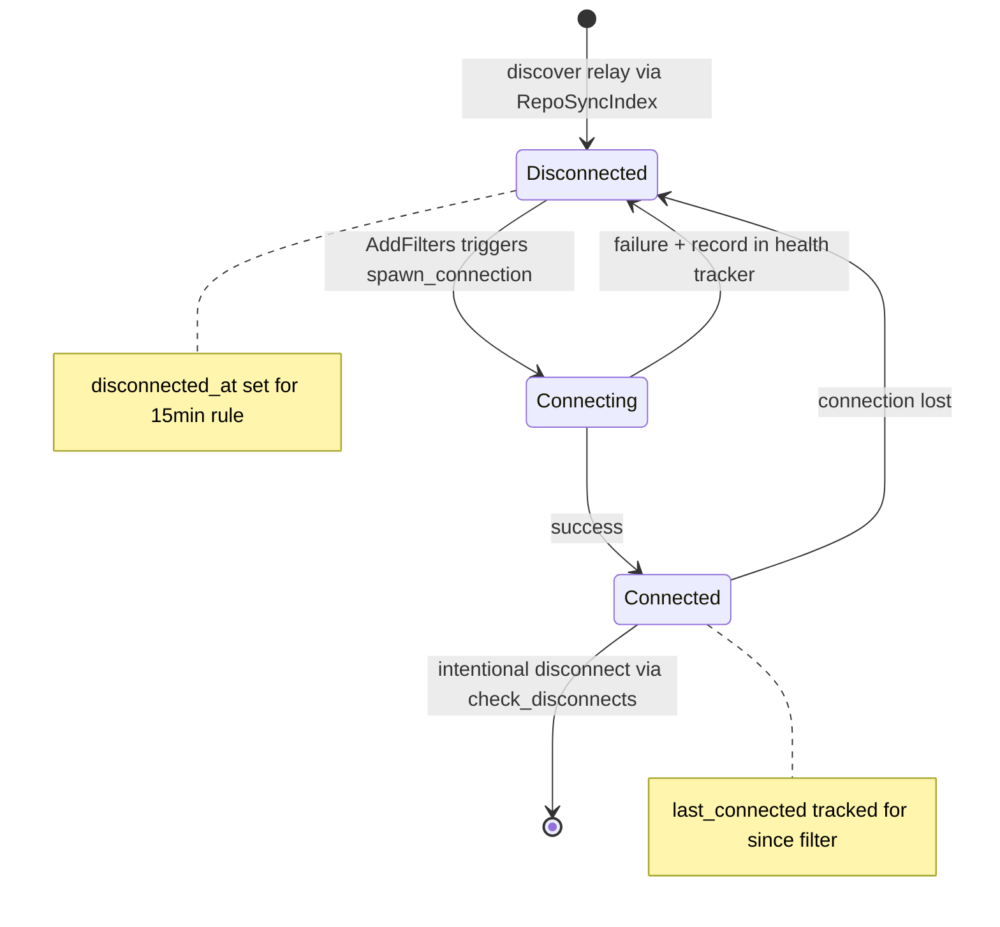
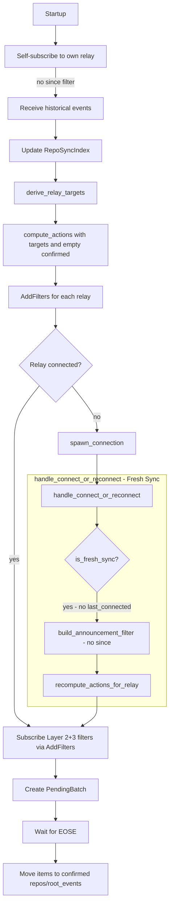
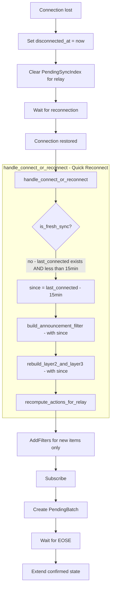
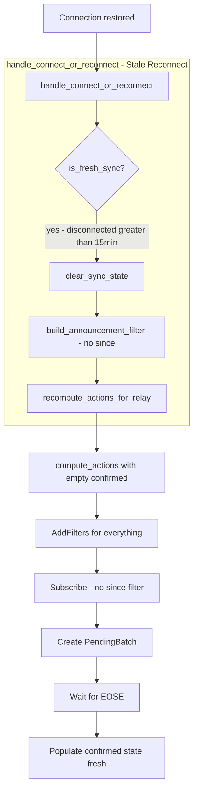
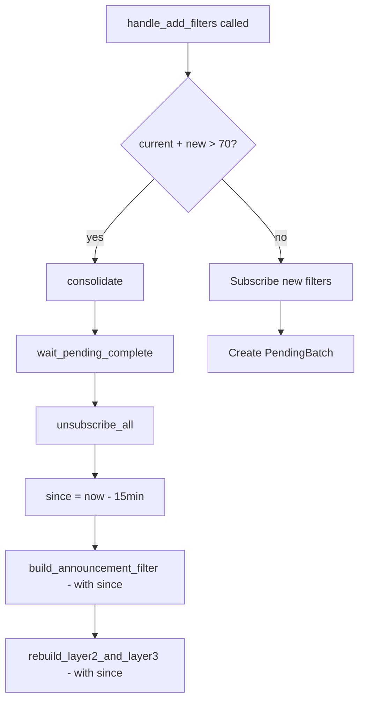
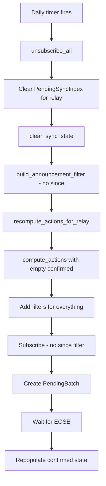
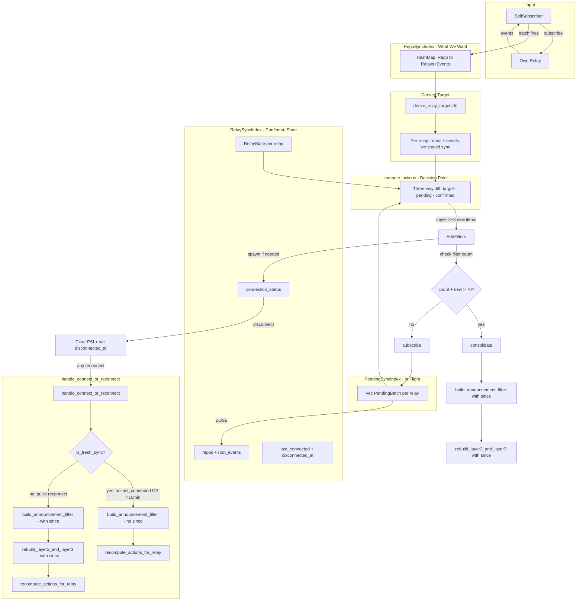

# GRASP-02: Proactive Sync - Design & Implementation

## Overview

This document explains the proactive sync system that synchronizes repository data from external relays based on relay URLs listed in 30617 repository announcements. Key principles:

1. **Self-subscription as the only mechanism** - No database initialization at startup
2. **compute_actions as single decision point** - Determines what NEW subscriptions to create
3. **Two subscription paths on reconnect** - Catch-up (retained, with since) vs new items (via compute_actions)
4. **Blank state = fresh sync** - Empty confirmed state triggers full historical fetch
5. **Clear on disconnect, not reconnect** - PendingSyncIndex cleared at event boundary

---

## Data Model

### RepoSyncIndex (Source of Truth)

```rust
/// What we WANT to sync - derived from events received via self-subscription.
/// Updated immediately when self-subscriber batch fires.
/// Key: repo addressable ref - 30617:pubkey:identifier
pub type RepoSyncIndex = Arc<RwLock<HashMap<String, RepoSyncNeeds>>>;

#[derive(Debug, Clone, Default)]
pub struct RepoSyncNeeds {
    /// Relay URLs listed in this repo's 30617 announcement
    pub relays: HashSet<String>,
    /// Root event IDs - 1617/1618/1619/1621 - that reference this repo
    pub root_events: HashSet<EventId>,
}
```

### RelaySyncIndex (Confirmed State + Connection)

```rust
/// What we have CONFIRMED syncing - includes connection state for integrated lifecycle.
/// Key: relay URL
pub type RelaySyncIndex = Arc<RwLock<HashMap<String, RelayState>>>;

/// Connection status for a relay
#[derive(Debug, Clone, Copy, PartialEq, Eq)]
pub enum ConnectionStatus {
    /// Not currently connected
    Disconnected,
    /// Connection attempt in progress
    Connecting,
    /// Successfully connected and subscribed
    Connected,
}

/// Complete state for a single relay - combines sync needs with connection lifecycle
#[derive(Debug)]
pub struct RelayState {
    /// Repos we have confirmed syncing from this relay
    pub repos: HashSet<String>,
    /// Root events we have confirmed tracking
    pub root_events: HashSet<EventId>,
    /// If true, never disconnect this relay
    pub is_bootstrap: bool,
    /// Current connection status
    pub connection_status: ConnectionStatus,
    /// When we last successfully connected - used for since filter on reconnect
    pub last_connected: Option<Timestamp>,
    /// When we disconnected - for 15-minute state retention rule
    pub disconnected_at: Option<Timestamp>,
}

impl RelayState {
    /// Check if state should be cleared based on 15-minute rule
    pub fn should_clear_state(&self) -> bool {
        match self.disconnected_at {
            Some(disconnected) => {
                let now = Timestamp::now();
                now.as_secs().saturating_sub(disconnected.as_secs()) > 900 // 15 minutes
            }
            None => false, // Still connected or never connected
        }
    }

    /// Clear repos and root_events - called when reconnect takes > 15 minutes
    pub fn clear_sync_state(&mut self) {
        self.repos.clear();
        self.root_events.clear();
    }
}
```

### PendingSyncIndex (In-Flight Batches)

```rust
/// Tracks batches of subscriptions that are in-flight, awaiting EOSE.
/// Each batch has its own ID and can confirm independently.
/// Key: relay URL
pub type PendingSyncIndex = Arc<RwLock<HashMap<String, Vec<PendingBatch>>>>;

#[derive(Debug, Clone)]
pub struct PendingBatch {
    /// Unique ID for this batch - for debugging/logging
    pub batch_id: u64,
    /// The items this batch is syncing
    pub items: PendingItems,
    /// Subscription IDs that must ALL receive EOSE before confirming
    pub outstanding_subs: HashSet<SubscriptionId>,
}

#[derive(Debug, Clone, Default)]
pub struct PendingItems {
    pub repos: HashSet<String>,
    pub root_events: HashSet<EventId>,
}
```

---

## Connection Lifecycle State Machine



---

## Flow Scenarios

### Scenario 1: Initial Connect



**Key points:**

- No `since` filter on initial connect - get full history
- `handle_connect_or_reconnect` detects `is_fresh_sync` via `last_connected.is_none()`
- Layer 1: `build_announcement_filter(None)` - subscribed immediately without since
- Layer 2+3: handled via `recompute_actions_for_relay` → `compute_actions` with PendingBatch tracking

### Scenario 2: Quick Reconnect (less than 15 minutes)



**Key points:**

- PendingSyncIndex cleared on disconnect (not reconnect)
- `handle_connect_or_reconnect`:
  1. `build_announcement_filter(Some(since))` - Layer 1 with since
  2. `rebuild_layer2_and_layer3(since)` - Layer 2+3 with since
  3. `recompute_actions_for_relay` - check for new items
- since = last_connected - 15min ensures we catch events during disconnection

### Scenario 3: Stale Reconnect (greater than 15 minutes)



**Key points:**

- `should_clear_state()` returns true → triggers fresh sync
- Same path as initial connect after clearing state
- Layer 1: `build_announcement_filter(None)` - full history
- Layer 2+3: handled via empty confirmed state → compute_actions generates AddFilters for everything

### Scenario 4: Consolidation (Triggered on Filter Add)



**Key points:**

- Consolidation checked in `handle_add_filters` BEFORE adding new filters
- After closing all subscriptions, re-subscribe:
  1. `build_announcement_filter(Some(since))` - Layer 1 stays active with since
  2. `rebuild_layer2_and_layer3(since)` - Layer 2+3 with since
- `since = now - 15min` prevents re-fetching old events
- Keeps confirmed state, just reduces filter count

### Scenario 5: Daily Timer (23-25h Random)



**Key points:**

- Daily timer is a full fresh sync, NOT consolidation
- Clears both PendingSyncIndex and confirmed state
- Layer 1: `build_announcement_filter(None)` - full history
- Layer 2+3: via compute_actions with empty confirmed - full history
- Detects any state drift accumulated over 24 hours

---

## Core Algorithms

### derive_relay_targets

Transforms the repo-centric `RepoSyncIndex` into a relay-centric view. For each relay URL mentioned in any repo's announcements, collects all the repos and root events that should be synced from that relay.

**Implementation:** [`derive_relay_targets()`](../../src/sync/algorithms.rs:61)

```rust
// Conceptual: inverts repo → relays to relay → repos
fn derive_relay_targets(repo_index: &HashMap<String, RepoSyncNeeds>) 
    -> HashMap<String, RelaySyncNeeds>
```

### compute_actions (Three-Way Diff)

**This is the ONLY decision point for what NEW subscriptions to create.**

Performs a three-way diff: `target - pending - confirmed = new`

- **targets**: What we want (from derive_relay_targets)
- **pending**: What's already in-flight awaiting EOSE
- **confirmed**: What's already confirmed syncing

Only creates `AddFilters` actions for items not already pending or confirmed. Skips disconnected relays (they will get AddFilters on reconnect).

**Implementation:** [`compute_actions()`](../../src/sync/algorithms.rs:96)

---

## Filter Building (Three-Layer Strategy)

The filter strategy uses three layers to ensure comprehensive event coverage:

### Layer 1: Announcements

- **Kinds**: 30617 (Repository Announcements), 30618 (Maintainer Lists)
- **When subscribed**: ONCE on connect, NOT rebuilt during consolidation
- **Function**: [`build_announcement_filter()`](../../src/sync/filters.rs:20)
- 30618 is ONLY synced from remote relays, not self-subscribed

### Layer 2: Events Tagging Our Repos

- **Tags**: lowercase `a`, uppercase `A`, and `q` tags for comprehensive coverage
- **Batching**: Per 100 repo refs
- **Function**: [`tagged_one_of_our_repo_event_filters()`](../../src/sync/filters.rs:43)

### Layer 3: Events Tagging Our Root Events

- **Tags**: lowercase `e`, uppercase `E`, and `q` tags for comprehensive coverage
- **Batching**: Per 100 event IDs
- **Function**: [`tagged_one_of_our_root_event_filters()`](../../src/sync/filters.rs:98)

### Combined Layer 2+3

The [`build_layer2_and_layer3_filters()`](../../src/sync/filters.rs:152) function combines both layers. Used by:
- `compute_actions` for incremental subscriptions
- `rebuild_layer2_and_layer3` during reconnection
- Consolidation rebuilds (Layer 1 remains active separately)

**Key insight**: Layer 1 is connection-level (subscribe once), Layer 2+3 are item-level (managed by compute_actions and PendingBatch).

---

## SyncManager Key Methods

The [`SyncManager`](../../src/sync/mod.rs:308) orchestrates all sync operations. Key methods:

### Connection Lifecycle

| Method | Purpose |
|--------|---------|
| `handle_connect_or_reconnect()` | Unified handler for initial connect and reconnect. Determines fresh vs quick reconnect based on `last_connected` and 15-minute rule |
| `handle_disconnect()` | Updates RelayState to Disconnected, sets disconnected_at, clears pending batches, records failure in health tracker |
| `spawn_relay_connection()` | Creates RelayConnection, subscribes to Layer 1, spawns event loop task |

### Sync Operations

| Method | Purpose |
|--------|---------|
| `handle_add_filters()` | Auto-spawns connection if needed, checks consolidation threshold (>70 filters), subscribes and creates PendingBatch |
| `handle_eose()` | Processes EOSE for subscription, moves items from pending to confirmed when batch completes |
| `recompute_actions_for_relay()` | Runs derive_relay_targets → compute_actions for a specific relay to find new items |
| `rebuild_layer2_and_layer3()` | Rebuilds subscriptions from confirmed state with optional since filter |

### Maintenance

| Method | Purpose |
|--------|---------|
| `daily_sync()` | Full fresh sync - unsubscribes all, clears state, recomputes actions |
| `consolidate()` | Reduces filter count by unsubscribing and rebuilding with combined filters |
| `check_disconnects()` | Periodic check for empty relays (no repos) to disconnect |
| `check_reconnects()` | Attempts reconnection for disconnected relays with pending work |

---

## Self-Subscriber

The [`SelfSubscriber`](../../src/sync/self_subscriber.rs:86) monitors our own relay for repository announcements and root events, updating the `RepoSyncIndex`.

### Event Kinds Monitored

- **30617** - Repository Announcements (triggers discovery of repos listing our relay)
- **1617** - Patches (root events referencing repos)
- **1618** - Issues
- **1619** - Replies/Status
- **1621** - Pull Requests

Note: 30618 (Maintainer Lists) is NOT self-subscribed - only synced from remote relays.

### Batching Flow

1. **Receive events** from own relay subscription
2. **Queue to pending** - announcements get repo ID + relay URLs; root events get repo ref + event ID
3. **Timer fires** (configurable window, default 5 seconds) - does NOT reset on new events
4. **Process batch**:
   - Update `RepoSyncIndex` with discovered repos and root events
   - Call `derive_relay_targets()` → `compute_actions()`
   - Send `AddFilters` actions to SyncManager

### Reconnection

Uses `last_connected` timestamp to apply since filter on reconnect (15-minute buffer), similar to external relay reconnection logic.

---

## State Flow Summary



---

## Key Design Decisions

| Decision | Choice | Rationale |
|----------|--------|-----------|
| Startup mechanism | Self-subscription only | Single code path, fresh DB behaves same as reconnect |
| Connect/reconnect handling | Unified handle_connect_or_reconnect | Single entry point for both initial and reconnect |
| Layer 1 handling | Separate build_announcement_filter | Connection-level: subscribe ONCE on connect, NOT rebuilt in consolidation |
| Layer 2+3 handling | Separate rebuild_layer2_and_layer3 | Item-level: managed by compute_actions, consolidated when filter count > 70 |
| Filter functions | since as Option parameter | Allows same functions for fresh sync and catch-up |
| Since filter | Only on catch-up paths | Initial/stale gets full history, quick reconnect catches up |
| compute_actions role | ONLY for new Layer 2+3 items | Does NOT handle Layer 1 or catch-up |
| Catch-up pending tracking | No PendingBatch | Items already confirmed, don't need re-confirmation |
| Consolidation trigger | On filter add, not periodic | Check in handle_add_filters before adding new filters |
| Clear on disconnect | Clear PSI on disconnect | Cleanup at event boundary, simpler than on reconnect |
| 15-minute rule | Clear confirmed if disconnected >15min | Matches since filter buffer, prevents stale subscriptions |
| Daily timer | Fresh sync (clears state) | Ensures consistency, detects drift |

---

## Module Structure

```
src/sync/
├── mod.rs              # SyncManager, main loop, data structures (RepoSyncNeeds, RelayState, etc.)
├── algorithms.rs       # derive_relay_targets(), compute_actions(), AddFilters
├── filters.rs          # build_announcement_filter(), build_layer2_and_layer3_filters()
├── health.rs           # RelayHealthTracker with exponential backoff
├── relay_connection.rs # RelayConnection, RelayEvent handling
├── self_subscriber.rs  # SelfSubscriber with batching
└── metrics.rs          # SyncMetrics for Prometheus
```

---

## Health Tracking

The [`RelayHealthTracker`](../../src/sync/health.rs:93) manages connection health with exponential backoff:

- **States**: Healthy, Degraded, Dead
- **Backoff**: `base * 2^(failures-1)`, capped at max_backoff
- **Dead threshold**: 24 hours of continuous failures
- **Dead relay retry**: Once per 24 hours

Bootstrap relays are never disconnected by the cleanup system, even if empty.

---

## Disconnect Handling

The disconnect checker runs periodically (default: 60 seconds) to clean up empty relays:

- Finds relays with `repos.is_empty() && root_events.is_empty()`
- Skips bootstrap relays (`is_bootstrap == true`)
- Removes from relay_sync_index, pending_sync_index, and connections
- Disconnects the WebSocket connection

Also triggers reconnection attempts for disconnected relays that have pending work.
