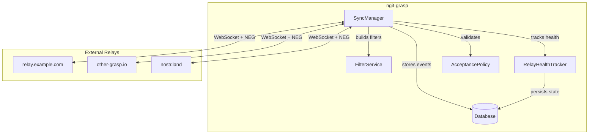
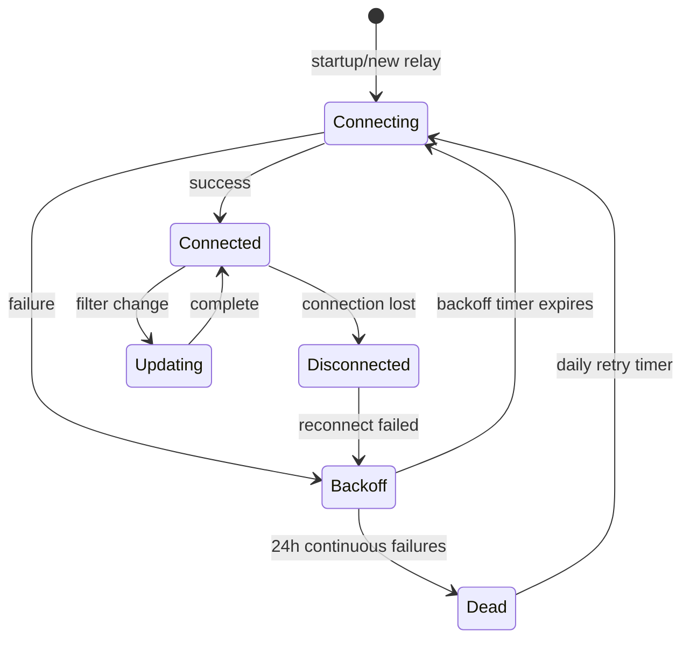
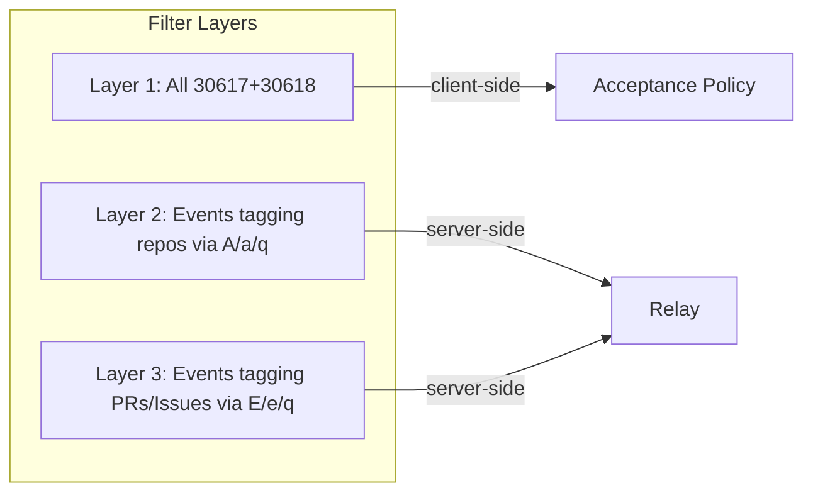
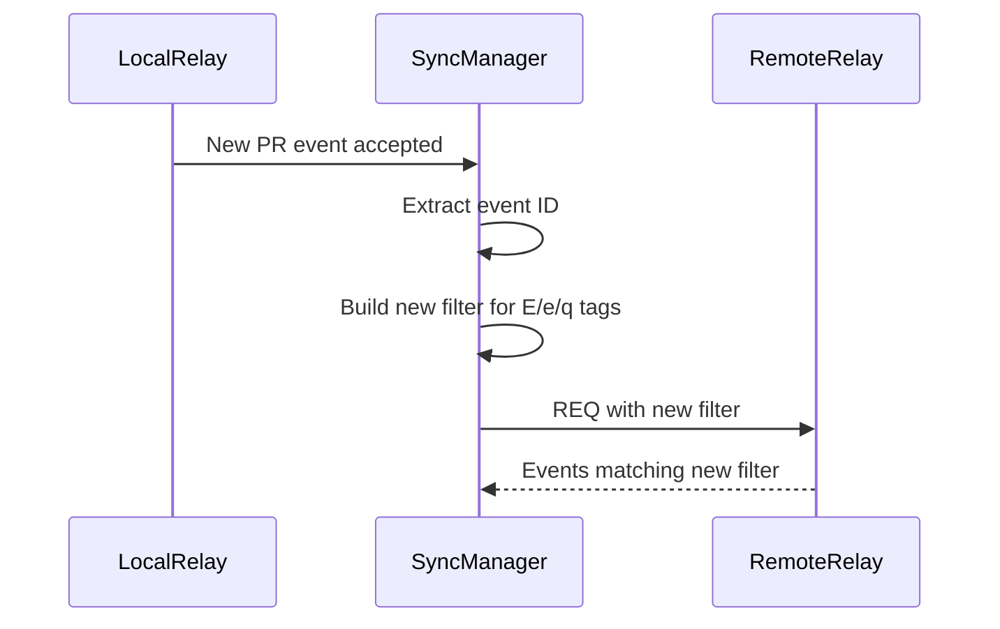
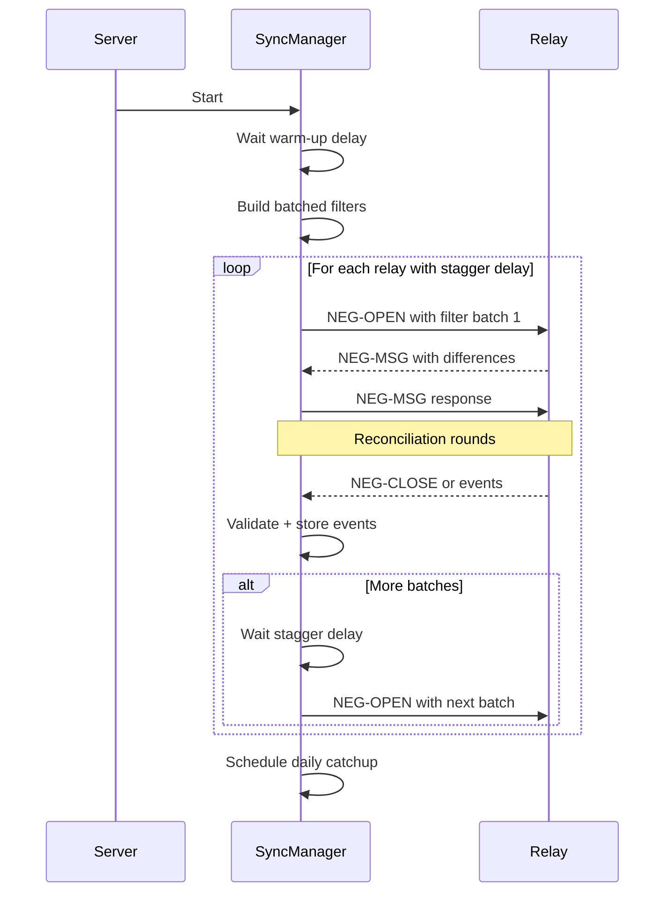

# GRASP-02: Proactive Sync - Design Document

## Overview

GRASP-02 Proactive Sync enables ngit-grasp to maintain live WebSocket connections to other relays listed in repository announcement events, synchronizing NIP-34 related events using both **live sync** (real-time subscriptions) and **negentropy catchup** (NIP-77 set reconciliation).

This document covers **event syncing only**. Git data syncing is out of scope for this phase.

## Goals

1. **Data Availability**: Ensure we have all relevant events for repositories we host
2. **Resilience**: Handle relay failures gracefully with backoff and health tracking
3. **Efficiency**: Minimize connections and bandwidth through filter consolidation
4. **Consistency**: Use unified filters for both live sync and negentropy catchup

## Architecture Overview



## Connection Management

### Relay Discovery

Relays to connect to are discovered from **all stored repository announcements**:

```rust
// Pseudocode for relay discovery
fn discover_relays(database: &Database) -> HashSet<RelayUrl> {
    let announcements = database.query(Filter::new().kind(30617));
    let mut relays = HashSet::new();

    for announcement in announcements {
        for relay_url in announcement.relays_tags() {
            if relay_url != our_domain {  // Exclude ourselves
                relays.insert(relay_url);
            }
        }
    }
    relays
}
```

### Connection Lifecycle



### Health Tracking & Backoff

| State       | Behavior                                            |
| ----------- | --------------------------------------------------- |
| **Healthy** | Normal operation, immediate reconnect on disconnect |
| **Backoff** | Exponential backoff: 1s → 2s → 4s → ... → 1h max    |
| **Dead**    | 24h of continuous failures, retry once per day      |

Health state is **persisted to database** to survive restarts:

```rust
struct RelayHealth {
    url: RelayUrl,
    status: RelayStatus,           // Healthy, Backoff, Dead
    consecutive_failures: u32,
    last_failure_at: Option<Timestamp>,
    last_success_at: Option<Timestamp>,
    next_retry_at: Timestamp,
}

enum RelayStatus {
    Healthy,
    Backoff { attempt: u32 },      // backoff = min(2^attempt, 3600) seconds
    Dead,                           // retry in 24h
}
```

## Filter Strategy

### Unified Filters for Live Sync and Negentropy

The same filter logic is used for both live subscriptions and negentropy reconciliation:



### Layer 1: Repository Announcements & States

Get ALL kind 30617 and 30618 events with unified `since` timestamp, then filter client-side through acceptance policy:

```rust
// Use same since filter as other layers for consistency
let layer1_filter = Filter::new()
    .kinds([Kind::from(30617), Kind::from(30618)])
    .since(since_timestamp);  // Unified with Layer 2/3
```

**Client-side validation**: Only store events that pass our [`Nip34WritePolicy`](src/nostr/builder.rs:51).

### Layer 2: Events Tagging Repositories

For repo announcements **that list BOTH this relay AND our service**:

```rust
// Build addressable references: 30617:<pubkey>:<identifier>
let repo_refs: Vec<String> = announcements
    .iter()
    .filter(|a| a.relays.contains(&this_relay) && a.lists_service(&our_domain))
    .map(|a| format!("30617:{}:{}", a.pubkey.to_hex(), a.identifier))
    .collect();

let layer2_filter = Filter::new()
    .custom_tag(SingleLetterTag::lowercase(Alphabet::A), repo_refs.clone())
    .or(Filter::new().custom_tag(SingleLetterTag::lowercase(Alphabet::Q), repo_refs));
```

### Layer 3: Events Tagging Issues/PRs/Patches

For events that reference PRs, Patches, or Issues from repos we track:

```rust
// Collect event IDs of PRs, Patches, Issues we've stored
let tagged_event_ids: Vec<EventId> = database
    .query(Filter::new().kinds([1618, 1619, 1621, 1622, 1630]))  // PR, PR Update, Issue, Patch, etc.
    .iter()
    .filter(|e| references_tracked_repo(e, &announcements))
    .map(|e| e.id)
    .collect();

let layer3_filter = Filter::new()
    .custom_tag(SingleLetterTag::lowercase(Alphabet::E), tagged_event_ids.clone())
    .or(Filter::new().custom_tag(SingleLetterTag::lowercase(Alphabet::Q), tagged_event_ids));
```

### Filter Size Management

When the tag list exceeds a threshold, split into batches:

```rust
const MAX_TAGS_PER_FILTER: usize = 100;

fn build_filters(tag_values: Vec<String>) -> Vec<Filter> {
    tag_values
        .chunks(MAX_TAGS_PER_FILTER)
        .map(|chunk| Filter::new().custom_tag(tag, chunk.to_vec()))
        .collect()
}
```

**Consolidation**: When total filter count exceeds ~150 across a connection, consolidate by rebuilding from scratch.

## Subscription Updates

### Dynamic Subscription Management

When new events arrive that affect our filter criteria:



**Events that trigger subscription updates**:

- New repository announcement accepted (adds to Layer 2)
- New PR/Issue/Patch accepted (adds to Layer 3)

### When to Consolidate

Track subscription count per connection:

```rust
struct ConnectionState {
    relay_url: RelayUrl,
    subscriptions: Vec<SubscriptionId>,
    total_filter_count: usize,
}

impl ConnectionState {
    fn should_consolidate(&self) -> bool {
        self.total_filter_count > 150
    }

    async fn consolidate(&mut self) {
        // Close all subscriptions
        // Rebuild from scratch with current database state
    }
}
```

## Negentropy Catchup

### NIP-77 Reconciliation Protocol

Negentropy enables efficient set reconciliation - discovering which events we're missing without transferring full event lists.

### Timing

| Trigger             | Behavior                                                             |
| ------------------- | -------------------------------------------------------------------- |
| **Initial startup** | Warm-up delay, staggered if many filters, initializes daily schedule |
| **After reconnect** | Delay to avoid rate limiting, limited to events from last 3 days     |
| **Daily**           | Staggered batches, max 100 tagged events per filter                  |

### Startup Flow



### Reconnection Catchup

After connection reestablished:

```rust
async fn catchup_after_reconnect(&self, relay: &RelayUrl) {
    // Delay to avoid immediate disconnect for too many requests
    tokio::time::sleep(RECONNECT_CATCHUP_DELAY).await;

    // Only catch up on recent events (last 3 days)
    let since = Timestamp::now() - Duration::from_secs(3 * 24 * 60 * 60);

    let filters = self.build_filters_for_relay(relay)
        .into_iter()
        .map(|f| f.since(since))
        .collect();

    self.run_negentropy(relay, filters).await;
}
```

### Daily Catchup Schedule

```rust
// Daily catchup runs at consistent time, staggered across relays
async fn schedule_daily_catchup(&self) {
    let mut interval = tokio::time::interval(Duration::from_secs(24 * 60 * 60));

    loop {
        interval.tick().await;

        for (i, relay) in self.healthy_relays().enumerate() {
            // Stagger: 5 minute delay between relays
            tokio::time::sleep(Duration::from_secs(i as u64 * 300)).await;

            // Batch filters to max 100 tagged events each
            let batches = self.build_batched_filters(&relay, 100);

            for batch in batches {
                self.run_negentropy(&relay, batch).await;
                tokio::time::sleep(Duration::from_secs(60)).await; // 1 min between batches
            }
        }
    }
}
```

## Event Processing

### Acceptance Policy

All synced events go through our acceptance policy (same as direct submissions), but **excluding nostr-sdk defaults** like rate limiting:

```rust
async fn process_synced_event(&self, event: Event, source_relay: &RelayUrl) -> Result<()> {
    // Skip nostr-sdk's built-in rate limiting - we trust our filter strategy
    // and don't want to reject valid events just because they arrived quickly

    // Apply our custom Nip34WritePolicy
    let result = self.acceptance_policy
        .admit_event(&event, source_relay)
        .await;

    match result {
        PolicyResult::Accept => {
            self.database.save_event(&event).await?;
            self.trigger_subscription_updates(&event).await;
        }
        PolicyResult::Reject(reason) => {
            tracing::debug!("Rejected synced event {}: {}", event.id.to_hex(), reason);
        }
    }

    Ok(())
}
```

## Module Structure

### New `src/sync/` Module

```
src/
├── sync/
│   ├── mod.rs              # Module exports
│   ├── manager.rs          # SyncManager - main coordinator
│   ├── connection.rs       # Per-relay connection handling
│   ├── filter.rs           # Filter building and batching
│   ├── health.rs           # RelayHealth tracking
│   ├── negentropy.rs       # NIP-77 reconciliation logic
│   └── subscription.rs     # Dynamic subscription management
├── nostr/
│   └── ... (existing)
└── ...
```

### Integration with Main Binary

```rust
// In main.rs
async fn main() -> Result<()> {
    // ... existing setup ...

    // Start sync manager as background task
    let sync_manager = SyncManager::new(
        database.clone(),
        config.domain.clone(),
    );

    tokio::spawn(async move {
        sync_manager.run().await
    });

    // ... rest of server startup ...
}
```

## Metrics & Observability

### Event Source Tracking

Track provenance of every event to measure live sync effectiveness:

```rust
enum EventSource {
    DirectSubmission,     // Sent directly to our relay by a user
    LiveSync(RelayUrl),   // Received via live subscription
    Catchup(RelayUrl),    // Discovered during negentropy catchup
    DailyCatchup(RelayUrl), // Found during daily reconciliation
}

struct SyncMetrics {
    /// Events by source
    events_from_direct: Counter,
    events_from_live_sync: Counter,
    events_from_catchup: Counter,      // Indicates live sync failure
    events_from_daily_catchup: Counter, // Indicates sustained sync gap

    /// Catchup gap tracking - events found that should have been live synced
    catchup_gap_total: Counter,
    catchup_gap_by_relay: HashMap<RelayUrl, Counter>,
}
```

**Key insight**: Events discovered during catchup or daily reconciliation represent **live sync failures** - we should have received them in real-time.

### Peer Reliability Tracking

Track relay health and data completeness:

```rust
struct PeerReliability {
    relay_url: RelayUrl,

    // Connection metrics
    connection_attempts: u64,
    connection_failures: u64,
    total_uptime_seconds: u64,
    total_downtime_seconds: u64,

    // Event coverage metrics (per repo we track)
    repos_tracked: HashSet<RepoRef>,
    missing_events_detected: HashMap<RepoRef, u64>,  // Events we have that they dont
    events_received_from: u64,

    // Calculated scores
    uptime_percentage: f64,      // uptime / (uptime + downtime)
    event_coverage_score: f64,   // ratio of events we have vs what we expect from them
}
```

### Observability Integration

```rust
// Prometheus-style metrics
impl SyncManager {
    fn record_event_received(&self, event: &Event, source: EventSource) {
        match source {
            EventSource::DirectSubmission => {
                self.metrics.events_from_direct.inc();
            }
            EventSource::LiveSync(relay) => {
                self.metrics.events_from_live_sync.inc();
                self.peer_metrics.get(&relay).events_received_from += 1;
            }
            EventSource::Catchup(relay) => {
                // This is a sync gap - we should have gotten it via live sync
                self.metrics.events_from_catchup.inc();
                self.metrics.catchup_gap_total.inc();
                self.metrics.catchup_gap_by_relay.entry(relay.clone()).or_default().inc();
                tracing::warn!(
                    relay = %relay,
                    event_id = %event.id.to_hex(),
                    "Sync gap detected: event found during catchup"
                );
            }
            EventSource::DailyCatchup(relay) => {
                // Sustained sync gap - missed by both live sync and initial catchup
                self.metrics.events_from_daily_catchup.inc();
                tracing::error!(
                    relay = %relay,
                    event_id = %event.id.to_hex(),
                    "Sustained sync gap: event found during daily catchup"
                );
            }
        }
    }

    fn record_connection_attempt(&self, relay: &RelayUrl, success: bool) {
        let peer = self.peer_metrics.entry(relay.clone()).or_default();
        peer.connection_attempts += 1;
        if !success {
            peer.connection_failures += 1;
        }
    }
}
```

### Log Levels for Sync Events

| Event                   | Level | Context                       |
| ----------------------- | ----- | ----------------------------- |
| Event via live sync     | DEBUG | Normal operation              |
| Event via catchup       | WARN  | Sync gap detected             |
| Event via daily catchup | ERROR | Sustained gap                 |
| Connection established  | INFO  | Relay URL                     |
| Connection failed       | WARN  | Relay URL, attempt #, backoff |
| Relay marked dead       | ERROR | Relay URL, failure duration   |
| Peer missing events     | WARN  | Relay URL, repo, count        |

## Configuration

```rust
pub struct SyncConfig {
    /// Warm-up delay before starting initial catchup
    pub startup_delay: Duration,           // Default: 30s

    /// Delay between filter batches during catchup
    pub batch_delay: Duration,             // Default: 60s

    /// Delay after reconnect before catchup
    pub reconnect_delay: Duration,         // Default: 10s

    /// Maximum events in last N days for reconnect catchup
    pub reconnect_lookback_days: u32,      // Default: 3

    /// Maximum tagged event IDs per filter
    pub max_tags_per_filter: usize,        // Default: 100

    /// Consolidate subscriptions when count exceeds
    pub max_subscriptions: usize,          // Default: 150

    /// Backoff configuration
    pub max_backoff: Duration,             // Default: 1h
    pub dead_threshold: Duration,          // Default: 24h
    pub dead_retry_interval: Duration,     // Default: 24h
}
```

## Summary

| Component              | Responsibility                                               |
| ---------------------- | ------------------------------------------------------------ |
| **SyncManager**        | Orchestrates connections, triggers catchup, processes events |
| **FilterService**      | Builds unified filters from database state                   |
| **RelayHealthTracker** | Manages backoff, dead relay detection, persistence           |
| **ConnectionState**    | Per-relay WebSocket + subscription management                |

### Key Design Decisions

1. **Unified filters** for live sync and negentropy - same criteria, different delivery mechanism
2. **Exclude ourselves** from relay list to prevent loops
3. **One connection per relay** with combined filters for efficiency
4. **Persisted health state** survives restarts
5. **Staggered catchup** to avoid overwhelming relays - runs immediately at startup after warm-up
6. **Client-side filtering** for 30617/30618, server-side for Layer 2/3
7. **Dynamic subscription addition** with periodic consolidation
8. **Custom acceptance policy** excluding rate limiting defaults
9. **Catchup as failure signal** - events found during catchup/daily indicate live sync gaps
10. **Peer reliability tracking** - monitor uptime and event coverage per relay
