# GRASP-02: Proactive Sync - Design & Implementation

## Overview

Proactively Sync Nostr Events from other relays listed in accepted repository announcements.

**Note**: This document covers **relay-to-relay event sync**. For automatic git data fetching when events arrive without their data, see [GRASP-02 Purgatory Git Data Fetching](grasp-02-proactive-sync-purgatory-git-data.md).

Features:

- Fetches all repository announcements from connected relays to discover new repos listing our service
- Discovers and dynamically connects to new relays listed by repository announcements we have accepted (with optional bootstrap relay to get started)
- Fetches events tagging repositories we are interested in, as well as events tagging Issues, Patches and PRs of these repositories
- Supports live sync and historic sync (tries NIP-77 negentropy but falls back to REQ+EOSE with 'until' based pagination)
- Plays nicely with other relays - connection backoff and rate-limiting detection with cooldown
- Does a full reconciliation daily
- Prometheus metrics
- **Triggers purgatory git data sync**: When events arrive via sync, they're enqueued for immediate git data fetching (500ms delay to batch bursts)

Key Architectural Points:

- **Simple data model** for tracking target, pending and actual filter state against relays
- **Self-subscription** enables a deduplicated feed of all accepted events which leads to an updated target sync state
- **Clear separation** between Live sync (using `limit:0`) and Historic Sync (handled via negentropy falling back to REQ+EOSE with 'until' based pagination support)
- **Discovery management**: The nature of discovery inherently leads to a drip feed of root_events (e.g., Repo Announcements, Issues, Patches and PRs) that require additional subscriptions. Without careful management this can lead to large numbers of subscriptions and potentially rate limiting. Mitigation strategies:
  - Self-subscriber waits for 5s to batch updates before creating new filters / subscriptions, allowing time for most events to be received from outstanding subscriptions from connected relays
  - PendingBatch tracks each new set of filters that may require pagination until they are complete
  - Avoid long awaits - recompute desired filters when connection is established to ensure filters are as consolidated as possible
  - Consolidation function ensures number of live_sync subscriptions don't reach rate-limiting limits (threshold: 70 filters)
- **Quick Reconnect** (< 15mins) - doesn't do a full reconciliation vs fresh start (longer disconnect or relaunch binary)
- **Background timers** handle relay connection health and metrics, handling reconnects after backoff and recovery after rate-limiting

Sections:

- Data Model
- Connection Lifecycle
- Live vs Historic Sync
- Triggers and Flow
- Background Tasks

## Data Model

The state of which relays we want to connect to, the progress of historic sync, and the active live filters is captures in this simple data model.

This state starts afresh when the binary loads.

### RepoSyncIndex (Source of Truth)

```rust
/// What we WANT to sync - derived from events received via self-subscription.
/// Updated immediately when self-subscriber batch fires.
/// Key: repo addressable ref - 30617:pubkey:identifier
pub type RepoSyncIndex = Arc<RwLock<HashMap<String, RepoSyncNeeds>>>;

#[derive(Debug, Clone, Default)]
pub struct RepoSyncNeeds {
    /// Relay URLs listed in this repo's 30617 announcement
    pub relays: HashSet<String>,
    /// Root event IDs - 1617/1618/1621 - that reference this repo
    pub root_events: HashSet<EventId>,
}
```

### RelaySyncIndex (Confirmed State + Connection)

```rust
/// What we have CONFIRMED syncing - includes connection state for integrated lifecycle.
/// Key: relay URL
pub type RelaySyncIndex = Arc<RwLock<HashMap<String, RelayState>>>;

/// Connection status for a relay
#[derive(Debug, Clone, Copy, PartialEq, Eq)]
pub enum ConnectionStatus {
    /// Not currently connected
    Disconnected,
    /// Connection attempt in progress
    Connecting,
    /// Successfully connected, historic sync in progress
    Syncing,
    /// Successfully connected, historic sync completed
    Connected,
    /// Successfully connected, historic sync failed but live sync active
    ConnectedDegraded,
}

/// Complete state for a single relay - combines sync needs with connection lifecycle
#[derive(Debug)]
pub struct RelayState {
    /// Repos we have confirmed syncing from this relay
    pub repos: HashSet<String>,
    /// Root events we have confirmed tracking
    pub root_events: HashSet<EventId>,
    /// If true, never disconnect this relay
    pub is_bootstrap: bool,
    /// Current connection status
    pub connection_status: ConnectionStatus,
    /// When we last successfully connected - used for since filter on reconnect
    pub last_connected: Option<Timestamp>,
    /// When we disconnected - for 15-minute state retention rule
    pub disconnected_at: Option<Timestamp>,
    /// Whether announcement filter historic sync has completed for this relay
    /// Used to determine if we can use `since` filter on reconnect for Layer 1
    pub announcements_synced: bool,
    /// Whether initial historic sync has fully completed (all layers)
    /// Used to transition from Syncing -> Connected status
    pub historic_sync_completed: bool,
    /// When historic sync completed (None if never completed or cleared on fresh_start)
    pub historic_sync_completed_at: Option<Timestamp>,
}

impl RelayState {
    /// Check if state should be cleared based on 15-minute rule
    pub fn should_clear_state(&self) -> bool {
        match self.disconnected_at {
            Some(disconnected) => {
                let now = Timestamp::now();
                now.as_secs().saturating_sub(disconnected.as_secs()) > 900 // 15 minutes
            }
            None => false, // Still connected or never connected
        }
    }

    /// Clear repos and root_events - called when reconnect takes > 15 minutes
    pub fn clear_sync_state(&mut self) {
        self.repos.clear();
        self.root_events.clear();
    }
}
```

### PendingSyncIndex (In-Flight Batches)

```rust
/// Method used for synchronization
#[derive(Debug, Clone, Copy, PartialEq, Eq)]
pub enum SyncMethod {
    /// Traditional REQ+EOSE flow - waits for EOSE on subscriptions
    ReqEose,
    /// NIP-77 negentropy sync - confirms immediately after sync completes
    Negentropy,
}

/// Tracks batches of subscriptions that are in-flight, awaiting EOSE.
/// Each batch has its own ID and can confirm independently.
/// Key: relay URL
pub type PendingSyncIndex = Arc<RwLock<HashMap<String, Vec<PendingBatch>>>>;

/// Pagination state for a subscription in non-Negentropy historic sync
#[derive(Debug, Clone)]
pub struct PaginationState {
    /// Number of events received for this subscription
    pub event_count: usize,
    /// Smallest created_at timestamp seen (for pagination with `until`)
    pub min_created_at: Option<Timestamp>,
    /// Original filter to reconstruct for next page
    pub original_filter: Filter,
}

pub struct PendingBatch {
    /// Unique ID for this batch - for debugging/logging
    pub batch_id: u64,
    /// The items this batch is syncing
    pub items: PendingItems,
    /// Subscription IDs that must ALL receive EOSE before confirming (for ReqEose)
    /// Empty for Negentropy sync method
    pub outstanding_subs: HashSet<SubscriptionId>,
    /// The sync method used for this batch
    pub sync_method: SyncMethod,
    /// Pagination tracking for REQ+EOSE subscriptions (empty for Negentropy)
    /// Maps subscription ID to its pagination state
    pub pagination_state: HashMap<SubscriptionId, PaginationState>,
}

#[derive(Debug, Clone, Default)]
pub struct PendingItems {
    pub repos: HashSet<String>,
    pub root_events: HashSet<EventId>,
}
```

**Pagination for REQ+EOSE Historic Sync:**

When a relay doesn't support NIP-77 Negentropy, historic sync falls back to traditional REQ+EOSE. To handle large result sets efficiently:

- **`PaginationState`** tracks per-subscription pagination progress
  - `event_count`: Number of events received so far
  - `min_created_at`: Smallest timestamp seen, used to set `until` for next page
  - `original_filter`: Base filter to reconstruct with updated `until` parameter
- **Automatic pagination**: When EOSE is received, if enough events were received to suggest more may exist, the system automatically issues a follow-up request with `until` set to `min_created_at`
- **Completion**: Pagination continues until an EOSE is received with fewer events than expected, indicating the end of results

---

## Connection Lifecycle

### Object vs Connection Lifecycle

**Key Principle**: RelayConnection objects persist forever, WebSocket connections are transient.

- **RelayConnection object**: Created once via `register_relay()`, stored in HashMap permanently
- **WebSocket connection**: Transient, established via `try_connect_relay()`, dies on disconnect
- **Event loop**: Spawned by `handle_connect_or_reconnect()`, must be respawned after every reconnection

### Connection State Machine

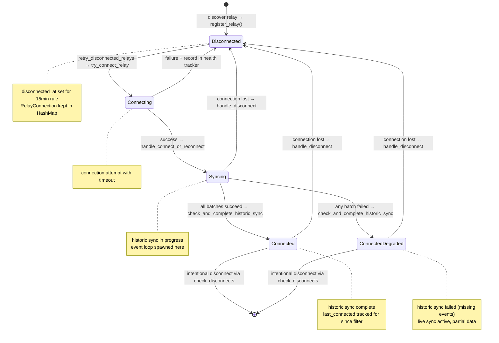

### Connection Flow Methods

| Method                              | Purpose                      | When Called                       | Actions                                                         |
| ----------------------------------- | ---------------------------- | --------------------------------- | --------------------------------------------------------------- |
| `register_relay()`                  | Initialize relay tracking    | Discovery via RepoSyncIndex       | Creates RelayConnection, stores in HashMap, returns immediately |
| `try_connect_relay()`               | Attempt connection           | Health tracker allows retry       | Calls connection.connect(), sends notification on success       |
| `handle_connect_or_reconnect()`     | Setup after connection       | ConnectNotification received      | Spawns event loop, sets Syncing, decides sync strategy          |
| `check_and_complete_historic_sync()` | Detect sync completion       | After each batch confirmation     | Transitions Syncing → Connected when no pending batches        |
| `handle_disconnect()`               | Cleanup after disconnect     | DisconnectNotification received   | Updates state, clears pending, KEEPS RelayConnection            |
| `retry_disconnected_relays()`       | Periodic reconnection        | Every 2s (health & metrics timer) | For each ready relay: try_connect_relay()                       |

### Historic Sync Completion

When a relay first connects, it enters the **Syncing** state and begins historic sync:

1. **Layer 1 (Announcements)**: Generic filter for all repository announcements
2. **Layer 2 (Repo Events)**: Filters for events tagging discovered repositories  
3. **Layer 3 (Root Events)**: Filters for events tagging discovered PRs/Issues/Patches

Each layer creates one or more `PendingBatch` entries tracked in `PendingSyncIndex`. As EOSE messages arrive:

- `handle_eose()` confirms each batch via `confirm_batch()`
- `confirm_batch()` moves items to confirmed state, tracks if batch failed, and calls `check_and_complete_historic_sync()`
- `check_and_complete_historic_sync()` uses a **double-check pattern** to avoid race conditions:
  1. First check: Are there pending batches? If yes, return early
  2. Wait 6 seconds (batch window + buffer) for self-subscriber to process in-flight events
  3. Second check: Are there still no pending batches? If yes, return early
  4. If no pending batches after wait:
     - If any batch failed: transition `Syncing` → `ConnectedDegraded`
     - If all batches succeeded: transition `Syncing` → `Connected`
     - Set `historic_sync_completed = true`

**Why the double-check?** There's an async gap between receiving EOSE and the self-subscriber processing events to create Layer 2/3 filters. The 6-second wait (5s batch window + 1s buffer) ensures we don't prematurely mark sync complete while Layer 2/3 batches are being created.

**Batch Failure Tracking**: When negentropy retry protection triggers (relay returns zero requested events on retry), the batch is marked as `failed = true`. This causes the relay to transition to `ConnectedDegraded` instead of `Connected`, signaling that live sync is active but historic sync is incomplete.

**Metrics tracking**: The `ngit_sync_relay_connected` metric shows:
- `0` = Disconnected
- `1` = Connecting
- `2` = Syncing (historic sync in progress)
- `3` = Connected (historic sync complete, live sync active)
- `4` = ConnectedDegraded (historic sync failed, live sync active, partial data)

This allows operators to monitor sync progress and distinguish between "connected but still catching up" vs "fully synced and live" vs "degraded (missing historic data)".

### Event Loop Lifecycle

**Critical**: Event loops die on disconnect and cannot be reused.

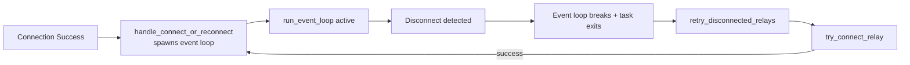

**Why respawn is required**:

- `run_event_loop()` breaks on RelayStatus::Disconnected
- The spawned task completely exits
- Cannot resume terminated task - must spawn fresh
- Happens for both initial connection AND every reconnect

---

## Background Tasks

The sync system uses three background tasks that run continuously:

### 1. Daily Timer (`run_daily_timer`)

**Purpose**: Periodic full reconciliation to detect state drift

**Interval**: Random 23-25 hours (prevents thundering herd)

**Actions**:

- Triggers `daily_sync()` for all connected relays
- Same as `fresh_start()` but without recording disconnect metrics
- Ensures consistency over time

### 2. Health and Metrics Checker (`run_health_and_metrics_checker`)

**Purpose**: Combined health management and metrics updates

**Interval**: 2 seconds

**Actions**:

1. **Disconnect checking**: Calls `check_disconnects()` to remove relays with no repos/events (except bootstrap)
2. **Retry disconnected**: Calls `retry_disconnected_relays()` to attempt reconnection per health tracker backoff
3. **Rate limit recovery**: Calls `check_rate_limit_recovery()` to clear expired rate limits
4. **Metrics update**: Updates Prometheus metrics with current health states

**Why combined**: The 2-second interval provides good responsiveness for health changes while minimizing overhead. All operations are lightweight (index checks, no I/O except actual connection attempts).

### 3. Self-Subscriber (`SelfSubscriber::run`)

**Purpose**: Monitor own relay for repository announcements and root events

**Subscribed kinds**: 30617, 1617, 1618, 1621 (NOT 30618)

**Batching**: 5-second window (configurable via `NGIT_SYNC_BATCH_WINDOW_MS`)

**Flow**:

1. Queue events to `PendingUpdates`
2. Timer fires (interval, does not reset on events)
3. Process batch: update RepoSyncIndex → derive targets → send AddFilters to SyncManager

---

## Core Architecture: Live vs Historic Sync

The sync system is built on two fundamental primitives that are clearly separated:

### Sync Primitives

| Primitive         | Purpose                 | Filter Modifier  | Tracking         |
| ----------------- | ----------------------- | ---------------- | ---------------- |
| `sync_live()`     | Ongoing event stream    | `limit: 0`       | Not tracked      |
| `historic_sync()` | Catch up on past events | Optional `since` | PendingSyncIndex |

### Layer Strategy

| Layer   | Content                                 | When Subscribed       | Managed By              |
| ------- | --------------------------------------- | --------------------- | ----------------------- |
| Layer 1 | 30617 Announcements, 30618 Maintainers  | On connect (any type) | Connection lifecycle    |
| Layer 2 | Events tagging our repos (a/A/q tags)   | Via AddFilters        | handle_new_sync_filters |
| Layer 3 | Events tagging root events (e/E/q tags) | Via AddFilters        | handle_new_sync_filters |

**Key insight**: Layer 1 is connection-level (handled at connect time), Layer 2+3 are item-level (flow through AddFilters → handle_new_sync_filters via two paths).

---

## Triggers and Flow

### Two Paths to AddFilters

The system has **two independent paths** that create and process AddFilters actions:

| Source                     | When                                | Flow                                                                             |
| -------------------------- | ----------------------------------- | -------------------------------------------------------------------------------- |
| Self-subscriber batch      | New events discovered on own relay  | Build AddFilters directly → send via channel → handle_new_sync_filters           |
| Connect/reconnect triggers | fresh_start, quick_reconnect, daily | recompute_new_sync_filters_for_relay → compute_actions → handle_new_sync_filters |

**Path 1: Self-Subscriber (direct AddFilters construction)**

The [`SelfSubscriber::process_batch()`](src/sync/self_subscriber.rs:448) method:

1. Updates `RepoSyncIndex` with discovered repos
2. Calls `derive_relay_targets()` to get per-relay targets
3. Builds `AddFilters` directly using `build_layer2_and_layer3_filters()`
4. Sends via `action_tx` channel to SyncManager
5. SyncManager receives via `action_rx` and calls `handle_new_sync_filters()`

**Path 2: Connect/Reconnect (via compute_actions)**

The `SyncManager::recompute_new_sync_filters_for_relay()` method:

1. Calls `derive_relay_targets()` from `RepoSyncIndex`
2. Calls `compute_actions(targets, pending, confirmed)` - three-way diff
3. Calls `handle_new_sync_filters()` for each resulting AddFilters action

### When Each Path is Used

| Trigger                     | Path Used                   | Why                                          |
| --------------------------- | --------------------------- | -------------------------------------------- |
| Self-subscriber batch fires | Direct (no compute_actions) | Building from scratch, no diff needed        |
| fresh_start()               | compute_actions             | Diff against pending/confirmed state         |
| quick_reconnect()           | compute_actions             | Check for NEW items discovered while offline |
| consolidate()               | compute_actions             | Check for new items during filter rebuild    |

### The Core Flow (Path 2: Connect/Reconnect)

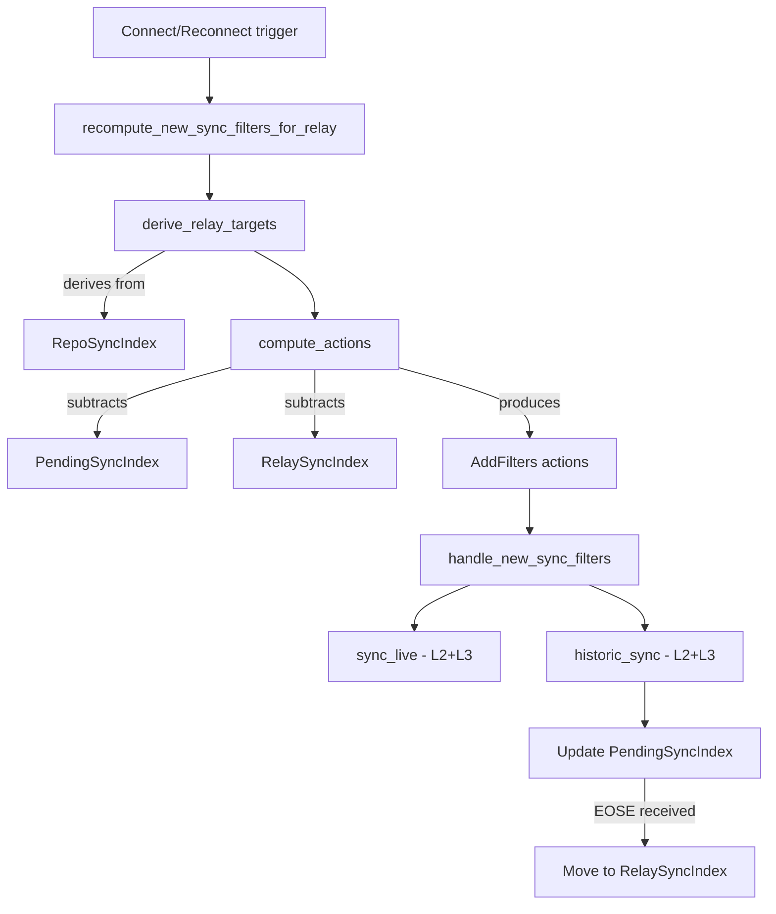

### The Self-Subscriber Flow (Path 1: Direct)

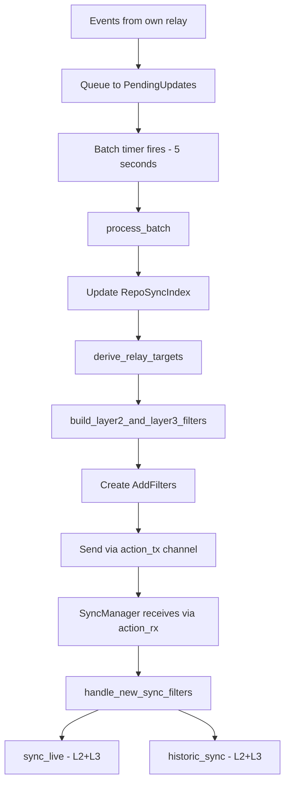

---

## Flow Scenarios

### Scenario 1: Fresh Start (Initial Connect / Long Reconnect / Daily Sync)

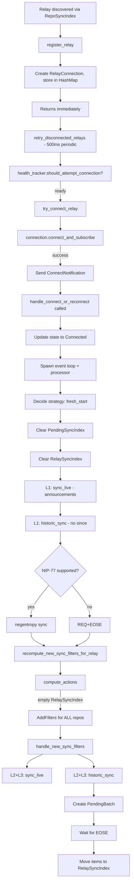

**Key points:**

- Always clear PendingSyncIndex first, then RelaySyncIndex
- L1 live + L1 historic (uses negentropy if available)
- Empty RelaySyncIndex means diff produces AddFilters for everything
- L2+L3 flow through `recompute_new_sync_filters_for_relay` → `handle_new_sync_filters` with proper pending tracking

### Scenario 2: Quick Reconnect (< 15 minutes)

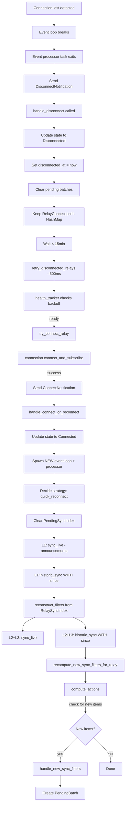

**Key points:**

- Clear PendingSyncIndex first (old subscriptions are dead)
- L1 live (always on any connection)
- L1 historic WITH since (catches up missed announcements)
- L2+L3 rebuilt from RelaySyncIndex (confirmed state preserved)
- `recompute_new_sync_filters_for_relay` → `compute_actions` checks for any NEW items discovered during catchup

### Scenario 3: Long Reconnect (> 15 minutes)

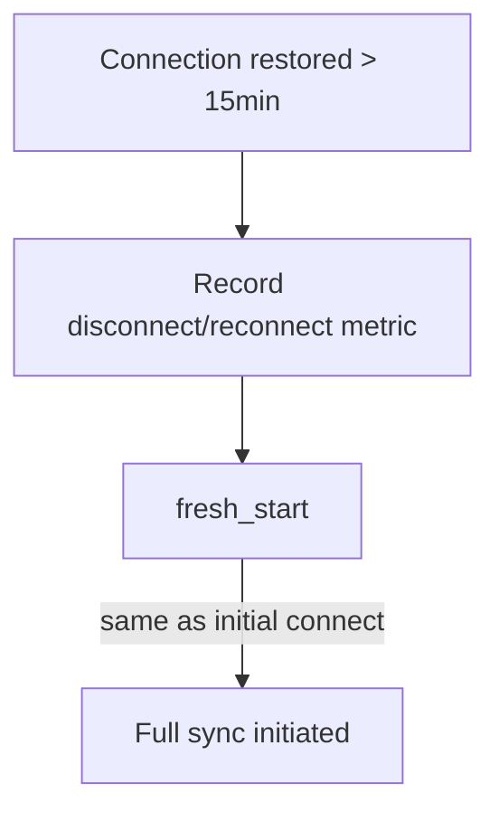

**Key points:**

- Records disconnect/reconnect as a metric
- Delegates to fresh_start() - same as initial connect
- State too stale to trust, start fresh

### Scenario 4: Consolidation (Filter Count > Threshold)

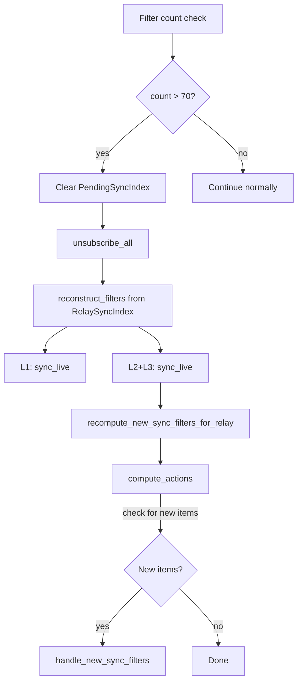

**Key points:**

- Clear PendingSyncIndex first
- NO historic sync needed - items already synced/syncing
- Only rebuilds live subscriptions from confirmed state
- `recompute_new_sync_filters_for_relay` → `compute_actions` catches any new items that need syncing

### Scenario 5: Daily Sync (23-25h Random Timer)

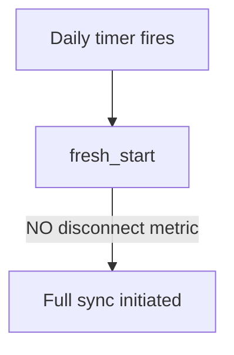

**Key points:**

- Same as fresh_start() but WITHOUT recording disconnect/reconnect metric
- Ensures consistency, detects any drift accumulated over 24 hours

### Scenario 6: Self-Subscriber Batch

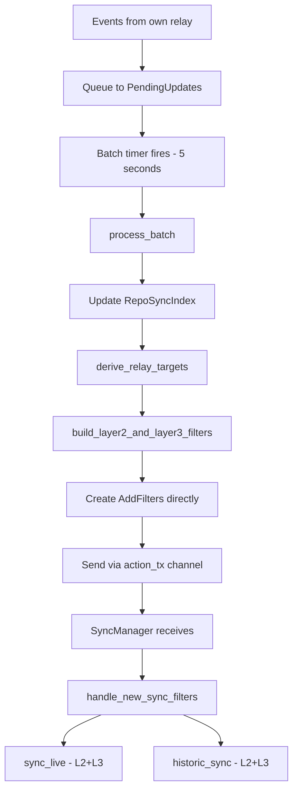

**Key points:**

- Self-subscriber monitors own relay for 30617, 1617, 1618, 1621 (NOT 1619 or 30618)
- Batches events in `PendingUpdates` (5 second window via interval timer)
- `process_batch()` updates RepoSyncIndex, then builds AddFilters **directly** (no compute_actions)
- AddFilters sent via channel to SyncManager, which calls `handle_new_sync_filters()`
- This path does NOT use compute_actions because it's building fresh filters from the updated index

---

## Core Algorithms

### derive_relay_targets

Transforms the repo-centric `RepoSyncIndex` into a relay-centric view. For each relay URL mentioned in any repo's announcements, collects all the repos and root events that should be synced from that relay.

```rust
// Conceptual: inverts repo → relays to relay → repos
fn derive_relay_targets(repo_index: &HashMap<String, RepoSyncNeeds>)
    -> HashMap<String, RelaySyncNeeds>
```

### compute_actions (Three-Way Diff)

**This is the ONLY decision point for what NEW subscriptions to create.**

Performs a three-way diff: `target - pending - confirmed = new`

- **targets**: What we want (from derive_relay_targets)
- **pending**: What's already in-flight awaiting EOSE
- **confirmed**: What's already confirmed syncing

Only creates `AddFilters` actions for items not already pending or confirmed. Skips disconnected relays (they will get AddFilters on reconnect).

```rust
fn compute_actions(
    targets: &HashMap<String, RelaySyncNeeds>,
    pending: &PendingSyncIndex,
    confirmed: &RelaySyncIndex,
) -> Vec<AddFilters>
```

---

## Key Implementation Methods

### Connection Lifecycle

- **`register_relay()`**: Creates RelayConnection object, stores in HashMap, returns immediately
- **`try_connect_relay()`**: Attempts connection using `connection.connect()` with timeout
- **`handle_connect_or_reconnect()`**: Spawns event loop, updates state, decides sync strategy (fresh_start/quick_reconnect)
- **`handle_disconnect()`**: Updates state to Disconnected, clears pending batches, keeps RelayConnection object
- **`retry_disconnected_relays()`**: Called every 2s, retries relays that pass health tracker checks

### Sync Entry Points

- **`fresh_start()`**: Full sync - clears all state, L1 historic (with negentropy if available), then L2+L3 via recompute
- **`quick_reconnect()`**: Incremental sync - preserves confirmed state, L1 historic with `since`, L2+L3 rebuild with `since`, then recompute for new items
- **`daily_sync()`**: Wrapper around `fresh_start()` without disconnect metrics
- **`consolidate()`**: Reduces filter count - clears pending, unsubscribes all, rebuilds live subscriptions only, then recompute for new items

### Sync Primitives

- **`sync_live()`**: Creates subscriptions with `limit: 0` for ongoing event stream (not tracked in PendingSyncIndex)
- **`historic_sync()`**: Dispatches to negentropy or REQ+EOSE based on relay capability, creates PendingBatch, returns batch_id

### Filter Processing

- **`handle_new_sync_filters()`**: Single entry point for AddFilters from both paths (self-subscriber OR recompute), orchestrates live+historic sync
- **`recompute_new_sync_filters_for_relay()`**: Calls derive_relay_targets → compute_actions → handle_new_sync_filters for each resulting action

---

## Method Relationships Summary

## Filter Building (Three-Layer Strategy)

### Layer 1: Announcements

- **Kinds**: 30617 (Repository Announcements), 30618 (Maintainer Lists)
- **When subscribed**: On connect (any type) - handled by connection lifecycle
- **Function**: `build_announcement_filter(since: Option<Timestamp>)`
- 30618 is ONLY synced from remote relays, not self-subscribed

### Layer 2: Events Tagging Our Repos

- **Tags**: lowercase `a`, uppercase `A`, and `q` tags for comprehensive coverage
- **Batching**: Per 100 repo refs
- **Function**: `build_repo_tag_filters(repos, since)`

### Layer 3: Events Tagging Our Root Events

- **Tags**: lowercase `e`, uppercase `E`, and `q` tags for comprehensive coverage
- **Batching**: Per 100 event IDs
- **Function**: `build_root_event_tag_filters(root_events, since)`

### Combined Layer 2+3

The `build_layer2_and_layer3_filters()` function combines both layers. Used by:

- `recompute_new_sync_filters_for_relay` for new item subscriptions
- `reconstruct_filters` for rebuilding from confirmed state

---

## NIP-77 Negentropy Sync

### What is Negentropy?

NIP-77 defines the negentropy protocol for efficient event set comparison. Instead of requesting all events matching a filter (REQ+EOSE), negentropy allows relays to compare fingerprints of their event sets and only transfer the differences.

### When Negentropy is Used

Negentropy sync is attempted for:

- **fresh_start()** - Full sync without `since`
- **daily_sync()** - Periodic full refresh (via fresh_start)

Negentropy is NOT used for:

- **quick_reconnect()** - Uses REQ with `since` (more efficient for small gaps)
- **Live subscriptions** - Always use REQ with `limit: 0`

### Fallback Behavior

If negentropy fails (relay doesn't support NIP-77, network error, etc.):

1. A warning is logged (once per relay to avoid spam)
2. The sync falls back to traditional REQ+EOSE
3. No error is raised - fallback is automatic

---

## REQ+EOSE Pagination

When a relay doesn't support NIP-77 Negentropy, historic sync uses traditional REQ+EOSE with automatic pagination to handle large result sets efficiently.

### How Pagination Works

1. **Initial Request**: Send REQ with filters (may include `since` parameter)
2. **Track Events**: As events arrive, [`PaginationState`](src/sync/mod.rs:165) tracks:
   - `event_count`: Number of events received
   - `min_created_at`: Smallest timestamp seen (oldest event)
   - `original_filter`: Base filter for reconstruction
3. **EOSE Detection**: When EOSE arrives, check if pagination is needed
4. **Next Page**: If enough events were received (suggesting more exist):
   - Create new filter with `until: min_created_at`
   - Issue another REQ for events older than the oldest seen
   - Reuse same subscription ID
5. **Completion**: Repeat until EOSE arrives with fewer events, indicating end of results

### Pagination State Lifecycle

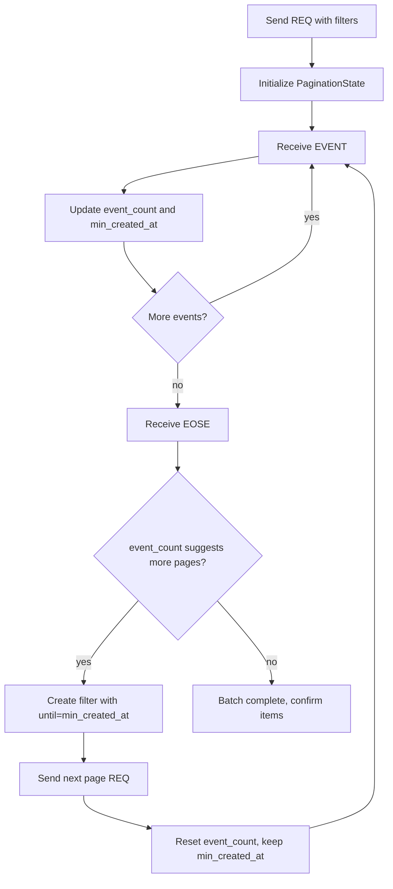

### Pagination vs Negentropy

| Aspect              | Negentropy Sync              | REQ+EOSE Pagination                                       |
| ------------------- | ---------------------------- | --------------------------------------------------------- |
| **Efficiency**      | High (set reconciliation)    | Lower (sequential pages)                                  |
| **Bandwidth**       | Minimal (only missing items) | Higher (all matching events transferred)                  |
| **Relay support**   | Requires NIP-77              | Universal (standard Nostr)                                |
| **State tracking**  | None needed                  | [`PaginationState`](src/sync/mod.rs:165) per subscription |
| **Completion time** | Typically faster             | Slower for large sets                                     |
| **Use cases**       | Full sync, large event sets  | Fallback, small gaps with `since`                         |

---

## State Flow Summary

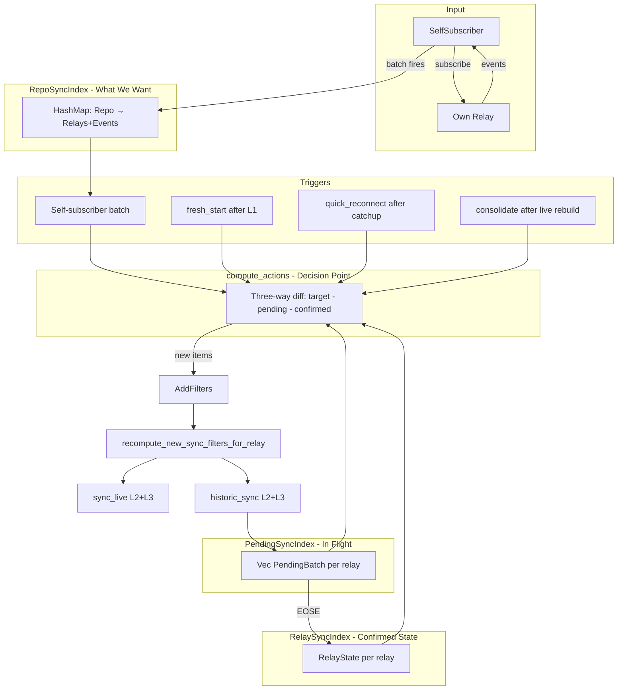

---

## Module Structure

```
src/sync/
├── mod.rs              # SyncManager, main loop, data structures
├── algorithms.rs       # derive_relay_targets(), compute_actions()
├── filters.rs          # build_announcement_filter(), build_layer2_and_layer3_filters()
├── health.rs           # RelayHealthTracker with exponential backoff
├── relay_connection.rs # RelayConnection, RelayEvent handling
├── self_subscriber.rs  # SelfSubscriber with batching
└── metrics.rs          # SyncMetrics for Prometheus
```

---

## Health Tracking

The [`RelayHealthTracker`](src/sync/health.rs:209) manages connection health with exponential backoff and state transitions:

### Health States

1. **Healthy**: Working connection, no recent failures, proven stable (past 5-minute stability period)
2. **Disconnected**: Not currently connected, but no recent failures or issues
3. **Degraded**: Connection problems (actively failing to connect) OR recently recovered but not yet stable
4. **Dead**: 24+ hours of continuous failures, minimal retry (once per 24 hours)
5. **RateLimited**: Rate limited by relay, 65-second cooldown active

### State Transitions

```
Healthy <-> Disconnected: Normal connection/disconnection
Disconnected -> Degraded: Connection failure
Degraded -> Dead: 24h+ of continuous failures
Degraded -> Disconnected: Recovery (enters 5min stability period)
Disconnected -> Healthy: Stable for 5 minutes after recovery
Any -> RateLimited: NOTICE message from relay indicating rate limiting
RateLimited -> previous state: After 65-second cooldown expires
```

### Backoff Configuration

- **Formula**: `base_backoff * 2^(failures-1)`, capped at `max_backoff`
- **Default base**: 5 seconds (configurable via `sync_base_backoff_secs`)
- **Default max**: 1 hour (configurable via `sync_max_backoff_secs`)
- **Dead threshold**: 24 hours of continuous failures
- **Dead retry interval**: Once per 24 hours
- **Rate limit cooldown**: Fixed 65 seconds (60s typical limit + 5s buffer)
- **Stability period**: 5 minutes after recovery before marking as Healthy

### Special Behaviors

- **Bootstrap relays**: Never disconnected by cleanup system, even if empty
- **Rate limiting**: Distinct from connection failures - triggered by relay NOTICE messages
- **Connection timeout**: Set to `base_backoff_secs` to ensure retry timing works correctly

---

## Prometheus Metrics

The [`SyncMetrics`](src/sync/metrics.rs:18) module provides comprehensive monitoring via Prometheus:

### Connection Metrics

- `ngit_sync_relay_connected`: Per-relay connection status (1=connected, 0=disconnected)
- `ngit_sync_connection_attempts_total`: Total connection attempts by relay and result (success/failure)

### Health Metrics

- `ngit_sync_relay_status`: Per-relay health status (1=healthy, 2=disconnected, 3=degraded, 4=dead, 5=rate_limited)
- `ngit_sync_relay_failures`: Consecutive failure count per relay

### Event Metrics

- `ngit_sync_events_synced_total`: Total events synced (newly saved events only, not duplicates or rejected)

### Summary Metrics

- `ngit_sync_relays_tracked_total`: Total number of relays discovered and tracked
- `ngit_sync_relays_connected_total`: Number of currently connected relays
- `ngit_sync_relays_dead_total`: Number of relays marked as dead

All metrics follow the `ngit_sync_` prefix convention and are updated by the health and metrics checker every 2 seconds.

---
