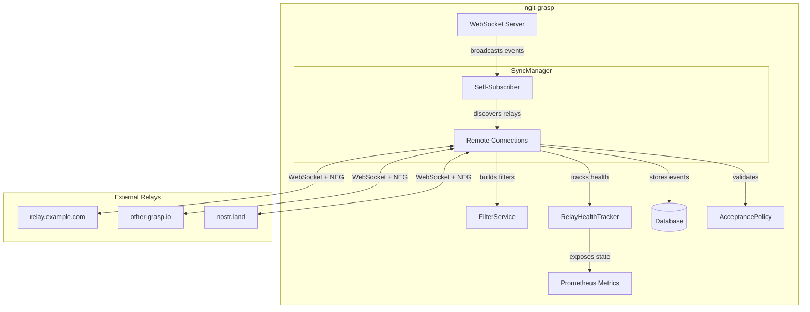
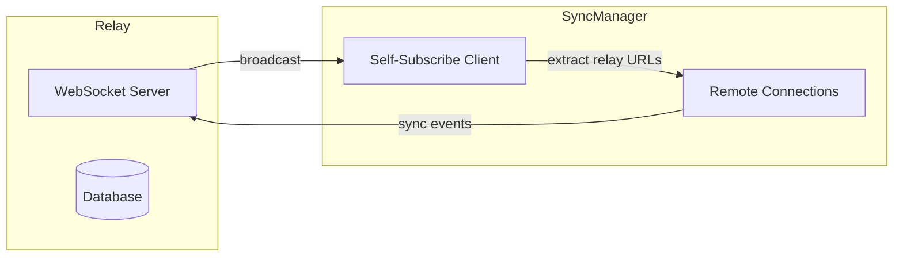
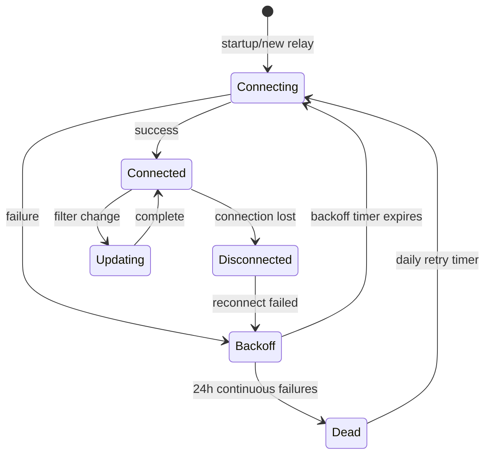
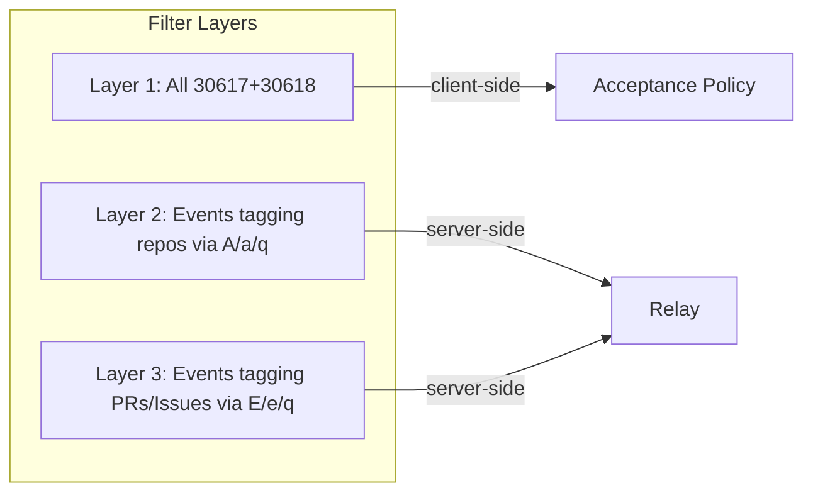
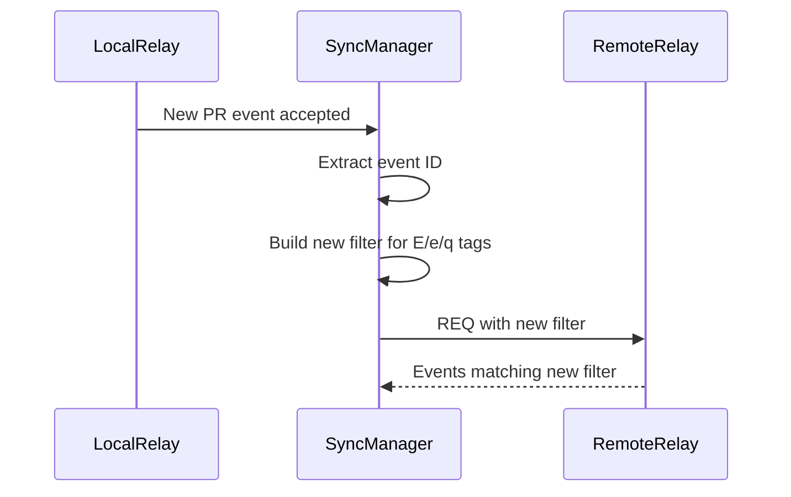
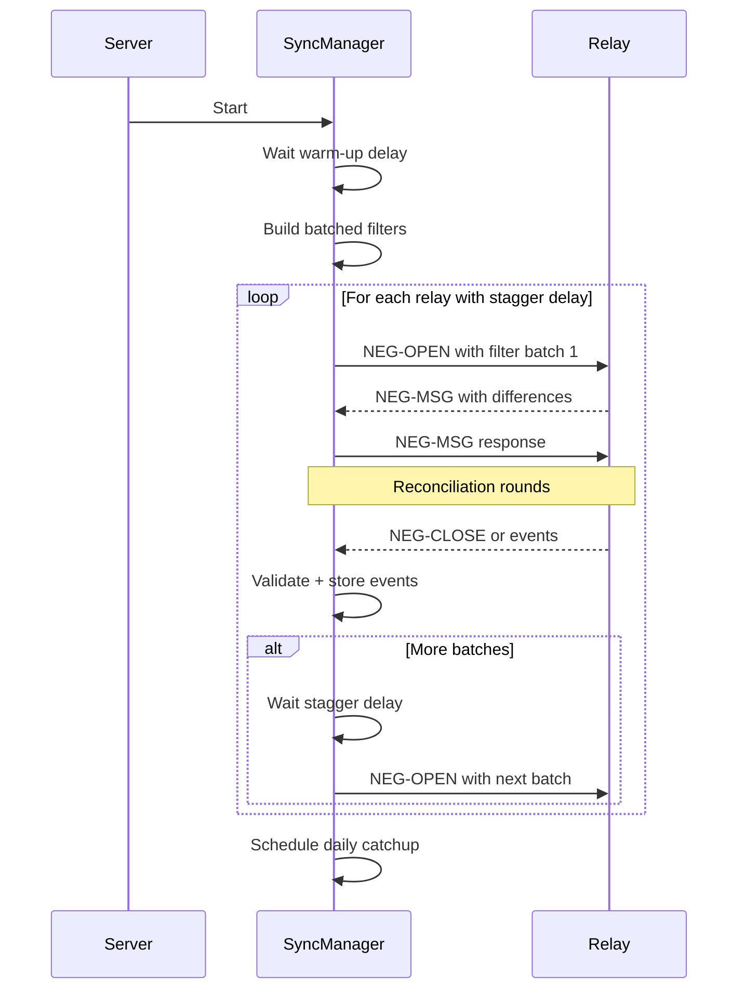

# GRASP-02: Proactive Sync - Design Document

## Overview

GRASP-02 Proactive Sync enables ngit-grasp to maintain live WebSocket connections to other relays listed in repository announcement events, synchronizing NIP-34 related events using both **live sync** (real-time subscriptions) and **negentropy catchup** (NIP-77 set reconciliation).

This document covers **event syncing only**. Git data syncing is out of scope for this phase.

## Goals

1. **Data Availability**: Ensure we have all relevant events for repositories we host
2. **Resilience**: Handle relay failures gracefully with backoff and health tracking
3. **Efficiency**: Minimize connections and bandwidth through filter consolidation
4. **Consistency**: Use unified filters for both live sync and negentropy catchup

## Architecture Overview



**Key Insight: Self-Subscribe Architecture**

The SyncManager uses a "self-subscribe" pattern for relay discovery. Rather than polling the database periodically, it connects to its own WebSocket server as a client and subscribes to kind 30617 events. When new announcements are saved (from any source), the self-subscriber receives them instantly and can spawn connections to newly discovered relays.

## Connection Management

### Relay Discovery

Relays to connect to are discovered using a **self-subscribe architecture** rather than periodic polling. The SyncManager connects to its own relay as a client and subscribes to kind 30617 (repository announcement) events. When a new announcement is saved to the database (from direct submission or sync), the self-subscriber receives it immediately and discovers new relays to connect to.



**Why Self-Subscribe vs Polling?**

| Approach | Latency | Complexity | Resource Use |
|----------|---------|------------|--------------|
| Self-Subscribe | Instant | Low | Minimal (1 WS connection) |
| Periodic Polling | 30s+ delay | Higher | DB queries every N seconds |

The self-subscribe approach provides:
- **Immediate discovery**: New relays discovered instantly when announcement saved
- **No polling overhead**: No periodic database queries
- **Simple architecture**: Reuses existing WebSocket infrastructure

**Implementation Pattern:**

```rust
// In SyncManager::run()
let self_client = Client::default();
self_client.add_relay(&own_relay_url).await?;
self_client.connect().await;

let filter = Filter::new().kind(Kind::Custom(30617));
self_client.subscribe(filter, None).await?;

// Handle notifications - when announcement arrives, extract relay URLs
client.handle_notifications(|notification| async {
    if let RelayPoolNotification::Event { event, .. } = notification {
        let new_urls = filter_service.extract_relay_urls_from_event(&event);
        for url in new_urls {
            if !active_relays.contains(&url) && !is_own_relay(&url) {
                spawn_connection(url, tx.clone(), filter_service.clone());
            }
        }
    }
    Ok(false) // Continue processing
});
```

**Startup Discovery:** At startup, existing announcements in the database are queried once to discover initial relays. After startup, all discovery is event-driven via self-subscribe.

**Reconnection:** The self-subscriber has built-in exponential backoff reconnection (1s → 60s max) to handle temporary disconnections from our own relay.

### Connection Lifecycle



### Health Tracking & Backoff

| State       | Behavior                                            |
| ----------- | --------------------------------------------------- |
| **Healthy** | Normal operation, immediate reconnect on disconnect |
| **Backoff** | Exponential backoff: 5s → 10s → 20s → ... → 1h max  |
| **Dead**    | 24h of continuous failures, retry once per day      |

Health state is **kept in-memory** using a `DashMap` for lock-free concurrent access:

```rust
/// In-memory relay health tracking (NOT persisted to database)
///
/// Design rationale: For <100 relays, persistence adds complexity without
/// significant benefit. Conservative initial backoff on restart avoids
/// thundering herd issues.
struct RelayHealthTracker {
    health: DashMap<RelayUrl, RelayHealth>,
    metrics: SyncMetrics,  // Prometheus metrics for operator visibility
}

struct RelayHealth {
    url: RelayUrl,
    status: RelayStatus,           // Healthy, Backoff, Dead
    consecutive_failures: u32,
    last_failure_at: Option<Instant>,
    last_success_at: Option<Instant>,
    next_retry_at: Instant,
}

enum RelayStatus {
    Healthy,
    Backoff { attempt: u32 },      // backoff = min(5 * 2^attempt, 3600) seconds
    Dead,                           // retry in 24h
}
```

### Restart Behavior (Graceful Degradation)

On restart, all relay health state is reset. To avoid thundering herd:

1. **Conservative initial backoff**: Start with 5s delay (not immediate) for all relays
2. **Staggered connection attempts**: Add random jitter (0-2s) per relay
3. **Health rebuilds organically**: Relays prove themselves healthy through successful connections

```rust
impl RelayHealthTracker {
    fn new(metrics: SyncMetrics) -> Self {
        Self {
            health: DashMap::new(),
            metrics,
        }
    }

    /// Called on startup for each discovered relay
    fn initialize_relay(&self, url: RelayUrl) {
        self.health.insert(url.clone(), RelayHealth {
            url,
            status: RelayStatus::Backoff { attempt: 0 }, // Start conservative
            consecutive_failures: 0,
            last_failure_at: None,
            last_success_at: None,
            next_retry_at: Instant::now() + Self::initial_backoff_with_jitter(),
        });
    }

    fn initial_backoff_with_jitter() -> Duration {
        Duration::from_secs(5) + Duration::from_millis(rand::random::<u64>() % 2000)
    }
}
```

**Trade-off**: We lose knowledge of chronically failing relays across restarts. This is acceptable because:

- Scale is small (<100 relays)
- Conservative initial backoff prevents hammering bad relays
- Prometheus metrics preserve historical health data for operators

## Filter Strategy

### Unified Filters for Live Sync and Negentropy

The same filter logic is used for both live subscriptions and negentropy reconciliation:



### Layer 1: Repository Announcements & States

Get ALL kind 30617 and 30618 events with unified `since` timestamp, then filter client-side through acceptance policy:

```rust
// Use same since filter as other layers for consistency
let layer1_filter = Filter::new()
    .kinds([Kind::from(30617), Kind::from(30618)])
    .since(since_timestamp);  // Unified with Layer 2/3
```

**Client-side validation**: Only store events that pass our [`Nip34WritePolicy`](src/nostr/builder.rs:51).

### Layer 2: Events Tagging Repositories

For repo announcements **that list BOTH this relay AND our service**:

```rust
// Build addressable references: 30617:<pubkey>:<identifier>
let repo_refs: Vec<String> = announcements
    .iter()
    .filter(|a| a.relays.contains(&this_relay) && a.lists_service(&our_domain))
    .map(|a| format!("30617:{}:{}", a.pubkey.to_hex(), a.identifier))
    .collect();

let layer2_filter = Filter::new()
    .custom_tag(SingleLetterTag::lowercase(Alphabet::A), repo_refs.clone())
    .or(Filter::new().custom_tag(SingleLetterTag::lowercase(Alphabet::Q), repo_refs));
```

### Layer 3: Events Tagging Issues/PRs/Patches

For events that reference PRs, Patches, or Issues from repos we track:

```rust
// Collect event IDs of PRs, Patches, Issues we've stored
let tagged_event_ids: Vec<EventId> = database
    .query(Filter::new().kinds([1618, 1619, 1621, 1622, 1630]))  // PR, PR Update, Issue, Patch, etc.
    .iter()
    .filter(|e| references_tracked_repo(e, &announcements))
    .map(|e| e.id)
    .collect();

let layer3_filter = Filter::new()
    .custom_tag(SingleLetterTag::lowercase(Alphabet::E), tagged_event_ids.clone())
    .or(Filter::new().custom_tag(SingleLetterTag::lowercase(Alphabet::Q), tagged_event_ids));
```

### Filter Size Management

When the tag list exceeds a threshold, split into batches:

```rust
const MAX_TAGS_PER_FILTER: usize = 100;

fn build_filters(tag_values: Vec<String>) -> Vec<Filter> {
    tag_values
        .chunks(MAX_TAGS_PER_FILTER)
        .map(|chunk| Filter::new().custom_tag(tag, chunk.to_vec()))
        .collect()
}
```

**Consolidation**: When total filter count exceeds ~150 across a connection, consolidate by rebuilding from scratch.

### Filter Generation vs. Policy Validation

The filter strategy and acceptance policies serve **different purposes** even though they share conceptual knowledge:

| Concern | Filters | Policies |
|---------|---------|----------|
| **Direction** | What to request FROM remote relays | What to accept INTO local database |
| **Input** | Stored events (announcements, PRs, etc.) | Single incoming event |
| **Output** | Filter specification | Accept/Reject decision |

The modular sub-policies ([`AnnouncementPolicy`](../../src/nostr/policy/announcement.rs:24), [`RelatedEventPolicy`](../../src/nostr/policy/related.rs:25), etc.) encode knowledge about event kinds and tag types, but this knowledge is applied differently:

- **In filters**: We enumerate **all** addressable refs (`30617:pubkey:id`) from stored announcements
- **In policies**: [`RelatedEventPolicy::check_references()`](../../src/nostr/policy/related.rs:39) checks if incoming event references **any** accepted event

Because of this fundamental difference, filter generation logic stays in `src/sync/filter.rs` rather than being delegated to policy modules. Both share the understanding of NIP-34 event relationships, but they answer different questions.

## Subscription Updates

### Dynamic Subscription Management

When new events arrive that affect our filter criteria:



**Events that trigger subscription updates**:

- New repository announcement accepted (adds to Layer 2)
- New PR/Issue/Patch accepted (adds to Layer 3)

### When to Consolidate

Track subscription count per connection:

```rust
struct ConnectionState {
    relay_url: RelayUrl,
    subscriptions: Vec<SubscriptionId>,
    total_filter_count: usize,
}

impl ConnectionState {
    fn should_consolidate(&self) -> bool {
        self.total_filter_count > 150
    }

    async fn consolidate(&mut self) {
        // Close all subscriptions
        // Rebuild from scratch with current database state
    }
}
```

## Negentropy Catchup

### NIP-77 Reconciliation Protocol

Negentropy enables efficient set reconciliation - discovering which events we're missing without transferring full event lists.

### Timing

| Trigger             | Behavior                                                             |
| ------------------- | -------------------------------------------------------------------- |
| **Initial startup** | Warm-up delay, staggered if many filters, initializes daily schedule |
| **After reconnect** | Delay to avoid rate limiting, limited to events from last 3 days     |
| **Daily**           | Staggered batches, max 100 tagged events per filter                  |

### Startup Flow



### Reconnection Catchup

After connection reestablished:

```rust
async fn catchup_after_reconnect(&self, relay: &RelayUrl) {
    // Delay to avoid immediate disconnect for too many requests
    tokio::time::sleep(RECONNECT_CATCHUP_DELAY).await;

    // Only catch up on recent events (last 3 days)
    let since = Timestamp::now() - Duration::from_secs(3 * 24 * 60 * 60);

    let filters = self.build_filters_for_relay(relay)
        .into_iter()
        .map(|f| f.since(since))
        .collect();

    self.run_negentropy(relay, filters).await;
}
```

### Daily Catchup Schedule

```rust
// Daily catchup runs at consistent time, staggered across relays
async fn schedule_daily_catchup(&self) {
    let mut interval = tokio::time::interval(Duration::from_secs(24 * 60 * 60));

    loop {
        interval.tick().await;

        for (i, relay) in self.healthy_relays().enumerate() {
            // Stagger: 5 minute delay between relays
            tokio::time::sleep(Duration::from_secs(i as u64 * 300)).await;

            // Batch filters to max 100 tagged events each
            let batches = self.build_batched_filters(&relay, 100);

            for batch in batches {
                self.run_negentropy(&relay, batch).await;
                tokio::time::sleep(Duration::from_secs(60)).await; // 1 min between batches
            }
        }
    }
}
```

## Event Processing

### Acceptance Policy

All synced events go through our acceptance policy, reusing the same [`Nip34WritePolicy`](../../src/nostr/builder.rs:36) validation logic used for direct client submissions.

#### Design: Reusing admit_event()

The [`WritePolicy::admit_event()`](../../src/nostr/builder.rs:256-269) trait method takes a `SocketAddr` parameter designed for client connections:

```rust
// From nostr-relay-builder WritePolicy trait
fn admit_event<'a>(
    &'a self,
    event: &'a Event,
    _addr: &'a SocketAddr,  // Unused in our implementation
) -> BoxedFuture<'a, PolicyResult>;
```

For synced events from remote relays, we pass a **synthetic localhost address** since:
1. The `_addr` parameter is currently unused in our [`Nip34WritePolicy`](../../src/nostr/builder.rs:259)
2. All meaningful validation is done by the modular sub-policies (see below)
3. This allows reusing 100% of the existing validation logic

```rust
use std::net::{IpAddr, Ipv4Addr, SocketAddr};

/// Synthetic address for synced events (not from a direct client connection)
const SYNC_SOURCE_ADDR: SocketAddr = SocketAddr::new(
    IpAddr::V4(Ipv4Addr::new(127, 0, 0, 1)),
    0
);

async fn process_synced_event(&self, event: Event, source_relay: &RelayUrl) -> Result<()> {
    // Apply our Nip34WritePolicy using synthetic address
    // The SocketAddr is unused - all validation is by the modular sub-policies
    let result = self.acceptance_policy
        .admit_event(&event, &SYNC_SOURCE_ADDR)
        .await;

    match result {
        PolicyResult::Accept => {
            self.database.save_event(&event).await?;
            tracing::debug!(
                "Accepted synced event {} from {}",
                event.id.to_hex(),
                source_relay
            );
            self.trigger_subscription_updates(&event).await;
        }
        PolicyResult::Reject(reason) => {
            tracing::debug!(
                "Rejected synced event {} from {}: {}",
                event.id.to_hex(),
                source_relay,
                reason
            );
        }
    }

    Ok(())
}
```

#### Modular Sub-Policies

The [`Nip34WritePolicy`](../../src/nostr/builder.rs:36-42) delegates to specialized sub-policies in [`src/nostr/policy/`](../../src/nostr/policy/mod.rs:1-41):

| Sub-Policy | Kinds | Responsibility |
|------------|-------|----------------|
| [`AnnouncementPolicy`](../../src/nostr/policy/announcement.rs:24-27) | 30617 | Validates service listing, maintainer exception, creates bare repos |
| [`StatePolicy`](../../src/nostr/policy/state.rs:43-46) | 30618 | Validates state structure, aligns git refs with authorized state |
| [`PrEventPolicy`](../../src/nostr/policy/pr_event.rs) | 1618, 1619 | Validates PR/PR Update events, manages refs/nostr/* |
| [`RelatedEventPolicy`](../../src/nostr/policy/related.rs:25-29) | All others | Checks forward/backward references to accepted repos/events |

All sub-policies share a common [`PolicyContext`](../../src/nostr/policy/mod.rs:22-27) containing:
- `domain`: Our service domain for validation
- `database`: For querying existing events
- `git_data_path`: For git operations

#### Why Not Call Sub-Policies Directly?

While we could bypass `admit_event()` and call sub-policies directly:

```rust
// Alternative: Direct sub-policy calls (NOT recommended)
match event.kind.as_u16() {
    30617 => self.announcement_policy.validate(&event).await,
    30618 => self.state_policy.validate(&event),
    1618 | 1619 => self.pr_event_policy.validate_nostr_ref(&event).await,
    _ => self.related_event_policy.check_references(&event).await,
}
```

This is **not recommended** because:
1. Duplicates the kind-routing logic from [`admit_event()`](../../src/nostr/builder.rs:261-268)
2. Misses important post-validation steps (e.g., `handle_announcement()` also calls `ensure_bare_repository()`)
3. Creates maintenance burden when policy logic changes

## Module Structure

### New `src/sync/` Module

```
src/
├── sync/
│   ├── mod.rs              # Module exports
│   ├── manager.rs          # SyncManager - main coordinator
│   ├── connection.rs       # Per-relay connection handling
│   ├── filter.rs           # Filter building and batching
│   ├── health.rs           # RelayHealth tracking
│   ├── negentropy.rs       # NIP-77 reconciliation logic
│   └── subscription.rs     # Dynamic subscription management
├── nostr/
│   └── ... (existing)
└── ...
```

### Integration with Main Binary

```rust
// In main.rs
async fn main() -> Result<()> {
    // ... existing setup ...

    // Start sync manager as background task
    let sync_manager = SyncManager::new(
        database.clone(),
        config.domain.clone(),
    );

    tokio::spawn(async move {
        sync_manager.run().await
    });

    // ... rest of server startup ...
}
```

## Metrics & Observability

All sync metrics are exposed via Prometheus at `/metrics`. For <100 relays, per-relay labels are acceptable cardinality.

### Prometheus Metrics

```rust
/// Sync module metrics registered with the global Prometheus registry
pub struct SyncMetrics {
    // === Connection Metrics (per relay) ===
    /// Active outbound connections: ngit_sync_relay_connected{relay="wss://..."}
    relay_connected: IntGaugeVec,           // labels: [relay]

    /// Connection attempts: ngit_sync_connection_attempts_total{relay="wss://...", result="success|failure"}
    connection_attempts: CounterVec,        // labels: [relay, result]

    // === Relay Health Status ===
    /// Current status: ngit_sync_relay_status{relay="wss://...", status="healthy|backoff|dead"}
    relay_status: IntGaugeVec,              // labels: [relay, status]

    /// Consecutive failures: ngit_sync_relay_failures{relay="wss://..."}
    relay_failures: IntGaugeVec,            // labels: [relay]

    // === Event Source Tracking ===
    /// Events received by source: ngit_sync_events_total{source="direct|live_sync|catchup|daily_catchup"}
    events_total: CounterVec,               // labels: [source]

    /// Sync gap events (should have been live synced): ngit_sync_gap_events_total{relay="wss://..."}
    sync_gap_events: CounterVec,            // labels: [relay]

    // === Aggregate Metrics ===
    /// Total relays being tracked
    relays_tracked_total: IntGauge,

    /// Relays currently connected
    relays_connected_total: IntGauge,

    /// Relays in dead state
    relays_dead_total: IntGauge,
}
```

### Metric Definitions

| Metric                                | Type    | Labels        | Description                                            |
| ------------------------------------- | ------- | ------------- | ------------------------------------------------------ |
| `ngit_sync_relay_connected`           | Gauge   | relay         | 1 if connected, 0 if not                               |
| `ngit_sync_connection_attempts_total` | Counter | relay, result | Connection attempt outcomes                            |
| `ngit_sync_relay_status`              | Gauge   | relay, status | 1 for current status, 0 otherwise                      |
| `ngit_sync_relay_failures`            | Gauge   | relay         | Current consecutive failure count                      |
| `ngit_sync_events_total`              | Counter | source        | Events received by source type                         |
| `ngit_sync_gap_events_total`          | Counter | relay         | Events found during catchup that should have been live |
| `ngit_sync_relays_tracked_total`      | Gauge   | -             | Total relays discovered from announcements             |
| `ngit_sync_relays_connected_total`    | Gauge   | -             | Currently connected relay count                        |
| `ngit_sync_relays_dead_total`         | Gauge   | -             | Relays marked as dead                                  |

**Key insight**: Events discovered during catchup or daily reconciliation represent **live sync failures** - we should have received them in real-time. The `ngit_sync_gap_events_total` metric tracks this per relay.

### Observability Integration

```rust
impl SyncManager {
    fn record_event_received(&self, event: &Event, source: EventSource) {
        match source {
            EventSource::DirectSubmission => {
                self.metrics.events_total.with_label_values(&["direct"]).inc();
            }
            EventSource::LiveSync(relay) => {
                self.metrics.events_total.with_label_values(&["live_sync"]).inc();
            }
            EventSource::Catchup(relay) => {
                // This is a sync gap - we should have gotten it via live sync
                self.metrics.events_total.with_label_values(&["catchup"]).inc();
                self.metrics.sync_gap_events.with_label_values(&[relay.as_str()]).inc();
                tracing::warn!(
                    relay = %relay,
                    event_id = %event.id.to_hex(),
                    "Sync gap detected: event found during catchup"
                );
            }
            EventSource::DailyCatchup(relay) => {
                // Sustained sync gap - missed by both live sync and initial catchup
                self.metrics.events_total.with_label_values(&["daily_catchup"]).inc();
                self.metrics.sync_gap_events.with_label_values(&[relay.as_str()]).inc();
                tracing::error!(
                    relay = %relay,
                    event_id = %event.id.to_hex(),
                    "Sustained sync gap: event found during daily catchup"
                );
            }
        }
    }

    fn record_connection_attempt(&self, relay: &RelayUrl, success: bool) {
        let result = if success { "success" } else { "failure" };
        self.metrics.connection_attempts
            .with_label_values(&[relay.as_str(), result])
            .inc();
    }

    fn update_relay_status(&self, relay: &RelayUrl, status: &RelayStatus) {
        // Reset all status labels for this relay
        for s in ["healthy", "backoff", "dead"] {
            self.metrics.relay_status
                .with_label_values(&[relay.as_str(), s])
                .set(0);
        }
        // Set current status
        let status_label = match status {
            RelayStatus::Healthy => "healthy",
            RelayStatus::Backoff { .. } => "backoff",
            RelayStatus::Dead => "dead",
        };
        self.metrics.relay_status
            .with_label_values(&[relay.as_str(), status_label])
            .set(1);
    }
}
```

### Example Grafana Queries

```promql
# Relay health overview - count by status
sum by (status) (ngit_sync_relay_status == 1)

# Connection success rate over last hour
sum(rate(ngit_sync_connection_attempts_total{result="success"}[1h]))
/ sum(rate(ngit_sync_connection_attempts_total[1h]))

# Sync gap detection - events that should have been live synced
sum(rate(ngit_sync_gap_events_total[1h])) by (relay)

# Live sync effectiveness (lower is better - fewer gaps)
sum(rate(ngit_sync_events_total{source=~"catchup|daily_catchup"}[1h]))
/ sum(rate(ngit_sync_events_total[1h]))

# Relays with high failure counts (potential issues)
topk(10, ngit_sync_relay_failures)

# Alert: relay stuck in dead state
ngit_sync_relay_status{status="dead"} == 1
```

### Log Levels for Sync Events

| Event                   | Level | Context                       |
| ----------------------- | ----- | ----------------------------- |
| Event via live sync     | DEBUG | Normal operation              |
| Event via catchup       | WARN  | Sync gap detected             |
| Event via daily catchup | ERROR | Sustained gap                 |
| Connection established  | INFO  | Relay URL                     |
| Connection failed       | WARN  | Relay URL, attempt #, backoff |
| Relay marked dead       | ERROR | Relay URL, failure duration   |
| Peer missing events     | WARN  | Relay URL, repo, count        |

## Configuration

```rust
pub struct SyncConfig {
    /// Warm-up delay before starting initial catchup
    pub startup_delay: Duration,           // Default: 30s

    /// Delay between filter batches during catchup
    pub batch_delay: Duration,             // Default: 60s

    /// Delay after reconnect before catchup
    pub reconnect_delay: Duration,         // Default: 10s

    /// Maximum events in last N days for reconnect catchup
    pub reconnect_lookback_days: u32,      // Default: 3

    /// Maximum tagged event IDs per filter
    pub max_tags_per_filter: usize,        // Default: 100

    /// Consolidate subscriptions when count exceeds
    pub max_subscriptions: usize,          // Default: 150

    /// Backoff configuration
    pub max_backoff: Duration,             // Default: 1h
    pub dead_threshold: Duration,          // Default: 24h
    pub dead_retry_interval: Duration,     // Default: 24h
}
```

## Summary

| Component              | Responsibility                                                 |
| ---------------------- | -------------------------------------------------------------- |
| **SyncManager**        | Orchestrates connections, triggers catchup, processes events   |
| **FilterService**      | Builds unified filters from database state                     |
| **RelayHealthTracker** | Manages backoff, dead relay detection (in-memory + Prometheus) |
| **ConnectionState**    | Per-relay WebSocket + subscription management                  |
| **SyncMetrics**        | Prometheus metrics for operator visibility                     |

### Key Design Decisions

1. **Unified filters** for live sync and negentropy - same criteria, different delivery mechanism
2. **Exclude ourselves** from relay list to prevent loops
3. **One connection per relay** with combined filters for efficiency
4. **In-memory health state** with Prometheus metrics for visibility (no database persistence needed for <100 relays)
5. **Graceful degradation on restart** - conservative initial backoff with jitter avoids thundering herd
6. **Staggered catchup** to avoid overwhelming relays - runs immediately at startup after warm-up
7. **Client-side filtering** for 30617/30618, server-side for Layer 2/3
8. **Dynamic subscription addition** with periodic consolidation
9. **Custom acceptance policy** excluding rate limiting defaults
10. **Catchup as failure signal** - events found during catchup/daily indicate live sync gaps, tracked in Prometheus

---

## Implementation Notes (Phase 6)

This section documents the final implementation as of Phase 6 (Observability & Production Readiness).

### What Was Actually Built

The implementation closely follows the design document with the following completed components:

#### Phase 1: Basic Sync (commit b167f1b)
- [`SyncManager`](../../src/sync/manager.rs) - Main coordinator for proactive sync
- Bootstrap relay sync via `NGIT_SYNC_BOOTSTRAP_RELAY_URL` configuration
- Dynamic relay discovery from repository announcements that list our service
- Event validation through existing [`Nip34WritePolicy`](../../src/nostr/builder.rs)

#### Phase 2: Three-Layer Filters (commit bf558b0)
- [`FilterService`](../../src/sync/filter.rs) - Builds three-layer filter strategy
- Layer 1: All kind 30617+30618 (announcements)
- Layer 2: A/a tag filters for repository events
- Layer 3: E/e tag filters for related events (PRs, Issues)
- Multi-relay discovery from stored announcements

#### Phase 3: Health Tracking (commit f639ecf)
- [`RelayHealthTracker`](../../src/sync/health.rs) - DashMap-based health tracking
- Three states: Healthy → Degraded → Dead
- Exponential backoff: 5s → 10s → 20s → ... → max (default 1h)
- Dead relay detection after 24h continuous failures
- Startup jitter (0-10s) to prevent thundering herd

#### Phase 4: Dynamic Subscriptions (commit a19ff57)
- [`SubscriptionManager`](../../src/sync/subscription.rs) - Per-connection subscription tracking
- Dynamic Layer 2 subscriptions when new announcements arrive
- Dynamic Layer 3 subscriptions when new PRs/Issues arrive
- Filter consolidation at threshold (150 filters)

#### Phase 5: Catchup & Gap Detection (commit 950c2e4)
- [`NegentropyService`](../../src/sync/negentropy.rs) - Gap-filling catchup operations
- Startup catchup (configurable delay)
- Reconnection catchup (limited lookback)
- Daily catchup (not yet implemented - placeholder)

#### Phase 6: Observability (this phase)
- [`SyncMetrics`](../../src/sync/metrics.rs) - Full Prometheus integration
- Grafana dashboard panels for sync monitoring
- Documentation updates

### Differences from Original Design

1. **Negentropy (NIP-77)**: Simplified gap-filling was used instead of full NIP-77 negentropy reconciliation, as nostr-sdk 0.44 lacks built-in negentropy support. The current implementation uses timestamp-based catchup queries.

2. **Filter Consolidation Threshold**: Set at 150 filters (as designed) based on typical relay filter limits.

3. **Health Tracking**: Implemented exactly as designed - in-memory only (not persisted to database), which is acceptable for production as health state rebuilds quickly on restart.

4. **Metric Label Strategy**: Used simpler numeric encoding for health status (1=healthy, 2=degraded, 3=dead) instead of multiple label values per relay, reducing cardinality.

5. **Event Source Tracking**: Implemented four source types (`live`, `startup`, `reconnect`, `daily`) instead of the original (`direct`, `live_sync`, `catchup`, `daily_catchup`).

### Three-Layer Filter Strategy (As Implemented)

```
Layer 1: Discovery Layer
├── Query: kinds [30617, 30618] (announcements)
├── Applied: At startup and during sync
└── Purpose: Discover all repositories across network

Layer 2: Repository Events
├── Query: Events with A/a tags pointing to tracked repos
├── Format: A tag = "30617:<pubkey>:<identifier>"
├── Triggered: When new announcement is accepted
└── Purpose: Get PRs, issues, patches for repositories

Layer 3: Related Events
├── Query: Events with E/e tags pointing to tracked PRs/Issues
├── Triggered: When new PR/Issue is accepted
└── Purpose: Get comments, reviews, status updates
```

### Prometheus Metrics (As Implemented)

| Metric | Type | Labels | Description |
|--------|------|--------|-------------|
| `ngit_sync_relay_connected` | Gauge | relay | Connection status (1/0) |
| `ngit_sync_connection_attempts_total` | Counter | relay, result | Attempts by outcome |
| `ngit_sync_relay_status` | Gauge | relay | Health state (1/2/3) |
| `ngit_sync_relay_failures` | Gauge | relay | Consecutive failures |
| `ngit_sync_events_total` | Counter | source | Events by source type |
| `ngit_sync_gap_events_total` | Counter | relay | Gap events filled |
| `ngit_sync_relays_tracked_total` | Gauge | - | Total relays discovered |
| `ngit_sync_relays_connected_total` | Gauge | - | Currently connected |
| `ngit_sync_relays_dead_total` | Gauge | - | Dead relay count |

### Configuration Options (As Implemented)

All configuration via environment variables or CLI flags:

| Option | Type | Default | Description |
|--------|------|---------|-------------|
| `NGIT_SYNC_BOOTSTRAP_RELAY_URL` | String | None | Bootstrap relay URL for initial sync |
| `NGIT_SYNC_MAX_BACKOFF_SECS` | u64 | 3600 | Max backoff delay (seconds) |
| `NGIT_SYNC_STARTUP_DELAY_SECS` | u64 | 30 | Catchup delay after startup |
| `NGIT_SYNC_RECONNECT_DELAY_SECS` | u64 | 10 | Catchup delay after reconnect |
| `NGIT_SYNC_RECONNECT_LOOKBACK_DAYS` | u64 | 3 | Days to look back on reconnect |

**Note:** Additional relays are automatically discovered from repository announcements (kind 30617) that list our service domain. The bootstrap relay provides an initial sync source but is not required - sync will discover relays from stored announcements.

### Module Structure (As Implemented)

```
src/sync/
├── mod.rs              # Module exports, constants
├── manager.rs          # SyncManager - orchestrates sync
├── connection.rs       # SyncConnection - per-relay WebSocket
├── filter.rs           # FilterService - three-layer filters
├── health.rs           # RelayHealthTracker - health states
├── metrics.rs          # SyncMetrics - Prometheus integration
├── negentropy.rs       # NegentropyService - gap-filling
└── subscription.rs     # SubscriptionManager - dynamic subs
```

### Production Readiness Checklist

- [x] All metrics exposed at `/metrics` endpoint
- [x] Health state tracking with configurable backoff
- [x] Dead relay detection and minimal retry
- [x] Startup jitter to prevent thundering herd
- [x] Grafana dashboard with sync panels
- [x] Configuration documented
- [x] Integration tests passing
