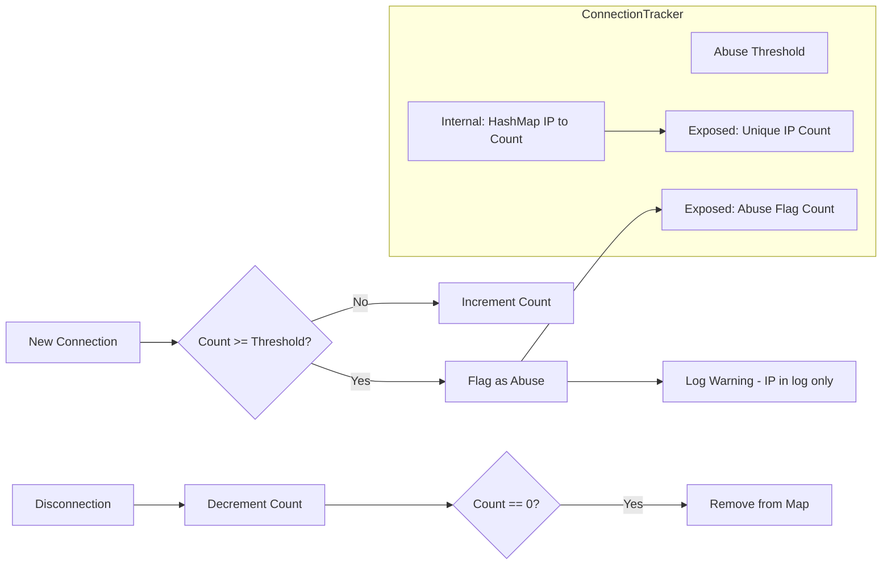
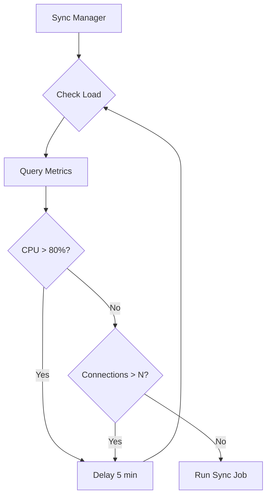

# Monitoring Strategy - Design Document

## Overview

This document describes the logging and monitoring strategy for ngit-grasp, designed to help administrators:

1. Monitor WebSocket connections per unique IP
2. Correlate resource spikes (memory, CPU) with usage patterns
3. Detect potential abuse (too many connections from single IP)
4. Support future load-based scheduling of background jobs (GRASP-02 sync)

## Architecture

```mermaid
flowchart TB
    subgraph ngit-grasp
        HTTP[HTTP Service]
        WS[WebSocket Handler]
        GIT[Git Handlers]
        RELAY[Nostr Relay]
        
        subgraph Metrics Module
            REG[Prometheus Registry]
            CT[ConnectionTracker]
            MC[Metric Counters]
        end
        
        ME[/metrics endpoint]
    end
    
    subgraph External
        PROM[Prometheus Server]
        GRAF[Grafana]
        ADMIN[Admin Browser]
    end
    
    HTTP --> ME
    WS --> CT
    WS --> MC
    GIT --> MC
    RELAY --> MC
    
    CT --> REG
    MC --> REG
    REG --> ME
    
    PROM -->|scrape /metrics| ME
    GRAF -->|query| PROM
    ADMIN -->|view dashboards| GRAF
```

## Metric Categories

### 1. WebSocket Connection Metrics

| Metric Name | Type | Labels | Description |
|------------|------|--------|-------------|
| `ngit_websocket_connections_total` | Counter | - | Total WebSocket connections since startup |
| `ngit_websocket_connections_active` | Gauge | - | Current active WebSocket connections |
| `ngit_websocket_unique_ips` | Gauge | - | Number of unique IP addresses connected (NOT the IPs themselves) |
| `ngit_websocket_flagged_abusers` | Gauge | - | Number of IPs exceeding connection threshold |
| `ngit_websocket_connection_duration_seconds` | Histogram | - | Duration of WebSocket connections |
| `ngit_websocket_messages_received_total` | Counter | `type` | Messages received (REQ, EVENT, CLOSE) |
| `ngit_websocket_messages_sent_total` | Counter | `type` | Messages sent (EVENT, EOSE, OK, NOTICE) |

**Privacy Note:** IP addresses are NEVER exposed in metrics. The `ConnectionTracker` maintains per-IP counts internally only for abuse detection, logging warnings when thresholds are exceeded.

### 2. Git Operation Metrics

| Metric Name | Type | Labels | Description |
|------------|------|--------|-------------|
| `ngit_git_operations_total` | Counter | `operation`, `status` | Git operations (clone, fetch, push) |
| `ngit_git_operation_duration_seconds` | Histogram | `operation` | Duration of git operations |
| `ngit_git_bytes_total` | Counter | `direction` | Total bytes in/out for git operations |
| `ngit_git_push_authorization_total` | Counter | `result` | Push auth results (allowed, denied, error) |

### 3. Top-N Repository Bandwidth Tracking

To identify high-bandwidth repositories without creating cardinality explosion (which doesn't scale to 1000+ repos), we use a hybrid approach:

| Metric Name | Type | Labels | Description |
|------------|------|--------|-------------|
| `ngit_git_top_repos_bytes` | Gauge | `repo` | Top 10 repositories by bandwidth (refreshed every 60s) |

**How it works:**
- All per-repo bandwidth is tracked internally in a `HashMap<RepoId, u64>`
- Every 60 seconds, the top 10 are calculated and exposed to Prometheus
- Previous repo labels are cleared before setting new ones
- Prometheus only ever sees ~10 label values, keeping cardinality low

```rust
struct BandwidthTracker {
    // Internal: tracks ALL repos (memory only, not exposed)
    all_repos: DashMap<String, u64>,
    
    // Exposed to Prometheus: only top 10
    top_repos_gauge: GaugeVec,
    
    // Refresh interval
    last_refresh: Instant,
}

impl BandwidthTracker {
    fn record_transfer(&self, repo_id: &str, bytes: u64) {
        self.all_repos
            .entry(repo_id.to_string())
            .and_modify(|v| *v += bytes)
            .or_insert(bytes);
    }
    
    fn maybe_refresh_top_n(&self) {
        if self.last_refresh.elapsed() > Duration::from_secs(60) {
            self.refresh_top_n();
        }
    }
    
    fn refresh_top_n(&self) {
        let mut sorted: Vec<_> = self.all_repos.iter()
            .map(|r| (r.key().clone(), *r.value()))
            .collect();
        sorted.sort_by(|a, b| b.1.cmp(&a.1));
        
        // Clear old labels, set new top 10
        self.top_repos_gauge.reset();
        for (repo, bytes) in sorted.into_iter().take(10) {
            self.top_repos_gauge
                .with_label_values(&[&repo])
                .set(bytes as i64);
        }
    }
}
```

### 4. Nostr Event Metrics

| Metric Name | Type | Labels | Description |
|------------|------|--------|-------------|
| `ngit_events_received_total` | Counter | `kind` | Events received by kind |
| `ngit_events_stored_total` | Counter | `kind` | Events successfully stored |
| `ngit_events_rejected_total` | Counter | `kind`, `reason` | Events rejected and why |

### 5. Repository Metrics

| Metric Name | Type | Labels | Description |
|------------|------|--------|-------------|
| `ngit_repositories_total` | Gauge | - | Total repositories hosted |

### 6. System Health Metrics

| Metric Name | Type | Labels | Description |
|------------|------|--------|-------------|
| `ngit_uptime_seconds` | Counter | - | Seconds since startup |
| `ngit_build_info` | Gauge | `version`, `commit` | Build information |

### 7. Future: Sync Metrics (GRASP-02)

| Metric Name | Type | Labels | Description |
|------------|------|--------|-------------|
| `ngit_sync_events_received_total` | Counter | `source` | Events from sync (live vs catchup) |
| `ngit_sync_relay_connections_active` | Gauge | - | Active outbound relay connections |
| `ngit_sync_catchup_gap_total` | Counter | - | Events found during catchup (sync failures) |

## Connection Tracker Design

The `ConnectionTracker` maintains per-IP connection counts internally for abuse detection. **IP addresses are never exposed in metrics** - only aggregate counts.



### Data Structure

```rust
pub struct ConnectionTracker {
    /// Active connections per IP (INTERNAL ONLY - never exposed to metrics)
    connections: DashMap<IpAddr, ConnectionInfo>,
    /// Threshold for abuse flagging
    abuse_threshold: u32,
    /// Prometheus gauges (aggregate counts only, no IPs)
    active_connections: IntGauge,     // Total connections
    unique_ips: IntGauge,             // len() of HashMap
    flagged_abusers: IntGauge,        // Count where flagged_as_abuse == true
}

struct ConnectionInfo {
    count: u32,
    first_seen: Instant,
    flagged_as_abuse: bool,
}
```

### What Gets Exposed vs Internal

| Data | Location | Exposed? |
|------|----------|----------|
| Total connections | Prometheus | ✅ Yes |
| Unique IP count | Prometheus | ✅ Yes |
| Flagged abuser count | Prometheus | ✅ Yes |
| Actual IP addresses | Internal HashMap | ❌ No |
| IP + abuse flag | Logs (when flagged) | ⚠️ Logs only |

### Thread Safety

Using `DashMap` for lock-free concurrent access, as connection tracking happens across multiple tokio tasks.

## /metrics Endpoint

The `/metrics` endpoint returns Prometheus text format:

```
# HELP ngit_websocket_connections_active Current active WebSocket connections
# TYPE ngit_websocket_connections_active gauge
ngit_websocket_connections_active 23

# HELP ngit_websocket_connections_by_ip Active connections per IP
# TYPE ngit_websocket_connections_by_ip gauge
ngit_websocket_connections_by_ip{ip="192.168.1.100"} 2
ngit_websocket_connections_by_ip{ip="10.0.0.50"} 5

# HELP ngit_git_operations_total Git operations by type and status
# TYPE ngit_git_operations_total counter
ngit_git_operations_total{operation="clone",status="success"} 1247
ngit_git_operations_total{operation="push",status="denied"} 12
```

## Integration Points

### HTTP Service Integration

In [`src/http/mod.rs`](../../src/http/mod.rs):

```rust
// Add to HttpService
struct HttpService {
    // ... existing fields ...
    metrics: Arc<Metrics>,
}

// Add /metrics route handling
if path == "/metrics" {
    let metrics_output = self.metrics.render();
    return Ok(Response::builder()
        .status(200)
        .header("content-type", "text/plain; version=0.0.4")
        .body(Full::new(Bytes::from(metrics_output)))
        .unwrap());
}
```

### WebSocket Connection Tracking

In the WebSocket upgrade handler:

```rust
// On connection
let ip = addr.ip();
metrics.connection_tracker.on_connect(ip);

// Spawn connection handler
tokio::spawn(async move {
    // ... handle connection ...
    // On disconnect
    metrics.connection_tracker.on_disconnect(ip);
});
```

### Git Handler Integration

In [`src/git/handlers.rs`](../../src/git/handlers.rs):

```rust
// Wrap git operations with metrics
let timer = metrics.git_operation_duration.start_timer();
let result = git::handlers::handle_upload_pack(repo_path, body_bytes).await;
timer.observe_duration();

metrics.git_operations_total
    .with_label_values(&["clone", result_status])
    .inc();
```

## Configuration

New configuration options in [`src/config.rs`](../../src/config.rs):

| Option | CLI Flag | Environment Variable | Default | Description |
|--------|----------|---------------------|---------|-------------|
| Metrics enabled | `--metrics-enabled` | `NGIT_METRICS_ENABLED` | `true` | Enable /metrics endpoint |
| Abuse threshold | `--abuse-threshold` | `NGIT_ABUSE_THRESHOLD` | `10` | Max connections per IP before flagging |
| Metrics path | `--metrics-path` | `NGIT_METRICS_PATH` | `/metrics` | Path for metrics endpoint |

## Crate Dependencies

Add to `Cargo.toml`:

```toml
# Metrics
prometheus = "0.13"
dashmap = "5"     # Lock-free concurrent HashMap
lazy_static = "1.4"  # For static metric registration
```

## Module Structure

```
src/
├── metrics/
│   ├── mod.rs              # Module exports, Metrics struct
│   ├── connection.rs       # ConnectionTracker implementation
│   ├── definitions.rs      # Metric definitions (lazy_static!)
│   └── render.rs           # Prometheus format rendering
├── http/
│   └── mod.rs              # Add /metrics route
└── ...
```

## Grafana Dashboard

A pre-built Grafana dashboard will be provided at `docs/grafana/ngit-grasp-dashboard.json` with panels for:

1. **Overview Row**
   - Active connections (gauge)
   - Requests per second (graph)
   - Git operations per minute (graph)

2. **Connections Row**
   - Active connections over time
   - Connections by IP (top 10)
   - Flagged abuse IPs (table)

3. **Git Operations Row**
   - Clone/fetch/push rates
   - Push authorization results (pie chart)
   - Operation duration percentiles

4. **Events Row**
   - Events received by kind
   - Events rejected by reason
   - Active subscriptions

## Deployment: Prometheus on NixOS

Example NixOS configuration for Prometheus:

```nix
services.prometheus = {
  enable = true;
  scrapeConfigs = [
    {
      job_name = "ngit-grasp";
      static_configs = [{
        targets = [ "localhost:8080" ];  # ngit-grasp bind address
      }];
      scrape_interval = "15s";
      metrics_path = "/metrics";
    }
  ];
};

services.grafana = {
  enable = true;
  settings.server.http_port = 3000;
  provision.datasources.settings.datasources = [{
    name = "Prometheus";
    type = "prometheus";
    url = "http://localhost:9090";
  }];
};
```

## Future: Load-Based Sync Scheduling

The metrics infrastructure enables future load-based scheduling for GRASP-02 sync jobs:



The `Metrics` struct will expose a method for checking load:

```rust
impl Metrics {
    /// Check if system is under high load
    pub fn is_high_load(&self) -> bool {
        let active = self.websocket_connections_active.get();
        active > self.config.high_load_threshold
    }
}
```

## Future Enhancement: Loki for Detailed Logging

For detailed per-repository investigation at scale, consider adding **Loki** (log aggregation) in a future iteration:

```rust
// Structured logging with tracing
tracing::info!(
    repo = %repo_id,
    npub = %npub,
    bytes = bytes_transferred,
    operation = "clone",
    duration_ms = elapsed.as_millis(),
    "git_transfer_complete"
);
```

Loki query examples:
```logql
# Find all transfers > 10MB
{job="ngit-grasp"} |= "git_transfer_complete" | json | bytes > 10000000

# Sum bytes by repo in last hour
sum by (repo) (
  {job="ngit-grasp"} |= "git_transfer_complete" | json | unwrap bytes
)
```

This pairs with Prometheus for long-term trends while enabling ad-hoc deep dives.

## Privacy Considerations

- IP addresses are stored only in memory (not logged to disk by default)
- Per-IP metrics can be disabled via configuration
- Consider IP anonymization for GDPR compliance if needed

## Summary

| Component | Purpose |
|-----------|---------|
| `Metrics` struct | Central registry and access point |
| `ConnectionTracker` | Per-IP tracking with abuse detection |
| `/metrics` endpoint | Prometheus scraping interface |
| Grafana dashboard | Visualization and analysis |
| NixOS config | Easy deployment for operators |

This strategy provides comprehensive observability without requiring a separate database - Prometheus handles all time-series storage and Grafana provides the visualization layer.