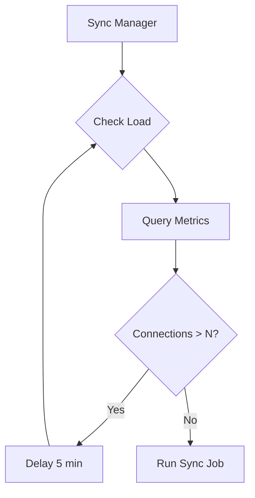

# Monitoring

ngit-grasp exposes Prometheus metrics at `/metrics` for monitoring WebSocket connections, Git operations, Nostr events, and system health.

## Architecture

```mermaid
flowchart TB
    subgraph ngit-grasp
        HTTP[HTTP Service]
        WS[WebSocket Handler]
        GIT[Git Handlers]
        RELAY[Nostr Relay]
        
        subgraph Metrics Module
            REG[Prometheus Registry]
            CT[ConnectionTracker]
            MC[Metric Counters]
        end
        
        ME[/metrics endpoint]
    end
    
    subgraph External
        PROM[Prometheus Server]
        GRAF[Grafana]
        ADMIN[Admin Browser]
    end
    
    HTTP --> ME
    WS --> CT
    WS --> MC
    GIT --> MC
    RELAY --> MC
    
    CT --> REG
    MC --> REG
    REG --> ME
    
    PROM -->|scrape /metrics| ME
    GRAF -->|query| PROM
    ADMIN -->|view dashboards| GRAF
```

## Configuration

| Option | CLI Flag | Environment Variable | Default | Description |
|--------|----------|---------------------|---------|-------------|
| Metrics enabled | `--metrics-enabled` | `NGIT_METRICS_ENABLED` | `true` | Enable /metrics endpoint |
| Abuse threshold | `--abuse-threshold` | `NGIT_ABUSE_THRESHOLD` | `10` | Max connections per IP before flagging |
| Top N repos | `--top-n-repos` | `NGIT_TOP_N_REPOS` | `10` | Number of top bandwidth repos to track |

## Privacy Model

IP addresses are **never exposed in Prometheus metrics**. The connection tracker maintains per-IP counts internally only for abuse detection:

| Data | Exposed in Metrics? |
|------|---------------------|
| Total connections | ✅ Yes |
| Unique IP count | ✅ Yes |
| Flagged abuser count | ✅ Yes |
| Actual IP addresses | ❌ No (internal only) |
| IP + abuse flag | ⚠️ Logs only (when flagged) |

When an IP exceeds the abuse threshold, a warning is logged but the IP is never exposed via Prometheus.

## Deployment

See [Prometheus Setup Guide](../how-to/prometheus-setup.md) for NixOS configuration and Grafana dashboard provisioning.

## Future: Load-Based Sync Scheduling (GRASP-02)

The metrics infrastructure enables future load-based scheduling for GRASP-02 sync jobs:



## Future: Loki for Detailed Logging

For detailed per-repository investigation at scale, consider adding **Loki** (log aggregation):

- Structured logging with tracing crate already in place
- Loki queries enable ad-hoc deep dives (e.g., find all transfers > 10MB)
- Pairs with Prometheus for long-term trends

## Future: Sync Metrics (GRASP-02)

When GRASP-02 proactive sync is implemented, additional metrics will track:

- Events received from sync (live vs catchup)
- Active outbound relay connections
- Catchup gap (events found during catchup indicating sync failures)