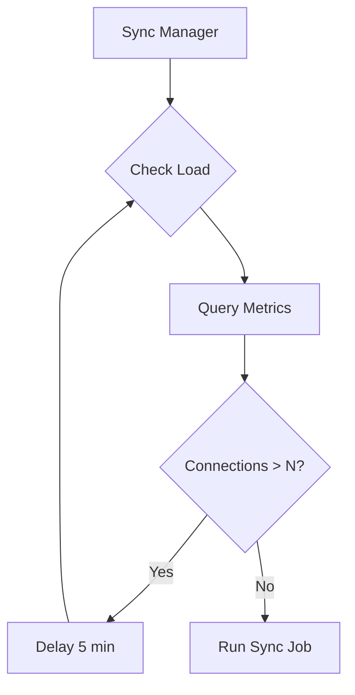

# Monitoring

ngit-grasp exposes Prometheus metrics at `/metrics` for monitoring WebSocket connections, Git operations, Nostr events, and system health.

## Architecture

```mermaid
flowchart TB
    subgraph ngit-grasp
        HTTP[HTTP Service]
        WS[WebSocket Handler]
        GIT[Git Handlers]
        RELAY[Nostr Relay]
        
        subgraph Metrics Module
            REG[Prometheus Registry]
            CT[ConnectionTracker]
            MC[Metric Counters]
        end
        
        ME[/metrics endpoint]
    end
    
    subgraph External
        PROM[Prometheus Server]
        GRAF[Grafana]
        ADMIN[Admin Browser]
    end
    
    HTTP --> ME
    WS --> CT
    WS --> MC
    GIT --> MC
    RELAY --> MC
    
    CT --> REG
    MC --> REG
    REG --> ME
    
    PROM -->|scrape /metrics| ME
    GRAF -->|query| PROM
    ADMIN -->|view dashboards| GRAF
```

## Configuration

| Option | CLI Flag | Environment Variable | Default | Description |
|--------|----------|---------------------|---------|-------------|
| Metrics enabled | `--metrics-enabled` | `NGIT_METRICS_ENABLED` | `true` | Enable /metrics endpoint |
| Abuse threshold | `--abuse-threshold` | `NGIT_ABUSE_THRESHOLD` | `10` | Max connections per IP before flagging |
| Top N repos | `--top-n-repos` | `NGIT_TOP_N_REPOS` | `10` | Number of top bandwidth repos to track |

## Privacy Model

IP addresses are **never exposed in Prometheus metrics**. The connection tracker maintains per-IP counts internally only for abuse detection:

| Data | Exposed in Metrics? |
|------|---------------------|
| Total connections | ✅ Yes |
| Unique IP count | ✅ Yes |
| Flagged abuser count | ✅ Yes |
| Actual IP addresses | ❌ No (internal only) |
| IP + abuse flag | ⚠️ Logs only (when flagged) |

When an IP exceeds the abuse threshold, a warning is logged but the IP is never exposed via Prometheus.

## Deployment

See [Prometheus Setup Guide](../how-to/prometheus-setup.md) for NixOS configuration and Grafana dashboard provisioning.

## Future: Load-Based Sync Scheduling (GRASP-02)

The metrics infrastructure enables future load-based scheduling for GRASP-02 sync jobs:



## Future: Loki for Detailed Logging

For detailed per-repository investigation at scale, consider adding **Loki** (log aggregation):

- Structured logging with tracing crate already in place
- Loki queries enable ad-hoc deep dives (e.g., find all transfers > 10MB)
- Pairs with Prometheus for long-term trends

## Sync Metrics (GRASP-02)

When GRASP-02 proactive sync is implemented, the following metrics will be added to track relay synchronization health. These metrics use in-memory tracking with Prometheus for operator visibility (no database persistence needed for <100 relays).

### Sync Metrics Overview

| Metric | Type | Labels | Description |
|--------|------|--------|-------------|
| `ngit_sync_relay_connected` | Gauge | relay | 1 if connected, 0 if not |
| `ngit_sync_connection_attempts_total` | Counter | relay, result | Connection attempt outcomes |
| `ngit_sync_relay_status` | Gauge | relay, status | 1 for current status, 0 otherwise |
| `ngit_sync_relay_failures` | Gauge | relay | Current consecutive failure count |
| `ngit_sync_events_total` | Counter | source | Events received by source type |
| `ngit_sync_gap_events_total` | Counter | relay | Events found during catchup |
| `ngit_sync_relays_tracked_total` | Gauge | - | Total relays discovered |
| `ngit_sync_relays_connected_total` | Gauge | - | Currently connected relay count |
| `ngit_sync_relays_dead_total` | Gauge | - | Relays marked as dead |

### Event Sources

The `source` label on `ngit_sync_events_total` tracks how events were received:

- `direct` - Submitted directly to our relay by a user
- `live_sync` - Received via live WebSocket subscription (expected path)
- `catchup` - Found during negentropy catchup after reconnect
- `daily_catchup` - Found during daily reconciliation

**Catchup events indicate sync failures** - these should have been received via live sync. High catchup rates suggest connectivity issues or filter mismatches.

### Relay Health States

The `status` label on `ngit_sync_relay_status` tracks relay health:

- `healthy` - Normal operation, connections working
- `backoff` - Exponential backoff after failures (5s → 10s → ... → 1h)
- `dead` - 24h of continuous failures, daily retry only

### Example Grafana Queries

```promql
# Relay health overview - count by status
sum by (status) (ngit_sync_relay_status == 1)

# Connection success rate over last hour
sum(rate(ngit_sync_connection_attempts_total{result="success"}[1h]))
/ sum(rate(ngit_sync_connection_attempts_total[1h]))

# Sync gap detection - events that should have been live synced
sum(rate(ngit_sync_gap_events_total[1h])) by (relay)

# Live sync effectiveness (lower is better - fewer gaps)
sum(rate(ngit_sync_events_total{source=~"catchup|daily_catchup"}[1h]))
/ sum(rate(ngit_sync_events_total[1h]))

# Relays with high failure counts (potential issues)
topk(10, ngit_sync_relay_failures)
```

### Example Alerts

```yaml
# Alert if relay stuck in dead state for > 1 day
- alert: SyncRelayDead
  expr: ngit_sync_relay_status{status="dead"} == 1
  for: 1d
  labels:
    severity: warning
  annotations:
    summary: "Sync relay {{ $labels.relay }} is dead"

# Alert if sync gap rate is high (>10% of events from catchup)
- alert: SyncGapHigh
  expr: >
    sum(rate(ngit_sync_events_total{source=~"catchup|daily_catchup"}[1h]))
    / sum(rate(ngit_sync_events_total[1h])) > 0.1
  for: 30m
  labels:
    severity: warning
  annotations:
    summary: "High sync gap rate - {{ $value | humanizePercentage }} of events from catchup"
```

### Design Rationale

**In-memory health tracking with Prometheus visibility** was chosen over database persistence because:

1. **Scale**: <100 relays means per-relay labels have acceptable cardinality
2. **Simplicity**: No database schema, migrations, or cleanup needed
3. **Operator visibility**: Prometheus + Grafana provide better dashboards than custom queries
4. **Restart behavior**: Conservative initial backoff (5s + jitter) avoids thundering herd on restart
5. **Historical data**: Prometheus retains health history; in-memory state only needs current status

See [GRASP-02 Proactive Sync](grasp-02-proactive-sync.md) for full architecture details.