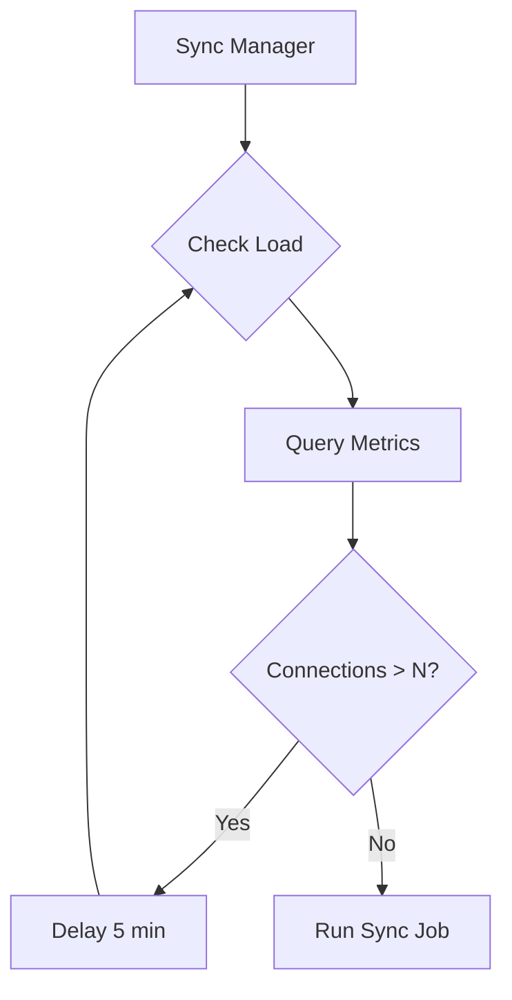

# Monitoring

ngit-grasp exposes Prometheus metrics at `/metrics` for monitoring WebSocket connections, Git operations, Nostr events, and system health.

## Architecture

```mermaid
flowchart TB
    subgraph ngit-grasp
        HTTP[HTTP Service]
        WS[WebSocket Handler]
        GIT[Git Handlers]
        RELAY[Nostr Relay]
        
        subgraph Metrics Module
            REG[Prometheus Registry]
            CT[ConnectionTracker]
            MC[Metric Counters]
        end
        
        ME[/metrics endpoint]
    end
    
    subgraph External
        PROM[Prometheus Server]
        GRAF[Grafana]
        ADMIN[Admin Browser]
    end
    
    HTTP --> ME
    WS --> CT
    WS --> MC
    GIT --> MC
    RELAY --> MC
    
    CT --> REG
    MC --> REG
    REG --> ME
    
    PROM -->|scrape /metrics| ME
    GRAF -->|query| PROM
    ADMIN -->|view dashboards| GRAF
```

## Configuration

| Option | CLI Flag | Environment Variable | Default | Description |
|--------|----------|---------------------|---------|-------------|
| Metrics enabled | `--metrics-enabled` | `NGIT_METRICS_ENABLED` | `true` | Enable /metrics endpoint |
| Abuse threshold | `--abuse-threshold` | `NGIT_ABUSE_THRESHOLD` | `10` | Max connections per IP before flagging |
| Top N repos | `--top-n-repos` | `NGIT_TOP_N_REPOS` | `10` | Number of top bandwidth repos to track |

## Privacy Model

IP addresses are **never exposed in Prometheus metrics**. The connection tracker maintains per-IP counts internally only for abuse detection:

| Data | Exposed in Metrics? |
|------|---------------------|
| Total connections | ✅ Yes |
| Unique IP count | ✅ Yes |
| Flagged abuser count | ✅ Yes |
| Actual IP addresses | ❌ No (internal only) |
| IP + abuse flag | ⚠️ Logs only (when flagged) |

When an IP exceeds the abuse threshold, a warning is logged but the IP is never exposed via Prometheus.

## Deployment

See [Prometheus Setup Guide](../how-to/prometheus-setup.md) for NixOS configuration and Grafana dashboard provisioning.

## Future: Load-Based Sync Scheduling (GRASP-02)

The metrics infrastructure enables future load-based scheduling for GRASP-02 sync jobs:



## Future: Loki for Detailed Logging

For detailed per-repository investigation at scale, consider adding **Loki** (log aggregation):

- Structured logging with tracing crate already in place
- Loki queries enable ad-hoc deep dives (e.g., find all transfers > 10MB)
- Pairs with Prometheus for long-term trends

## Sync Metrics (GRASP-02)

When GRASP-02 proactive sync is implemented, the following metrics will be added to track relay synchronization health. These metrics use in-memory tracking with Prometheus for operator visibility (no database persistence needed for <100 relays).

### Sync Metrics Overview

| Metric | Type | Labels | Description |
|--------|------|--------|-------------|
| `ngit_sync_relay_connected` | Gauge | relay | Connection status (0=disconnected, 1=connecting, 2=syncing, 3=connected, 4=connected_historic_sync_failures) |
| `ngit_sync_connection_attempts_total` | Counter | relay, result | Connection attempt outcomes |
| `ngit_sync_relay_status` | Gauge | relay | Health status (1=healthy, 2=disconnected, 3=degraded, 4=dead, 5=rate_limited) |
| `ngit_sync_relay_failures` | Gauge | relay | Current consecutive failure count |
| `ngit_sync_events_synced_total` | Counter | - | Events synced (newly saved events only) |
| `ngit_sync_relays_tracked_total` | Gauge | - | Total relays discovered |
| `ngit_sync_relays_connected_total` | Gauge | - | Currently connected relay count |
| `ngit_sync_relays_dead_total` | Gauge | - | Relays marked as dead |

### Connection Status Values

The `ngit_sync_relay_connected` metric tracks the connection lifecycle:

- `0` = **Disconnected** - Not currently connected
- `1` = **Connecting** - Connection attempt in progress
- `2` = **Syncing** - Connected, historic sync in progress
- `3` = **Connected** - Connected, historic sync complete, live sync active
- `4` = **ConnectedHistoricSyncFailures** - Connected, historic sync had failures, live sync active, partial data

This allows operators to distinguish between "connected but still catching up" (Syncing) vs "fully synced and live" (Connected) vs "historic sync failures - missing historic data" (ConnectedHistoricSyncFailures).

### Relay Health States

The `ngit_sync_relay_status` metric tracks relay health:

- `1` = **Healthy** - Connected and stable
- `2` = **Disconnected** - Not connected, but no issues detected
- `3` = **Degraded** - Connection problems or unstable after recovery
- `4` = **Dead** - 24h+ of continuous failures
- `5` = **RateLimited** - Rate limit cooldown active (65s)

### Example Grafana Queries

```promql
# Relay connection status overview - count by status
sum by (relay) (ngit_sync_relay_connected == 0)  # Disconnected
sum by (relay) (ngit_sync_relay_connected == 1)  # Connecting
sum by (relay) (ngit_sync_relay_connected == 2)  # Syncing
sum by (relay) (ngit_sync_relay_connected == 3)  # Connected
sum by (relay) (ngit_sync_relay_connected == 4)  # ConnectedHistoricSyncFailures

# Relays still syncing (not yet fully caught up)
count(ngit_sync_relay_connected == 2)

# Relays with historic sync failures (missing historic data)
count(ngit_sync_relay_connected == 4)

# Connection success rate over last hour
sum(rate(ngit_sync_connection_attempts_total{result="success"}[1h]))
/ sum(rate(ngit_sync_connection_attempts_total[1h]))

# Event sync rate (newly saved events)
rate(ngit_sync_events_synced_total[5m])

# Relays with high failure counts (potential issues)
topk(10, ngit_sync_relay_failures)

# Relay health overview - count by health state
sum(ngit_sync_relay_status == 1)  # Healthy
sum(ngit_sync_relay_status == 2)  # Disconnected
sum(ngit_sync_relay_status == 3)  # Degraded
sum(ngit_sync_relay_status == 4)  # Dead
sum(ngit_sync_relay_status == 5)  # RateLimited
```

### Example Alerts

```yaml
# Alert if relay stuck in dead state for > 1 day
- alert: SyncRelayDead
  expr: ngit_sync_relay_status == 4  # Dead state
  for: 1d
  labels:
    severity: warning
  annotations:
    summary: "Sync relay {{ $labels.relay }} is dead (24h+ failures)"

# Alert if relay stuck in syncing state for > 1 hour
- alert: SyncRelaySlow
  expr: ngit_sync_relay_connected == 2  # Syncing state
  for: 1h
  labels:
    severity: info
  annotations:
    summary: "Sync relay {{ $labels.relay }} taking >1h to complete historic sync"

# Alert if too many relays are degraded
- alert: SyncManyDegraded
  expr: sum(ngit_sync_relay_status == 3) > 5  # Degraded state
  for: 15m
  labels:
    severity: warning
  annotations:
    summary: "{{ $value }} relays in degraded state"
```

### Design Rationale

**In-memory health tracking with Prometheus visibility** was chosen over database persistence because:

1. **Scale**: <100 relays means per-relay labels have acceptable cardinality
2. **Simplicity**: No database schema, migrations, or cleanup needed
3. **Operator visibility**: Prometheus + Grafana provide better dashboards than custom queries
4. **Restart behavior**: Conservative initial backoff (5s + jitter) avoids thundering herd on restart
5. **Historical data**: Prometheus retains health history; in-memory state only needs current status

See [GRASP-02 Proactive Sync](grasp-02-proactive-sync.md) for full architecture details.

## Rejected Events Index Metrics

The rejected events index tracks rejected repository announcements and state events to prevent wasteful re-fetching during negentropy sync and enable race condition resolution.

### Rejected Events Metrics

All metrics are parameterized by `event_type` label with values "announcement" or "state":

| Metric | Type | Labels | Description |
|--------|------|--------|-------------|
| `ngit_rejected_hot_cache_current` | Gauge | event_type | Current number of entries in hot cache |
| `ngit_rejected_cold_index_current` | Gauge | event_type | Current number of entries in cold index |
| `ngit_rejected_hot_cache_hits` | Counter | event_type | Events successfully retrieved from hot cache for re-processing |
| `ngit_rejected_hot_cache_misses` | Counter | event_type | Events expired from hot cache before dependency arrived |
| `ngit_rejected_hot_cache_expired` | Counter | event_type | Entries cleaned up from hot cache (2 min expiry) |
| `ngit_rejected_cold_index_expired` | Counter | event_type | Entries cleaned up from cold index (7 day expiry) |
| `ngit_rejected_invalidated` | Counter | event_type | Entries invalidated when dependency was satisfied |

### Example Grafana Queries

```promql
# Hot cache efficiency - how often we successfully re-process from cache
rate(ngit_rejected_hot_cache_hits_total[5m])
/ (rate(ngit_rejected_hot_cache_hits_total[5m]) + rate(ngit_rejected_hot_cache_misses_total[5m]))

# Current rejected events by type
ngit_rejected_hot_cache_current{event_type="announcement"}
ngit_rejected_hot_cache_current{event_type="state"}
ngit_rejected_cold_index_current{event_type="announcement"}
ngit_rejected_cold_index_current{event_type="state"}

# Race condition resolution rate - invalidations indicate successful dependency arrival
rate(ngit_rejected_invalidated_total[5m])

# Cache hit ratio over time (higher is better, means dependencies arriving quickly)
sum(rate(ngit_rejected_hot_cache_hits_total[5m]))
/ sum(rate(ngit_rejected_hot_cache_hits_total[5m]) + rate(ngit_rejected_hot_cache_misses_total[5m]))
```

### Example Alerts

```yaml
# Alert if hot cache hit rate is too low (suggests timing issues)
- alert: RejectedEventsCacheMissRate
  expr: |
    sum(rate(ngit_rejected_hot_cache_misses_total[5m]))
    / sum(rate(ngit_rejected_hot_cache_hits_total[5m]) + rate(ngit_rejected_hot_cache_misses_total[5m]))
    > 0.8
  for: 15m
  labels:
    severity: warning
  annotations:
    summary: "High rejected events cache miss rate ({{ $value | humanizePercentage }})"
    description: "Most rejected events are expiring before dependencies arrive"

# Alert if cold index growing too large
- alert: RejectedEventsColdIndexSize
  expr: ngit_rejected_cold_index_current > 10000
  for: 1h
  labels:
    severity: info
  annotations:
    summary: "Rejected events cold index has {{ $value }} entries"
    description: "Consider investigating why many events are being rejected"
```

### Two-Tier Architecture

**Hot Cache (2 minutes):**
- Stores full event objects
- Enables immediate re-processing when dependencies arrive
- Cleaned up every 60 seconds
- Memory: ~200 KB typical, ~20 MB worst case

**Cold Index (7 days):**
- Stores metadata only (event ID, pubkey, identifier, reason)
- Prevents re-downloading during negentropy sync
- Cleaned up daily
- Memory: ~1 MB typical

### Use Cases

**Race Condition Resolution:**
When a maintainer announcement arrives before the owner announcement:
1. Maintainer event rejected → hot cache + cold index
2. Owner announcement accepted → invalidate from cold index
3. If still in hot cache → immediate re-processing (<1 second)
4. If expired from hot cache → will be re-fetched on next sync

**Negentropy Sync Efficiency:**
During sync, cold index IDs are excluded from "missing events" calculation, preventing wasteful re-download of events that will be rejected again.

See [work/rejected-events-index-summary.md](../../work/rejected-events-index-summary.md) for complete implementation details.