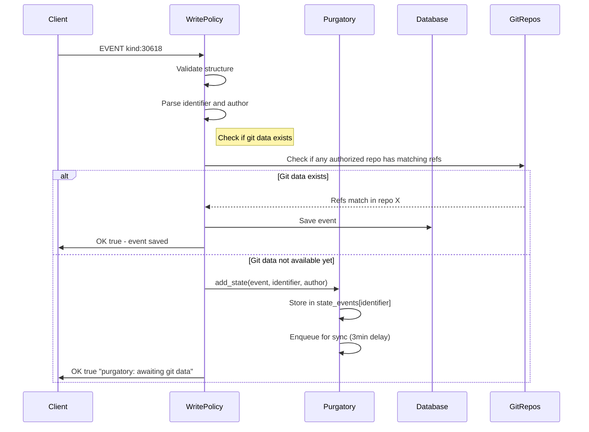
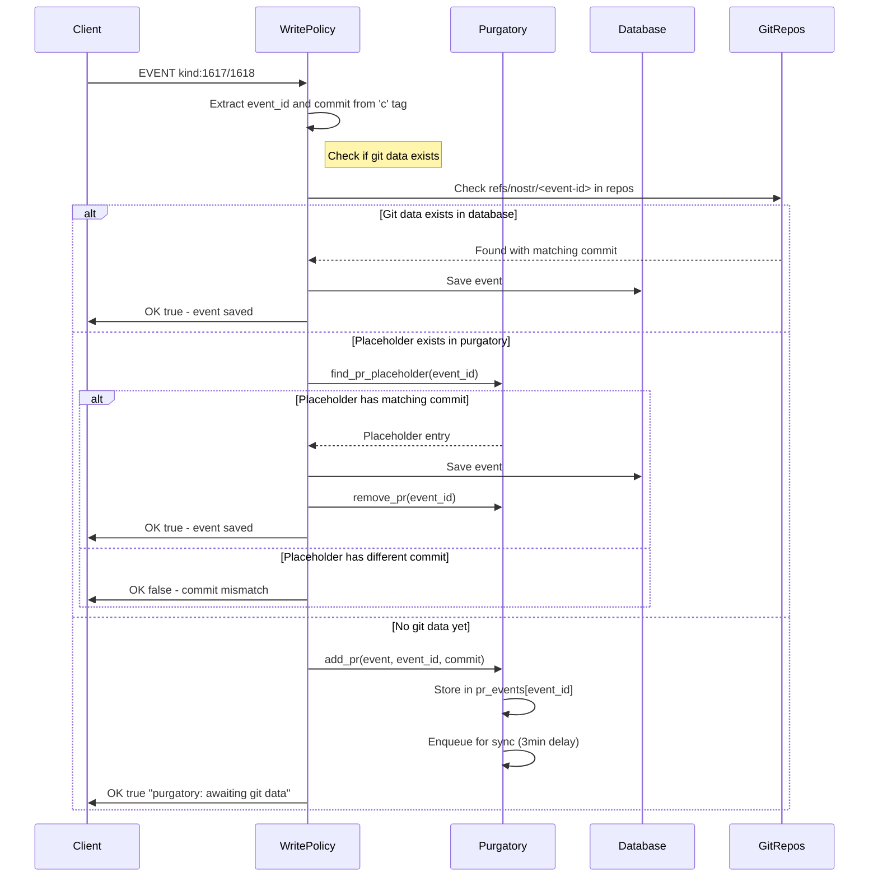
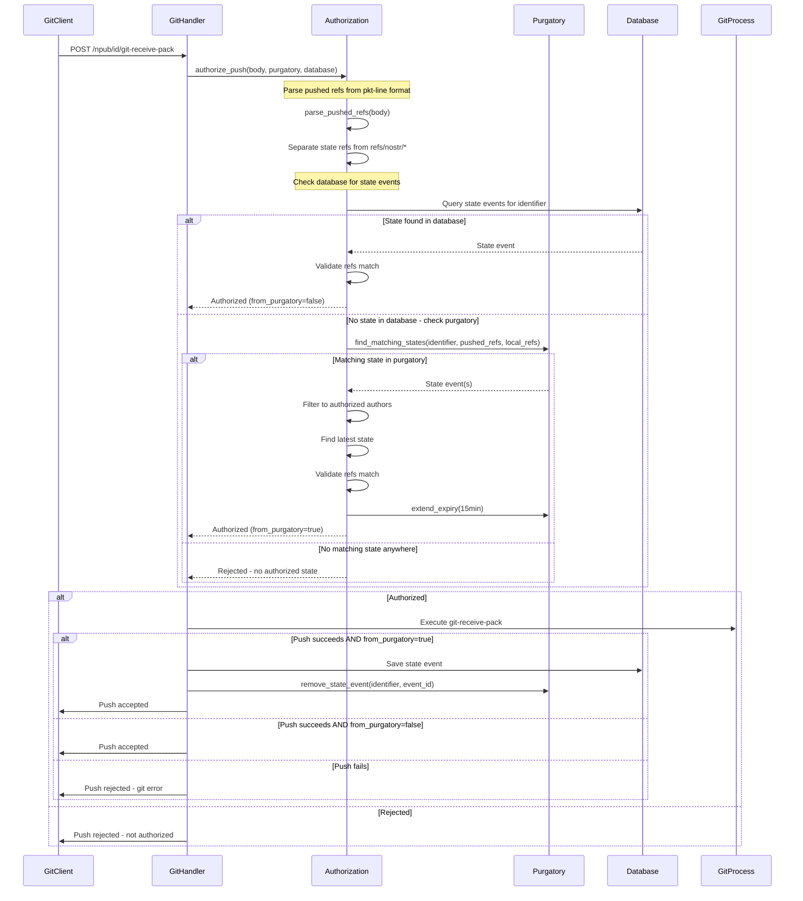
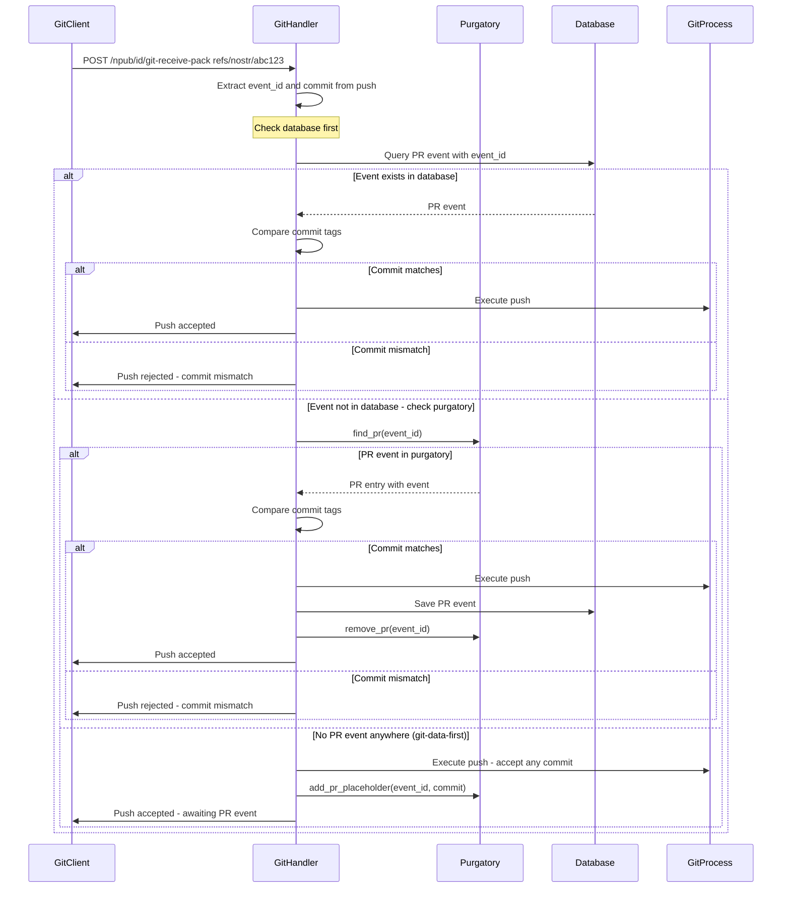

# Purgatory: In-Memory Holding Area for Events Awaiting Git Data

**Status**: ✅ Implemented  
**Implementation**: [`src/purgatory/`](../../src/purgatory/)  
**Related**: [`docs/explanation/architecture.md`](architecture.md) - System architecture overview

---

## Overview

Purgatory is an in-memory holding area that solves the **"which arrives first?"** problem in GRASP. Either nostr events or git pushes can arrive in any order:

- **Event first**: Event waits in purgatory until git data arrives
- **Git first**: Placeholder waits in purgatory until event arrives

When both halves arrive, they are processed together and saved to the database.

**Spec Reference**: [GRASP-01 Purgatory Section](https://github.com/DanConwayDev/grasp/blob/main/01.md#purgatory)

> Accepted repo state announcements, PRs and PR Updates SHOULD be accepted with message "purgatory: won't be served until git data arrives" and kept in purgatory (not served) until the related git data arrives and otherwise discarded after 30 minutes.

---

## Key Design Principles

### 1. In-Memory Only

Purgatory data is **not persisted** to disk. On restart, all purgatory entries are lost. This is acceptable because:

- Events are still on other relays (can be re-submitted)
- Git data can be re-pushed
- 30-minute expiry means data is transient anyway

### 2. Separate Storage for State vs PR Events

State events (kind 30618) and PR events (kind 1617/1618) have fundamentally different matching patterns:

| Event Type | Index | Matching Strategy |
|------------|-------|-------------------|
| **State Events** | `identifier` (d tag) | Compare refs at push time |
| **PR Events** | `event_id` (hex string) | Direct match via `refs/nostr/<event-id>` |

They use **separate DashMap stores** for efficient concurrent access.

### 3. Late Binding for State Events

**Critical:** Do NOT extract refs from state events at arrival time. Extract and match refs **at git push time**.

**Why?** Multiple state events might be in purgatory with different target states. An older state event's git data might arrive after a newer one is received. By waiting until push time:

- Compare pushed refs against each purgatory state event's expected state
- Handle out-of-order git data arrival correctly
- Only release events when their specific target state is achieved

See [`src/purgatory/helpers.rs:can_satisfy_state`](../../src/purgatory/helpers.rs) for implementation.

### 4. Bidirectional Waiting for PR Events

For PR events, **either side can arrive first**:

| Scenario | What Happens |
|----------|--------------|
| **Event first** | PR event waits in purgatory for git push to `refs/nostr/<event-id>` |
| **Git first** | Push creates placeholder entry waiting for PR event |

Placeholders are identified by `PrPurgatoryEntry.event == None`.

### 5. Authorization During Push (Not After)

**Critical for avoiding deadlock:** Authorization checks **both database and purgatory** during push validation.

Without this, we'd have a deadlock:
1. State event arrives → No git data → Goes to **purgatory** (not database)
2. Git push arrives → Authorization checks **database only** → No state found → **REJECTED** ❌

With purgatory checking during authorization:
1. State event arrives → No git data → Goes to purgatory
2. Git push arrives → Checks **database + purgatory** → State found → **AUTHORIZED** ✅
3. After push succeeds → Save event to database → Remove from purgatory

See [`src/git/authorization.rs:51-162`](../../src/git/authorization.rs) for implementation.

---

## Data Structures

### Core Types

```rust
/// A reference name and its target object
#[derive(Debug, Clone, Hash, Eq, PartialEq)]
pub struct RefPair {
    pub ref_name: String,    // e.g., "refs/heads/main"
    pub object_sha: String,  // commit or annotated tag SHA
}

/// A ref update in a git push
#[derive(Debug, Clone)]
pub struct RefUpdate {
    pub old_oid: String,
    pub new_oid: String,
    pub ref_name: String,
}
```

### State Purgatory Entry

```rust
pub struct StatePurgatoryEntry {
    /// The nostr state event (kind 30618) awaiting git data
    pub event: Event,
    
    /// Repository identifier from 'd' tag
    pub identifier: String,
    
    /// Event author pubkey
    pub author: PublicKey,
    
    /// When added to purgatory
    pub created_at: Instant,
    
    /// Expiry deadline (30 min from creation, may be extended)
    pub expires_at: Instant,
}
```

**Note:** Refs are NOT extracted at creation time. They're extracted at push time for late binding.

### PR Purgatory Entry

```rust
pub struct PrPurgatoryEntry {
    /// The nostr PR event, if received (None = git data arrived first)
    pub event: Option<Event>,
    
    /// Expected commit SHA from 'c' tag (if event exists)
    /// or actual commit pushed (if git arrived first)
    pub commit: String,
    
    /// When added to purgatory
    pub created_at: Instant,
    
    /// Expiry deadline (30 min from creation)
    pub expires_at: Instant,
}
```

**Key:** `event: None` indicates a placeholder (git-data-first scenario).

### Purgatory Stores

```rust
pub struct Purgatory {
    /// State events indexed by identifier (d tag)
    /// Multiple state events per identifier allowed (different authors)
    state_events: Arc<DashMap<String, Vec<StatePurgatoryEntry>>>,
    
    /// PR events indexed by event_id (hex string)
    /// Single entry per event ID
    pr_events: Arc<DashMap<String, PrPurgatoryEntry>>,
    
    /// Sync queue for background git data fetching
    sync_queue: Arc<DashMap<String, SyncQueueEntry>>,
    
    _git_data_path: PathBuf,
}
```

---

## Event Flows

### State Event Arrival (Kind 30618)



### PR Event Arrival (Kind 1617/1618)



### Git Push - State Refs

**Critical:** Authorization happens BEFORE git-receive-pack execution, checking both database and purgatory.



### Git Push - PR Refs (refs/nostr/event-id)



---

## Background Sync

Purgatory includes a background sync system that fetches git data from remote servers when events arrive before git data.

### Sync Architecture

```
┌─────────────────────────────────────────────────────┐
│                  Sync Loop (1s)                     │
│  - Checks sync_queue for ready identifiers          │
│  - Spawns tasks for each ready identifier           │
└─────────────────────────────────────────────────────┘
                         │
                         ▼
┌─────────────────────────────────────────────────────┐
│           sync_identifier(identifier)               │
│  1. Try all non-throttled URLs sequentially         │
│  2. Check if complete after each fetch              │
│  3. Enqueue with throttled domains if incomplete    │
└─────────────────────────────────────────────────────┘
                         │
                         ▼
┌─────────────────────────────────────────────────────┐
│      sync_identifier_from_url(identifier, url)      │
│  1. Collect needed OIDs from purgatory events       │
│  2. Fetch OIDs from remote URL                      │
│  3. Process newly available git data                │
└─────────────────────────────────────────────────────┘
                         │
                         ▼
┌─────────────────────────────────────────────────────┐
│   process_newly_available_git_data(repo, oids)      │
│  1. Find satisfiable state events in purgatory      │
│  2. Find satisfiable PR events in purgatory         │
│  3. Save events to database                         │
│  4. Sync git data to other owner repos              │
│  5. Remove from purgatory                           │
└─────────────────────────────────────────────────────┘
```

### Sync Queue Entry

```rust
pub struct SyncQueueEntry {
    /// When to attempt next sync
    pub next_attempt: Instant,
    
    /// Number of sync attempts made
    pub attempt_count: u32,
    
    /// Whether a sync task is currently running
    pub in_progress: bool,
}
```

**Backoff strategy:**
- First attempt: 20 seconds
- Second attempt: 2 minutes
- Subsequent attempts: 2 minutes

### Sync Delays

| Scenario | Delay | Reason |
|----------|-------|--------|
| User-submitted event | 3 minutes | Give time for git push to arrive |
| Sync-triggered event | 500ms | Batch burst arrivals from negentropy |

### Domain Throttling

```rust
pub struct ThrottleManager {
    /// Max requests per domain per minute
    max_requests_per_minute: usize,
    
    /// Tracking window duration
    window_duration: Duration,
    
    /// Per-domain throttle state
    domains: DashMap<String, DomainThrottle>,
}
```

**Rate limiting:**
- Default: 5 requests per domain per 30 seconds
- Tracks request timestamps in a sliding window
- Queues identifiers when domain is throttled
- Processes queue when capacity frees up

See [`src/purgatory/sync/throttle.rs`](../../src/purgatory/sync/throttle.rs) for implementation.

---

## Purgatory API

### Adding Entries

```rust
impl Purgatory {
    /// Add a state event to purgatory
    /// Automatically enqueues for sync with 3min delay
    pub fn add_state(&self, event: Event, identifier: String, author: PublicKey);
    
    /// Add a PR event to purgatory
    /// Automatically enqueues for sync with 3min delay
    pub fn add_pr(&self, event: Event, event_id: String, commit: String);
    
    /// Add a PR placeholder (git-data-first scenario)
    pub fn add_pr_placeholder(&self, event_id: String, commit: String);
}
```

### Finding Entries

```rust
impl Purgatory {
    /// Find state events waiting for an identifier
    pub fn find_state(&self, identifier: &str) -> Vec<StatePurgatoryEntry>;
    
    /// Find state events that match pushed refs (late binding)
    pub fn find_matching_states(
        &self,
        identifier: &str,
        pushed_updates: &[RefUpdate],
        local_refs: &HashMap<String, String>,
    ) -> Vec<Event>;
    
    /// Find a PR entry by event ID
    pub fn find_pr(&self, event_id: &str) -> Option<PrPurgatoryEntry>;
    
    /// Find a PR placeholder specifically (git-data-first)
    pub fn find_pr_placeholder(&self, event_id: &str) -> Option<String>;
}
```

### Removing Entries

```rust
impl Purgatory {
    /// Remove all state events for an identifier
    pub fn remove_state(&self, identifier: &str);
    
    /// Remove a specific state event by event ID
    pub fn remove_state_event(&self, identifier: &str, event_id: &EventId);
    
    /// Remove a PR entry
    pub fn remove_pr(&self, event_id: &str);
}
```

### Maintenance

```rust
impl Purgatory {
    /// Remove expired entries (called every 60 seconds)
    /// Returns (state_removed, pr_removed)
    pub fn cleanup(&self) -> (usize, usize);
    
    /// Extend expiry for entries about to be processed
    /// Ensures at least `duration` remaining
    pub fn extend_expiry(&self, identifier: &str, event_ids: &[EventId], duration: Duration);
    
    /// Get current counts for metrics
    pub fn count(&self) -> (usize, usize);
}
```

### Sync Queue Management

```rust
impl Purgatory {
    /// Enqueue identifier for sync with custom delay
    pub fn enqueue_sync(&self, identifier: &str, delay: Duration);
    
    /// Enqueue with default delay (3 minutes)
    pub fn enqueue_sync_default(&self, identifier: &str);
    
    /// Enqueue with immediate delay (500ms)
    pub fn enqueue_sync_immediate(&self, identifier: &str);
    
    /// Check if identifier has pending events
    pub fn has_pending_events(&self, identifier: &str) -> bool;
    
    /// Remove identifier from sync queue
    pub fn remove_from_sync_queue(&self, identifier: &str);
}
```

---

## Helper Functions

### State Event Matching

```rust
/// Extract ref pairs from a state event
pub fn extract_refs_from_state(event: &Event) -> Vec<RefPair>;

/// Check if a state event can be satisfied by a push
/// Returns true if:
/// - Every ref in state is either in pushed_refs OR in local_refs
/// - At least one ref in state is being changed by the push
pub fn can_satisfy_state(
    state_refs: &[RefPair],
    pushed_refs: &[RefPair],
    local_refs: &HashMap<String, String>,
) -> bool;

/// Check if a state event can be applied to a repository
/// Returns true if all required OIDs exist in the repo
pub fn can_apply_state(
    event: &Event,
    repo_path: &Path,
) -> Result<bool>;

/// Get refs from state that aren't being pushed
pub fn get_unpushed_refs(
    state_refs: &[RefPair],
    pushed_refs: &[RefPair],
) -> Vec<RefPair>;
```

See [`src/purgatory/helpers.rs`](../../src/purgatory/helpers.rs) for implementation.

---

## Integration Points

### 1. Event Policy (Nip34WritePolicy)

State and PR events are added to purgatory when git data doesn't exist:

```rust
// From src/nostr/policy/state.rs
async fn handle_state(&self, event: &Event) -> WritePolicyResult {
    let identifier = extract_identifier(event)?;
    
    // Check if we have matching git data
    if self.has_matching_git_data(&identifier, event).await? {
        return WritePolicyResult::Accept;
    }
    
    // Add to purgatory
    self.purgatory.add_state(
        event.clone(),
        identifier.clone(),
        event.pubkey,
    );
    
    WritePolicyResult::Reject {
        status: true,  // Client sees OK
        message: "purgatory: awaiting git data".into()
    }
}
```

### 2. Git Push Authorization

Authorization checks both database and purgatory:

```rust
// From src/git/authorization.rs
pub async fn authorize_push(
    database: &SharedDatabase,
    identifier: &str,
    owner_pubkey: &str,
    request_body: &Bytes,
    purgatory: &Arc<Purgatory>,  // Critical!
    repo_path: &std::path::Path,
) -> anyhow::Result<AuthorizationResult> {
    // Parse pushed refs
    let pushed_refs = parse_pushed_refs(request_body);
    
    // Check database for state events
    let db_result = get_authorization_from_db(database, identifier).await?;
    
    if !db_result.authorized {
        // No state in database - check purgatory
        let purgatory_result = get_state_authorization_for_specific_owner_repo(
            database,
            identifier,
            owner_pubkey,
            purgatory,
            &pushed_refs,
            repo_path,
        ).await?;
        
        return purgatory_result;
    }
    
    db_result
}
```

### 3. Post-Push Processing

After successful push, events from purgatory are saved to database:

```rust
// From src/git/handlers.rs
if from_purgatory {
    if let (Some(db), Some(purg)) = (&database, &purgatory) {
        // Save state event to database
        db.save_event(&state.event).await?;
        
        // Remove from purgatory
        purg.remove_state_event(identifier, &state.event.id);
    }
}
```

### 4. Background Sync Loop

Started during application initialization:

```rust
// From src/main.rs
let purgatory = Arc::new(Purgatory::new(git_data_path));
let ctx = Arc::new(RealSyncContext::new(
    database.clone(),
    purgatory.clone(),
    config.domain.clone(),
    git_data_path.clone(),
));
let throttle_manager = Arc::new(ThrottleManager::new(5, 30));
throttle_manager.set_context(ctx.clone());

// Start sync loop
let sync_handle = purgatory.clone().start_sync_loop(ctx, throttle_manager);

// Start cleanup task
let cleanup_handle = tokio::spawn(async move {
    let mut interval = tokio::time::interval(Duration::from_secs(60));
    loop {
        interval.tick().await;
        let (state_removed, pr_removed) = purgatory.cleanup();
        if state_removed + pr_removed > 0 {
            tracing::debug!(
                "Purgatory cleanup removed {} state, {} PR entries",
                state_removed, pr_removed
            );
        }
    }
});
```

---

## File Structure

```
src/
├── purgatory/
│   ├── mod.rs              # Main Purgatory struct and API
│   ├── types.rs            # RefPair, StatePurgatoryEntry, PrPurgatoryEntry
│   ├── helpers.rs          # Ref extraction and matching functions
│   └── sync/
│       ├── mod.rs          # Sync module exports
│       ├── loop.rs         # Background sync loop
│       ├── functions.rs    # sync_identifier, sync_identifier_from_url
│       ├── context.rs      # SyncContext trait and RealSyncContext
│       ├── queue.rs        # SyncQueueEntry
│       └── throttle.rs     # ThrottleManager, DomainThrottle
├── git/
│   ├── authorization.rs    # authorize_push with purgatory checking
│   ├── handlers.rs         # handle_receive_pack with post-push processing
│   └── sync.rs             # process_newly_available_git_data
└── nostr/
    └── policy/
        ├── state.rs        # State event policy with purgatory
        └── pr_event.rs     # PR event policy with purgatory
```

---

## Testing

### Unit Tests

Located in each module:

- **[`src/purgatory/mod.rs`](../../src/purgatory/mod.rs)** - Core purgatory operations
- **[`src/purgatory/helpers.rs`](../../src/purgatory/helpers.rs)** - Ref matching logic
- **[`src/purgatory/sync/functions.rs`](../../src/purgatory/sync/functions.rs)** - Sync functions with MockSyncContext
- **[`src/purgatory/sync/throttle.rs`](../../src/purgatory/sync/throttle.rs)** - Throttle manager

### Integration Tests

Located in [`tests/`](../../tests/):

- **State event purgatory flow** - Event arrives, git push releases it
- **PR event purgatory flow** - Event arrives, git push releases it
- **Git-data-first flow** - Git push creates placeholder, event completes it
- **Authorization with purgatory** - Push authorized by purgatory state
- **Background sync** - Sync fetches git data and releases events

---

## Key Learnings

### 1. Purgatory Authorization is Critical

Without checking purgatory during authorization, we have a deadlock:
- State event goes to purgatory (no git data)
- Push is rejected (no state in database)
- Event never gets released

**Solution:** `authorize_push()` checks both database and purgatory.

### 2. Late Binding for State Events

Extracting refs at event arrival time doesn't work when:
- Multiple state events arrive for same identifier
- Git data for older state arrives after newer state received

**Solution:** Extract and match refs at push time via `find_matching_states()`.

### 3. Bidirectional Waiting for PR Events

PR events can arrive before or after git data:
- Event first → Wait for git push
- Git first → Create placeholder, wait for event

**Solution:** `PrPurgatoryEntry.event: Option<Event>` with `None` = placeholder.

### 4. Sync Queue Debouncing

When events arrive in bursts (e.g., negentropy sync), we don't want to spawn a sync task for each event.

**Solution:** `enqueue_sync()` resets `attempt_count` and updates `next_attempt` if already queued.

### 5. Domain Throttling with Queues

When a domain is throttled, we still want to eventually sync from it.

**Solution:** `ThrottleManager` maintains per-domain queues and processes them when capacity frees.

---

## Related Documentation

- [Inline Authorization](inline-authorization.md) - Why purgatory checking during authorization is essential
- [Architecture Overview](architecture.md) - Full system design
- [Background Sync](../how-to/purgatory-sync.md) - How to configure and monitor sync
- [Test Strategy](../reference/test-strategy.md) - How we test purgatory

---

*Part of the [ngit-grasp explanation docs](./)*
