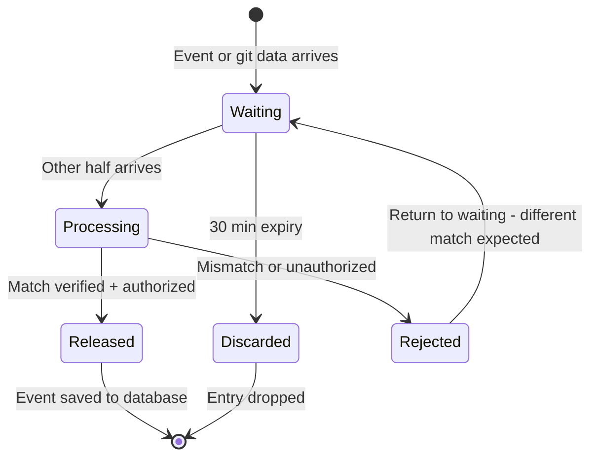
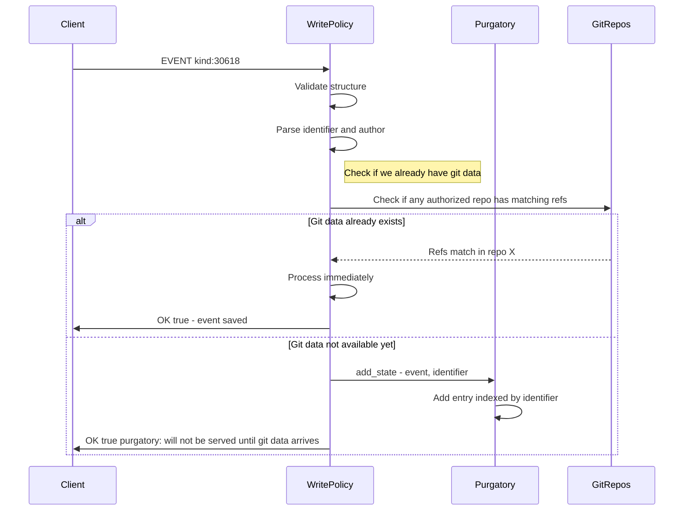
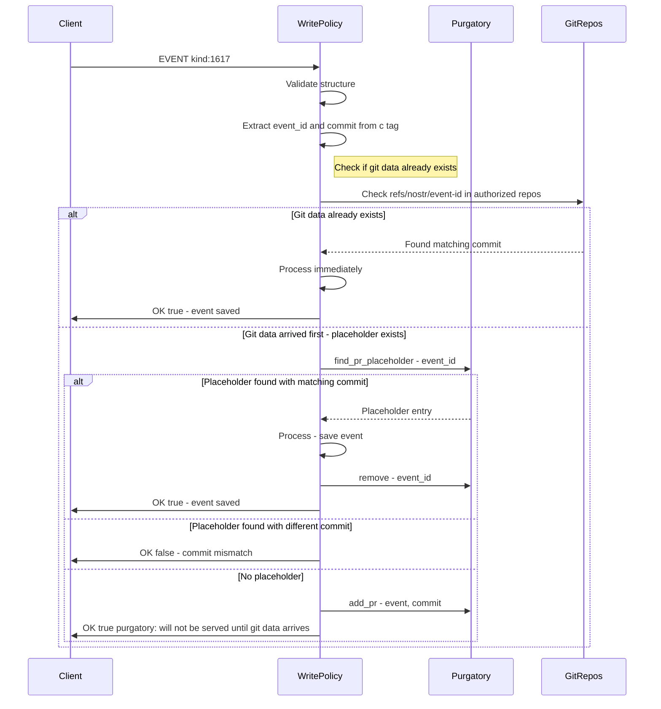
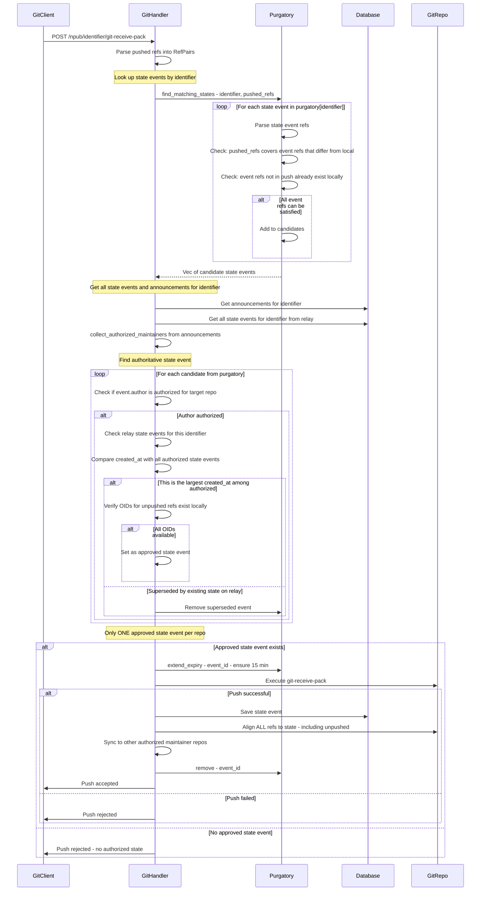
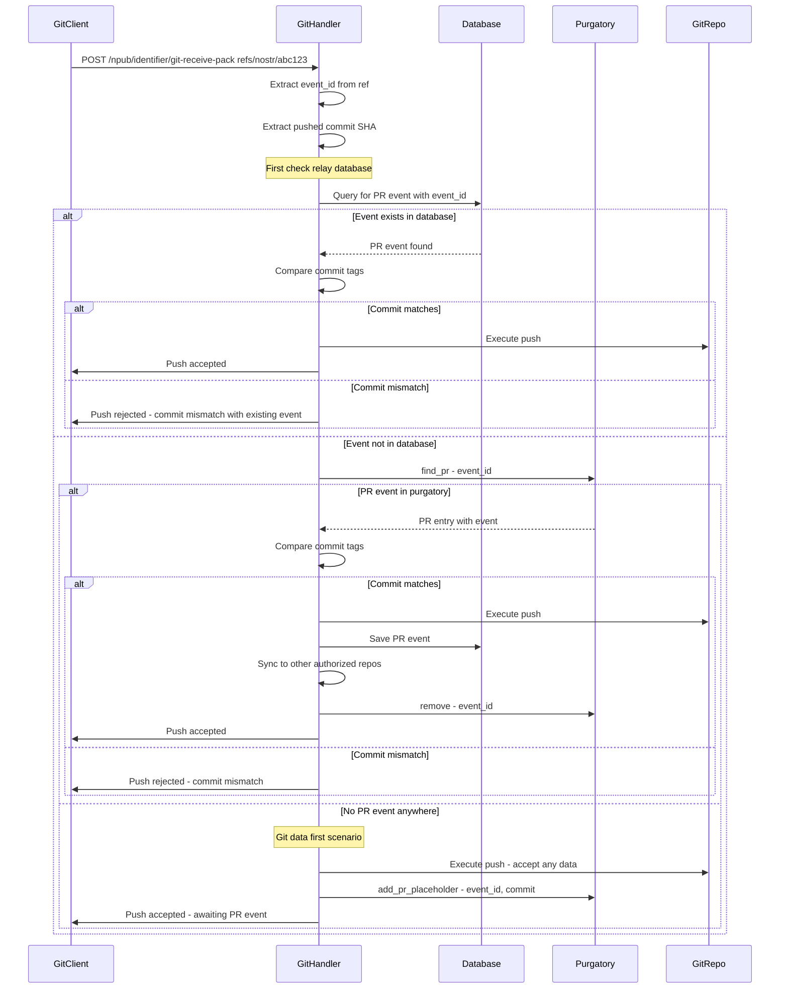
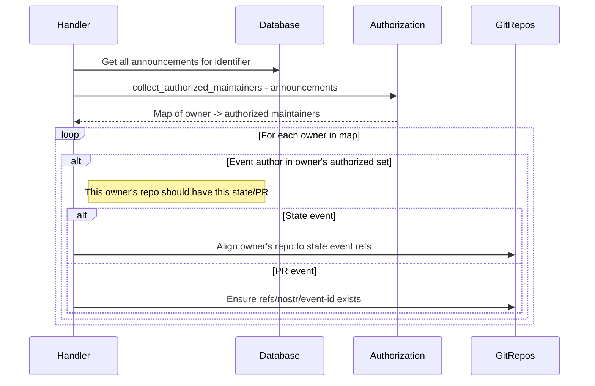
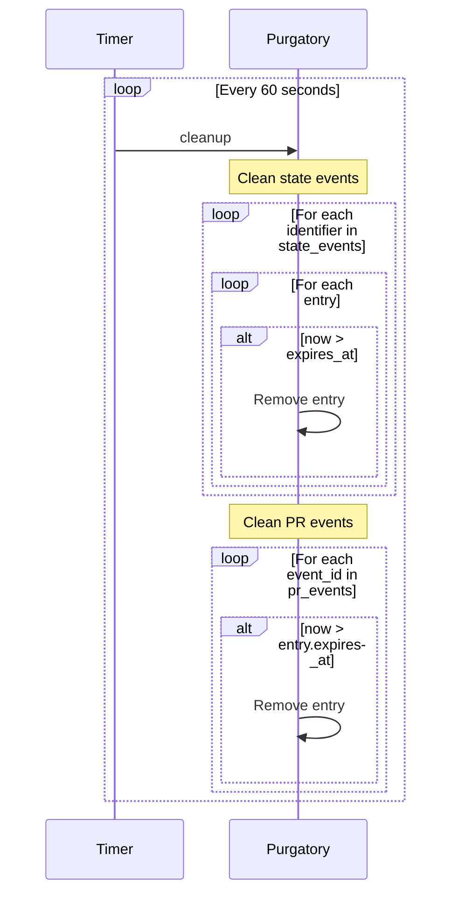

# Purgatory Implementation Design

## Overview

Purgatory is an in-memory holding area for nostr events that depend on git data that hasn't arrived yet, **and** for git data that arrived before its corresponding nostr event. Events/placeholders are held until the other half arrives, at which point they are processed and saved to the database.

**Spec Reference**: [GRASP-01 Purgatory Section](../grasp/01.md:20-22)

> Accepted repo state announcements, PRs and PR Updates SHOULD be accepted with message "purgatory: won't be served until git data arrives" and kept in purgatory (not served) until the related git data arrives and otherwise discarded after 30 minutes.

## Key Design Principles

### 1. Separate Storage for State vs PR Events

State events (kind 30618) and PR events (kind 1617/1618) have fundamentally different matching and authorization patterns. They are stored in **separate purgatory stores** with different indices:

- **State Events**: Indexed by `identifier` (d tag), matched via ref comparison
- **PR Events**: Indexed by `event_id`, matched directly via `refs/nostr/<event-id>`

### 2. Late Binding of Refs (State Events)

**Do NOT extract refs at event arrival time.** Extract and match refs at git push time.

**Why?** Multiple state events might be in purgatory with different target states. An older state event's git data might arrive after a newer one is received. By waiting until push time, we:

- Compare the pushed refs against each purgatory state event's expected state
- Handle out-of-order git data arrival correctly
- Only release events when their specific target state is achieved

### 3. Bidirectional Waiting (PR Events)

For PR events, **either side can arrive first**:

- **Event first**: PR event waits in purgatory for git push to `refs/nostr/<event-id>`
- **Git first**: Push creates placeholder, waits for PR event to arrive

### 4. Ref Pairs, Not Just Commits

State events define a target state: specific refs pointing to specific objects (commits or annotated tags). We match **ref name + object SHA** pairs, not just raw commits.

### 5. No Separate PurgatoryState Tracking

All entries use a single 30-minute expiry timer. When git push activity begins, we simply ensure at least 15 minutes remain on the timer (extend if needed). This eliminates complexity of tracking Secured vs Pending states.

## Event Lifecycle



## Data Structures

### RefPair - A single ref target

```rust
/// A reference name and its target object
#[derive(Debug, Clone, Hash, Eq, PartialEq)]
pub struct RefPair {
    /// Full ref name, e.g., "refs/heads/main" or "refs/tags/v1.0"
    pub ref_name: String,
    /// Target object SHA (commit or annotated tag)
    pub object_sha: String,
}
```

### StatePurgatoryEntry

```rust
pub struct StatePurgatoryEntry {
    /// The nostr state event (kind 30618) awaiting git data
    pub event: Event,

    /// The repository identifier from the event's 'd' tag
    pub identifier: String,

    /// Event author pubkey
    pub author: PublicKey,

    /// When this entry was added to purgatory
    pub created_at: Instant,

    /// Expiry deadline (30 min from creation, may be extended)
    pub expires_at: Instant,
}
```

### PrPurgatoryEntry

```rust
pub struct PrPurgatoryEntry {
    /// The nostr PR event, if received (None = git data arrived first)
    pub event: Option<Event>,

    /// The expected commit SHA from 'c' tag (if event exists)
    /// or the actual commit pushed (if git arrived first)
    pub commit: String,

    /// When this entry was added to purgatory
    pub created_at: Instant,

    /// Expiry deadline (30 min from creation, may be extended)
    pub expires_at: Instant,
}
```

**Note:** `PrPurgatoryEntry.event` being `None` indicates the "git data first" scenario - we have a placeholder waiting for the PR event.

### Purgatory Stores

```rust
pub struct Purgatory {
    /// State events indexed by identifier
    state_events: DashMap<String, Vec<StatePurgatoryEntry>>,

    /// PR events indexed by event_id (hex string)
    pr_events: DashMap<String, PrPurgatoryEntry>,
}
```

## Event Flows

### State Event (Kind 30618) Arrival



### PR Event (Kind 1617/1618) Arrival



### Git Push - State Event Matching

When a push arrives to normal refs (branches/tags), we check for matching state events:

**Key Rule**: For a given `pubkey/identifier` repo, there can only be **one authoritative state event** - the one with the largest `created_at` among all authorized maintainers. State events in purgatory are only processed if they aren't superseded by existing state events on the relay.



### Git Push - PR Event (refs/nostr/event-id)



### Sync to Other Maintainer Repos

After successfully processing a state event or PR, we sync to other authorized repos:



### Background Cleanup



## API Methods

### Purgatory

```rust
impl Purgatory {
    /// Create a new empty purgatory
    pub fn new() -> Self;

    // ==================== State Events ====================

    /// Add a state event (kind 30618) to purgatory
    /// Returns purgatory message for client response
    pub fn add_state(&self, event: Event, identifier: String) -> String;

    /// Find state events that could be satisfied by pushed refs
    /// Returns events where:
    /// - All refs in event are either in pushed_refs OR already exist locally
    /// - At least one ref in event is in pushed_refs (something to update)
    pub fn find_matching_states(
        &self,
        identifier: &str,
        pushed_refs: &[RefPair],
        local_refs: &HashMap<String, String>,
    ) -> Vec<Event>;

    /// Extend expiry for entries about to be processed
    /// Ensures at least `duration` remaining on timer
    pub fn extend_expiry(&self, event_ids: &[EventId], duration: Duration);

    /// Remove state event after successful processing
    pub fn remove_state(&self, event_id: &EventId);

    // ==================== PR Events ====================

    /// Add a PR event (kind 1617/1618) to purgatory
    /// Returns purgatory message for client response
    pub fn add_pr(&self, event: Event, commit: String) -> String;

    /// Add a placeholder for git-data-first scenario
    /// Called when push to refs/nostr/<event-id> arrives before the PR event
    pub fn add_pr_placeholder(&self, event_id: EventId, commit: String);

    /// Find PR entry by event ID
    /// Returns the entry if found (may or may not have event)
    pub fn find_pr(&self, event_id: &EventId) -> Option<PrPurgatoryEntry>;

    /// Find PR placeholder (git-data-first entry without event)
    pub fn find_pr_placeholder(&self, event_id: &EventId) -> Option<PrPurgatoryEntry>;

    /// Remove PR entry after successful processing
    pub fn remove_pr(&self, event_id: &EventId);

    // ==================== Maintenance ====================

    /// Remove expired entries (30 min)
    /// Returns count of removed entries
    pub fn cleanup(&self) -> usize;

    /// Get counts for metrics/debugging
    pub fn state_event_count(&self) -> usize;
    pub fn pr_event_count(&self) -> usize;
    pub fn pr_placeholder_count(&self) -> usize;

    /// Check if an event is in purgatory (either store)
    pub fn contains(&self, event_id: &EventId) -> bool;
}
```

### Helper: Extract and Match Refs

```rust
/// Extract ref pairs from a state event
pub fn extract_refs_from_state(event: &Event) -> Vec<RefPair> {
    // Parse refs/heads/* and refs/tags/* tags
    // Return vec of RefPair { ref_name, object_sha }
}

/// Check if a state event can be satisfied by a push
///
/// Returns true if:
/// - Every ref in state_refs is either in pushed_refs (matching SHA) OR in local_refs (matching SHA)
/// - At least one ref in state_refs is actually being changed by the push
pub fn can_satisfy_state(
    state_refs: &[RefPair],
    pushed_refs: &[RefPair],
    local_refs: &HashMap<String, String>,
) -> bool;

/// Get refs from state event that aren't being pushed but need updating
pub fn get_unpushed_refs(
    state_refs: &[RefPair],
    pushed_refs: &[RefPair],
) -> Vec<RefPair>;

/// Verify all OIDs from refs exist in the local git repo
pub fn verify_oids_exist(
    repo_path: &Path,
    refs: &[RefPair],
) -> Result<bool, git::Error>;
```

## Integration Points

### 1. Nip34WritePolicy Changes

```rust
pub struct Nip34WritePolicy {
    ctx: PolicyContext,
    purgatory: Arc<Purgatory>,  // Shared with git handlers
    // ... existing fields
}
```

### 2. handle_state Changes

On state event arrival:

**Key Rules**:

1. Reject if we already have a state event from this author for this identifier with a larger `created_at` date (outdated event)
2. If accepted, check if we need to sync repos with the same identifier

```rust
async fn handle_state(&self, event: &Event) -> WritePolicyResult {
    let identifier = extract_identifier(&event)?;
    let author = event.pubkey;
    let state_refs = extract_refs_from_state(&event);

    // Check for existing state event from this author with larger created_at
    let existing_states = self.database.get_state_events_by_author_identifier(
        &author,
        &identifier
    ).await?;

    for existing in existing_states {
        if existing.created_at > event.created_at {
            // Reject - we have a newer state from this author
            return WritePolicyResult::Reject {
                status: false,
                message: "rejected: newer state event exists for this author/identifier".into()
            };
        }
    }

    // Check if we already have matching git data
    let repos = self.find_repos_for_identifier(&identifier).await?;
    for repo in repos {
        if self.refs_match_state(&repo, &state_refs).await? {
            // Git data exists - process immediately
            // Also trigger sync check for other repos with same identifier
            // Pass the repo that has the git data so it can be used as source
            self.check_and_sync_repos_for_identifier(&identifier, &event, &repo).await?;
            return WritePolicyResult::Accept;
        }
    }

    // Add to purgatory
    let msg = self.purgatory.add_state(event.clone(), identifier);
    WritePolicyResult::Reject {
        status: true,  // Client sees OK
        message: msg.into()
    }
}
```

### 3. handle_pr_event Changes

On PR event arrival:

**Key Rule**: Incoming PR events supersede existing refs. If the existing `refs/nostr/<event-id>` ref has a different commit_id, the ref should be removed and the event stored in purgatory to await new git data.

```rust
async fn handle_pr_event(&self, event: &Event) -> WritePolicyResult {
    let commit = extract_c_tag_commit(&event)?;
    let event_id = event.id.to_hex();

    // Check if placeholder exists (git-data-first)
    if let Some(placeholder) = self.purgatory.find_pr_placeholder(&event.id) {
        if placeholder.commit == commit {
            self.purgatory.remove_pr(&event.id); // Note this shouldnt remove the git data
            return WritePolicyResult::Accept;
        } else {
            // Placeholder has different commit - incoming event supersedes
            // Update placeholder with new expected commit
            self.purgatory.remove_pr(&event.id);
            // TODO also remove git data
            let msg = self.purgatory.add_pr(event.clone(), commit);
            return WritePolicyResult::Reject {
                status: true,  // Client sees OK - in purgatory awaiting correct git data
                message: msg.into()
            };
        }
    }

    // Add to purgatory
    let msg = self.purgatory.add_pr(event.clone(), commit);
    WritePolicyResult::Reject {
        status: true,
        message: msg.into()
    }
}
```

### 4. Git Handler Changes

In `handle_receive_pack` for normal refs:

**Key Rule**: Refs are sent to a specific repo (`pubkey/identifier`), and there can only be **one authorized state event** for that repo. Therefore, this function returns a single `Option<Event>` rather than `Vec<Event>`.

```rust
async fn handle_state_refs_push(
    &self,
    identifier: &str,
    repo_owner: &str,
    pushed_refs: &[RefPair],
) -> Result<Option<Event>, GitError> {
    let local_refs = git::list_refs(&self.repo_path)?;

    // Find matching state events
    let candidates = self.purgatory.find_matching_states(
        identifier,
        pushed_refs,
        &local_refs,
    );

    // Get all state events from relay for this identifier
    let relay_states = self.database.get_state_events_for_identifier(identifier).await?;

    // Get announcements to determine authorization
    let announcements = self.database.get_announcements(identifier).await?;
    let auth_map = collect_authorized_maintainers(&announcements);

    // Find the authoritative state event (largest created_at among all authorized)
    let mut best_candidate: Option<(Event, Timestamp)> = None;

    // Check purgatory candidates
    for event in candidates {
        if let Some(maintainers) = auth_map.get(repo_owner) {
            if maintainers.contains(&event.pubkey.to_hex()) {
                // Check if this event is superseded by any relay state
                let superseded = relay_states.iter().any(|relay_state| {
                    let relay_authorized = auth_map.values()
                        .any(|m| m.contains(&relay_state.pubkey.to_hex()));
                    relay_authorized && relay_state.created_at > event.created_at
                });

                if superseded {
                    // Don't use this as best_candidate for THIS repo
                    // Note: Do NOT remove from purgatory - it may still be
                    // authoritative for a DIFFERENT repo with a different maintainer set
                    continue;
                }

                // Verify OIDs for unpushed refs exist
                let state_refs = extract_refs_from_state(&event);
                let unpushed = get_unpushed_refs(&state_refs, pushed_refs);
                if verify_oids_exist(&self.repo_path, &unpushed)? {
                    // Track best candidate by created_at
                    if best_candidate.is_none() || event.created_at > best_candidate.as_ref().unwrap().1 {
                        best_candidate = Some((event, event.created_at));
                    }
                }
            }
        }
    }

    // If we found an approved event, extend its expiry
    if let Some((ref event, _)) = best_candidate {
        self.purgatory.extend_expiry(&[event.id], Duration::from_secs(900));
    }

    Ok(best_candidate.map(|(e, _)| e))
}
```

For `refs/nostr/<event-id>` pushes:

**Key Rule**: If there is no event (neither in database nor in purgatory), a push of a different commit_id should be **accepted**. This is the "git-data-first" scenario where we're waiting for the PR event to arrive.

```rust
async fn handle_nostr_ref_push(
    &self,
    event_id: &str,
    pushed_commit: &str,
) -> Result<PushDecision, GitError> {
    // Check database first
    if let Some(event) = self.database.get_event_by_id(event_id).await? {
        let expected_commit = extract_c_tag_commit(&event)?;
        if expected_commit == pushed_commit {
            return Ok(PushDecision::Accept);
        } else {
            return Ok(PushDecision::Reject("commit mismatch with existing event"));
        }
    }

    // Check purgatory for PR event
    if let Some(entry) = self.purgatory.find_pr(&EventId::from_hex(event_id)?) {
        if let Some(event) = entry.event {
            // Event exists in purgatory - must match commit
            let expected_commit = extract_c_tag_commit(&event)?;
            if expected_commit == pushed_commit {
                // Remove from purgatory before returning
                self.purgatory.remove_pr(&EventId::from_hex(event_id)?); // note this shouldnt delete the git data
                return Ok(PushDecision::AcceptAndRelease(event));
            } else {
                return Ok(PushDecision::Reject("commit mismatch with purgatory event"));
            }
        } else {
            // Placeholder exists (previous push, no event yet)
            // Accept and update placeholder with new commit
            // This allows re-pushing with corrected data before event arrives
            return Ok(PushDecision::AcceptAndUpdatePlaceholder(pushed_commit.to_string()));
        }
    }

    // No event anywhere - git-data-first scenario
    // Accept ANY commit and create placeholder awaiting the PR event
    Ok(PushDecision::AcceptAndCreatePlaceholder(pushed_commit.to_string()))
}
// TODO when AcceptAndUpdatePlaceholder gets called purgatory must get udpated with a new / updated entry either here of where AcceptAndCreatePlaceholder is handled
```

### 5. Main.rs Changes

```rust
// During startup
let purgatory = Arc::new(Purgatory::new());

// Pass to WritePolicy
let write_policy = Nip34WritePolicy::new(
    &config.domain,
    database.clone(),
    &git_data_path,
    purgatory.clone(),
);

// Pass to git handlers (via shared state)
let git_state = GitState {
    purgatory: purgatory.clone(),
    database: database.clone(),
    // ...
};

// Spawn cleanup task
let purgatory_cleanup = purgatory.clone();
tokio::spawn(async move {
    let mut interval = tokio::time::interval(Duration::from_secs(60));
    loop {
        interval.tick().await;
        let removed = purgatory_cleanup.cleanup();
        if removed > 0 {
            tracing::debug!("Purgatory cleanup removed {} expired entries", removed);
        }
    }
});
```

## Post-Push Sync Flow

After successfully processing a state or PR event, sync to other maintainer repos:

**Key Rules for State Events (30618)**:

1. Fetch all state events matching the identifier from the database
2. Check if another existing state event supersedes this one (the maintainer set may be different, so another maintainer may have a more recent state event)
3. Only sync if this event is not superseded

```rust
async fn sync_to_other_repos(
    &self,
    identifier: &str,
    event: &Event,
    processed_repo_owner: &str,
) -> Result<usize, SyncError> {
    let announcements = self.database.get_announcements(identifier).await?;
    let auth_map = collect_authorized_maintainers(&announcements);

    // Fetch all state events for this identifier to check for superseding
    let all_state_events = self.database.get_state_events_for_identifier(identifier).await?;

    let mut synced = 0;
    for (owner, maintainers) in auth_map {
        // Skip the repo we just processed
        if owner == processed_repo_owner {
            continue;
        }

        // Check if event author is authorized for this owner's repo
        if maintainers.contains(&event.pubkey.to_hex()) {
            let repo_path = self.repo_path_for_owner(&owner);

            match event.kind.as_u64() {
                30618 => {
                    // State event - check if another state event supersedes this one
                    // for THIS owner's repo (maintainer sets may differ between owners)
                    let owner_maintainers = auth_map.get(&owner).cloned().unwrap_or_default();

                    // Find the authoritative state for this owner's repo
                    let superseding_state = all_state_events.iter()
                        .filter(|s| owner_maintainers.contains(&s.pubkey.to_hex()))
                        .filter(|s| s.created_at > event.created_at)
                        .max_by_key(|s| s.created_at);

                    if let Some(newer_state) = superseding_state {
                        // This event is superseded by a more recent state
                        // for this owner's repo - skip syncing this event
                        tracing::debug!(
                            "Skipping sync to {}: event {} superseded by {}",
                            owner,
                            event.id,
                            newer_state.id
                        );
                        continue;
                    }

                    // No superseding state - align refs
                    let state_refs = extract_refs_from_state(&event);
                    self.align_refs(&repo_path, &state_refs)?;
                }
                1617 | 1618 => {
                    // PR event - ensure nostr ref exists
                    let commit = extract_c_tag_commit(&event)?;
                    self.ensure_nostr_ref(&repo_path, &event.id, &commit)?;
                }
                _ => {}
            }
            synced += 1;
        }
    }

    Ok(synced)
}
```

## Implementation File Structure

```
src/
├── purgatory/
│   ├── mod.rs              # Purgatory struct, public API
│   ├── types.rs            # RefPair, StatePurgatoryEntry, PrPurgatoryEntry
│   ├── state_events.rs     # State event purgatory logic
│   ├── pr_events.rs        # PR event purgatory logic
│   └── helpers.rs          # extract_refs_from_state, can_satisfy_state, etc.
├── nostr/
│   ├── builder.rs          # Modified: Nip34WritePolicy accepts Arc<Purgatory>
│   └── policy/
│       ├── state.rs        # Modified: handle_state uses purgatory
│       └── pr_event.rs     # Modified: handle_pr_event uses purgatory
├── git/
│   └── handlers.rs         # Modified: handle_receive_pack integrates purgatory
└── main.rs                 # Modified: creates Purgatory, spawns cleanup task
```

## Additional Type Definitions

### PushDecision Enum

Used by `handle_nostr_ref_push` to communicate different outcomes to the caller:

```rust
/// Result of evaluating a push to refs/nostr/<event-id>
pub enum PushDecision {
    /// Push is valid - event exists in database and commit matches
    Accept,

    /// Push valid and event should be released from purgatory to database
    AcceptAndRelease(Event),

    /// Push valid - create new placeholder awaiting PR event
    AcceptAndCreatePlaceholder(String),  // commit SHA

    /// Push valid - update existing placeholder with new commit
    AcceptAndUpdatePlaceholder(String),  // new commit SHA

    /// Push rejected with reason
    Reject(&'static str),
}
```

### WritePolicyResult Clarification

The design uses a pattern where purgatory events return `status: true` but the event is NOT saved:

```rust
// Event goes to purgatory - client sees OK but event not served until git data arrives
WritePolicyResult::Reject {
    status: true,  // Nostr OK message to client
    message: "purgatory: won't be served until git data arrives".into()
}

// Event rejected - client sees error
WritePolicyResult::Reject {
    status: false,  // Nostr error message to client
    message: "rejected: reason...".into()
}

// Event accepted and saved to database
WritePolicyResult::Accept
```

**Note:** This is a quirk of using the `WritePolicyResult::Reject` variant for purgatory - the `status: true` ensures the client receives an OK response, but since we're in the Reject variant, the event is not automatically saved to the database. The purgatory mechanism holds it until git data arrives.

## Test Scenarios

### State Event Tests

1. **Event arrives, git data exists** - Event processed immediately, saved to DB
2. **Event arrives, git data doesn't exist** - Event goes to purgatory, client sees OK
3. **Git push arrives, matching event in purgatory** - Event released from purgatory, saved to DB
4. **Git push arrives, no matching event** - Push rejected (no authorized state)
5. **Event expires in purgatory** - Entry removed after 30 minutes (dont implement test due to 30m wait)
6. **Multiple state events for same identifier** - Late binding at push time selects correct one

### PR Event Tests

1. **PR event arrives, git data exists** - Event processed immediately, saved to DB
2. **PR event arrives, no git data** - Event goes to purgatory awaiting git push
3. **PR event arrives, placeholder exists with matching commit** - Event released, saved to DB
4. **PR event arrives, placeholder exists with different commit** - Ref deleted, event to purgatory
5. **Git push to refs/nostr/ arrives, PR event exists in purgatory** - Event released, ref created
6. **Git push to refs/nostr/ arrives, no PR event** - Placeholder created, awaiting event
7. **Second git push updates placeholder** - Placeholder commit updated

### Edge Cases (NOT TESTED)

1. **Relay restart** - All purgatory entries lost (acceptable per design)
2. **Same event submitted twice** - Deduplicated by event ID
3. **Push timeout during processing** - Entry expiry extended to 15 min minimum
4. **Race between event and git push** - Whichever completes the pair triggers release
