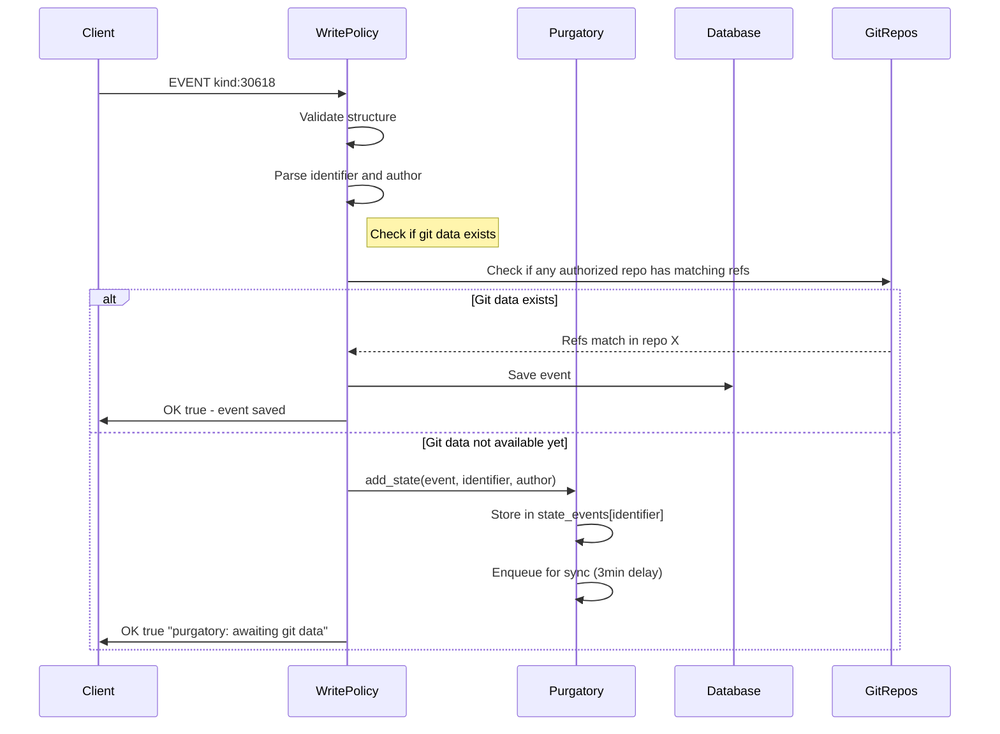
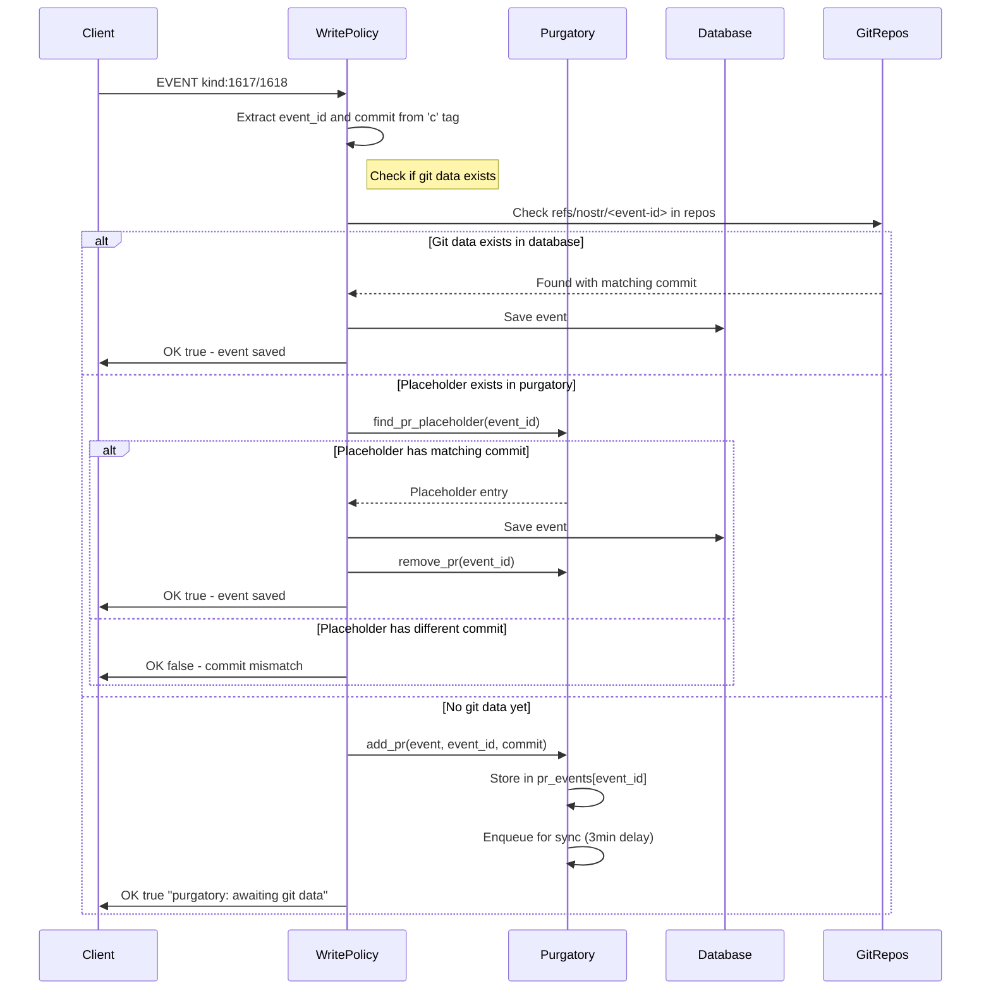
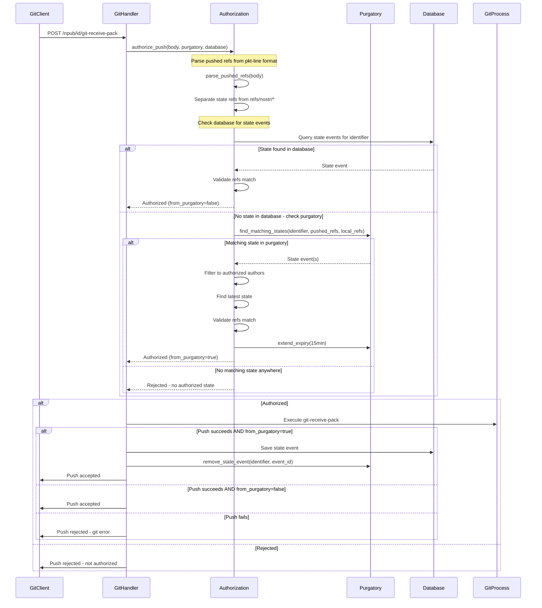
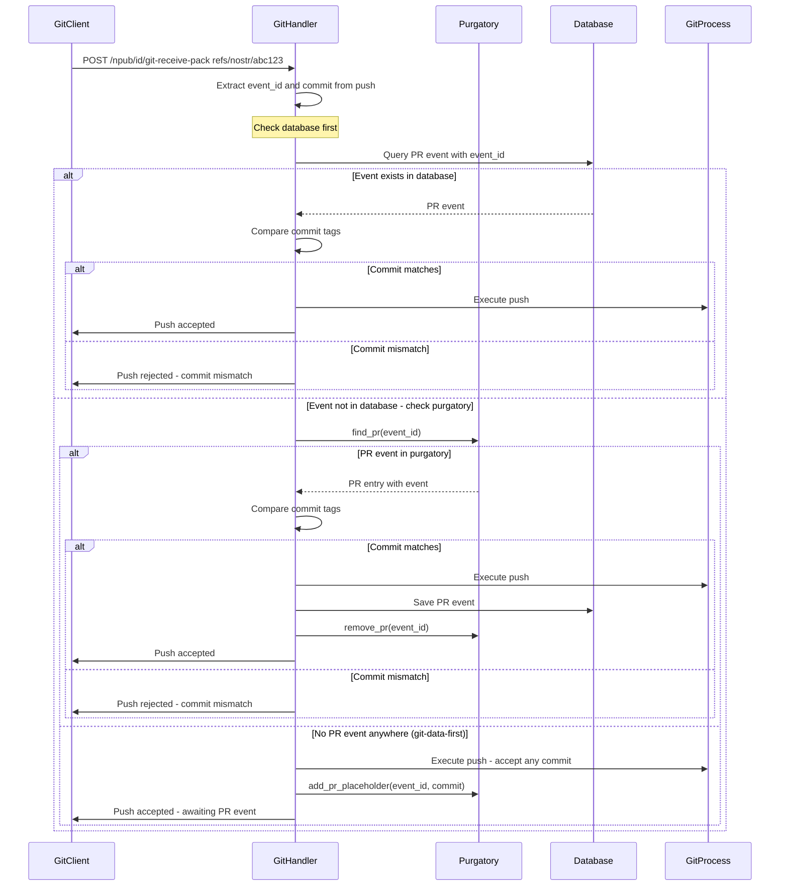

# Purgatory: In-Memory Holding Area for Events Awaiting Git Data

**Status**: ✅ Implemented  
**Implementation**: [`src/purgatory/`](../../src/purgatory/)  
**Related**: [`docs/explanation/architecture.md`](architecture.md) - System architecture overview

---

## Overview

Purgatory is an in-memory holding area that solves two related problems in GRASP:

### Problem 1: "Which arrives first?" (State and PR events)

Either nostr events or git pushes can arrive in any order:

- **Event first**: Event waits in purgatory until git data arrives
- **Git first**: Placeholder waits in purgatory until event arrives

When both halves arrive, they are processed together and saved to the database.

**Spec Reference**: [GRASP-01 Purgatory Section](https://github.com/DanConwayDev/grasp/blob/main/01.md#purgatory)

> Accepted repo state announcements, PRs and PR Updates SHOULD be accepted with message "purgatory: won't be served until git data arrives" and kept in purgatory (not served) until the related git data arrives and otherwise discarded after 30 minutes.

### Problem 2: Misleading empty repository announcements

When a repository announcement arrives, we must create the bare git repo immediately so pushes can succeed. But if no git data ever arrives, we would serve an empty repo and its announcement indefinitely—clients see the announcement, try to clone, and get nothing.

**Solution**: New announcements go to **announcement purgatory** instead of being immediately accepted:

1. **Announcement arrives** → Create bare repo immediately, add announcement to purgatory
2. **Git data arrives** → Promote announcement from purgatory to active (now served to clients)
3. **No git data before expiry** → Delete bare repo, discard announcement (never served)

This ensures we only serve announcements for repos that actually have content.

---

## Key Design Principles

### 1. Graceful-Shutdown Persistence

Purgatory state is **saved to disk on graceful shutdown** and **restored on startup**. This preserves in-flight work across planned restarts (deployments, reboots).

On `SIGINT` / Ctrl-C, `main.rs` calls `purgatory.save_to_disk()` before exiting. On startup, if the state file exists, `purgatory.restore_from_disk()` is called before the server begins accepting connections.

**What is persisted:**

| Store | Persisted? | Notes |
|-------|-----------|-------|
| `announcement_purgatory` | ✅ Yes | Non-soft-expired entries only (bare repo must exist) |
| `state_events` | ✅ Yes | All active entries |
| `pr_events` | ✅ Yes | Both events and placeholders |
| `expired_events` | ✅ Yes | Prevents re-sync loops after restart |
| `sync_queue` | ❌ No | Rebuilt automatically after restore |

**What is NOT persisted (unclean shutdown):**

On a crash or `SIGKILL`, the state file is not written. In that case:

- Events are still on other relays (can be re-submitted)
- Git data can be re-pushed
- 30-minute expiry means data is transient anyway

**State file location:** `<git_data_path>/purgatory-state.json`

**Downtime accounting:** Expiry deadlines are stored as duration offsets from the save timestamp. On restore, elapsed downtime is subtracted from each deadline. Entries that expired during downtime are immediately swept by the next cleanup tick.

**Soft-expired announcements are excluded:** Their bare repos have already been deleted, so they cannot be meaningfully restored. They will be re-fetched via background sync if needed.

### 2. Separate Storage for Each Event Type

| Store | Index | Purpose |
|-------|-------|---------|
| `announcement_purgatory` | `(PublicKey, String)` — `(owner, identifier)` | Announcements awaiting git data |
| `state_events` | `identifier` (d tag) | State events awaiting git data |
| `pr_events` | `event_id` (hex string) | PR events awaiting git data |

Announcement purgatory uses `(pubkey, identifier)` because identifier alone is not unique across different owners.

### 3. Late Binding for State Events

**Critical:** Do NOT extract refs from state events at arrival time. Extract and match refs **at git push time**.

**Why?** Multiple state events might be in purgatory with different target states. An older state event's git data might arrive after a newer one is received. By waiting until push time:

- Compare pushed refs against each purgatory state event's expected state
- Handle out-of-order git data arrival correctly
- Only release events when their specific target state is achieved

See [`src/purgatory/helpers.rs:can_satisfy_state`](../../src/purgatory/helpers.rs) for implementation.

### 4. Bidirectional Waiting for PR Events

For PR events, **either side can arrive first**:

| Scenario | What Happens |
|----------|--------------|
| **Event first** | PR event waits in purgatory for git push to `refs/nostr/<event-id>` |
| **Git first** | Push creates placeholder entry waiting for PR event |

Placeholders are identified by `PrPurgatoryEntry.event == None`.

**GRASP-06 scoped placeholders:** A push to `/prs/<npub>/<id>.git` creates a *scoped* placeholder that additionally records `(submitter, identifier)` from the URL. When the PR event arrives, its signer and a-tag d-value are cross-checked against the scope. An un-scoped placeholder (created by a standard-endpoint push) can be upgraded to a scoped one via `try_upgrade_to_scoped`, which performs the check-and-modify atomically under a single DashMap shard lock — preventing a TOCTOU race where two concurrent `/prs/` pushes for the same `event_id` could otherwise both see "un-scoped" and the second write would silently overwrite the first.

### 5. Authorization During Push (Not After)

**Critical for avoiding deadlock:** Authorization checks **both database and purgatory** during push validation.

Without this, we'd have a deadlock:
1. State event arrives → No git data → Goes to **purgatory** (not database)
2. Git push arrives → Authorization checks **database only** → No state found → **REJECTED** ❌

With purgatory checking during authorization:
1. State event arrives → No git data → Goes to purgatory
2. Git push arrives → Checks **database + purgatory** → State found → **AUTHORIZED** ✅
3. After push succeeds → Save event to database → Remove from purgatory

See [`src/git/authorization.rs`](../../src/git/authorization.rs) for implementation.

### 6. Announcement Purgatory: Bare Repo Created Immediately

**Decision:** Create the bare git repo when announcement enters purgatory.

**Why:** Git pushes may arrive at any time. Without a repo, pushes fail.

**Consequence:** We allocate disk space for repos that may expire unused. Must delete repos on expiry.

### 7. Replacement Announcements Skip Purgatory

**Decision:** Announcements replacing an existing active (database) announcement are accepted immediately.

**Why:** The repository is already proven active with content.

**How:** Check if active announcement exists for `(pubkey, identifier)` before routing to purgatory.

---

## Data Structures

### Core Types

```rust
/// A reference name and its target object
#[derive(Debug, Clone, Hash, Eq, PartialEq)]
pub struct RefPair {
    pub ref_name: String,    // e.g., "refs/heads/main"
    pub object_sha: String,  // commit or annotated tag SHA
}

/// A ref update in a git push
#[derive(Debug, Clone)]
pub struct RefUpdate {
    pub old_oid: String,
    pub new_oid: String,
    pub ref_name: String,
}
```

### Announcement Purgatory Entry

```rust
pub struct AnnouncementPurgatoryEntry {
    /// The kind 30617 announcement event
    pub event: Event,

    /// Repository identifier from 'd' tag
    pub identifier: String,

    /// Event author pubkey
    pub owner: PublicKey,

    /// Path to the bare git repo on disk (created immediately on entry)
    pub repo_path: PathBuf,

    /// Relay URLs from 'relays'/'clone' tags — for sync registration
    pub relays: HashSet<String>,

    /// When added to purgatory
    pub created_at: Instant,

    /// Expiry deadline (30 min from creation, may be extended)
    pub expires_at: Instant,

    /// Whether the bare repo has been deleted (soft expiry phase)
    pub soft_expired: bool,
}
```

**Indexed by `(pubkey, identifier)`** because identifier is not unique across different owners.

### State Purgatory Entry

```rust
pub struct StatePurgatoryEntry {
    /// The nostr state event (kind 30618) awaiting git data
    pub event: Event,

    /// Repository identifier from 'd' tag
    pub identifier: String,

    /// Event author pubkey
    pub author: PublicKey,

    /// When added to purgatory
    pub created_at: Instant,

    /// Expiry deadline (30 min from creation, may be extended)
    pub expires_at: Instant,
}
```

**Note:** Refs are NOT extracted at creation time. They're extracted at push time for late binding.

### PR Purgatory Entry

```rust
pub struct PrPurgatoryEntry {
    /// The nostr PR event, if received (None = git data arrived first)
    pub event: Option<Event>,

    /// Expected commit SHA from 'c' tag (if event exists)
    /// or actual commit pushed (if git arrived first)
    pub commit: String,

    /// When added to purgatory
    pub created_at: Instant,

    /// Expiry deadline (30 min from creation)
    pub expires_at: Instant,

    /// GRASP-06 /prs/ scope, if the placeholder was created by a /prs/ push.
    /// When set, the arriving PR event must have signer == submitter and
    /// one of its a-tag d-values == identifier.
    pub prs_scope: Option<PrsPlaceholderScope>,
}
```

**Key:** `event: None` indicates a placeholder (git-data-first scenario). `prs_scope: Some(…)` means the placeholder was created by a `/prs/` push and carries the URL's `(submitter, identifier)` binding.

### Purgatory Stores

```rust
pub struct Purgatory {
    /// Announcement events indexed by (owner, identifier)
    announcement_purgatory: DashMap<(PublicKey, String), AnnouncementPurgatoryEntry>,

    /// State events indexed by identifier (d tag)
    /// Multiple state events per identifier allowed (different authors)
    state_events: DashMap<String, Vec<StatePurgatoryEntry>>,

    /// PR events indexed by event_id (hex string)
    /// Single entry per event ID
    pr_events: DashMap<String, PrPurgatoryEntry>,

    /// Sync queue for background git data fetching
    sync_queue: DashMap<String, SyncQueueEntry>,

    /// Events that previously expired without git data (prevents re-sync loops)
    expired_events: DashMap<EventId, Instant>,
}
```

### Persistence State (Disk Format)

`Instant` fields cannot be serialized directly. Each entry type has a corresponding `Serializable*` wrapper that stores time fields as `u64` second offsets from a `saved_at: SystemTime` reference point. On restore, elapsed downtime is subtracted to produce the correct remaining TTL.

```rust
struct PurgatoryState {
    version: u32,                    // currently 1
    saved_at: SystemTime,            // reference for offset math

    /// Non-soft-expired announcements indexed by "owner_hex:identifier"
    announcement_purgatory: HashMap<String, SerializableAnnouncementPurgatoryEntry>,

    /// State events indexed by repository identifier
    state_events: HashMap<String, Vec<SerializableStatePurgatoryEntry>>,

    /// PR events (and placeholders) indexed by event ID hex
    pr_events: HashMap<String, SerializablePrPurgatoryEntry>,

    /// Expired event IDs → approximate expiry SystemTime
    expired_events: HashMap<String, SystemTime>,
}
```

The `announcement_purgatory` field uses `#[serde(default)]` so that state files written before announcement persistence was added (version 1 without the field) still deserialize correctly.

---

## Announcement Purgatory Flows

### New Announcement Flow

```
Announcement arrives
    |
    v
Is there an active announcement for (pubkey, identifier) in DB?
    |
    +-- YES --> Accept immediately (replacement, repo already proven)
    |
    +-- NO --> Is there a purgatory entry for (pubkey, identifier)?
                |
                +-- YES --> Replace purgatory entry, extend expiry 30 min
                |           Return OK to client (but don't serve)
                |
                +-- NO --> Create bare repo
                           Add to purgatory
                           Return OK to client (but don't serve)
```

### Git Data Arrival → Promotion

```
Git push/fetch completes with data
    |
    v
process_purgatory_announcements() called
    |
    v
Is there a purgatory announcement for (owner, identifier)?
    |
    +-- YES --> promote_announcement() removes from purgatory
    |           Save event to database
    |           Notify WebSocket clients
    |           (Sync upgrades to Full automatically via SelfSubscriber)
    |
    +-- NO --> Normal processing
```

### State Event Arrival for Purgatory Announcement

```
State event arrives
    |
    v
fetch_repository_data_with_purgatory() checks DB + purgatory
    |
    +-- Announcement found in purgatory -->
    |       Validate authorization against purgatory announcement
    |       Extend purgatory announcement expiry (reset 30-min timer)
    |       If soft-expired: recreate bare repo, clear soft_expired flag
    |       Route state event to state purgatory
    |
    +-- No announcement anywhere --> Reject
```

### Announcement Expiry (Two-Phase Soft Expiry)

The protocol specifies 30-minute expiry for announcements. We implement a two-phase soft expiry:

**Phase 1 — Initial 30-minute expiry (`soft_expired == false`):**
- Delete the bare git repo (frees disk space, respects protocol expiry)
- Set `soft_expired = true`
- Extend `expires_at` by 24 hours (`SOFT_EXPIRY_EXTENDED`)
- Continue syncing state events (same as active purgatory)

**Phase 2 — 24-hour soft expiry (`soft_expired == true`):**
- Add event ID to `expired_events` (prevents re-sync loops)
- Remove entry completely from `announcement_purgatory`

**Why soft expiry?** Without it, we'd face a dilemma:

- Add expired announcements to `failed_events` → permanently reject future state events, losing potential revival when state events arrive late
- Re-fetch the announcement event on every sync cycle → wasting bandwidth and creating unnecessary sync traffic

Soft expiry retains the event for 24 hours so that late-arriving state events (e.g. from a slow sync) can revive the announcement without forcing a full re-announcement flow.

**Revival:** If a state event arrives for a soft-expired announcement, `extend_announcement_expiry()` recreates the bare repo, clears `soft_expired`, and resets the 30-minute timer.

### Expiry Extension Triggers

The 30-minute purgatory timer is reset (extended) in three scenarios:

| Trigger | Location | Why |
|---------|----------|-----|
| State event arrives | `StatePolicy::process_state_event()` | Repo is actively receiving metadata |
| Git push authorized against purgatory state | `get_state_authorization_for_specific_owner_repo()` | Repo is actively receiving git data |
| Replacement announcement arrives | `AnnouncementPolicy::validate()` | Announcement updated |

All three call `purgatory.extend_announcement_expiry(owner, identifier, 1800s)`.

### Purgatory Lifecycle

```
                    ┌─────────────────────────────────────┐
                    │                                     │
                    v                                     │
Announcement ──> ACTIVE ──────────────────────────────────┤
  arrives        (bare repo exists)                       │
                    │                                     │
                    ├── Git data ──> PROMOTED (exit)      │
                    │                                     │
                    ├── Deletion ──> REMOVED (exit)       │
                    │                                     │
                    v                                     │
               SOFT_EXPIRED ──────────────────────────────┘
               (bare repo deleted,        ^
                event retained)           │
                    │                     │
                    ├── State event arrives (revival)
                    │
                    └── Extended expiry ──> REMOVED (exit)
```

| Exit | Trigger | Action |
|------|---------|--------|
| **Promotion** | Git data arrives | Move to database, sync upgrades to Full |
| **Soft expiry** | Initial 30-min timeout | Delete bare repo, retain event, continue sync |
| **Full expiry** | 24-hour soft expiry | Add to expired_events, remove from purgatory |
| **Deletion** | Kind 5 event | Delete bare repo, remove from purgatory |
| **Replacement** | Newer announcement (same pubkey, identifier) | Replace entry, extend expiry |
| **Service change** | Newer announcement removes our service | Remove from purgatory |

---

## State and PR Event Flows

### State Event Arrival (Kind 30618)



### PR Event Arrival (Kind 1617/1618)



### Git Push - State Refs

**Critical:** Authorization happens BEFORE git-receive-pack execution, checking both database and purgatory.



### Git Push - PR Refs (refs/nostr/event-id)



---

## Background Sync

Purgatory includes a background sync system that fetches git data from remote servers when events arrive before git data.

### Sync Architecture

```
┌─────────────────────────────────────────────────────┐
│                  Sync Loop (1s)                     │
│  - Checks sync_queue for ready identifiers          │
│  - Spawns tasks for each ready identifier           │
└─────────────────────────────────────────────────────┘
                         │
                         ▼
┌─────────────────────────────────────────────────────┐
│           sync_identifier(identifier)               │
│  1. Try all non-throttled URLs sequentially         │
│  2. Check if complete after each fetch              │
│  3. Enqueue with throttled domains if incomplete    │
└─────────────────────────────────────────────────────┘
                         │
                         ▼
┌─────────────────────────────────────────────────────┐
│      sync_identifier_from_url(identifier, url)      │
│  1. Collect needed OIDs from purgatory events       │
│  2. Fetch OIDs from remote URL                      │
│  3. Process newly available git data                │
└─────────────────────────────────────────────────────┘
                         │
                         ▼
┌─────────────────────────────────────────────────────┐
│   process_newly_available_git_data(repo, oids)      │
│  1. Find satisfiable announcement in purgatory      │
│  2. Find satisfiable state events in purgatory      │
│  3. Find satisfiable PR events in purgatory         │
│  4. Save events to database                         │
│  5. Sync git data to other owner repos              │
│  6. Remove from purgatory                           │
└─────────────────────────────────────────────────────┘
```

### Sync Queue Entry

```rust
pub struct SyncQueueEntry {
    /// When to attempt next sync
    pub next_attempt: Instant,
    
    /// Number of sync attempts made
    pub attempt_count: u32,
    
    /// Whether a sync task is currently running
    pub in_progress: bool,
}
```

**Backoff strategy:**
- First attempt: 20 seconds
- Second attempt: 40 seconds
- Subsequent attempts: capped at 2 minutes

### Sync Delays

| Scenario | Delay | Reason |
|----------|-------|--------|
| User-submitted event | 3 minutes | Give time for git push to arrive |
| Sync-triggered event | 500ms | Batch burst arrivals from negentropy |

### Domain Throttling

```rust
pub struct ThrottleManager {
    /// Max requests per domain per minute
    max_requests_per_minute: usize,
    
    /// Tracking window duration
    window_duration: Duration,
    
    /// Per-domain throttle state
    domains: DashMap<String, DomainThrottle>,
}
```

**Rate limiting:**
- Default: 5 concurrent requests per domain, 30 requests per minute
- Tracks request timestamps in a sliding window
- Queues identifiers when domain is throttled
- Processes queue when capacity frees up

See [`src/purgatory/sync/throttle.rs`](../../src/purgatory/sync/throttle.rs) for implementation.

---

## Purgatory API

### Announcement Purgatory

```rust
impl Purgatory {
    /// Add an announcement to purgatory (bare repo already created by caller)
    pub fn add_announcement(
        &self,
        event: Event,
        identifier: String,
        owner: PublicKey,
        repo_path: PathBuf,
        relays: HashSet<String>,
    );

    /// Promote announcement: remove from purgatory, return event for DB save
    pub fn promote_announcement(
        &self,
        owner: &PublicKey,
        identifier: &str,
    ) -> Option<Event>;

    /// Get announcements by identifier (for authorization checks)
    pub fn get_announcements_by_identifier(
        &self,
        identifier: &str,
    ) -> Vec<AnnouncementPurgatoryEntry>;

    /// Extend expiry (and revive soft-expired entries, recreating bare repo)
    pub fn extend_announcement_expiry(
        &self,
        owner: &PublicKey,
        identifier: &str,
        duration: Duration,
    );

    /// Get all announcements for sync registration
    pub fn announcements_for_sync(&self) -> Vec<AnnouncementPurgatoryEntry>;
}
```

### State and PR Purgatory

```rust
impl Purgatory {
    /// Add a state event to purgatory
    /// Automatically enqueues for sync with 3min delay
    pub fn add_state(&self, event: Event, identifier: String, author: PublicKey);
    
    /// Add a PR event to purgatory
    /// Automatically enqueues for sync with 3min delay
    pub fn add_pr(&self, event: Event, event_id: String, commit: String);
    
    /// Add a PR placeholder (git-data-first scenario, standard endpoint)
    pub fn add_pr_placeholder(&self, event_id: String, commit: String);

    /// Add a scoped PR placeholder (git-data-first scenario, /prs/ endpoint)
    pub fn add_prs_pr_placeholder(
        &self,
        event_id: String,
        commit: String,
        submitter: PublicKey,
        identifier: String,
    );

    /// Atomically upgrade an un-scoped placeholder to a scoped one.
    ///
    /// Used by the /prs/ post-push path (edge case B2) when a standard-endpoint
    /// push created an un-scoped placeholder before the /prs/ push arrived.
    /// The check-and-modify happen under a single DashMap shard lock, so two
    /// concurrent /prs/ pushes for the same event_id cannot both win the upgrade.
    /// Returns true if the upgrade was applied, false otherwise.
    pub fn try_upgrade_to_scoped(
        &self,
        event_id: &str,
        commit: String,
        submitter: PublicKey,
        identifier: String,
    ) -> bool;

    /// Find state events waiting for an identifier
    pub fn find_state(&self, identifier: &str) -> Vec<StatePurgatoryEntry>;
    
    /// Find state events that match pushed refs (late binding)
    pub fn find_matching_states(
        &self,
        identifier: &str,
        pushed_updates: &[RefUpdate],
        local_refs: &HashMap<String, String>,
    ) -> Vec<Event>;
    
    /// Find a PR entry by event ID
    pub fn find_pr(&self, event_id: &str) -> Option<PrPurgatoryEntry>;
    
    /// Find a PR placeholder specifically (git-data-first)
    pub fn find_pr_placeholder(&self, event_id: &str) -> Option<String>;

    /// Remove all state events for an identifier
    pub fn remove_state(&self, identifier: &str);
    
    /// Remove a specific state event by event ID
    pub fn remove_state_event(&self, identifier: &str, event_id: &EventId);
    
    /// Remove a PR entry
    pub fn remove_pr(&self, event_id: &str);
}
```

### Maintenance

```rust
impl Purgatory {
    /// Remove expired entries (called every 60 seconds)
    /// Handles two-phase soft expiry for announcements
    pub fn cleanup(&self);
    
    /// Extend expiry for state/PR entries about to be processed
    pub fn extend_expiry(&self, identifier: &str, event_ids: &[EventId], duration: Duration);
    
    /// Check if an event previously expired (prevents re-sync loops)
    pub fn is_expired(&self, event_id: &EventId) -> bool;
}
```

---

## Helper Functions

### State Event Matching

```rust
/// Extract ref pairs from a state event
pub fn extract_refs_from_state(event: &Event) -> Vec<RefPair>;

/// Check if a state event can be satisfied by a push
/// Returns true if:
/// - Every ref in state is either in pushed_refs OR in local_refs
/// - At least one ref in state is being changed by the push
pub fn can_satisfy_state(
    state_refs: &[RefPair],
    pushed_refs: &[RefPair],
    local_refs: &HashMap<String, String>,
) -> bool;

/// Check if a state event can be applied to a repository
/// Returns true if all required OIDs exist in the repo
pub fn can_apply_state(
    event: &Event,
    repo_path: &Path,
) -> Result<bool>;
```

See [`src/purgatory/helpers.rs`](../../src/purgatory/helpers.rs) for implementation.

---

## Integration Points

### 1. Announcement Policy (`src/nostr/policy/announcement.rs`)

Routes new announcements to purgatory or accepts replacements:

- If active DB announcement exists for `(pubkey, identifier)` → `Accept` immediately
- If purgatory entry exists → replace it, extend expiry, return `Accept`
- Otherwise → return `AcceptPurgatory`, caller calls `add_to_purgatory()` which creates bare repo and adds to purgatory

### 2. State Event Policy (`src/nostr/policy/state.rs`)

Checks purgatory announcements for authorization and extends their expiry:

```rust
// Fetch announcements from both DB and purgatory
let repo_data = fetch_repository_data_with_purgatory(db, purgatory, identifier).await?;

// For each authorized owner with a purgatory announcement, extend expiry
purgatory.extend_announcement_expiry(&owner_pk, &identifier, Duration::from_secs(1800));
```

### 3. Git Push Authorization (`src/git/authorization.rs`)

`fetch_repository_data_with_purgatory()` merges DB announcements with purgatory announcements for authorization. On successful authorization via purgatory state events, also extends announcement expiry.

### 4. Git Data Processing (`src/git/sync.rs`)

`process_purgatory_announcements()` is called after any git push or background sync fetch. It promotes announcements from purgatory to the database and notifies WebSocket clients.

### 5. Sync Registration (`src/sync/`)

A background timer (`run_purgatory_announcement_sync`, every 5 seconds) ensures purgatory announcements are registered in `RepoSyncIndex` with `SyncLevel::StateOnly`. When an announcement is promoted, the `SelfSubscriber` upgrades it to `SyncLevel::Full`.

---

## File Structure

```
src/
├── purgatory/
│   ├── mod.rs              # Main Purgatory struct, API, save_to_disk, restore_from_disk
│   ├── types.rs            # RefPair, AnnouncementPurgatoryEntry, StatePurgatoryEntry, PrPurgatoryEntry
│   ├── persistence.rs      # instant_to_offset / offset_to_instant time conversion utilities
│   ├── helpers.rs          # Ref extraction and matching functions
│   └── sync/
│       ├── mod.rs          # Sync module exports
│       ├── loop.rs         # Background sync loop
│       ├── functions.rs    # sync_identifier, sync_identifier_from_url
│       ├── context.rs      # SyncContext trait and RealSyncContext
│       ├── queue.rs        # SyncQueueEntry
│       └── throttle.rs     # ThrottleManager, DomainThrottle
├── git/
│   ├── authorization.rs    # authorize_push with purgatory checking
│   ├── handlers.rs         # handle_receive_pack with post-push processing
│   └── sync.rs             # process_newly_available_git_data, process_purgatory_announcements
└── nostr/
    └── policy/
        ├── announcement.rs # Route announcements to purgatory
        ├── state.rs        # State event policy with purgatory
        └── pr_event.rs     # PR event policy with purgatory
```

---

## Testing

### Unit Tests

Located in each module:

- **[`src/purgatory/mod.rs`](../../src/purgatory/mod.rs)** - Core purgatory operations including announcement purgatory; persistence round-trip tests for all entry types (state, PR, announcement, expired events, downtime calculation, soft-expired exclusion, missing-repo skip)
- **[`src/purgatory/persistence.rs`](../../src/purgatory/persistence.rs)** - `instant_to_offset` / `offset_to_instant` round-trip tests
- **[`src/purgatory/helpers.rs`](../../src/purgatory/helpers.rs)** - Ref matching logic
- **[`src/purgatory/sync/functions.rs`](../../src/purgatory/sync/functions.rs)** - Sync functions with MockSyncContext
- **[`src/purgatory/sync/throttle.rs`](../../src/purgatory/sync/throttle.rs)** - Throttle manager

### Integration Tests

Located in [`tests/`](../../tests/):

- **Announcement purgatory flow** - Announcement enters purgatory, git data promotes it
- **Announcement soft expiry** - Bare repo deleted after 30 min, event retained 24h
- **Announcement revival** - State event revives soft-expired announcement
- **State event purgatory flow** - Event arrives, git push releases it
- **PR event purgatory flow** - Event arrives, git push releases it
- **Git-data-first flow** - Git push creates placeholder, event completes it
- **Authorization with purgatory** - Push authorized by purgatory state
- **Background sync** - Sync fetches git data and releases events
- **Persistence across restart** - Save/restore cycle preserves all entry types including announcements

---

## Key Learnings

### 1. Announcement Purgatory Prevents Misleading Empty Repos

Without announcement purgatory, we'd serve announcements for repos with no content. Clients would see the announcement, try to clone, and get nothing.

**Solution:** Announcements wait in purgatory until git data proves content exists.

### 2. Soft Expiry Avoids Sync Loops

The protocol's 30-minute expiry creates a problem: without soft expiry, we'd either permanently block repositories or constantly re-sync expired announcement events.

**Solution:** Soft expiry retains the event for 24 hours after deleting the bare repo, allowing revival without re-fetching.

### 3. Purgatory Authorization is Critical

Without checking purgatory during authorization, we have a deadlock:
- State event goes to purgatory (no git data)
- Push is rejected (no state in database)
- Event never gets released

**Solution:** `authorize_push()` checks both database and purgatory.

### 4. Late Binding for State Events

Extracting refs at event arrival time doesn't work when:
- Multiple state events arrive for same identifier
- Git data for older state arrives after newer state received

**Solution:** Extract and match refs at push time via `find_matching_states()`.

### 5. Bidirectional Waiting for PR Events

PR events can arrive before or after git data:
- Event first → Wait for git push
- Git first → Create placeholder, wait for event

**Solution:** `PrPurgatoryEntry.event: Option<Event>` with `None` = placeholder.

### 6. Persistence Requires Instant → Duration Conversion

`std::time::Instant` is not serializable and is not meaningful across process boundaries. Expiry deadlines must be converted to a portable form.

**Solution:** Store each deadline as a `u64` second offset from a `saved_at: SystemTime` reference. On restore, subtract elapsed downtime from each offset to compute the new `Instant`. Entries whose deadline already passed during downtime get `expires_at = now` and are swept by the next cleanup tick.

**Soft-expired announcements are excluded from persistence** because their bare repos have been deleted. Restoring them would leave purgatory entries pointing at non-existent repos. They are simply dropped; background sync will re-fetch the announcement event if needed.

---

## Related Documentation

- [Architecture Overview](architecture.md) - Full system design
- [GRASP-02 Proactive Sync](grasp-02-proactive-sync.md) - Relay-to-relay event sync with SyncLevel
- [GRASP-02 Purgatory Git Data Fetching](grasp-02-proactive-sync-purgatory-git-data.md) - Background git data hunting

---

*Part of the [ngit-grasp explanation docs](./)*
