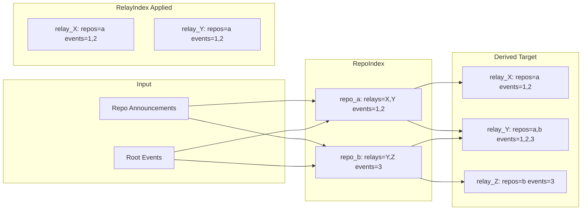
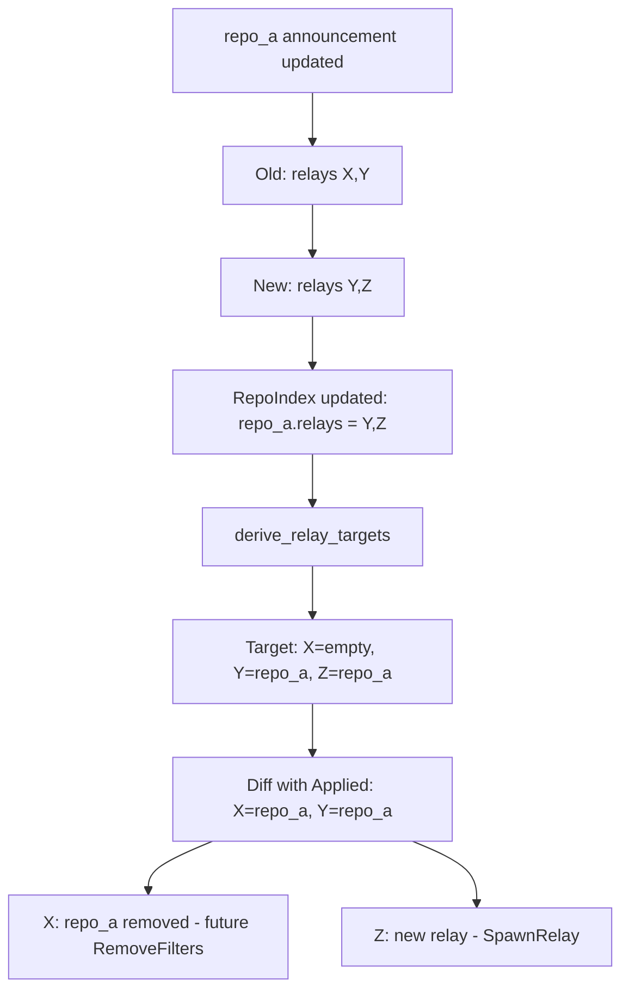
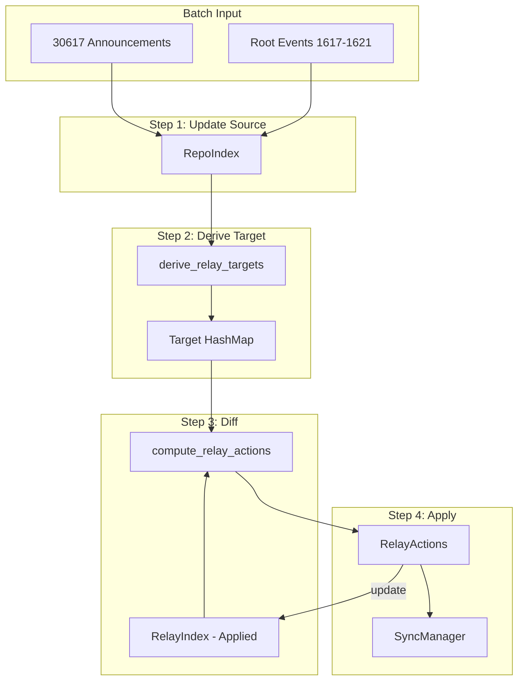

# State Structure Redesign Proposal v2

## The Core Problem

We need to transform:
- **Repo Announcements** (30617) that list relays
- **Root Events** (1617/1618/1619/1621) that tag repos

Into:
- **Per-relay subscriptions**: which repos and root events to sync from each relay

And generate **RelayActions** when this mapping changes.

---

## Proposed Data Model

### 1. RepoIndex (Primary Source of Truth)

```rust
/// Everything we know about repos we're tracking
/// Key: repo addressable ref ("30617:pubkey:identifier")
pub type RepoIndex = Arc<RwLock<HashMap<String, RepoInfo>>>;

#[derive(Debug, Clone, Default)]
pub struct RepoInfo {
    /// Relay URLs listed in the repo's announcement
    pub relays: HashSet<String>,
    /// Root event IDs that reference this repo
    pub root_events: HashSet<EventId>,
}
```

**Updated by:** Database init, batch processing of new announcements/root events

### 2. RelayIndex (Applied State)

```rust
/// What we've told each relay to sync
/// Key: relay URL
pub type RelayIndex = Arc<RwLock<HashMap<String, SyncTarget>>>;

#[derive(Debug, Clone, Default, PartialEq)]
pub struct SyncTarget {
    /// Repos we're syncing for this relay
    pub repos: HashSet<String>,
    /// Root events we're tracking
    pub root_events: HashSet<EventId>,
}
```

**Updated by:** SyncManager after RelayActions are applied

---

## The Transformation



The **diff** between Derived Target and RelayIndex produces RelayActions:
- relay_Y needs AddFilters for repo_b and event 3
- relay_Z needs SpawnRelay

---

## Algorithm: derive_target_from_repo_index

```rust
/// Derive what we SHOULD be syncing from the repo data
fn derive_relay_targets(repo_index: &HashMap<String, RepoInfo>) -> HashMap<String, SyncTarget> {
    let mut targets: HashMap<String, SyncTarget> = HashMap::new();
    
    for (repo_ref, info) in repo_index {
        // For each relay that lists this repo
        for relay_url in &info.relays {
            let target = targets.entry(relay_url.clone()).or_default();
            target.repos.insert(repo_ref.clone());
            target.root_events.extend(info.root_events.iter().cloned());
        }
    }
    
    targets
}
```

---

## Algorithm: process_batch

```rust
async fn process_batch(&self, pending: &mut PendingUpdates) {
    // ============================================
    // STEP 1: Update RepoIndex from batch
    // ============================================
    
    let mut repo_index = self.repo_index.write().await;
    
    // 1a. Process root events - add to repo's root_events set
    for event in pending.root_events.drain(..) {
        for repo_ref in extract_repo_refs(&event) {
            repo_index.entry(repo_ref)
                .or_default()
                .root_events
                .insert(event.id);
        }
    }
    
    // 1b. Process announcements - update repo's relay set
    for event in pending.announcements.drain(..) {
        if !lists_our_service(&event) {
            continue;
        }
        let repo_ref = build_repo_ref(&event);
        let relay_urls: HashSet<String> = extract_relay_urls(&event)
            .into_iter()
            .filter(|url| !is_own_relay(url))
            .collect();
        
        // Replace relay set (handles updates that change relays)
        repo_index.entry(repo_ref)
            .or_default()
            .relays = relay_urls;
    }
    
    // ============================================
    // STEP 2: Derive target state from RepoIndex
    // ============================================
    
    let target = derive_relay_targets(&repo_index);
    drop(repo_index);  // Release write lock
    
    // ============================================
    // STEP 3: Diff target vs applied (RelayIndex)
    // ============================================
    
    let applied = self.relay_index.read().await;
    let actions = compute_relay_actions(&target, &applied);
    drop(applied);  // Release read lock
    
    // ============================================
    // STEP 4: Send actions & update RelayIndex
    // ============================================
    
    for action in actions {
        match &action {
            RelayAction::SpawnRelay { relay_url, repos_and_root_events } => {
                // Update RelayIndex with new relay
                let mut applied = self.relay_index.write().await;
                applied.insert(relay_url.clone(), SyncTarget {
                    repos: repos_and_root_events.keys().cloned().collect(),
                    root_events: repos_and_root_events.values()
                        .flat_map(|e| e.iter().cloned())
                        .collect(),
                });
            }
            RelayAction::AddFilters { relay_url, repos_and_new_root_event } => {
                // Update RelayIndex with additions
                let mut applied = self.relay_index.write().await;
                if let Some(target) = applied.get_mut(relay_url) {
                    for (repo, events) in repos_and_new_root_event {
                        target.repos.insert(repo.clone());
                        target.root_events.extend(events.iter().cloned());
                    }
                }
            }
        }
        
        // Send action to SyncManager
        let _ = self.action_tx.send(action).await;
    }
}
```

---

## Algorithm: compute_relay_actions

```rust
fn compute_relay_actions(
    target: &HashMap<String, SyncTarget>,
    applied: &HashMap<String, SyncTarget>,
) -> Vec<RelayAction> {
    let mut actions = Vec::new();
    
    for (relay_url, target_state) in target {
        match applied.get(relay_url) {
            None => {
                // New relay - spawn it
                let mut repos_and_events = HashMap::new();
                for repo in &target_state.repos {
                    // Get events for this specific repo
                    let events = target_state.root_events.clone(); // simplified
                    repos_and_events.insert(repo.clone(), events);
                }
                actions.push(RelayAction::SpawnRelay {
                    relay_url: relay_url.clone(),
                    repos_and_root_events: repos_and_events,
                });
            }
            Some(applied_state) => {
                // Existing relay - check for new repos/events
                let new_repos: HashSet<_> = target_state.repos
                    .difference(&applied_state.repos)
                    .cloned()
                    .collect();
                let new_events: HashSet<_> = target_state.root_events
                    .difference(&applied_state.root_events)
                    .cloned()
                    .collect();
                
                if !new_repos.is_empty() || !new_events.is_empty() {
                    let mut repos_and_events = HashMap::new();
                    for repo in &new_repos {
                        repos_and_events.insert(repo.clone(), new_events.clone());
                    }
                    // Also handle new events for existing repos
                    if !new_events.is_empty() && new_repos.is_empty() {
                        for repo in &applied_state.repos {
                            repos_and_events.insert(repo.clone(), new_events.clone());
                        }
                    }
                    
                    actions.push(RelayAction::AddFilters {
                        relay_url: relay_url.clone(),
                        repos_and_new_root_event: repos_and_events,
                    });
                }
            }
        }
    }
    
    // Future: detect relay removal (in applied but not in target)
    
    actions
}
```

---

## Handling Announcement Updates

When an announcement is **updated** and changes its relay list:



The current RelayAction types only support growth (SpawnRelay, AddFilters). Removal would need a new `RemoveFilters` action type - this is a future enhancement.

---

## Name Mappings

| Current | Proposed | Semantics |
|---------|----------|-----------|
| `FollowingRepoRootEvents` | `RepoIndex` | Per-repo: relays + root events |
| `SyncRelays` | `RelayIndex` | Per-relay: what we're syncing (applied state) |
| - | `SyncTarget` | Struct for repos + events |
| - | `RepoInfo` | Struct for relay set + event set |

---

## Data Flow Summary



---

## Files to Modify

| File | Changes |
|------|---------|
| [`src/sync/mod.rs`](src/sync/mod.rs) | Replace type aliases with RepoIndex/RelayIndex + structs |
| [`src/sync/self_subscriber.rs`](src/sync/self_subscriber.rs) | Rewrite process_batch with new algorithm |

---

## Questions for Approval

1. **Naming**: Are `RepoIndex`/`RelayIndex` and `RepoInfo`/`SyncTarget` clear enough?

2. **When to update RelayIndex**: Should we:
   - (a) Update immediately when generating action (optimistic) ← proposed above
   - (b) Update only after SyncManager confirms action succeeded

3. **Bootstrap relay**: Keep special-casing it in RelayIndex (always present)?

4. **Future work**: Add `RemoveFilters` action for relay removal, or defer?

---

## Benefits

1. **Logical flow**: Source → Derived → Diff → Actions
2. **Single source of truth**: RepoIndex is the authoritative data
3. **Clear transformation**: `derive_relay_targets()` is a pure function
4. **Handles updates**: Replacing `repo.relays` naturally handles announcement changes
5. **Testable**: Each step can be unit tested independently