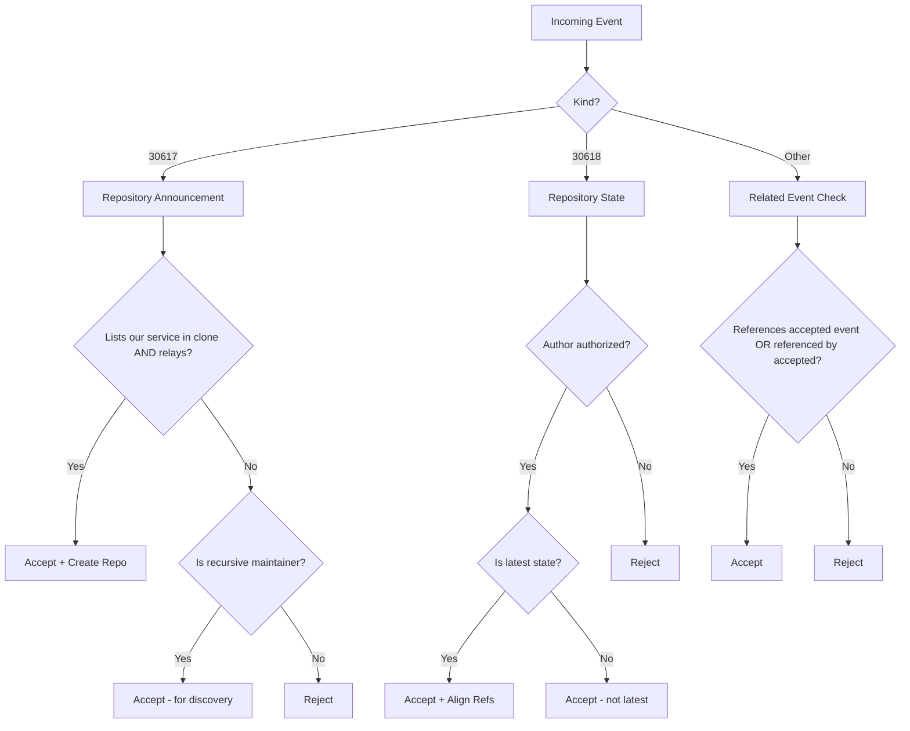
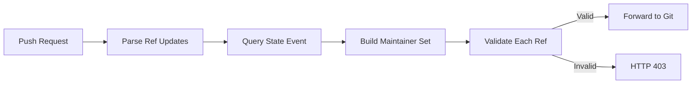

# GRASP-01 Implementation Learnings

**Purpose:** Document learnings from the GRASP-01 implementation  
**Date:** December 4, 2025

---

## What Was Built

### Core Relay Implementation (`src/`)

**Single Rust Binary** serving:
- **Nostr Relay** at `/` (WebSocket + HTTP for NIP-11)
- **Git Smart HTTP** at `/<npub>/<identifier>.git/*`
- **Landing Pages** at `/<npub>/<identifier>.git` and `/`

**Key Technical Choices:**

| Component | Choice | Rationale |
|-----------|--------|-----------|
| HTTP Server | Hyper (not actix-web) | Better control over WebSocket upgrade handling |
| Nostr Relay | nostr-relay-builder | Mature, well-tested, supports custom policies |
| Database | LMDB (default), NostrDB, Memory | LMDB for production, Memory for testing |
| Configuration | clap + dotenvy | CLI flags > env vars > .env > defaults |

---

### GRASP-01 Compliance Features

**Nostr Relay Requirements:**
- ✅ NIP-01 compliant relay at `/`
- ✅ Accepts repository announcements listing this service
- ✅ Accepts repository state announcements
- ✅ Accepts events tagging/tagged by accepted repos
- ✅ Recursive maintainer announcement support
- ✅ NIP-11 document with `supported_grasps` field
- ✅ CORS headers on all endpoints

**Git HTTP Service:**
- ✅ Serves git at `/<npub>/<identifier>.git`
- ✅ Push validation against state events
- ✅ Recursive maintainer chain support
- ✅ HEAD set from state events
- ✅ `refs/nostr/<event-id>` support for PRs
- ✅ `allow-tip-sha1-in-want` and `allow-reachable-sha1-in-want` (GRASP-01 requirement)
- ✅ `uploadpack.allowFilter` for partial clone support (required by git-natural-api)

---

### Audit Tool (`grasp-audit/`)

**Reusable Compliance Testing:**
- Separate crate with own `Cargo.toml` and `flake.nix`
- Spec-mirrored test structure matching GRASP-01 sections
- Automatic cleanup tags for production-safe testing
- Can audit any GRASP implementation (not just ngit-grasp)

---

## Key Implementation Patterns

### 1. Event Acceptance Flow



### 2. State Event to Git Alignment

When a valid state event arrives:
1. Find all announcements where author is authorized
2. For each matching announcement, check if this is the latest state
3. If latest AND git data exists, align refs:
   - Create refs that exist in state but not in repo
   - Update refs pointing to wrong commits
   - Delete refs not in state (for refs/heads/ and refs/tags/)
   - Set HEAD if HEAD branch commit is available

### 3. Push Authorization



---

## What Worked Well

### 1. Inline Authorization

The decision to validate pushes **before** spawning git-receive-pack worked extremely well:
- Better error messages (HTTP responses vs git hook stderr)
- No hook management complexity
- Shared state between Nostr and Git components
- Easy Rust-native testing

### 2. nostr-relay-builder Integration

Using rust-nostr's relay builder was the right call:
- Handles NIP-01 protocol correctly
- Custom `WritePolicy` trait for our validation
- Database abstraction (LMDB, NostrDB, Memory)
- Active maintenance and updates

### 3. Separate Audit Tool

Building `grasp-audit` as a separate crate enabled:
- Test development in parallel with implementation
- Reusable by other GRASP implementations
- Production-safe auditing with cleanup tags
- Spec-mirrored test organization

### 4. Test Isolation Strategy

Automatic cleanup tags on audit events:
```rust
["t", "grasp-audit-test-event"]              // Marker
["t", "audit-{run_id}"]                      // Run isolation
["t", "audit-cleanup-after-{unix_timestamp}"] // Cleanup time
```

This enables parallel CI runs without interference.

---

## What I'd Do Differently

### 1. ~~Keep Architecture Docs Updated~~ ✅ FIXED

**What happened:** Architecture design docs were essential to start - they guided the implementation. But as we made decisions (e.g., hyper instead of actix-web), the docs weren't updated to reflect reality.

**Better approach:** Treat architecture docs as living documents. When implementation diverges from the plan, update the doc immediately. The initial design document was valuable and should remain, but it should reflect what was built.

**Resolution:** Added prominent warning to [`AGENTS.md`](../../AGENTS.md) with explicit guidance to keep architecture docs updated as living documents.

### 2. ~~Smaller Nip34WritePolicy~~ ✅ DONE

**What happened:** The `Nip34WritePolicy` grew to ~900 lines handling all event types.

**Resolution:** Split into focused sub-policies in [`src/nostr/policy/`](src/nostr/policy/mod.rs:1):
- [`AnnouncementPolicy`](src/nostr/policy/announcement.rs:1) - Repository announcement validation
- [`StatePolicy`](src/nostr/policy/state.rs:1) - State event validation + ref alignment
- [`RelatedEventPolicy`](src/nostr/policy/related.rs:1) - Forward/backward reference checking
- [`PrEventPolicy`](src/nostr/policy/pr_event.rs:1) - PR/PR Update validation

The main [`Nip34WritePolicy`](src/nostr/builder.rs:51) now delegates to these sub-policies, improving testability and readability.

### 3. Git Operations Module Organization

**What happened:** Many git operations are in [`src/git/mod.rs`](src/git/mod.rs) (500+ lines).

**Better approach:** Split into:
- `refs.rs` - Ref manipulation (create, update, delete, list)
- `head.rs` - HEAD management
- `objects.rs` - Object verification (commit_exists)
- `repository.rs` - Repository lifecycle (create, configure)

### 4. Unit Tests for Policy Logic

**What happened:** Event acceptance policy testing relies on integration tests in `grasp-audit` and the main project's test suite.

**Better approach:** Also have unit tests for [`Nip34WritePolicy`](src/nostr/builder.rs:51) that mock the database queries. This provides faster feedback during development without needing a running relay.

---

## Technical Debt to Address

### High Priority

1. ~~**Split `Nip34WritePolicy`**~~ ✅ DONE - Split into sub-policies in [`src/nostr/policy/`](src/nostr/policy/mod.rs:1)
2. **Add unit tests for policy logic** - Currently relies on integration tests
3. ~~**Document actual architecture**~~ ✅ FIXED - Added guidance to AGENTS.md to keep docs updated as living documents

### Medium Priority

1. **Error types cleanup** - Some places use `String` errors, should use proper error types
2. **Tracing improvements** - Add structured logging for better debugging
3. **Configuration validation** - Validate domain format, paths, etc.

### Low Priority

1. **Git protocol parsing** - Could be more efficient with zero-copy
2. **Connection pooling** - For future GRASP-02 relay connections
3. **Metrics/observability** - Prometheus integration

---

## Lessons for GRASP-02

Based on GRASP-01 experience:

1. **Define sync policies early** - Which events to sync, from where
2. **Plan connection lifecycle** - Backoff, reconnection, health tracking
3. **Consider filter efficiency** - Negentropy vs regular subscriptions
4. **Test sync scenarios** - Network partitions, out-of-order events
5. **Measure sync gaps** - Track when catchup finds events that live sync missed

---

## Quick Reference: What's Where

| Feature | Location |
|---------|----------|
| Event acceptance policy | [`src/nostr/builder.rs:51`](src/nostr/builder.rs:51) - `Nip34WritePolicy` |
| Repo/State parsing | [`src/nostr/events.rs`](src/nostr/events.rs) |
| Git HTTP handlers | [`src/git/handlers.rs`](src/git/handlers.rs) |
| Push authorization | [`src/git/authorization.rs`](src/git/authorization.rs) |
| HTTP server | [`src/http/mod.rs`](src/http/mod.rs) |
| NIP-11 document | [`src/http/nip11.rs`](src/http/nip11.rs) |
| Audit test specs | [`grasp-audit/src/specs/grasp01/`](grasp-audit/src/specs/grasp01/) |
| Integration tests | [`tests/`](tests/) |

---

*Created: December 4, 2025*